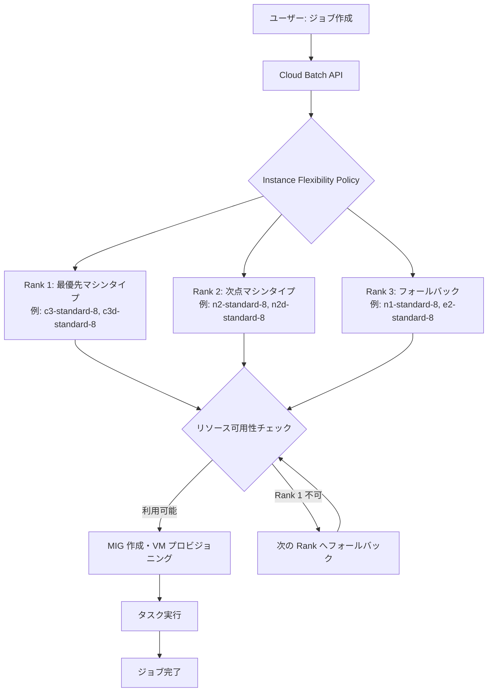

# Batch: Instance Flexibility (Preview)

**リリース日**: 2026-07-17

**サービス**: Cloud Batch

**機能**: Instance Flexibility (インスタンスの柔軟性)

**ステータス**: Preview

📊 [このアップデートのインフォグラフィックを見る](https://takech9203.github.io/google-cloud-news-summary/20260717-batch-instance-flexibility-preview.html)

## 概要

Cloud Batch に Instance Flexibility (インスタンスの柔軟性) 機能が Preview として導入されました。この機能により、バッチジョブの実行時に複数のマシンタイプを指定し、オプションでランク付け (優先順位) を設定できるようになります。これにより、リソースの取得可能性 (obtainability) が大幅に向上します。

Instance Flexibility は、特に大規模なバッチ処理や需要の高いハードウェアを必要とするワークロードにおいて、リソース可用性エラーの発生確率を低減します。複数のマシンタイプを許容することで、Spot VM を使用する場合にはプリエンプション (強制停止) される可能性が低いマシンタイプが自動的に選択されるため、ジョブの安定性も向上します。

この機能の対象ユーザーは、HPC (高性能コンピューティング)、機械学習、データ処理などのバッチワークロードを実行しており、リソース確保の信頼性向上やコスト最適化を求めるエンジニアおよびデータサイエンティストです。

**アップデート前の課題**

- ジョブ作成時に単一のマシンタイプしか指定できず、そのマシンタイプが利用不可の場合にリソース可用性エラーが発生していた
- Spot VM 使用時にプリエンプション率の高いマシンタイプが選択される可能性があり、ジョブが中断されるリスクがあった
- 特定のゾーンでリソースが枯渇した場合、手動で別のマシンタイプやゾーンを指定してジョブを再作成する必要があった

**アップデート後の改善**

- 複数のマシンタイプを指定でき、リソース可用性に基づいて自動的に最適なマシンタイプが選択される
- ランク (優先順位) を設定することで、優先マシンタイプが利用不可の場合にフォールバックが自動的に行われる
- Spot VM 使用時に、同一ランク内で最もプリエンプション率の低いマシンタイプが自動選択される

## アーキテクチャ図



Cloud Batch がジョブ作成時に Instance Flexibility Policy を評価し、ランク順にリソース可用性を確認してマシンタイプを選択するフローを示しています。

## サービスアップデートの詳細

### 主要機能

1. **複数マシンタイプの指定**
   - 1 つのジョブに対して最大 200 のマシンタイプを指定可能
   - 異なる CPU プラットフォームやアーキテクチャ (x86、Arm) のマシンタイプを混在させることが可能
   - マシンタイプ ID のみで指定 (例: `n2-standard-16`)

2. **ランクによる優先順位設定**
   - 各マシンタイプグループにランク (数値) を割り当て、選択優先順位を定義
   - ランクの数値が小さいほど優先度が高い
   - 同一ランク内のマシンタイプは同等の優先度を持つ
   - 優先マシンタイプが利用不可の場合、自動的に次のランクにフォールバック

3. **Spot VM との統合最適化**
   - 同一ランク内で複数のマシンタイプを指定すると、最もプリエンプション率の低いマシンタイプが自動選択される
   - リソース取得確率の向上とプリエンプション回避の両立が可能

4. **予約 (Reservations) との連携**
   - `ANY_RESERVATION` 設定時、未使用の予約を持つマシンタイプが優先的に選択される
   - ランクと予約の両方が設定されている場合、ランクが優先され、同一ランク内で予約が考慮される

## 技術仕様

### Instance Flexibility Policy の構造

| 項目 | 詳細 |
|------|------|
| API フィールド | `instanceFlexibilityPolicy.instanceSelections` |
| マシンタイプ上限 | 全 instanceSelections 合計で最大 200 |
| ランク値 | 整数値 (小さいほど高優先) |
| 対応 API バージョン | v1alpha (Batch REST API) |
| マシンタイプ指定形式 | マシンタイプ ID のみ (例: `n1-standard-16`) |

### 設定例 (JSON)

```json
{
  "instanceFlexibilityPolicy": {
    "instanceSelections": {
      "high-priority": {
        "rank": 1,
        "machineTypes": ["c3-standard-8", "c3d-standard-8"]
      },
      "medium-priority": {
        "rank": 2,
        "machineTypes": ["n2-standard-8", "n2d-standard-8"]
      },
      "fallback": {
        "rank": 3,
        "machineTypes": ["n1-standard-8", "e2-standard-8"]
      }
    }
  }
}
```

## 設定方法

### 前提条件

1. Batch API が有効化されていること
2. 適切な IAM ロール (`roles/batch.jobsEditor`) が付与されていること
3. サービスアカウントユーザーロール (`roles/iam.serviceAccountUser`) が付与されていること

### 手順

#### ステップ 1: ジョブ定義に Instance Flexibility Policy を追加

```json
{
  "taskGroups": [
    {
      "taskSpec": {
        "runnables": [
          {
            "script": {
              "text": "echo Hello from Batch with Instance Flexibility"
            }
          }
        ],
        "computeResource": {
          "cpuMilli": 4000,
          "memoryMib": 8192
        }
      },
      "taskCount": 10
    }
  ],
  "allocationPolicy": {
    "instances": [
      {
        "policy": {
          "instanceFlexibilityPolicy": {
            "instanceSelections": {
              "preferred": {
                "rank": 1,
                "machineTypes": ["c3-standard-4", "c3d-standard-4"]
              },
              "alternative": {
                "rank": 2,
                "machineTypes": ["n2-standard-4", "n2d-standard-4", "n1-standard-4"]
              }
            }
          }
        }
      }
    ]
  }
}
```

#### ステップ 2: gcloud CLI でジョブを作成

```bash
gcloud batch jobs submit my-flexible-job \
  --location=us-central1 \
  --config=job-config.json
```

#### ステップ 3: ジョブの状態を確認

```bash
gcloud batch jobs describe my-flexible-job \
  --location=us-central1
```

## メリット

### ビジネス面

- **ジョブ完了率の向上**: 複数のマシンタイプをフォールバックとして指定できるため、リソース枯渇によるジョブ失敗を大幅に削減
- **コスト最適化**: ランク付けにより、コスト効率の高いマシンタイプを優先しつつ、利用不可時には代替マシンタイプで継続実行
- **運用負荷の軽減**: リソース可用性エラー発生時の手動対応 (マシンタイプ変更・ジョブ再作成) が不要に

### 技術面

- **リソース取得可能性の向上**: 複数のマシンタイプ候補により、特定ハードウェアの在庫切れの影響を最小化
- **Spot VM の安定性向上**: プリエンプション率の低いマシンタイプが自動選択され、ジョブ中断リスクを低減
- **柔軟なアーキテクチャ対応**: x86 と Arm の混在指定により、幅広いリソースプールからの調達が可能

## デメリット・制約事項

### 制限事項

- 現在 Preview ステータスのため、SLA の対象外
- v1alpha API を使用する必要がある (GA 版 API では未提供の可能性)
- 全 instanceSelections を通じてマシンタイプの合計数は最大 200 に制限
- アプリケーションが指定した全てのマシンタイプ上で正しく動作することを事前に確認する必要がある

### 考慮すべき点

- 異なるマシンタイプ間で vCPU やメモリの差異がある場合、タスクの `computeResource` 設定との互換性を確認する必要がある
- ランクを跨いだマシンタイプ選択では、Spot VM のプリエンプション率最適化よりもランク順が優先される
- 特定の予約 (`SPECIFIC` reservation) を使用する場合、instanceSelections に予約のマシンタイプが含まれていないとインスタンス作成に失敗する

## ユースケース

### ユースケース 1: 大規模データ処理パイプライン

**シナリオ**: 毎日数万タスクのデータ変換ジョブを実行しているが、特定のゾーンでリソース枯渇が頻発し、ジョブが失敗することがある。

**実装例**:
```json
{
  "instanceFlexibilityPolicy": {
    "instanceSelections": {
      "compute-optimized": {
        "rank": 1,
        "machineTypes": ["c3-standard-8", "c3d-standard-8", "c2-standard-8"]
      },
      "general-purpose": {
        "rank": 2,
        "machineTypes": ["n2-standard-8", "n2d-standard-8", "n4-standard-8"]
      }
    }
  }
}
```

**効果**: コンピュート最適化マシンを優先しつつ、利用不可時には汎用マシンにフォールバックすることで、ジョブ完了率を大幅に向上。

### ユースケース 2: Spot VM を活用したコスト最適化バッチ処理

**シナリオ**: 機械学習の前処理パイプラインで Spot VM を活用してコストを削減したいが、プリエンプションによるジョブ中断が課題。

**実装例**:
```json
{
  "instanceFlexibilityPolicy": {
    "instanceSelections": {
      "all-compatible": {
        "rank": 1,
        "machineTypes": [
          "n2-standard-4", "n2d-standard-4",
          "c3-standard-4", "c3d-standard-4",
          "n1-standard-4", "e2-standard-4"
        ]
      }
    }
  }
}
```

**効果**: 同一ランク内に多数のマシンタイプを配置することで、Batch が最もプリエンプション率の低いマシンタイプを自動選択し、ジョブの安定性を最大化。

### ユースケース 3: HPC ワークロードの信頼性向上

**シナリオ**: 科学計算シミュレーションで高性能なコンピュート最適化マシンが必要だが、需要集中時にリソースが確保できないことがある。

**効果**: 複数世代のコンピュート最適化マシンタイプ (C3, C3D, C2, C2D) を指定し、いずれかのリソースが利用可能であればジョブが実行されるため、研究・開発のスケジュール遅延を防止。

## 料金

Instance Flexibility 機能自体には追加料金は発生しません。料金は実際にプロビジョニングされた VM のマシンタイプに基づいて、通常の Compute Engine 料金が適用されます。

| 項目 | 料金体系 |
|------|----------|
| Instance Flexibility 機能利用料 | 無料 |
| VM 利用料 | 選択されたマシンタイプの Compute Engine 標準料金 |
| Spot VM 割引 | オンデマンド価格から最大 91% 割引 |
| Committed Use Discounts (CUD) | 1 年: 最大 55% 割引、3 年: 最大 70% 割引 |
| Sustained Use Discounts (SUD) | 月 25% 以上の使用で最大 30% 自動割引 |

## 関連サービス・機能

- **Compute Engine Instance Flexibility (MIG)**: Batch の基盤となるマネージド インスタンス グループの Instance Flexibility 機能。Batch ジョブは内部的に MIG を使用してリソースを管理
- **Spot VM**: プリエンプティブル VM の後継。Instance Flexibility と組み合わせることで、コスト削減と安定性を両立
- **Dynamic Workload Scheduler / Flex-start VM**: 大規模 GPU ワークロード向けのリソーススケジューリング機能。Instance Flexibility とは異なるアプローチでリソース確保を支援
- **Compute Engine Reservations**: 確約済みリソースの予約。Instance Flexibility と連携して、予約済みリソースの優先利用が可能

## 参考リンク

- 📊 [インフォグラフィック](https://takech9203.github.io/google-cloud-news-summary/20260717-batch-instance-flexibility-preview.html)
- [公式リリースノート](https://cloud.google.com/batch/docs/release-notes)
- [ドキュメント: About instance flexibility](https://cloud.google.com/compute/docs/instance-groups/about-instance-flexibility)
- [ドキュメント: Configure instance flexibility](https://cloud.google.com/compute/docs/instance-groups/configure-instance-flexibility)
- [Batch API リファレンス (v1alpha)](https://cloud.google.com/batch/docs/reference/rest/v1alpha/projects.locations.jobs)
- [料金ページ: Compute Engine](https://cloud.google.com/products/compute/pricing)

## まとめ

Cloud Batch の Instance Flexibility は、バッチジョブのリソース取得可能性を劇的に向上させる重要な機能です。複数のマシンタイプをランク付けして指定するだけで、リソース枯渇時の自動フォールバックや Spot VM のプリエンプション最小化が実現されます。大規模バッチ処理やコスト最適化を求める組織は、Preview 段階から検証を開始し、GA リリース時にスムーズに本番適用できるよう準備することを推奨します。

---

**タグ**: #CloudBatch #InstanceFlexibility #Preview #ResourceObtainability #SpotVM #HPC #BatchProcessing #CostOptimization #ComputeEngine
