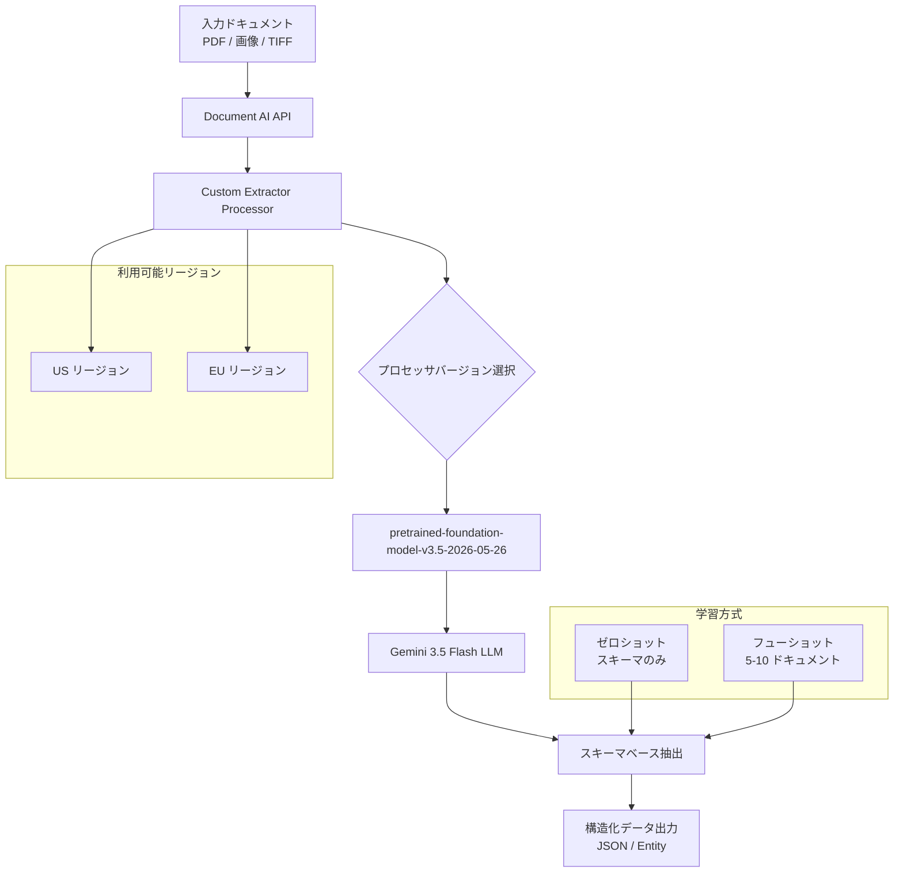

# Document AI: Custom Extractor に Gemini 3.5 Flash LLM 搭載モデルが Preview で登場

**リリース日**: 2026-07-17

**サービス**: Document AI

**機能**: Custom extractor model pretrained-foundation-model-v3.5-2026-05-26 powered by Gemini 3.5 Flash LLM is available in Preview

**ステータス**: Preview (Release Candidate)

📊 [このアップデートのインフォグラフィックを見る](https://takech9203.github.io/google-cloud-news-summary/20260717-document-ai-custom-extractor-gemini-flash.html)

## 概要

Google Cloud Document AI の Custom Extractor に、最新の Gemini 3.5 Flash LLM を搭載した新しいプロセッサバージョン `pretrained-foundation-model-v3.5-2026-05-26` が Preview として利用可能になりました。このモデルは US および EU リージョンで ML 処理が可能であり、ドキュメントからの構造化データ抽出において最新の生成 AI 技術を活用できます。

Gemini 3.5 Flash は Google の最新世代の高速 LLM であり、Document AI の Custom Extractor にこのモデルが搭載されたことで、ゼロショットおよびフューショット学習による高精度な情報抽出が期待できます。従来の v1.6 (Gemini 3 Flash 搭載) からの世代交代により、抽出精度と処理速度の両面での改善が見込まれます。

このアップデートは、請求書、契約書、身分証明書など多様なドキュメントからの自動データ抽出を必要とする企業に特に有益です。スキーマを定義するだけでトレーニングデータなしに利用できるゼロショット機能により、迅速な導入が可能です。

**アップデート前の課題**

- 以前の最新モデル (v1.6: Gemini 3 Flash 搭載) では、一部の複雑なドキュメントレイアウトに対する抽出精度に改善の余地があった
- Gemini 3 世代の LLM をベースとしたモデルでは、Data Residency (DMZ) 準拠の制限がある場合があった (v1.6-pro, v1.6)
- 最新の LLM 技術を活用したドキュメント処理を求めるユーザーに対して、より新しい選択肢が必要だった

**アップデート後の改善**

- Gemini 3.5 Flash LLM の搭載により、最新世代の生成 AI をドキュメント抽出に活用可能になった
- US と EU の両リージョンで ML 処理が利用可能で、地理的なカバレッジが確保されている
- v3.5 というメジャーバージョン番号の付与により、モデルアーキテクチャの大幅な進化を示唆している

## アーキテクチャ図



この図は、ドキュメントが Document AI API を通じて Custom Extractor プロセッサに送信され、Gemini 3.5 Flash LLM を活用してスキーマに基づいたデータ抽出が行われる処理フローを示しています。

## サービスアップデートの詳細

### 主要機能

1. **Gemini 3.5 Flash LLM 搭載**
   - Google の最新世代高速 LLM「Gemini 3.5 Flash」をドキュメント抽出エンジンとして採用
   - 高速推論と高精度な構造化データ抽出を両立
   - Custom Extractor の Foundation モデルとして動作

2. **ゼロショット・フューショット抽出**
   - ゼロショット: スキーマ定義のみで即座にドキュメント抽出が可能 (トレーニングデータ不要)
   - フューショット: 5-10 件の参照ドキュメントで精度向上が可能
   - Foundation モデルの汎用知識を活用した高品質な推論

3. **US / EU リージョン対応**
   - 米国 (US) および欧州 (EU) の両マルチリージョンで ML 処理が利用可能
   - データ所在地の要件に応じたリージョン選択が可能

4. **生成 AI ベースの高度な機能**
   - 3 段階ネスト: 複雑なテーブル構造からの階層的データ抽出
   - 派生フィールド (Derived Fields): ドキュメントのコンテキストから推論によるデータ生成
   - 署名検出: 視覚的手がかりによる署名有無の検出

## 技術仕様

### モデルバージョン比較

| 項目 | v3.5 (新) | v1.6 (前世代) | v1.5 (Stable) |
|------|-----------|---------------|---------------|
| ベース LLM | Gemini 3.5 Flash | Gemini 3 Flash | Gemini 2.5 Flash |
| リリースチャネル | Release Candidate | Release Candidate | Stable |
| ML 処理 (US/EU) | 対応 | 対応 | 対応 |
| ファインチューニング | 非対応 | 非対応 | US, EU 対応 |
| リリース日 | 2026-05-26 | 2026-01-13 | 2025-05-05 |

### API バージョン

| 項目 | 詳細 |
|------|------|
| サポート API | v1 および v1beta3 |
| プロセッサタイプ | CUSTOM_EXTRACTION_PROCESSOR |
| モデルタイプ | MODEL_TYPE_GENERATIVE |
| バージョン識別子 | `pretrained-foundation-model-v3.5-2026-05-26` |

### プロセッサバージョン設定例

```json
{
  "processorVersion": {
    "name": "projects/PROJECT_ID/locations/LOCATION/processors/PROCESSOR_ID/processorVersions/pretrained-foundation-model-v3.5-2026-05-26",
    "displayName": "Gemini 3.5 Flash Custom Extractor",
    "modelType": "MODEL_TYPE_GENERATIVE"
  }
}
```

## 設定方法

### 前提条件

1. Google Cloud プロジェクトで課金が有効化されていること
2. Document AI API が有効化されていること
3. 適切な IAM 権限 (`roles/documentai.editor` 以上) が付与されていること

### 手順

#### ステップ 1: Document AI API の有効化

```bash
gcloud services enable documentai.googleapis.com --project=PROJECT_ID
```

Document AI API をプロジェクトで有効にします。

#### ステップ 2: Custom Extractor プロセッサの作成

```bash
curl -X POST \
  -H "Authorization: Bearer $(gcloud auth print-access-token)" \
  -H "Content-Type: application/json" \
  -d '{
    "type": "CUSTOM_EXTRACTION_PROCESSOR",
    "displayName": "my-custom-extractor-v35"
  }' \
  "https://us-documentai.googleapis.com/v1/projects/PROJECT_ID/locations/us/processors"
```

US リージョンに Custom Extractor プロセッサを作成します。EU の場合は `us` を `eu` に変更してください。

#### ステップ 3: プロセッサバージョンの変更

```bash
curl -X POST \
  -H "Authorization: Bearer $(gcloud auth print-access-token)" \
  -H "Content-Type: application/json" \
  -d '{
    "processorVersion": "projects/PROJECT_ID/locations/us/processors/PROCESSOR_ID/processorVersions/pretrained-foundation-model-v3.5-2026-05-26"
  }' \
  "https://us-documentai.googleapis.com/v1/projects/PROJECT_ID/locations/us/processors/PROCESSOR_ID:setDefaultProcessorVersion"
```

プロセッサのデフォルトバージョンを v3.5 に設定します。

#### ステップ 4: ドキュメント処理リクエストの送信

```bash
curl -X POST \
  -H "Authorization: Bearer $(gcloud auth print-access-token)" \
  -H "Content-Type: application/json" \
  -d '{
    "rawDocument": {
      "content": "BASE64_ENCODED_DOCUMENT",
      "mimeType": "application/pdf"
    }
  }' \
  "https://us-documentai.googleapis.com/v1/projects/PROJECT_ID/locations/us/processors/PROCESSOR_ID/processorVersions/pretrained-foundation-model-v3.5-2026-05-26:process"
```

指定したプロセッサバージョンでドキュメントを処理します。

## メリット

### ビジネス面

- **迅速な導入**: ゼロショット学習により、トレーニングデータの準備なしで即座にドキュメント抽出を開始可能。概念実証 (PoC) を数分で構築できる
- **運用コスト削減**: ラベリング作業やデータセット構築の人的コストを大幅に削減。スキーマ定義だけで高品質な抽出結果を得られる
- **グローバル対応**: US と EU の両リージョンで利用可能なため、GDPR などのデータ規制に準拠しながら活用可能

### 技術面

- **最新 LLM アーキテクチャ**: Gemini 3.5 Flash の最新推論能力により、複雑なドキュメントレイアウトや曖昧な表現にも対応
- **統合 API**: v1 および v1beta3 API の両方で利用可能。既存の Document AI ワークフローにシームレスに統合可能
- **高度な抽出機能**: 3 段階ネスト、派生フィールド、署名検出など、Foundation モデルならではの高度な機能を活用可能

## デメリット・制約事項

### 制限事項

- Preview (Release Candidate) ステータスのため、本番環境での利用にはリスクが伴う。SLA は Preview 製品には適用されない
- ファインチューニングは現時点で非対応。高精度化が必要な場合はフューショット学習に限られる
- Confidence Score のサポートについて明示的な記載がない (v1.4, v1.5, v1.5 Pro のみ記載あり)

### 考慮すべき点

- Preview から GA (一般提供) への移行時にモデルの挙動が変わる可能性がある
- クォータについてはドキュメントに v3.5 専用の記載がないため、デフォルトの 120 ページ/分が適用される可能性が高い
- Data Residency (DMZ) 準拠についての明確な記載がないため、厳格なデータ所在地要件がある場合は確認が必要
- 前世代 v1.5 (Stable) からの移行を検討する場合、ファインチューニング機能が失われる点に注意

## ユースケース

### ユースケース 1: 請求書からの自動データ抽出

**シナリオ**: 経理部門が毎月大量の請求書を処理しており、手動でのデータ入力に時間がかかっている。フォーマットが統一されていない取引先からの請求書にも対応する必要がある。

**実装例**:
```json
{
  "documentSchema": {
    "entityTypes": [
      {
        "name": "invoice_number",
        "baseTypes": ["string"],
        "description": "請求書番号。通常ドキュメント上部に記載される一意の識別子"
      },
      {
        "name": "total_amount",
        "baseTypes": ["money"],
        "description": "請求総額。税込みの合計金額"
      },
      {
        "name": "vendor_name",
        "baseTypes": ["string"],
        "description": "請求元の会社名または事業者名"
      },
      {
        "name": "due_date",
        "baseTypes": ["datetime"],
        "description": "支払期限日"
      }
    ]
  }
}
```

**効果**: ゼロショットでの抽出により、新規取引先の請求書フォーマットにも即座に対応可能。人手による確認作業を最小限に抑え、処理時間を大幅に短縮。

### ユースケース 2: 契約書の重要条項抽出

**シナリオ**: 法務部門が大量の契約書レビューを行っており、重要な条項 (解約条件、責任制限、秘密保持期間など) を効率的に抽出したい。

**効果**: Gemini 3.5 Flash の高度な言語理解能力により、法的文書の複雑な表現からも的確に情報を抽出。3 段階ネスト機能により、契約書内の入れ子構造 (条項 > 項 > 号) にも対応可能。

### ユースケース 3: 多言語ドキュメントの構造化

**シナリオ**: グローバル企業が各国の税務書類や証明書を一元管理するために、多言語ドキュメントからの統一的なデータ抽出基盤を構築したい。

**効果**: Gemini 3.5 Flash の多言語対応能力を活かし、英語・日本語・ドイツ語・フランス語など多言語のドキュメントを統一スキーマで処理可能。

## 料金

Document AI Custom Extractor の料金は処理ページ数に基づいて課金されます。

### 料金例

| 使用量 | 月額料金 (概算) |
|--------|-----------------|
| 1,000 ページ/月 | $30 |
| 10,000 ページ/月 | $300 |
| 100,000 ページ/月 | $3,000 |

※ Preview 期間中の料金は変更される可能性があります。最新の料金情報は公式料金ページを参照してください。

## 利用可能リージョン

| リージョン | ML 処理 | ファインチューニング |
|-----------|---------|---------------------|
| US (マルチリージョン) | 対応 | 非対応 |
| EU (マルチリージョン) | 対応 | 非対応 |

※ シングルリージョン (asia-south1, australia-southeast1 等) での対応状況は公式ドキュメントを確認してください。

## 関連サービス・機能

- **Vertex AI Gemini API**: Document AI の Custom Extractor が内部的に使用する Gemini 3.5 Flash LLM の基盤プラットフォーム
- **Document AI Layout Parser**: ドキュメントのレイアウト解析とチャンキングを行う関連プロセッサ。Custom Extractor と組み合わせて使用可能
- **Document AI Custom Classifier**: ドキュメントの分類を行うプロセッサ。Custom Extractor の前段として文書タイプを判定する用途に最適
- **Document AI Custom Splitter**: 複数ドキュメントが結合された PDF を個別ドキュメントに分割するプロセッサ
- **Cloud Storage**: 処理対象ドキュメントの保管やバッチ処理の入出力に使用

## 参考リンク

- 📊 [インフォグラフィック](https://takech9203.github.io/google-cloud-news-summary/20260717-document-ai-custom-extractor-gemini-flash.html)
- [公式リリースノート](https://docs.cloud.google.com/release-notes#July_17_2026)
- [Custom Extractor ドキュメント](https://docs.cloud.google.com/document-ai/docs/ce-with-genai)
- [プロセッサバージョン管理](https://docs.cloud.google.com/document-ai/docs/manage-processor-versions)
- [料金ページ](https://cloud.google.com/document-ai/pricing)
- [クォータと制限](https://docs.cloud.google.com/document-ai/quotas)

## まとめ

Document AI Custom Extractor に Gemini 3.5 Flash LLM を搭載した `pretrained-foundation-model-v3.5-2026-05-26` が Preview として登場し、最新の生成 AI 技術をドキュメント抽出に活用できるようになりました。US と EU の両リージョンで利用可能であり、ゼロショット/フューショット学習による迅速な導入が可能です。現時点では Preview ステータスのためファインチューニングは非対応ですが、本番環境への展開前の評価・検証フェーズとして活用し、GA 昇格時に備えることを推奨します。

---

**タグ**: #DocumentAI #CustomExtractor #Gemini35Flash #Preview #ML #生成AI #ドキュメント処理 #OCR #データ抽出
