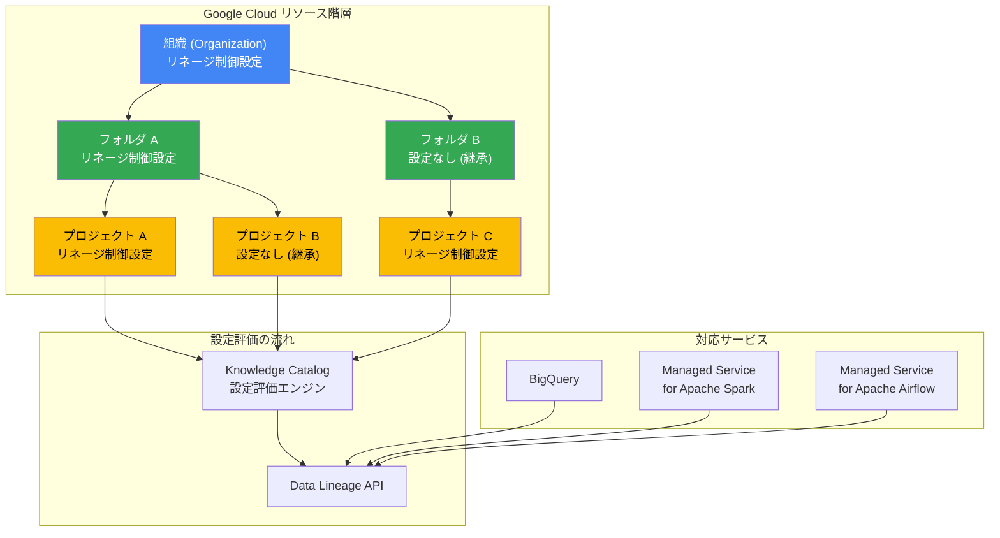

# Knowledge Catalog (Dataplex): データリネージ制御が組織・フォルダ・プロジェクトレベルで GA

**リリース日**: 2026-07-17

**サービス**: Knowledge Catalog (Dataplex)

**機能**: データリネージ制御が組織・フォルダ・プロジェクトレベルで一般提供開始 (BigQuery, Managed Service for Apache Spark, Managed Service for Apache Airflow 対応)

**ステータス**: GA (一般提供)

📊 [このアップデートのインフォグラフィックを見る](https://takech9203.github.io/google-cloud-news-summary/20260717-knowledge-catalog-data-lineage-control-ga.html)

## 概要

Google Cloud の Knowledge Catalog (Dataplex) において、データリネージの取り込み制御機能が組織 (Organization)、フォルダ (Folder)、プロジェクト (Project) の各レベルで一般提供 (GA) となりました。対象サービスは BigQuery、Managed Service for Apache Spark、Managed Service for Apache Airflow の 3 つです。

この機能により、Google Cloud のリソース階層に沿って、データリネージの収集を細かく制御できるようになります。例えば、開発用プロジェクトではリネージ収集を無効にしてコストを抑え、本番環境では有効にしてデータガバナンスを強化するといった運用が可能です。

本機能は 2026 年 1 月に Dataproc 向けの Preview として初めて登場し、6 月に BigQuery と Managed Airflow のサポートが追加されました。今回の GA により、本番ワークロードでの利用が正式にサポートされ、SLA の対象となります。

**アップデート前の課題**

Data Lineage API を有効化すると、プロジェクト内の全サービスで一律にリネージ情報の収集が開始されていました。

- Data Lineage API の有効化はプロジェクト単位であり、サービスごとや階層ごとの細かい制御ができなかった
- 開発環境や大量ワークロード環境でも不要なリネージデータが収集され、コストが増大していた
- 組織全体で統一的なリネージ収集ポリシーを適用する手段がなく、各プロジェクトで個別に管理する必要があった

**アップデート後の改善**

リソース階層に基づいた柔軟な制御が可能になりました。

- 組織・フォルダ・プロジェクトの各レベルでサービスごとにリネージ収集の有効/無効を設定可能になった
- 階層型の設定評価 (プロジェクト → フォルダ → 組織) により、継承と上書きを活用した柔軟なポリシー管理が実現
- 不要な環境でのリネージ収集を停止することでコスト最適化が可能になった

## アーキテクチャ図



Knowledge Catalog はリソース階層を下から上へ評価し、最初に見つかった明示的な設定を適用します。プロジェクトレベルの設定が最優先され、設定がない場合は親フォルダ、さらに組織レベルの設定が適用されます。

## サービスアップデートの詳細

### 主要機能

1. **階層型リネージ取り込み制御**
   - 組織、フォルダ、プロジェクトの各レベルでリネージ収集の有効/無効を設定可能
   - 設定の評価順序: プロジェクト → 親フォルダ (最も近い) → 組織 → システムデフォルト
   - 下位レベルの設定が上位レベルの設定を上書き (オーバーライド)

2. **サービス別独立制御**
   - BigQuery、Managed Service for Apache Spark、Managed Service for Apache Airflow それぞれ個別に制御可能
   - 各サービスの設定は独立して評価され、他のサービスの設定に影響しない
   - 同一プロジェクト内でサービスごとに異なるポリシーを適用可能

3. **一括管理サポート**
   - 階層的サービス有効化 (Hierarchical Service Activation) と組み合わせてフォルダ・組織配下の全プロジェクトで Data Lineage API を一括有効化
   - 組織レベルでのデフォルトポリシー設定により、新規プロジェクト作成時も自動的にポリシーが適用

## 技術仕様

### 設定評価ロジック

| 評価順序 | レベル | 動作 |
|----------|--------|------|
| 1 (最優先) | プロジェクト | 明示的に設定されている場合、その設定を適用 |
| 2 | フォルダ | プロジェクトに設定がない場合、最も近い親フォルダの設定を適用 |
| 3 | 組織 | プロジェクトにもフォルダにも設定がない場合、組織の設定を適用 |
| 4 (フォールバック) | システムデフォルト | どのレベルにも設定がない場合、システムデフォルトを使用 |

### 対応サービスと統合名

| サービス | 統合識別子 (Integration) | 備考 |
|----------|--------------------------|------|
| BigQuery | `BIGQUERY` | クエリジョブのリネージを追跡 |
| Managed Service for Apache Spark | `DATAPROC` | Spark/Hive ジョブ、サーバーレスデプロイメントを含む |
| Managed Service for Apache Airflow | `COMPOSER` | DAG 実行時のタスクリネージを追跡 |

### API と設定構造

```json
{
  "ingestion": {
    "rules": [
      {
        "integrationSelector": {
          "integration": "BIGQUERY"
        },
        "lineageEnablement": {
          "enabled": true
        }
      },
      {
        "integrationSelector": {
          "integration": "DATAPROC"
        },
        "lineageEnablement": {
          "enabled": false
        }
      }
    ]
  },
  "etag": "ETAG_VALUE"
}
```

## 設定方法

### 前提条件

1. Data Lineage API がプロジェクトで有効化されていること
2. 適切な IAM 権限 (datalineage.config.update) を持つサービスアカウントまたはユーザー
3. gcloud CLI または Python クライアントライブラリがインストールされていること

### 手順

#### ステップ 1: 現在の設定を取得

```bash
# プロジェクトレベルの設定を取得
gcloud datalineage config get --project=PROJECT_ID

# 組織レベルの設定を取得
gcloud datalineage config get --organization=ORGANIZATION_ID
```

etag 値を記録しておきます。設定更新時に楽観的排他制御 (Optimistic Concurrency Control) として使用されます。

#### ステップ 2: リネージ取り込み設定を更新

```bash
# プロジェクトレベルで BigQuery のリネージ収集を無効化
gcloud datalineage config update --project=PROJECT_ID \
  --config='{
    "ingestion": {
      "rules": [
        {
          "integrationSelector": {
            "integration": "BIGQUERY"
          },
          "lineageEnablement": {
            "enabled": false
          }
        }
      ]
    },
    "etag": "ETAG_VALUE"
  }'
```

#### ステップ 3: 組織またはフォルダレベルでの設定 (一括管理)

```bash
# 組織レベルで全サービスのデフォルトを設定
gcloud datalineage config update --organization=ORGANIZATION_ID \
  --config='{
    "ingestion": {
      "rules": [
        {
          "integrationSelector": {
            "integration": "BIGQUERY"
          },
          "lineageEnablement": {
            "enabled": true
          }
        },
        {
          "integrationSelector": {
            "integration": "DATAPROC"
          },
          "lineageEnablement": {
            "enabled": true
          }
        },
        {
          "integrationSelector": {
            "integration": "COMPOSER"
          },
          "lineageEnablement": {
            "enabled": true
          }
        }
      ]
    },
    "etag": "ETAG_VALUE"
  }'

# フォルダレベルで開発環境のリネージ収集を無効化
gcloud datalineage config update --folder=FOLDER_ID \
  --config='{
    "ingestion": {
      "rules": [
        {
          "integrationSelector": {
            "integration": "BIGQUERY"
          },
          "lineageEnablement": {
            "enabled": false
          }
        }
      ]
    },
    "etag": "ETAG_VALUE"
  }'
```

#### ステップ 4: Python クライアントライブラリでの設定

```python
from google.cloud.datacatalog.lineage import configmanagement_v1

def configure_lineage_ingestion(project_id: str, integration: str, enabled: bool):
    """リネージ取り込み設定を更新する"""
    client = configmanagement_v1.ConfigManagementServiceClient()
    name = f"projects/{project_id}/locations/global/config"

    # 現在の設定を取得
    config = client.get_config(name=name)

    # 既存のルールから対象の統合を除外
    new_rules = [
        rule for rule in config.ingestion.rules
        if rule.integration_selector.integration != getattr(
            configmanagement_v1.Config.Ingestion.IngestionRule.IntegrationSelector.Integration,
            integration
        )
    ]

    # 新しいルールを追加
    integration_selector = configmanagement_v1.Config.Ingestion.IngestionRule.IntegrationSelector(
        integration=getattr(
            configmanagement_v1.Config.Ingestion.IngestionRule.IntegrationSelector.Integration,
            integration
        )
    )
    lineage_enablement = configmanagement_v1.Config.Ingestion.IngestionRule.LineageEnablement(
        enabled=enabled
    )
    new_rules.append(
        configmanagement_v1.Config.Ingestion.IngestionRule(
            integration_selector=integration_selector,
            lineage_enablement=lineage_enablement,
        )
    )

    config.ingestion = configmanagement_v1.Config.Ingestion(rules=new_rules)
    response = client.update_config(
        configmanagement_v1.UpdateConfigRequest(config=config)
    )
    return response

# 使用例: BigQuery のリネージ収集を無効化
configure_lineage_ingestion("my-project-id", "BIGQUERY", False)
```

## メリット

### ビジネス面

- **コスト最適化**: 開発環境や不要なワークロードでのリネージ収集を無効化し、Data Lineage API の使用コストを削減
- **ガバナンス強化**: 組織全体で統一的なデータリネージポリシーを適用し、コンプライアンス要件への対応を簡素化
- **運用効率向上**: 組織・フォルダレベルでの一括設定により、多数のプロジェクトを効率的に管理可能

### 技術面

- **柔軟な制御粒度**: サービス単位 x リソース階層レベルの組み合わせで細かい制御が可能
- **継承メカニズム**: 上位レベルの設定が自動的に継承されるため、新規プロジェクト作成時の追加設定が不要
- **楽観的排他制御**: etag を使用した同時更新の競合防止により、複数管理者による安全な設定変更が可能

## デメリット・制約事項

### 制限事項

- 上位レベルの設定よりもプロジェクトレベルの設定が常に優先されるため、組織管理者が強制的に全プロジェクトでリネージを有効にすることはできない
- Cloud Data Fusion、Dataflow、Vertex AI Pipelines など、一部のサービスはこの階層型制御の対象外
- Data Lineage API 自体のプロジェクトごとの有効化は別途必要 (階層的サービス有効化で一括対応可能)

### 考慮すべき点

- リネージ収集を無効にした期間のデータフローは追跡されず、後から復元することはできない
- 既存のリネージデータは設定変更後も保持されるが、新規データの収集のみが停止される
- 複雑な階層設定を行う場合、意図しない継承動作に注意が必要 (各サービスの設定が独立して評価されるため)

## ユースケース

### ユースケース 1: 環境別リネージ管理

**シナリオ**: 大規模な組織で本番環境・ステージング環境・開発環境を運用しており、コスト最適化とガバナンスのバランスを取りたい。

**実装例**:
```
組織レベル: 全サービス有効 (デフォルトポリシー)
├── 本番フォルダ: 設定なし (組織から継承 = 有効)
│   └── 本番プロジェクト群: 全サービスのリネージが自動的に収集される
├── ステージングフォルダ: BigQuery のみ有効、他は無効
│   └── ステージングプロジェクト群: BigQuery のリネージのみ収集
└── 開発フォルダ: 全サービス無効
    └── 開発プロジェクト群: リネージ収集なし (コスト削減)
```

**効果**: 本番環境では完全なデータリネージを維持しつつ、開発環境ではコストを削減。ステージング環境では重要なサービスのみ追跡。

### ユースケース 2: 高頻度ワークロードのコスト制御

**シナリオ**: 特定のプロジェクトで大量の Spark ジョブが実行されており、リネージ収集のコストが問題になっている。

**実装例**:
```bash
# 高頻度 Spark ジョブのプロジェクトで Spark リネージのみ無効化
gcloud datalineage config update --project=high-volume-spark-project \
  --config='{
    "ingestion": {
      "rules": [
        {
          "integrationSelector": {"integration": "DATAPROC"},
          "lineageEnablement": {"enabled": false}
        },
        {
          "integrationSelector": {"integration": "BIGQUERY"},
          "lineageEnablement": {"enabled": true}
        }
      ]
    },
    "etag": "CURRENT_ETAG"
  }'
```

**効果**: BigQuery のリネージは維持しつつ、コストの高い Spark ジョブのリネージ収集を停止してコストを最適化。

## 料金

データリネージの料金は Data Lineage API の使用量に基づきます。リネージ制御機能自体に追加料金は発生しません。

### 料金例

| 項目 | 料金 |
|------|------|
| リネージ取り込み制御の設定変更 | 無料 |
| Data Lineage API 書き込みクォータ | プロジェクトごとに上限あり |
| リネージイベントの保存 | Knowledge Catalog の料金体系に準拠 |

リネージ制御により不要なリネージ収集を停止することで、Data Lineage API の利用コストを直接削減できます。

## 利用可能リージョン

Data Lineage API がサポートされている全てのリージョンで利用可能です。リネージ制御の設定自体は `global` ロケーションで管理されます。Knowledge Catalog のデータリネージをサポートするリージョンの一覧は公式ドキュメントを参照してください。

## 関連サービス・機能

- **Knowledge Catalog (Dataplex)**: データリネージを含むメタデータ管理プラットフォーム。本機能の親サービス
- **BigQuery**: クエリジョブ実行時のテーブル間データフローをリネージとして自動記録
- **Managed Service for Apache Spark (Dataproc)**: Spark/Hive ジョブおよびサーバーレスジョブのリネージを追跡
- **Managed Service for Apache Airflow (Cloud Composer)**: DAG タスク実行時のリネージイベントを自動生成
- **Column-level Lineage**: 2025 年 9 月に GA となったカラムレベルのリネージ追跡機能 (BigQuery のみ対応)

## 参考リンク

- 📊 [インフォグラフィック](https://takech9203.github.io/google-cloud-news-summary/20260717-knowledge-catalog-data-lineage-control-ga.html)
- [公式リリースノート](https://docs.cloud.google.com/release-notes#July_17_2026)
- [About data lineage ingestion control](https://docs.cloud.google.com/dataplex/docs/control-lineage-ingestion)
- [Configure data lineage ingestion for a service](https://docs.cloud.google.com/dataplex/docs/configure-lineage-ingestion)
- [Data Lineage 概要](https://docs.cloud.google.com/dataplex/docs/about-data-lineage)
- [Knowledge Catalog ドキュメント](https://docs.cloud.google.com/dataplex/docs/introduction)

## まとめ

Knowledge Catalog のデータリネージ取り込み制御が GA となり、組織・フォルダ・プロジェクトの各レベルで BigQuery、Managed Spark、Managed Airflow のリネージ収集を細かく制御できるようになりました。これにより、データガバナンスの強化とコスト最適化を両立した運用が可能になります。まずは組織レベルでデフォルトポリシーを設定し、開発環境や高頻度ワークロードのプロジェクトで不要なリネージ収集を無効化することを推奨します。

---

**タグ**: #KnowledgeCatalog #Dataplex #DataLineage #BigQuery #Dataproc #CloudComposer #GA #データガバナンス #リネージ制御
