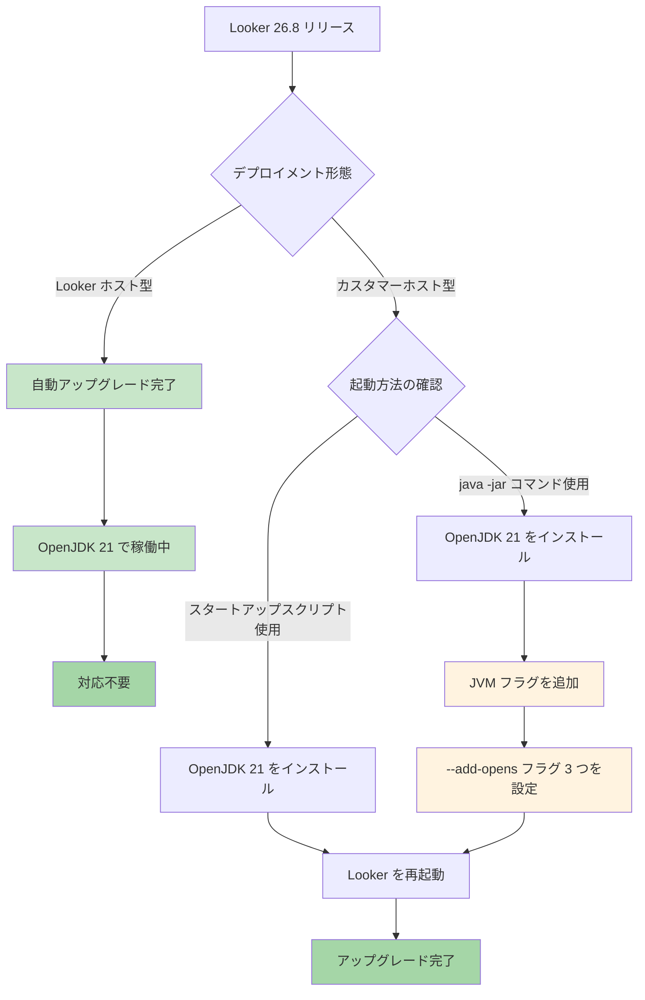

# Looker: OpenJDK 21 サポート (Looker 26.8)

**リリース日**: 2026-07-17

**サービス**: Looker

**機能**: Looker 26.8 より Java OpenJDK バージョン 21 をサポート

**ステータス**: GA (一般提供)

📊 [このアップデートのインフォグラフィックを見る](https://takech9203.github.io/google-cloud-news-summary/20260717-looker-openjdk-21-support.html)

## 概要

Looker 26.8 より、Looker の Java ランタイム要件が OpenJDK 21 にアップグレードされました。これは Looker のパフォーマンス、セキュリティ、および長期サポートを強化するための重要な基盤更新です。

Looker ホスト型インスタンスについては既に OpenJDK 21 へのアップグレードが完了しています。一方、カスタマーホスト型（オンプレミス）インスタンスを運用している組織は、自身で OpenJDK 21 へのアップグレードを実施する必要があります。特に `java -jar` コマンドで直接 Looker を実行している環境では、新しい JVM フラグの追加が必須となります。

この変更は、Java のモジュールシステム（Java Platform Module System）に対応するためのものであり、OpenJDK 21 の長期サポート（LTS）リリースへの移行により、より安定した運用基盤が提供されます。Oracle JDK やその他のバージョンの OpenJDK はサポート対象外です。

**アップデート前の課題**

- OpenJDK 11 をベースとしており、Java 11 のセキュリティパッチ提供が終了に近づいていた
- 古い Java バージョンでは最新の暗号化アルゴリズムやパフォーマンス改善の恩恵を受けられなかった
- Java 11 環境では Nashorn スクリプトエンジンの非推奨化に伴う `-Dnashorn.args=--optimistic-types=false` フラグが必要だった

**アップデート後の改善**

- OpenJDK 21（LTS）による長期的なセキュリティサポートとパフォーマンス向上
- Java 21 の最新ガベージコレクション（ZGC、Shenandoah）やパターンマッチング等の言語改善の恩恵
- Looker ホスト型インスタンスは自動的にアップグレード済みで、追加対応不要
- Nashorn 関連の JVM フラグが不要になり、代わりにモジュールアクセス用の `--add-opens` フラグに移行

## アーキテクチャ図



この図は、Looker 26.8 における OpenJDK 21 アップグレードのデプロイメントパスを示しています。Looker ホスト型は自動対応済み、カスタマーホスト型は起動方法に応じた手動対応が必要です。

## サービスアップデートの詳細

### 主要機能

1. **OpenJDK 21 への移行**
   - Looker の実行環境が OpenJDK 11 から OpenJDK 21 にアップグレード
   - Java 21 は LTS（Long-Term Support）リリースであり、長期的なセキュリティパッチが提供される
   - JDK（JRE ではなく）の使用が推奨され、トラブルシューティングツールが利用可能

2. **Looker ホスト型インスタンスの自動アップグレード**
   - Looker がホストするインスタンスは既に OpenJDK 21 にアップグレード済み
   - 顧客側での追加作業は不要
   - サービス中断なしで移行が完了

3. **カスタマーホスト型インスタンスの手動アップグレード要件**
   - カスタマーホスト型インスタンスは管理者が手動でアップグレードを実施する必要がある
   - `java -jar` コマンドで起動する場合、3 つの `--add-opens` フラグが必須
   - スタートアップスクリプト使用時はフラグが自動的に適用される

## 技術仕様

### JVM 要件

| 項目 | 詳細 |
|------|------|
| Java バージョン | OpenJDK 21 |
| 推奨パッケージ | JDK（JRE ではなく JDK を推奨） |
| 対応 Looker バージョン | 26.8 以降 |
| Oracle JDK | サポート対象外 |
| その他の OpenJDK バージョン | サポート対象外 |

### 必須 JVM フラグ（java -jar 起動時）

`java -jar` コマンドで Looker を直接実行する場合、以下の 3 つの `--add-opens` フラグを含める必要があります。

```bash
java \
  --add-opens=java.base/sun.nio.ch=ALL-UNNAMED \
  --add-opens=java.base/java.io=ALL-UNNAMED \
  --add-opens=java.base/java.nio=ALL-UNNAMED \
  -jar looker.jar
```

これらのフラグは Java Platform Module System（JPMS）のアクセス制御を緩和し、Looker が必要とする内部 API へのリフレクションアクセスを許可するものです。

### システム要件（変更なし）

| 項目 | 要件 |
|------|------|
| CPU | 1.2 GHz 以上（2 コア以上推奨） |
| メモリ | 8 GB 以上の空きRAM |
| ディスク | 10 GB 以上の空き容量 |
| スワップ | 2 GB |
| OS | Linux（x64、Ubuntu LTS 推奨） |
| ネットワーク | TCP ポート 9999（API: 19999） |

## 設定方法

### 前提条件

1. Looker 26.8 以降のバージョンであること
2. カスタマーホスト型インスタンスを運用していること
3. 現在の環境のバックアップが取得済みであること

### 手順

#### ステップ 1: 現在の Java バージョンを確認

```bash
java -version
```

OpenJDK 11 が表示される場合、アップグレードが必要です。

#### ステップ 2: OpenJDK 21 のインストール

Ubuntu/Debian の場合:

```bash
sudo apt update
sudo apt install openjdk-21-jdk
```

RHEL/CentOS の場合:

```bash
sudo yum install java-21-openjdk-devel
```

#### ステップ 3: Java バージョンの切り替え

```bash
sudo update-alternatives --config java
# OpenJDK 21 を選択
```

#### ステップ 4: Looker の再起動

スタートアップスクリプトを使用する場合:

```bash
cd /home/looker/looker
./looker restart
```

`java -jar` コマンドで起動する場合:

```bash
java \
  --add-opens=java.base/sun.nio.ch=ALL-UNNAMED \
  --add-opens=java.base/java.io=ALL-UNNAMED \
  --add-opens=java.base/java.nio=ALL-UNNAMED \
  -jar looker.jar start
```

#### ステップ 5: 動作確認

```bash
# Looker のステータス確認
curl -s http://localhost:9999/alive
```

ブラウザから Looker UI にアクセスし、ダッシュボードやクエリが正常に動作することを確認してください。

## メリット

### ビジネス面

- **長期的な安定運用**: OpenJDK 21 は LTS リリースであり、数年間のセキュリティアップデートが保証される
- **コンプライアンス強化**: 最新の暗号化アルゴリズムとセキュリティ機能により、規制要件への適合が容易に
- **Looker ホスト型の利便性**: Looker ホスト型インスタンスは自動アップグレードにより運用負荷ゼロ

### 技術面

- **パフォーマンス向上**: Java 21 の改善された JIT コンパイラとガベージコレクションにより、応答性が向上
- **セキュリティ強化**: 最新のセキュリティパッチと TLS 1.3 の完全サポート
- **モダンな Java 機能**: Virtual Threads、Pattern Matching 等の言語レベルの改善がプラットフォーム基盤に反映

## デメリット・制約事項

### 制限事項

- Oracle JDK はサポート対象外であり、OpenJDK 21 のみが公式サポート
- OpenJDK 21 以外のバージョン（11、17 等）はサポート対象外
- `java -jar` コマンド起動時は必ず 3 つの `--add-opens` フラグが必要

### 考慮すべき点

- カスタマーホスト型インスタンスでは手動アップグレードが必要で、ダウンタイムが発生する
- 既存の JVM 起動スクリプトやシステムサービス設定の更新が必要な場合がある
- Java 11 用の `-Dnashorn.args=--optimistic-types=false` フラグは不要になるため、起動オプションの見直しが必要
- サードパーティの JDBC ドライバーとの互換性確認が推奨される

## ユースケース

### ユースケース 1: スタートアップスクリプトを使用したカスタマーホスト型インスタンス

**シナリオ**: Ubuntu Linux 上でスタートアップスクリプトを使用して Looker を運用している企業が、OpenJDK 21 にアップグレードする場合。

**実装例**:
```bash
# 1. バックアップの作成
cd /home/looker/looker
./looker backup

# 2. Looker を停止
./looker stop

# 3. OpenJDK 21 をインストール
sudo apt install openjdk-21-jdk

# 4. Java バージョンを切り替え
sudo update-alternatives --config java

# 5. Looker を起動（スタートアップスクリプトがフラグを自動設定）
./looker start
```

**効果**: スタートアップスクリプトが `--add-opens` フラグを自動的に適用するため、最小限の変更でアップグレードが完了する。

### ユースケース 2: java -jar コマンドで systemd サービスとして運用

**シナリオ**: systemd のサービスユニットファイルで `java -jar` を直接指定して Looker を起動している環境。

**実装例**:
```ini
# /etc/systemd/system/looker.service
[Unit]
Description=Looker Application
After=network.target

[Service]
Type=simple
User=looker
Group=looker
ExecStart=/usr/bin/java \
  --add-opens=java.base/sun.nio.ch=ALL-UNNAMED \
  --add-opens=java.base/java.io=ALL-UNNAMED \
  --add-opens=java.base/java.nio=ALL-UNNAMED \
  -Xmx4096m \
  -jar /home/looker/looker/looker.jar start
Restart=on-failure

[Install]
WantedBy=multi-user.target
```

**効果**: systemd サービス定義に JVM フラグを追加することで、再起動時にも自動的に正しい設定で Looker が起動される。

## 料金

このアップデートは Looker の既存ライセンスに含まれており、OpenJDK 21 へのアップグレードに伴う追加費用は発生しません。

### デプロイメント別の影響

| デプロイメント形態 | 追加費用 | 対応工数 |
|-------------------|---------|---------|
| Looker ホスト型 | なし | なし（自動適用済み） |
| カスタマーホスト型 | なし | 運用チームによるアップグレード作業 |

## 利用可能リージョン

この変更は Java ランタイムのバージョン要件に関するものであり、リージョンによる制限はありません。全てのデプロイメント形態（Looker ホスト型、カスタマーホスト型）で適用されます。

## 関連サービス・機能

- **Looker (Google Cloud core)**: Google Cloud コンソールから管理される Looker インスタンス。こちらは別途マネージド環境として提供
- **Looker Studio**: セルフサービス BI ツール。Looker とは異なる製品だが、データ可視化の補完として利用可能
- **OpenJDK 21 アップグレードガイド**: OpenJDK 11 から 21 への移行に関する公式ドキュメント

## 参考リンク

- 📊 [インフォグラフィック](https://takech9203.github.io/google-cloud-news-summary/20260717-looker-openjdk-21-support.html)
- [公式リリースノート](https://docs.cloud.google.com/release-notes#July_17_2026)
- [Looker インストール要件](https://docs.cloud.google.com/looker/docs/installing-looker-application)
- [カスタマーホスト型デプロイメント管理](https://docs.cloud.google.com/looker/docs/managing-customer-hosted-deployment)
- [OpenJDK 21 アップグレードガイド](https://docs.cloud.google.com/looker/docs/upgrading-to-openjdk-21-customer-hosted-instance)
- [カスタマーホスト型インストール手順](https://docs.cloud.google.com/looker/docs/customer-hosted-installation-steps)

## まとめ

Looker 26.8 における OpenJDK 21 サポートは、プラットフォームのセキュリティとパフォーマンスを強化する重要な基盤更新です。Looker ホスト型インスタンスは既にアップグレード済みですが、カスタマーホスト型インスタンスを運用している組織は、速やかに OpenJDK 21 へのアップグレードを計画し、特に `java -jar` 起動環境では必須の `--add-opens` フラグの追加を忘れずに実施してください。

---

**タグ**: #Looker #OpenJDK #Java #アップグレード #カスタマーホスト #JVM #セキュリティ #パフォーマンス
