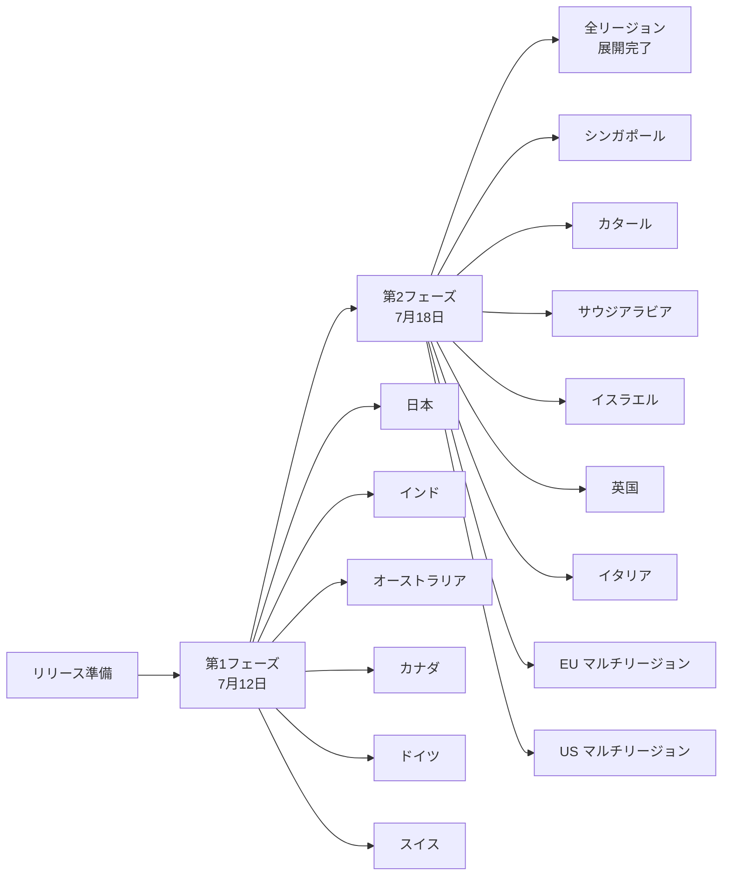

# Google SecOps SOAR: Release 6.3.93 が全リージョンで利用可能に

**リリース日**: 2026-07-18

**サービス**: Google SecOps SOAR

**機能**: Release 6.3.93 is now available for all regions

**ステータス**: 全リージョン展開完了

📊 [このアップデートのインフォグラフィックを見る](https://takech9203.github.io/google-cloud-news-summary/20260718-google-secops-soar-release-6-3-93.html)

## 概要

Google SecOps SOAR の Release 6.3.93 が全リージョンで利用可能になりました。このリリースは 2026年7月12日に第1フェーズのリージョンへの展開が開始され、内部およびカスタマーバグフィックスを含んでいます。本日をもって全リージョンへの展開が完了しました。

Google SecOps SOAR は、セキュリティオーケストレーション、自動化、レスポンス (SOAR) 機能を提供するプラットフォームで、セキュリティチームがインシデント対応を効率化するために使用します。定期的なリリースにより、プラットフォームの安定性とパフォーマンスが継続的に改善されています。

なお、同じ7月12日のリリースでは Publisher Agent Version 2.7.0 も全リージョンで利用可能になったことが併せて発表されています。

## リリース展開プロセス

Google SecOps SOAR のリリースは、2段階のグラジュアルロールアウト方式で展開されます。

リリースは通常日曜日に第1フェーズのリージョンへ展開され、約1週間後に残りのリージョンへ展開されます。

## サービスアップデートの詳細

### 主要内容

1. **内部バグフィックス**
   - プラットフォームの内部的な不具合修正
   - システムの安定性向上

2. **カスタマーバグフィックス**
   - ユーザーから報告された問題の修正
   - ユーザー体験の改善

3. **Publisher Agent Version 2.7.0 の全リージョン展開**
   - 高可用性 (High Availability) サポートの追加
   - GCOM インフラストラクチャに移行済みのエージェントでのファイル転送サポート (プレイブックおよび SDK 経由でのアップロード/ダウンロード)

## 利用可能リージョン

Release 6.3.93 は以下の全リージョンで利用可能です。

| フェーズ | リージョン | 展開日 |
|----------|-----------|--------|
| 第1フェーズ | 日本、インド、オーストラリア、カナダ、ドイツ、スイス | 2026-07-12 |
| 第2フェーズ | シンガポール、カタール、サウジアラビア、イスラエル、英国 (ロンドン)、イタリア、EU (マルチリージョン)、US (マルチリージョン) | 2026-07-18 |

## 最近のリリース履歴

| バージョン | 第1フェーズ展開 | 全リージョン展開 |
|-----------|----------------|-----------------|
| 6.3.93 | 2026-07-12 | 2026-07-18 |
| 6.3.92 | 2026-07-05 | 2026-07-11 |
| 6.3.91 | 2026-06-28 | 2026-07-04 |
| 6.3.90 | 2026-06-21 | 2026-06-27 |

## 関連サービス・機能

- **Google SecOps SIEM**: SOAR と統合されたセキュリティ情報イベント管理 (SIEM) プラットフォーム
- **Chronicle API**: SOAR リソースを含む統合 API (2026年5月に統合・アップグレード済み)
- **Publisher Agent**: リモート環境での統合実行を可能にするエージェント (Version 2.7.0 が同時にリリース)
- **Google Cloud IAM**: SOAR パーミッショングループの IAM 移行が GA (2026年3月)

## 参考リンク

- 📊 [インフォグラフィック](https://takech9203.github.io/google-cloud-news-summary/20260718-google-secops-soar-release-6-3-93.html)
- [公式リリースノート](https://docs.cloud.google.com/chronicle/docs/soar/release-notes)
- [SOAR グラジュアルリリース計画](https://docs.cloud.google.com/chronicle/docs/soar/overview-and-introduction/soar-gradual-release)
- [Google Cloud Release Notes](https://docs.cloud.google.com/release-notes#July_18_2026)

## まとめ

Google SecOps SOAR Release 6.3.93 が全リージョンで利用可能になりました。このリリースは内部およびカスタマーバグフィックスを含む定期メンテナンスリリースです。特別な対応は不要ですが、Publisher Agent Version 2.7.0 の高可用性サポートとファイル転送機能を活用する場合は、関連ドキュメントを確認することを推奨します。

---

**タグ**: #GoogleSecOps #SOAR #Chronicle #SecurityOperations #ReleaseNotes #BugFix
