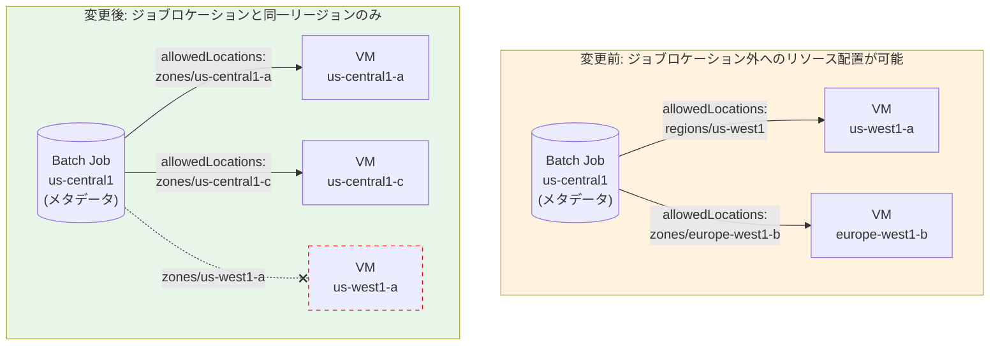

# Batch: allowedLocations フィールドによるジョブロケーション外リソース配置の廃止

**リリース日**: 2026-07-20

**サービス**: Cloud Batch

**機能**: allowedLocations[] フィールドによるジョブロケーション外への Compute Engine リソース配置

**ステータス**: Breaking Change

[このアップデートのインフォグラフィックを見る](https://takech9203.github.io/google-cloud-news-summary/20260720-batch-allowed-locations-breaking-change.html)

## 概要

Cloud Batch において、ジョブのロケーション (メタデータ保存リージョン) とは異なるリージョンやゾーンに Compute Engine リソースを配置する機能が廃止される破壊的変更が発表された。これまで `allowedLocations[]` フィールドを使用して、ジョブのロケーションとは別のリージョンに VM を作成することが可能だったが、今後はジョブのロケーションと同一リージョン内にのみリソースを配置する必要がある。

この変更は段階的に適用される。2026 年 7 月 31 日以前に `allowedLocations[]` フィールドでジョブロケーション外のリージョンまたはゾーンを指定したジョブを正常に送信したことがあるプロジェクトについては 2027 年 6 月 30 日から、その他のすべてのプロジェクトについては 2026 年 7 月 31 日から変更が適用される。

`allowedLocations[]` フィールドを使用していないジョブについては、対応は不要である。

**アップデート前の課題**

- `allowedLocations[]` フィールドを使用して、ジョブのメタデータロケーションとは異なるリージョンに Compute Engine VM を配置することが可能だった
- 例えば、ジョブを `us-central1` に作成しつつ、VM を `us-west1` のゾーンで実行するといった構成が許可されていた
- ジョブのメタデータと実際のコンピュートリソースが地理的に離れた場所に存在する構成が許容されていた

**アップデート後の改善**

- `allowedLocations[]` フィールドで指定するリージョンまたはゾーンは、ジョブのロケーションと同一リージョン内でなければならない
- ジョブのメタデータとコンピュートリソースのロケーション整合性が強制される
- データローカリティとガバナンスの一貫性が向上する

## アーキテクチャ図



変更前はジョブのメタデータロケーションと Compute Engine リソースの配置先が異なるリージョンであっても許可されていたが、変更後はジョブのロケーションと同一リージョン内にのみリソースを配置する必要がある。

## サービスアップデートの詳細

### 主要な変更点

1. **ロケーション制約の強制**
   - `allowedLocations[]` フィールドで指定するリージョンまたはゾーンは、ジョブのロケーション (`projects/{project}/locations/{region}`) と同一リージョン内でなければならない
   - ジョブのロケーション外のリージョンやゾーンを指定した場合、ジョブの作成が拒否される

2. **段階的な適用スケジュール**
   - **2026 年 7 月 31 日**: `allowedLocations[]` でジョブロケーション外を指定したことがないプロジェクトに適用開始
   - **2027 年 6 月 30 日**: 2026 年 7 月 31 日以前にジョブロケーション外を指定したジョブを正常送信したことがあるプロジェクトに適用開始

3. **影響を受けないケース**
   - `allowedLocations[]` フィールドを指定していないジョブ (VM はジョブのロケーションと同一リージョンに自動配置される)
   - `allowedLocations[]` で既にジョブロケーションと同一リージョン内のゾーンのみを指定しているジョブ

## 技術仕様

### LocationPolicy の allowedLocations[] フィールド

| 項目 | 詳細 |
|------|------|
| フィールド名 | `allocationPolicy.location.allowedLocations[]` |
| 値の形式 | `regions/{region}` または `zones/{region}-{zone}` |
| 変更前の制約 | 異なるリージョンの混在は不可だが、ジョブロケーションと異なるリージョンは指定可能 |
| 変更後の制約 | ジョブのロケーションと同一リージョン内のみ指定可能 |

### 変更前後の設定例

**変更前 (許可されていた構成):**

```json
{
  "parent": "projects/my-project/locations/us-central1",
  "allocationPolicy": {
    "location": {
      "allowedLocations": ["regions/us-west1"]
    }
  }
}
```

**変更後 (必要な修正):**

```json
{
  "parent": "projects/my-project/locations/us-west1",
  "allocationPolicy": {
    "location": {
      "allowedLocations": ["regions/us-west1"]
    }
  }
}
```

または、ジョブのロケーションと同一リージョンのゾーンを指定:

```json
{
  "parent": "projects/my-project/locations/us-central1",
  "allocationPolicy": {
    "location": {
      "allowedLocations": ["zones/us-central1-a", "zones/us-central1-c"]
    }
  }
}
```

## 対応方法

### 前提条件

1. 現在のジョブ構成で `allowedLocations[]` フィールドを使用しているかどうかを確認する
2. 使用している場合、指定しているリージョン/ゾーンがジョブのロケーションと同一リージョンかどうかを確認する

### 手順

#### ステップ 1: 既存ジョブの確認

```bash
# ジョブの詳細を確認し、allowedLocations の設定を確認
gcloud batch jobs describe JOB_NAME \
  --location=REGION \
  --project=PROJECT_ID
```

ジョブの `allocationPolicy.location.allowedLocations` フィールドの値と、ジョブのロケーション (API エンドポイントの `locations/{region}` 部分) を比較する。

#### ステップ 2: 構成の修正

`allowedLocations[]` でジョブロケーション外のリージョンやゾーンを指定している場合、以下のいずれかの対応を行う:

**方法 A**: ジョブのロケーションを VM を配置したいリージョンに変更する

```bash
# ジョブのロケーションを VM 配置先と同じリージョンに変更
gcloud batch jobs submit JOB_NAME \
  --location=us-west1 \
  --config=job-config.json
```

**方法 B**: `allowedLocations[]` をジョブのロケーションと同一リージョン内に変更する

```bash
# allowedLocations をジョブロケーションと同一リージョンに修正
# job-config.json の allowedLocations を更新
```

## デメリット・制約事項

### 制限事項

- ジョブのメタデータロケーションと VM の実行リージョンを分離する構成が不可能になる
- Batch が利用可能なリージョンでのみジョブを作成でき、かつそのリージョン内にのみ VM が配置される
- 既存のワークフローで異なるリージョンへの VM 配置を前提としている場合、ジョブ構成の変更が必要

### 考慮すべき点

- 移行猶予期間が設けられている (既存利用プロジェクト: 2027 年 6 月 30 日まで、その他: 2026 年 7 月 31 日まで)
- ジョブのロケーション変更に伴い、API 呼び出しのエンドポイントやリソース名のパスも変更が必要になる場合がある
- `allowedLocations[]` を省略している場合は影響なし (VM はデフォルトでジョブのロケーションに配置される)

## ユースケース

### ユースケース 1: 特定リージョンの GPU リソースを利用するバッチジョブ

**シナリオ**: これまで、ジョブのメタデータを `us-central1` に保存しつつ、GPU が利用可能な `us-west1` で VM を実行していたケース。

**対応例**:
```json
{
  "parent": "projects/my-project/locations/us-west1",
  "taskGroups": [{"taskSpec": {"runnables": [...]}}],
  "allocationPolicy": {
    "location": {
      "allowedLocations": ["regions/us-west1"]
    },
    "instances": [{"policy": {"accelerators": [{"type": "nvidia-tesla-t4", "count": "1"}]}}]
  }
}
```

**効果**: ジョブのロケーションを `us-west1` に変更することで、GPU リソースの利用を継続できる。

### ユースケース 2: allowedLocations を使用していないジョブ

**シナリオ**: `allowedLocations[]` を指定せず、ジョブのロケーションと同じリージョンで VM が自動配置されているケース。

**効果**: 対応不要。変更の影響を受けない。

## 関連サービス・機能

- **Compute Engine**: Batch ジョブの実行基盤となる VM インスタンスを提供。リージョン/ゾーンのリソース可用性に依存する
- **Cloud Batch Instance Flexibility (Preview)**: 2026 年 7 月 17 日に Preview として発表された機能。複数のマシンタイプを指定してリソース取得可能性を向上させる。ロケーション制約が強化される中で、同一リージョン内でのリソース取得可能性を高める手段として活用可能

## 参考リンク

- [インフォグラフィック](https://takech9203.github.io/google-cloud-news-summary/20260720-batch-allowed-locations-breaking-change.html)
- [公式リリースノート](https://cloud.google.com/release-notes#July_20_2026)
- [Batch ロケーション ドキュメント](https://cloud.google.com/batch/docs/locations)
- [Batch Job API リファレンス - LocationPolicy](https://cloud.google.com/batch/docs/reference/rest/v1/projects.locations.jobs#LocationPolicy)

## まとめ

Cloud Batch の `allowedLocations[]` フィールドによるジョブロケーション外へのリソース配置が段階的に廃止される。`allowedLocations[]` を使用してジョブのロケーションとは異なるリージョンに VM を配置しているプロジェクトは、期限までにジョブのロケーションを VM 配置先と一致させるか、`allowedLocations[]` の指定を同一リージョン内に修正する必要がある。`allowedLocations[]` を使用していない場合は対応不要である。

---

**タグ**: #CloudBatch #BreakingChange #allowedLocations #LocationPolicy #ComputeEngine #Migration
