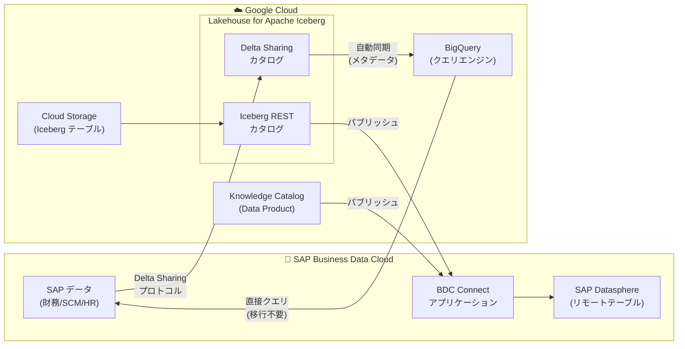

# BigQuery: Lakehouse for Apache Iceberg と SAP Business Data Cloud の連携 (Preview)

**リリース日**: 2026-07-20

**サービス**: BigQuery

**機能**: Cross-cloud Lakehouse SAP BDC Integration

**ステータス**: Preview

📊 [このアップデートのインフォグラフィックを見る](https://takech9203.github.io/google-cloud-news-summary/20260720-bigquery-lakehouse-sap-bdc-integration.html)

## 概要

Google Cloud は、Lakehouse for Apache Iceberg の Cross-cloud Lakehouse 機能において、SAP Business Data Cloud (BDC) との連携を Preview として提供開始しました。この連携により、BigQuery と SAP BDC 間で双方向のデータアクセスが可能になり、データを移動することなく SAP のビジネスデータを BigQuery で分析したり、Google Cloud のデータを SAP 環境から直接利用したりできるようになります。

SAP BDC は、財務、サプライチェーン、人事を含むすべての SAP アプリケーションからのデータを統合管理する中心的なシステムです。今回の連携では Delta Sharing プロトコルを使用したフェデレーション (SAP から Google Cloud) と、Apache Iceberg REST カタログを介したパブリッシュ (Google Cloud から SAP) の 2 つのワークフローをサポートします。

この機能は、SAP と Google Cloud の両方の環境を持つエンタープライズ企業のデータアーキテクト、BI エンジニア、データエンジニアを主な対象としています。

**アップデート前の課題**

- SAP のビジネスデータを BigQuery で分析するには、ETL パイプラインを構築してデータを移行する必要があった
- データ移行に伴う遅延により、SAP データのリアルタイム性が失われていた
- Google Cloud のデータを SAP ユーザーが利用するには、SAP 側にデータをコピーする別のパイプラインが必要だった
- SAP と Google Cloud 間のデータ統合には高い運用コストとメンテナンス負荷がかかっていた

**アップデート後の改善**

- Delta Sharing プロトコルにより、SAP BDC のデータを BigQuery から直接クエリ可能になった (データ移行不要)
- Lakehouse カタログが SAP BDC のシェア、スキーマ、テーブルを自動同期するため、メタデータ管理が自動化された
- Apache Iceberg REST カタログまたは Knowledge Catalog Data Product を SAP BDC に直接パブリッシュできるようになった
- SAP ユーザーが Google Cloud のデータを SAP Datasphere のリモートテーブルとしてネイティブに利用可能になった

## アーキテクチャ図



BigQuery Lakehouse と SAP BDC 間の双方向データフローを示しています。上方向 (SAP to Google Cloud) では Delta Sharing プロトコルによるフェデレーション、下方向 (Google Cloud to SAP) では Iceberg REST カタログを介したパブリッシュが実現されます。

## サービスアップデートの詳細

### 主要機能

1. **SAP BDC からのフェデレーション (SAP to Google Cloud)**
   - Lakehouse に Delta Sharing カタログを作成し、SAP BDC からのシェア、スキーマ、テーブルを自動同期
   - Federated Delta Lake Catalog が Delta Sharing プロトコルを使用して SAP BDC と通信
   - テーブルやスキーマのライブディスカバリーが可能
   - デフォルトで 5 分ごとにメタデータが自動更新 (`--refresh-interval` で設定可能)

2. **SAP データのクエリ (Query SAP Data)**
   - 同期された SAP BDC テーブルを BigQuery から標準 GoogleSQL で直接クエリ
   - データ移行なしで SAP のビジネスデータにアクセス
   - BigQuery ML、Looker などの BigQuery エコシステムのツールと連携可能
   - データ階層: `PROJECT_ID.CATALOG_ID.SHARE_NAME.SCHEMA_NAME.TABLE_NAME`

3. **SAP BDC へのパブリッシュ (Google Cloud to SAP)**
   - Apache Iceberg REST カタログ (IRC) テーブルを SAP BDC に直接パブリッシュ
   - Knowledge Catalog Data Product を SAP BDC に直接パブリッシュ
   - SAP Datasphere のリモートテーブルとして Google Cloud データを利用可能
   - Workload Identity Federation (WIF) による認証連携

## 技術仕様

### プロトコルと接続方式

| 項目 | 詳細 |
|------|------|
| フェデレーションプロトコル | Delta Sharing |
| カタログタイプ | Federated Delta Lake Catalog |
| パブリッシュ方式 | Apache Iceberg REST Catalog / Knowledge Catalog Data Product |
| 認証方式 | Workload Identity Federation (WIF) + OIDC |
| メタデータ更新間隔 | デフォルト 5 分 (カスタマイズ可能) |
| データアクセス | 読み取り専用 (SAP BDC からのデータ書き込みは不可) |
| 必要エディション | BigQuery Enterprise Plus |

### データ階層構造

```
PROJECT_ID
  └── CATALOG_ID (Lakehouse カタログ)
        └── SHARE_NAME (SAP Data Product)
              └── SCHEMA_NAME (Delta Schema)
                    └── TABLE_NAME (SAP テーブル)
```

### 必要な IAM ロール

| ロール | 用途 |
|--------|------|
| `roles/biglake.admin` | Lakehouse カタログの管理 |
| `roles/bigquery.admin` | BigQuery リソースの管理 |
| `roles/iam.workloadIdentityPoolAdmin` | WIF プール・プロバイダの管理 |
| `roles/biglake.viewer` | カタログメタデータの参照 (WIF プリンシパルに付与) |
| `roles/serviceusage.serviceUsageConsumer` | サービスクォータの消費 (WIF プリンシパルに付与) |

## 設定方法

### 前提条件

1. BigQuery Enterprise Plus エディションが有効であること
2. SAP 管理者が SAP BDC 環境にアクセスできること
3. BigLake Admin (`roles/biglake.admin`) または BigQuery Admin (`roles/bigquery.admin`) ロールが付与されていること

### 手順

#### ステップ 1: Enterprise Plus リザベーションの作成

```bash
# Enterprise Plus リザベーションを作成
# BigQuery > 管理 > 容量管理 > リザベーション タブ
# - Edition: Enterprise Plus
# - Baseline slots: 0 (クエリ実行時のみ課金)
# - Autoscaling: 有効
```

#### ステップ 2: Delta Sharing カタログの作成

```bash
# 空の Delta Sharing カタログを作成
gcloud alpha biglake delta-sharing catalogs create CATALOG_ID \
  --project="PROJECT_ID" \
  --location="REGION" \
  --refresh-interval="5m"
```

#### ステップ 3: SAP for Me でコネクタを設定

SAP 管理者が SAP for Me にサインインし、BDC Connect アプリケーションをプロビジョニング:
- Google Cloud サービスアカウント ID を External System Instance Identifier として入力
- Activation Link から SAP Connector Endpoint と Invitation Code を取得

#### ステップ 4: カタログの更新 (ハンドシェイク完了)

```bash
# SAP から取得したエンドポイントと招待コードでカタログを更新
gcloud alpha biglake delta-sharing catalogs update CATALOG_ID \
  --project="PROJECT_ID" \
  --endpoint="SAP_CONNECTOR_ENDPOINT" \
  --invitation-code="SAP_INVITATION_CODE"
```

#### ステップ 5: SAP データのクエリ

```sql
-- SAP BDC のテーブルをクエリ
SELECT *
FROM `PROJECT_ID`.`CATALOG_ID`.`SHARE_NAME`.`SCHEMA_NAME`.`TABLE_NAME`
LIMIT 10
```

#### ステップ 6: Google Cloud データの SAP BDC へのパブリッシュ (逆方向)

```bash
# Workload Identity Federation プールの作成
gcloud iam workload-identity-pools create POOL_ID \
  --project="PROJECT_ID" \
  --location="global"

# Data Product を SAP BDC にパブリッシュ
gcloud alpha biglake data-product-sharing publish \
  --catalog="CATALOG_ID" \
  --project="PROJECT_ID"
```

## メリット

### ビジネス面

- **データサイロの解消**: SAP と Google Cloud のデータを統合的に分析でき、部門横断的なインサイトを獲得
- **運用コスト削減**: ETL パイプラインの構築・維持が不要になり、データ統合の TCO が大幅に低減
- **リアルタイム分析**: データ移行の遅延がなく、SAP BDC の最新データに直接アクセス可能
- **双方向のデータ共有**: SAP チームと Google Cloud チームが互いのデータを自由に活用可能

### 技術面

- **ゼロコピーアーキテクチャ**: データ移動なしでクエリ可能なため、ストレージコストの重複を回避
- **標準プロトコル採用**: Delta Sharing と Apache Iceberg REST の業界標準プロトコルにより高い互換性
- **自動メタデータ同期**: カタログのメタデータが定期的に自動更新され、手動管理が不要
- **BigQuery エコシステム活用**: BigQuery ML、Looker、Cloud Dataflow など既存の分析ツールを SAP データに適用可能

## デメリット・制約事項

### 制限事項

- **特殊文字の制約 (既知の問題)**: Data Product 名に "/" や "-" などの特殊文字が含まれる場合、サポートされない。この問題のある Data Product を共有すると Google 側のリフレッシュが停止し、再登録が必要になる場合がある。BW ソースや SuccessFactors からの Data Product で発生しやすい
- **読み取り専用アクセス**: SAP BDC テーブルへの書き込みは不可 (BigQuery から SAP データの変更はできない)
- **Fine-grained Access Control (FGAC) 非対応**: SAP Delta Sharing テーブルでは行・列レベルのアクセス制御が利用不可
- **Iceberg Metrics Reporting 非対応**: フェデレーテッドカタログでは Iceberg Metrics Reporting が利用不可 (`rest-metrics-reporting-enabled` を `false` に設定する必要あり)
- **Enterprise Plus 必須**: SAP BDC への接続には BigQuery Enterprise Plus エディションが必要

### 考慮すべき点

- **メタデータ更新間隔とコストのトレードオフ**: `--refresh-interval` を短くするとデータの鮮度は上がるが、Delta Sharing API 呼び出し (Lakehouse Class A operations) のコストが増加
- **VPC Service Controls**: ネットワーク設定によっては VPC 構成やホワイトリスト設定が必要
- **SAP 側の設定依存**: BDC Connect のプロビジョニングには SAP 管理者の協力が必須
- **Preview ステータス**: 本番環境での利用には注意が必要 (GA までに仕様変更の可能性あり)

## ユースケース

### ユースケース 1: SAP 財務データと BigQuery ML による需要予測

**シナリオ**: 製造業企業が SAP BDC に蓄積された販売実績、受注データ、在庫情報を BigQuery ML で分析し、需要予測モデルを構築する。

**実装例**:
```sql
-- SAP BDC の販売データを直接クエリして需要予測モデルを構築
CREATE OR REPLACE MODEL `my_project.ml_dataset.demand_forecast`
OPTIONS(model_type='ARIMA_PLUS') AS
SELECT
  order_date,
  SUM(quantity) as total_quantity
FROM `my_project`.`sap_catalog`.`sales_share`.`orders`.`sales_orders`
GROUP BY order_date
```

**効果**: ETL パイプライン不要でリアルタイムの SAP データを ML モデルのトレーニングに活用でき、需要予測の精度向上と開発サイクルの短縮を実現

### ユースケース 2: Google Cloud の分析結果を SAP Datasphere に公開

**シナリオ**: データサイエンスチームが BigQuery で作成した顧客セグメンテーション結果を、SAP BDC を通じてマーケティング部門の SAP Datasphere 環境に公開する。

**効果**: SAP ユーザーが慣れ親しんだ SAP Datasphere の UI から Google Cloud の高度な分析結果を直接利用でき、データ民主化が促進される

### ユースケース 3: クロスクラウドのサプライチェーン可視化

**シナリオ**: グローバル企業が SAP の SCM データと Google Cloud 上の IoT センサーデータ、物流データを統合して、Looker でサプライチェーン全体のダッシュボードを構築する。

**効果**: データ移行なしで SAP と Google Cloud のデータを横断的に分析でき、サプライチェーンのリアルタイム可視化を低コストで実現

## 料金

Lakehouse for Apache Iceberg の SAP BDC 連携に関連する料金:

### 料金例

| 項目 | 料金 (USD) |
|------|------------|
| Lakehouse テーブル管理 (DCU) | $0.12/DCU-Hour から |
| メタデータストレージ (無料枠超過分) | $0.04/GiB/月 |
| Class A オペレーション (メタデータ書き込み、5,001 超過分) | $6.00/100 万オペレーション |
| Class B オペレーション (メタデータ読み取り、50,001 超過分) | $0.90/100 万オペレーション |
| カタログフェデレーション メタデータリフレッシュ (5,001 超過分) | $6.00/100 万オペレーション |
| BigQuery Enterprise Plus スロット | 容量ベース料金に準拠 |

**無料枠**:
- メタデータストレージ: 1 GiB/月
- Class A オペレーション: 5,000 回/月
- Class B オペレーション: 50,000 回/月
- メタデータリフレッシュ: 5,000 回/月

## 関連サービス・機能

- **BigQuery Enterprise Plus**: SAP BDC 連携に必須のエディション。Auto-scaling スロットによるコスト最適化をサポート
- **Lakehouse for Apache Iceberg (Runtime Catalog)**: フェデレーションカタログとICEberg REST カタログの管理基盤
- **Knowledge Catalog (旧 Dataplex)**: Data Product の管理・ガバナンス。SAP BDC へのパブリッシュにも利用可能
- **Workload Identity Federation**: SAP BDC の OIDC 認証との信頼関係を確立する認証機構
- **Cloud Storage**: Iceberg テーブルのデータファイルとメタデータの保存先
- **BigQuery ML**: フェデレートされた SAP データに対する機械学習モデルの構築・実行
- **Looker**: SAP データを含む統合ダッシュボードの構築
- **Analytics Hub**: BigQuery のデータ共有・マーケットプレイス機能

## 参考リンク

- 📊 [インフォグラフィック](https://takech9203.github.io/google-cloud-news-summary/20260720-bigquery-lakehouse-sap-bdc-integration.html)
- [公式リリースノート](https://cloud.google.com/release-notes#July_20_2026)
- [SAP BDC 連携の概要ドキュメント](https://docs.cloud.google.com/lakehouse/docs/sap-bdc-overview)
- [Cross-cloud Lakehouse for SAP BDC のセットアップ](https://docs.cloud.google.com/lakehouse/docs/set-up-cross-cloud-lakehouse-sap-bdc)
- [SAP BDC データのクエリ](https://docs.cloud.google.com/lakehouse/docs/query-sap-data)
- [BigQuery データの SAP BDC へのパブリッシュ](https://docs.cloud.google.com/lakehouse/docs/publish-data-to-sap-bdc)
- [トラブルシューティング](https://docs.cloud.google.com/lakehouse/docs/troubleshoot-cross-cloud-lakehouse-sap-bdc)
- [Lakehouse 料金](https://cloud.google.com/products/biglake/pricing)

## まとめ

今回の Lakehouse for Apache Iceberg と SAP Business Data Cloud の連携 (Preview) は、SAP エコシステムと Google Cloud の分析基盤を統合する重要なアップデートです。Delta Sharing プロトコルによるゼロコピーフェデレーションと、Iceberg REST カタログを介した双方向データ共有により、企業はデータ移行パイプラインの構築・運用コストを大幅に削減しながら、SAP のビジネスデータに対する高度な分析を即座に実行できるようになります。SAP と Google Cloud の両方を利用するエンタープライズ企業は、GA 昇格に向けて早期に検証を開始することを推奨します。

---

**タグ**: BigQuery, Lakehouse, Apache Iceberg, SAP, BDC, Delta Sharing, Cross-cloud, Data Federation
