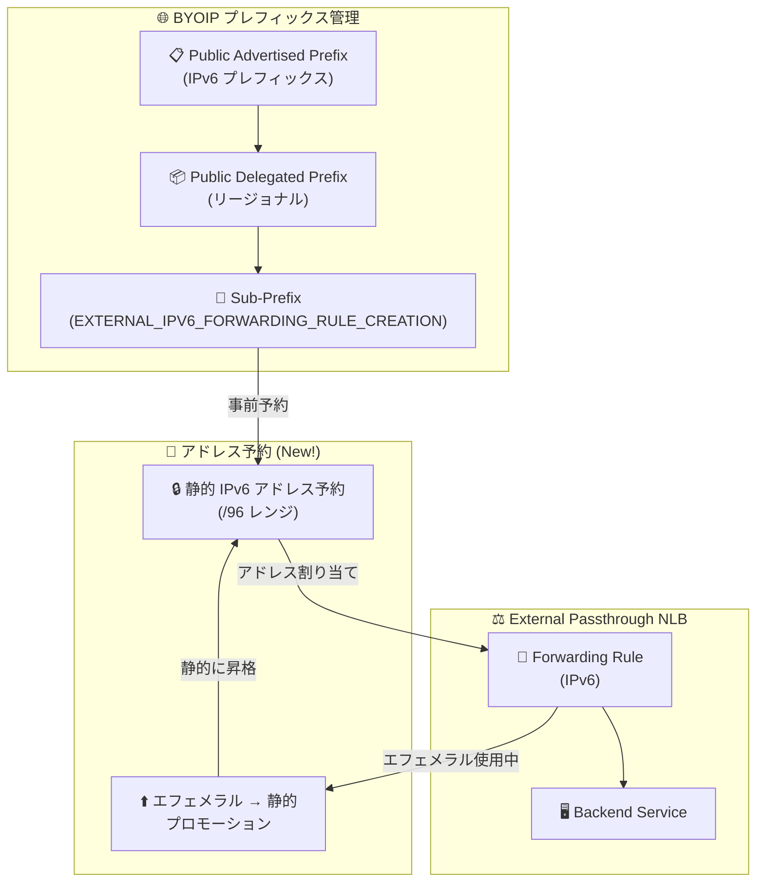

# Cloud Load Balancing / VPC: BYOIP IPv6 アドレスの事前予約とプロモーション

**リリース日**: 2026-07-20

**サービス**: Cloud Load Balancing / Virtual Private Cloud

**機能**: BYOIP IPv6 静的アドレスの事前予約およびエフェメラルアドレスのプロモーション

**ステータス**: Preview

📊 [このアップデートのインフォグラフィックを見る](https://takech9203.github.io/google-cloud-news-summary/20260720-cloud-load-balancing-byoip-ipv6-reservation.html)

## 概要

Google Cloud は、リージョナル外部パススルー Network Load Balancer (NLB) で使用する BYOIP (Bring Your Own IP) IPv6 アドレスについて、ロードバランサーの作成前に静的アドレスとして事前予約できる機能を Preview として提供開始した。これにより、IPv6 アドレスがロードバランサーのライフサイクルから独立して永続化される。

従来、BYOIP IPv6 アドレスはフォワーディングルール作成時にのみ割り当て可能であり、ロードバランサーを削除するとアドレスも解放されるリスクがあった。今回のアップデートにより、VPC レベルで BYOIP サブプレフィックス (EXTERNAL_IPV6_FORWARDING_RULE_CREATION モード) から静的外部 IPv6 アドレスを予約し、ロードバランサーのライフサイクルとは独立してアドレスを管理できるようになった。また、使用中のエフェメラル BYOIP IPv6 アドレスを静的 IP アドレスにプロモートする機能も同時に提供される。

この機能は、自社所有の IPv6 アドレスプレフィックスを Google Cloud 上で使用しているエンタープライズ顧客やサービスプロバイダーに特に有用である。DNS レコードやファイアウォールルールで固定 IPv6 アドレスを参照する運用において、アドレスの永続性が保証される。

**アップデート前の課題**

- BYOIP IPv6 アドレスはフォワーディングルール (ロードバランサー) 作成時にのみ割り当て可能であり、事前予約ができなかった
- ロードバランサーを削除すると関連する IPv6 アドレスも解放され、同じアドレスの再取得が保証されなかった
- 使用中のエフェメラル BYOIP IPv6 アドレスを静的アドレスにプロモートする手段がなかった
- アドレスの永続性がロードバランサーのライフサイクルに依存していたため、メンテナンスや構成変更時にアドレス変更リスクがあった

**アップデート後の改善**

- BYOIP サブプレフィックスから静的外部 IPv6 アドレスを事前に予約し、ロードバランサー作成前にアドレスを確保できるようになった
- 予約した IPv6 アドレスはロードバランサーのライフサイクルから独立して永続化される
- 使用中のエフェメラル BYOIP IPv6 アドレスを静的 IP アドレスにプロモート可能になった
- 特定の IPv6 アドレスまたは自動割り当てのいずれかを選択して予約できる

## アーキテクチャ図



BYOIP IPv6 アドレスのライフサイクルを示す図。サブプレフィックスから静的アドレスを事前予約し、フォワーディングルールに割り当てるフロー、およびエフェメラルアドレスを静的にプロモートするフローを表現している。

## サービスアップデートの詳細

### 主要機能

1. **BYOIP IPv6 静的アドレスの事前予約**
   - EXTERNAL_IPV6_FORWARDING_RULE_CREATION モードのサブプレフィックスから静的外部 IPv6 アドレスを予約可能
   - 特定のアドレスを指定するか、自動割り当てのいずれかを選択
   - 予約したアドレスはロードバランサー作成前に確保され、ライフサイクルが独立
   - /96 プレフィックス長の IPv6 アドレスレンジとして予約

2. **エフェメラル BYOIP IPv6 アドレスのプロモーション**
   - 外部フォワーディングルールで使用中のエフェメラル BYOIP IPv6 アドレスを静的に昇格
   - プロモーション中もパケットドロップなし (サービス中断なし)
   - プロモーション後はロードバランサーを削除してもアドレスが保持される

3. **対応するリソースタイプ**
   - リージョナル外部パススルー Network Load Balancer
   - 外部プロトコルフォワーディング
   - Premium ネットワークサービスティアが必要

## 技術仕様

### BYOIP IPv6 サブプレフィックスモードの要件

| 項目 | 詳細 |
|------|------|
| サブプレフィックスモード | `EXTERNAL_IPV6_FORWARDING_RULE_CREATION` |
| 有効なサブプレフィックス長 | /32, /40, /48, /56, /64, /72 |
| アロケータブルプレフィックス長 | /48, /56, /64, /72, /80, /88, /96 |
| デフォルトプレフィックス長 | サブプレフィックスが /64 or /72 の場合は /96、それ以外は /64 |
| ネットワークサービスティア | Premium のみ |
| スコープ | リージョナル |
| IPv6 アクセスタイプ | External |

### 静的アドレス予約のパラメータ

| パラメータ | 説明 |
|-----------|------|
| `--ip-version` | IPV6 |
| `--endpoint-type` | NETLB |
| `--ip-collection` | サブプレフィックス名 (PDP) |
| `--addresses` | 予約する IPv6 アドレス (オプション、未指定時は自動割り当て) |
| `--prefix-length` | 96 |

## 設定方法

### 前提条件

1. BYOIP の Public Advertised Prefix (PAP) が作成済みであること
2. Public Delegated Prefix (PDP) が作成済みであること
3. `EXTERNAL_IPV6_FORWARDING_RULE_CREATION` モードの IPv6 サブプレフィックスが作成済みであること
4. サブプレフィックスのアナウンスが完了していること (プロビジョニングに 2-4 週間)

### 手順

#### ステップ 1: BYOIP IPv6 静的アドレスの予約

```bash
# 特定のアドレスを指定して予約
gcloud compute addresses create my-byoip-ipv6-address \
  --region=us-central1 \
  --ip-version=IPV6 \
  --endpoint-type=NETLB \
  --ip-collection=my-sub-prefix \
  --addresses=2001:db8:1:1::1 \
  --prefix-length=96

# 自動割り当てで予約 (アドレス未指定)
gcloud compute addresses create my-byoip-ipv6-auto \
  --region=us-central1 \
  --ip-version=IPV6 \
  --endpoint-type=NETLB \
  --ip-collection=my-sub-prefix \
  --prefix-length=96
```

予約した静的アドレスは `gcloud compute addresses describe` で確認できる。

#### ステップ 2: 予約済みアドレスを NLB に割り当て

```bash
# フォワーディングルール作成時に予約済みアドレスを指定
gcloud compute forwarding-rules create my-nlb-ipv6-rule \
  --load-balancing-scheme=EXTERNAL \
  --ip-protocol=TCP \
  --ports=80 \
  --ip-version=IPV6 \
  --region=us-central1 \
  --address=my-byoip-ipv6-address \
  --ip-collection=my-sub-prefix \
  --backend-service=my-backend-service
```

#### ステップ 3: エフェメラルアドレスのプロモーション (既存 NLB の場合)

```bash
# 使用中のエフェメラル BYOIP IPv6 アドレスを静的にプロモート
gcloud compute addresses create my-promoted-ipv6 \
  --region=us-central1 \
  --addresses=2001:db8:1:1::a \
  --prefix-length=96
```

プロモーション中はパケットドロップが発生せず、サービスは継続される。

## メリット

### ビジネス面

- **IP アドレスの永続性保証**: DNS レコードやパートナー連携で使用する IPv6 アドレスが、インフラ変更時にも変わらないことが保証される
- **運用リスクの低減**: ロードバランサーのメンテナンスや再作成時にアドレス変更に伴うダウンタイムや設定変更が不要
- **コンプライアンス対応**: 自社所有アドレスの管理ポリシーに準拠したライフサイクル管理が可能

### 技術面

- **ライフサイクルの分離**: IP アドレスとロードバランサーのライフサイクルが独立し、Blue/Green デプロイメントや構成変更が容易
- **ゼロダウンタイムプロモーション**: エフェメラルアドレスの静的プロモーション中にパケットドロップが発生しない
- **IaC との親和性**: Terraform 等で IP アドレスとロードバランサーを別リソースとして管理でき、依存関係が明確化

## デメリット・制約事項

### 制限事項

- Preview ステータスのため、本番環境での使用には SLA が適用されない可能性がある
- IPv6 BYOIP アドレスはリージョナルのみ対応 (グローバル IPv6 BYOIP アドレスは作成不可)
- Premium ネットワークサービスティアでのみ利用可能
- BYOIP プレフィックスのプロビジョニングには 2-4 週間が必要
- BYOIP アドレスはプロジェクト間で移動不可
- サブプレフィックスのモードは作成後に変更不可 (EXTERNAL_IPV6_FORWARDING_RULE_CREATION と EXTERNAL_IPV6_SUBNETWORK_CREATION は排他的)

### 考慮すべき点

- 予約した静的アドレスをリソースに割り当てない場合の課金体系を確認すること (BYOIP アドレスは通常課金なしだが、静的予約の扱いを要確認)
- サブプレフィックスのアロケータブルプレフィックス長がフォワーディングルールで使用する IPv6 レンジサイズを決定する
- 既存のエフェメラルアドレスをプロモートする場合、プロモート後は明示的に解放しない限りアドレスが保持される

## ユースケース

### ユースケース 1: マルチリージョン DNS ベースのフェイルオーバー

**シナリオ**: 企業が自社所有の IPv6 プレフィックスを使って複数リージョンに NLB をデプロイし、DNS ベースのフェイルオーバーを構成する場合。各リージョンの NLB に固定 IPv6 アドレスを割り当て、DNS レコードに登録する。

**実装例**:
```bash
# リージョン A のアドレス予約
gcloud compute addresses create nlb-region-a-ipv6 \
  --region=us-east1 \
  --ip-version=IPV6 \
  --endpoint-type=NETLB \
  --ip-collection=my-byoip-sub-prefix-east \
  --prefix-length=96

# リージョン B のアドレス予約
gcloud compute addresses create nlb-region-b-ipv6 \
  --region=us-west1 \
  --ip-version=IPV6 \
  --endpoint-type=NETLB \
  --ip-collection=my-byoip-sub-prefix-west \
  --prefix-length=96
```

**効果**: NLB の再作成や構成変更が発生しても IPv6 アドレスが変わらず、DNS レコードの更新やクライアント側の変更が不要。

### ユースケース 2: Blue/Green デプロイメントでの IP アドレス移行

**シナリオ**: 新しいバックエンドサービスへの移行時に、既存の IPv6 アドレスを新しいロードバランサーに付け替える。

**効果**: 固定 IP アドレスを新旧ロードバランサー間で移動でき、クライアントへの影響なしにインフラを更新可能。

## 料金

BYOIP アドレスについては、通常の Google 提供 IP アドレスとは異なる料金体系が適用される。

- **BYOIP アドレスの使用**: アイドル状態および使用中のいずれも課金なし (Google 提供 IP アドレスと異なり、BYOIP アドレスには IP アドレス使用料金が発生しない)
- **Network Load Balancer**: フォワーディングルール料金 + データ処理料金が別途発生

詳細は公式料金ページを参照。

## 利用可能リージョン

BYOIP IPv6 サブプレフィックスが作成可能なすべてのリージョンで利用可能。BYOIP のプロビジョニング時にリージョンを指定するため、具体的な利用可能リージョンはプロジェクトの BYOIP 設定に依存する。

## 関連サービス・機能

- **VPC (Virtual Private Cloud)**: BYOIP プレフィックスの管理基盤。パブリックアドバタイズドプレフィックス、パブリックデリゲートプレフィックス、サブプレフィックスの作成・管理
- **Cloud Load Balancing**: 外部パススルー NLB および外部プロトコルフォワーディングでの BYOIP IPv6 アドレス利用
- **Cloud DNS**: 予約した静的 IPv6 アドレスを DNS レコードに登録し、安定したサービスエンドポイントを提供
- **Cloud Armor**: NLB と組み合わせた DDoS 保護やセキュリティポリシーの適用
- **Terraform (Google Provider)**: `google_compute_address` リソースによる IaC 管理

## 参考リンク

- 📊 [インフォグラフィック](https://takech9203.github.io/google-cloud-news-summary/20260720-cloud-load-balancing-byoip-ipv6-reservation.html)
- [公式リリースノート](https://docs.cloud.google.com/release-notes#July_20_2026)
- [Bring your own IP addresses (BYOIP) ドキュメント](https://docs.cloud.google.com/vpc/docs/bring-your-own-ip)
- [静的外部 IP アドレスの予約](https://docs.cloud.google.com/vpc/docs/reserve-static-external-ip-address)
- [IPv6 サブプレフィックスの作成と使用](https://docs.cloud.google.com/vpc/docs/create-ipv6-sub-prefixes)
- [外部パススルー NLB の設定 (BYOIP)](https://docs.cloud.google.com/load-balancing/docs/network/setting-up-network-backend-service#byoip-ipv6)
- [VPC ネットワーク料金](https://docs.cloud.google.com/vpc/network-pricing#ipaddress)

## まとめ

今回のアップデートにより、BYOIP IPv6 アドレスのライフサイクル管理がロードバランサーから分離され、エンタープライズ環境での IPv6 アドレス管理が大幅に改善された。自社所有の IPv6 プレフィックスを使用している組織は、既存のエフェメラルアドレスを静的にプロモートし、今後作成する NLB では事前予約したアドレスを使用することで、アドレスの永続性を確保することを推奨する。

---

**タグ**: #CloudLoadBalancing #VPC #BYOIP #IPv6 #NetworkLoadBalancer #StaticIP #Preview
