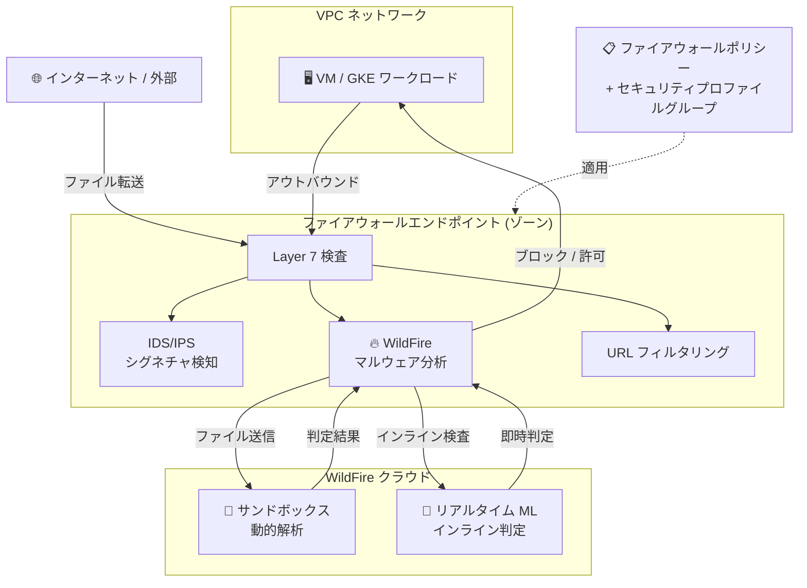

# Cloud NGFW: WildFire マルウェア防御サービス

**リリース日**: 2026-07-20

**サービス**: Cloud NGFW (Cloud Next Generation Firewall)

**機能**: WildFire マルウェア防御サービス

**ステータス**: Preview

📊 [このアップデートのインフォグラフィックを見る](https://takech9203.github.io/google-cloud-news-summary/20260720-cloud-ngfw-wildfire-malware-protection.html)

## 概要

Cloud NGFW に WildFire サービスが統合され、ネットワーク経由で転送されるファイルに対する高度なマルウェア防御が可能になった。WildFire は Palo Alto Networks のマルウェアサンドボックス技術とリアルタイム機械学習 (ML) を組み合わせ、ネットワークルーティングされるファイル転送を深層検査し、ゼロデイマルウェアがワークロードに到達する前にブロックする。

本機能は Cloud Firewall Enterprise ティアで利用可能であり、既存の侵入検知・防御サービス (IDS/IPS) やURL フィルタリングに加え、未知のマルウェアやファイルベースの脅威に対する新たな防御レイヤーを提供する。従来のシグネチャベースの検知では対応が困難だった新種のマルウェアや未知の脅威に対して、クラウドベースのサンドボックス分析とインライン ML による即時判定を組み合わせることで、プロアクティブな防御を実現する。

**アップデート前の課題**

- Cloud NGFW Enterprise の IDS/IPS はシグネチャベースの検知に依存しており、既知の脅威パターンにのみ対応可能だった
- 未知のマルウェアやゼロデイ攻撃に対しては、シグネチャが配信されるまで検知・ブロックができなかった
- ファイル転送に含まれる新種のマルウェアを検査するには、サードパーティのサンドボックスソリューションを別途構築・運用する必要があった
- ネットワーク経由のファイルベース脅威に対するインライン検査の仕組みがクラウドネイティブに提供されていなかった

**アップデート後の改善**

- WildFire サンドボックスによりネットワーク経由のファイルを動的解析し、未知のマルウェアを検知・ブロック可能になった
- リアルタイム ML によるインライン判定で、シグネチャ配信を待たずに即座にゼロデイ脅威を防御できるようになった
- Cloud NGFW のセキュリティプロファイルとして統合され、追加のインフラ構築なしにファイルベースの脅威防御を有効化可能になった
- アップロード・ダウンロード両方向のファイル転送を検査対象とすることで、包括的なファイルベース脅威防御が実現した

## アーキテクチャ図



WildFire はファイアウォールエンドポイントの Layer 7 検査パイプラインに統合され、ネットワーク経由のファイル転送に対してリアルタイム ML による即時判定とクラウドサンドボックスによる動的解析の 2 段階で未知のマルウェアを検知・ブロックする。

## サービスアップデートの詳細

### 主要機能

1. **マルウェアサンドボックス分析**
   - ネットワーク経由で転送されるファイルをクラウドベースのサンドボックス環境で実行し、悪意のある動作を検知
   - 既知のシグネチャに依存しない動的解析により、新種のマルウェアを発見可能
   - 解析結果に基づきファイル転送のブロック/許可を判定

2. **リアルタイム機械学習 (インライン ML)**
   - ファイル転送をインラインで ML モデルにより即時判定
   - サンドボックス解析の完了を待たずにゼロデイ脅威をブロック可能
   - ML 例外設定 (partial hash ベース) による false positive の制御が可能

3. **インラインクラウド分析ルール**
   - ファイルタイプ (ANY_FILE、PE) ごとに分析ルールを設定可能
   - アップロード/ダウンロード/両方向のトラフィック方向を指定可能
   - アクション (ALLOW、DENY、ALERT) をルールごとに設定可能

4. **WildFire セキュリティプロファイル**
   - 組織レベルまたはプロジェクトレベルでの WildFire Analysis プロファイルの作成
   - セキュリティプロファイルグループへの統合による既存の IDS/IPS、URL フィルタリングとの連携
   - 脅威 ID ベースのオーバーライドやプロトコル別のアクション制御

## 技術仕様

### WildFire Analysis プロファイル構成要素

| 項目 | 詳細 |
|------|------|
| プロファイルタイプ | WildFire Analysis (wildfire-analysis) |
| 管理レベル | 組織レベル / プロジェクトレベル |
| 対応ファイルタイプ | ANY_FILE、PE |
| トラフィック方向 | UPLOAD、DOWNLOAD、BOTH |
| アクション | ALLOW、DENY、ALERT |
| インライン ML 例外 | partial hash + ファイル名ベースで設定 |

### サポートプロトコル (WildFire オーバーライド)

| プロトコル | 対応状況 |
|-----------|---------|
| HTTP | 対応 |
| HTTP2 | 対応 |
| FTP | 対応 |
| SMTP | 対応 |
| SMB | 対応 |
| POP3 | 対応 |
| IMAP | 対応 |

### ファイアウォールエンドポイントのスループット

| 構成 | 最大スループット |
|------|----------------|
| TLS 検査あり | 最大 2 Gbps |
| TLS 検査なし | 最大 10 Gbps |
| 接続あたり (TLS あり) | 最大 250 Mbps |
| 接続あたり (TLS なし) | 最大 1.25 Gbps |

## 設定方法

### 前提条件

1. Cloud Firewall Enterprise ティアが有効であること
2. ファイアウォールエンドポイントがワークロードと同じゾーンにデプロイされていること
3. VPC ネットワークとファイアウォールエンドポイントのアソシエーションが作成されていること
4. 必要な IAM 権限 (`roles/networksecurity.securityProfileAdmin` または `roles/compute.networkAdmin`)

### 手順

#### ステップ 1: WildFire Analysis セキュリティプロファイルの作成

```bash
gcloud beta network-security security-profiles wildfire-analysis create my-wildfire-profile \
    --organization=ORGANIZATION_ID \
    --location=global \
    --description="WildFire malware protection profile"
```

WildFire Analysis タイプのセキュリティプロファイルを作成する。

#### ステップ 2: インラインクラウド分析ルールの追加

```bash
gcloud beta network-security security-profiles wildfire-analysis \
    add-inline-cloud-analysis-rule my-wildfire-profile \
    --organization=ORGANIZATION_ID \
    --location=global \
    --file-types=ANY_FILE \
    --direction=BOTH \
    --action=DENY
```

すべてのファイルタイプを対象に、アップロード・ダウンロード両方向で脅威検知時にブロックするルールを追加する。

#### ステップ 3: セキュリティプロファイルグループの作成

```bash
gcloud network-security security-profile-groups create my-security-group \
    --organization=ORGANIZATION_ID \
    --location=global \
    --threat-prevention-profile=THREAT_PREVENTION_PROFILE_URL
```

WildFire プロファイルを含むセキュリティプロファイルグループを作成し、ファイアウォールポリシールールから参照可能にする。

#### ステップ 4: ファイアウォールポリシールールでの有効化

```bash
gcloud compute network-firewall-policies rules create 1000 \
    --firewall-policy=my-policy \
    --direction=INGRESS \
    --action=apply_security_profile_group \
    --security-profile-group=my-security-group \
    --global-firewall-policy
```

ファイアウォールポリシールールに `apply_security_profile_group` アクションを指定して Layer 7 検査を有効化する。

## メリット

### ビジネス面

- **ゼロデイ攻撃からの防御強化**: シグネチャ配信前の未知マルウェアを即時ブロックでき、セキュリティインシデントのリスクを大幅に低減
- **運用負荷の削減**: サードパーティのサンドボックスソリューションを別途運用する必要がなく、Cloud NGFW に統合された形で一元管理が可能
- **コンプライアンス対応**: ファイルベースの脅威に対する多層防御により、規制要件やセキュリティ監査への対応が強化される

### 技術面

- **インライン ML による低レイテンシ判定**: サンドボックスの結果を待たずに ML で即時判定するため、ユーザー体験を損なわずに防御可能
- **既存インフラとの統合**: 既存のファイアウォールエンドポイント・セキュリティプロファイルの仕組みに統合されており、追加デプロイが最小限
- **プロトコル横断的な対応**: HTTP、SMTP、FTP、SMB など多様なプロトコルでのファイル転送を検査可能
- **柔軟な例外管理**: partial hash ベースの ML 例外やプロトコル別オーバーライドにより、false positive を細かく制御可能

## デメリット・制約事項

### 制限事項

- 本機能は Preview ステータスであり、本番ワークロードでの使用は SLA の対象外
- Cloud Firewall Enterprise ティアでのみ利用可能 (Essentials、Standard ティアでは利用不可)
- ファイアウォールエンドポイントのスループット上限 (TLS 検査あり: 2 Gbps、なし: 10 Gbps) が WildFire 処理にも適用される
- Preview 段階では利用可能なリージョンやファイルタイプに制限がある可能性

### 考慮すべき点

- WildFire サンドボックス分析は外部クラウドへのファイル送信を伴うため、機密データの取り扱いポリシーとの整合性を確認する必要がある
- インライン ML による判定では false positive が発生する可能性があり、初期導入時は ALERT モードでの監視を推奨
- ファイアウォールエンドポイントの容量超過時にはパケットドロップが発生するため、トラフィック量に応じたエンドポイントのスケーリングが必要
- VPC ネットワークの MTU 設定がファイアウォールエンドポイントの上限 (ジャンボフレームあり: 8,500 bytes、なし: 1,460 bytes) を超えないよう注意

## ユースケース

### ユースケース 1: クラウドワークロードへのゼロデイマルウェア防御

**シナリオ**: 金融機関のクラウド基盤で、インターネットからダウンロードされるファイルに対してゼロデイマルウェアの侵入を防止したい。既存のアンチウイルスソリューションではシグネチャ更新に数時間のタイムラグがある。

**実装例**:
```bash
# WildFire プロファイルで全ファイルのダウンロード方向を検査
gcloud beta network-security security-profiles wildfire-analysis \
    add-inline-cloud-analysis-rule finance-wf-profile \
    --organization=123456789 \
    --location=global \
    --file-types=ANY_FILE \
    --direction=DOWNLOAD \
    --action=DENY
```

**効果**: シグネチャの更新を待たずに、ML によるリアルタイム判定とサンドボックス解析により未知のマルウェアを即座にブロック。インシデント発生前の段階で脅威を排除可能。

### ユースケース 2: 内部ネットワーク間のランサムウェア拡散防止

**シナリオ**: 大規模な VPC ネットワーク内で East-West トラフィックを経由したランサムウェアの横展開を防止したい。Cloud NGFW Enterprise は East-West トラフィックの検査にも対応しているため、内部セグメント間のファイル転送も保護対象とする。

**効果**: VPC 内の VM 間通信に含まれるマルウェアファイルの転送をインラインで検知・ブロックし、ランサムウェアの横展開を初期段階で封じ込め可能。

## 料金

Cloud NGFW Enterprise ティアの料金体系が適用される。WildFire 固有の追加料金については Preview 段階のため公式料金ページを確認する必要がある。

### Cloud NGFW Enterprise 基本料金構成

| 項目 | 課金対象 |
|------|---------|
| ファイアウォールエンドポイント | デプロイされたエンドポイントごとの時間単位課金 |
| トラフィック検査 | 検査されたトラフィック量に対する GB 単位課金 |
| 課金対象トラフィック | North-South および East-West トラフィック |

詳細な料金については [Cloud NGFW pricing](https://cloud.google.com/firewall/pricing) を参照。

## 関連サービス・機能

- **Cloud NGFW IDS/IPS (侵入検知・防御サービス)**: シグネチャベースの既知脅威検知。WildFire と組み合わせることで既知・未知双方の脅威に対する多層防御を構成
- **Cloud NGFW URL フィルタリング**: URL ベースのアクセス制御。WildFire と同じセキュリティプロファイルグループ内で併用可能
- **TLS インスペクション**: 暗号化されたトラフィックの復号・検査。WildFire による暗号化ファイル転送の検査に必要
- **Cloud Armor**: DDoS 防御と WAF。Cloud NGFW とは異なるレイヤーで防御を提供し、補完関係にある
- **Security Command Center**: セキュリティ検出結果の一元管理。WildFire の検知イベントを含むセキュリティポスチャの可視化に活用
- **VPC Service Controls**: データ境界の制御。WildFire と組み合わせたデータ保護の多層戦略に活用

## 参考リンク

- 📊 [インフォグラフィック](https://takech9203.github.io/google-cloud-news-summary/20260720-cloud-ngfw-wildfire-malware-protection.html)
- [公式リリースノート](https://docs.cloud.google.com/release-notes#July_20_2026)
- [Cloud NGFW の概要](https://docs.cloud.google.com/firewall/docs/about-firewalls)
- [Cloud NGFW ティアと機能](https://docs.cloud.google.com/firewall/docs/ngfw_tiers)
- [侵入検知・防御サービスの概要](https://docs.cloud.google.com/firewall/docs/about-intrusion-prevention)
- [脅威検知について](https://docs.cloud.google.com/firewall/docs/about-threats)
- [セキュリティプロファイルグループの設定](https://docs.cloud.google.com/firewall/docs/configure-security-profile-groups)
- [料金ページ](https://cloud.google.com/firewall/pricing)

## まとめ

Cloud NGFW への WildFire 統合は、Google Cloud のネットワークセキュリティにおける重要な進化であり、シグネチャベースの検知では対応困難だった未知のマルウェアやゼロデイ脅威に対するプロアクティブな防御を実現する。Cloud Firewall Enterprise ティアを利用する組織は、Preview 段階で本機能を評価し、既存の IDS/IPS と組み合わせた多層防御戦略の構築を検討することを推奨する。

---

**タグ**: #CloudNGFW #WildFire #マルウェア防御 #ゼロデイ #サンドボックス #機械学習 #NetworkSecurity #CloudFirewallEnterprise #Preview
