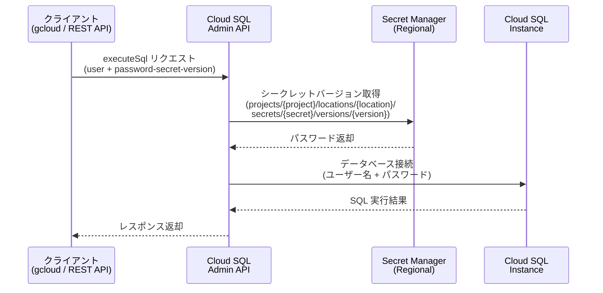

# Cloud SQL: Data API での Secret Manager 認証サポート

**リリース日**: 2026-07-20

**サービス**: Cloud SQL for MySQL / Cloud SQL for PostgreSQL

**機能**: Secret Manager Authentication for Data API (executeSql)

**ステータス**: Feature

[このアップデートのインフォグラフィックを見る](https://takech9203.github.io/google-cloud-news-summary/20260720-cloud-sql-secret-manager-data-api-auth.html)

## 概要

Cloud SQL for MySQL および Cloud SQL for PostgreSQL の Data API (executeSql) において、Secret Manager を利用したパスワード認証がサポートされました。これにより、データベースパスワードを Secret Manager のリージョナルシークレットに保存し、API リクエスト時にシークレットバージョンのリソース名を渡すことで、安全にビルトインユーザーとして認証できるようになります。

Data API は Cloud SQL Admin API を通じて SQL ステートメントを実行するための機能で、パブリック IP、プライベートサービスアクセス、Private Service Connect を使用するインスタンスに対応しています。今回のアップデートにより、IAM 認証に加えてパスワードベースの認証も Secret Manager と連携する形で安全に利用可能になりました。

この機能は、自動化スクリプトやアプリケーションから Data API を使用する際に、パスワードをコードや環境変数に直接埋め込む必要がなくなるため、セキュリティ体制の強化に貢献します。

**アップデート前の課題**

- Data API (executeSql) でビルトインユーザーとしてパスワード認証を行う場合、パスワードの安全な受け渡し方法が限定されていた
- API リクエストにパスワードを直接含める方式はセキュリティリスクがあった
- パスワードのローテーションや管理を一元化する仕組みが Data API レベルで統合されていなかった

**アップデート後の改善**

- Secret Manager のリージョナルシークレットにパスワードを格納し、リソース名のみで認証が可能になった
- パスワードが API リクエストに平文で含まれることがなくなり、セキュリティが向上した
- Secret Manager のバージョニング機能と連携して、パスワードのローテーションが容易になった

## アーキテクチャ図



Cloud SQL Admin API が Secret Manager からパスワードを安全に取得し、データベースインスタンスへの認証を仲介するフローを示しています。クライアントはパスワードそのものではなく、Secret Manager のリソース名のみを API リクエストに含めます。

## サービスアップデートの詳細

### 主要機能

1. **Secret Manager によるパスワード認証**
   - Data API の executeSql エンドポイントで `--password-secret-version` パラメータを使用
   - リージョナルシークレットのリソース名を指定するだけで認証が完了
   - パスワードが API リクエストやレスポンスに平文で含まれない

2. **リージョナルシークレットとの連携**
   - Cloud SQL インスタンスと同じリージョンにシークレットを配置する必要がある
   - Secret Manager のリージョナルエンドポイントで作成されたシークレットのみサポート
   - グローバルエンドポイントで作成されたシークレットは、同一リージョンに保存されていても非対応

3. **IAM 条件による細粒度アクセス制御**
   - IAM 条件を設定して、特定のシークレットへのアクセスのみを許可可能
   - プロジェクト内の他のシークレットへのアクセスを制限できる

4. **複数の認証方式のサポート**
   - IAM データベース認証 (ユーザー、サービスアカウント、グループ)
   - ビルトインユーザー + Secret Manager パスワード認証 (今回の機能)
   - デフォルト root ユーザーでの認証は非対応 (MySQL)

## 技術仕様

### API パラメータ

| 項目 | 詳細 |
|------|------|
| API エンドポイント | `POST https://sqladmin.googleapis.com/sql/v1beta4/projects/{PROJECT_ID}/instances/{INSTANCE_NAME}/executeSql` |
| gcloud コマンド | `gcloud sql instances execute-sql` |
| パスワード指定パラメータ | `--password-secret-version` (gcloud) / リクエストボディ内フィールド (REST) |
| シークレットリソース名形式 | `projects/{project}/locations/{location}/secrets/{secret}/versions/{secret_version}` |
| 対応 SQL タイプ | DML, DDL, DQL |
| 結果サイズ制限 | 10 MB (超過時の動作は partialResultMode で制御) |

### 必要な IAM ロール

| ロール | 説明 |
|--------|------|
| `roles/cloudsql.admin` | Cloud SQL Admin - フルアクセス |
| `roles/cloudsql.instanceUser` | Cloud SQL Instance User - SQL 実行権限 |
| `roles/cloudsql.studioUser` | Cloud SQL Studio User - Studio 経由のアクセス |
| カスタムロール | `cloudsql.instances.executesql` 権限を含む |

### REST API リクエストボディ (パスワード認証)

```json
{
  "database": "DATABASE_NAME",
  "sqlStatement": "SQL_STATEMENT",
  "user": "DATABASE_USER",
  "passwordSecretVersion": "projects/PROJECT_ID/locations/LOCATION/secrets/SECRET_ID/versions/VERSION",
  "partialResultMode": "FAIL_PARTIAL_RESULT"
}
```

## 設定方法

### 前提条件

1. Cloud SQL インスタンスで Data API アクセスが有効化されていること
2. Secret Manager API が有効化されていること
3. データベースユーザーが作成済みであること (デフォルト root ユーザーは非対応)
4. 適切な IAM ロールが付与されていること

### 手順

#### ステップ 1: Cloud SQL インスタンスで Data API を有効化

```bash
# Data API アクセスを有効化
gcloud sql instances patch INSTANCE_NAME \
  --data-api-access=ALLOW_DATA_API
```

Cloud SQL インスタンスの接続設定で Data API アクセスを許可します。

#### ステップ 2: データベースユーザーの作成

```bash
# データベースユーザーを作成
gcloud sql users create DB_USER \
  --instance=INSTANCE_NAME \
  --password=INITIAL_PASSWORD
```

Data API 経由でアクセスするためのデータベースユーザーを作成します。

#### ステップ 3: Secret Manager にリージョナルシークレットを作成

```bash
# リージョナルシークレットを作成
gcloud secrets create my-db-password \
  --location=REGION

# シークレットバージョンを追加 (パスワードを格納)
echo -n "INITIAL_PASSWORD" | gcloud secrets versions add my-db-password \
  --location=REGION \
  --data-file=-
```

Cloud SQL インスタンスと同じリージョンに Secret Manager のリージョナルシークレットを作成し、パスワードを格納します。

#### ステップ 4: Data API で SQL を実行 (Secret Manager 認証)

```bash
# Secret Manager 認証を使用して SQL ステートメントを実行
gcloud sql instances execute-sql INSTANCE_NAME \
  --database=my-database \
  --sql="SELECT * FROM users LIMIT 10;" \
  --user=DB_USER \
  --password-secret-version=projects/PROJECT_ID/locations/REGION/secrets/my-db-password/versions/latest
```

`--password-secret-version` にシークレットバージョンのリソース名を指定することで、Secret Manager 経由で安全に認証されます。

## メリット

### ビジネス面

- **コンプライアンス強化**: パスワードが平文でコードやログに含まれるリスクを排除し、監査要件への対応を改善
- **運用コスト削減**: パスワードローテーション時に Secret Manager のバージョンを更新するだけで済み、アプリケーション側の変更が不要

### 技術面

- **セキュリティ向上**: API リクエストにパスワードを直接含めないため、ネットワーク経路でのパスワード漏洩リスクを低減
- **一元管理**: Secret Manager でパスワードのライフサイクル管理 (作成、ローテーション、無効化) を一元化
- **IAM 統合**: IAM 条件を活用した細粒度のアクセス制御により、最小権限の原則を実現
- **自動化の促進**: CI/CD パイプラインやスクリプトからの Data API 利用時に、シークレット管理のベストプラクティスを容易に実装

## デメリット・制約事項

### 制限事項

- リージョナルシークレットのみサポート。グローバルエンドポイントで作成されたシークレットは使用不可 (同一リージョンに保存されていても不可)
- Cloud SQL インスタンスとシークレットは同じリージョンに配置する必要がある
- MySQL のデフォルト root ユーザーでは Data API 認証は使用不可
- Data API の結果サイズは 10 MB に制限される

### 考慮すべき点

- Secret Manager の API 呼び出しが追加されるため、わずかなレイテンシ増加の可能性
- Secret Manager の利用料金が追加で発生する (シークレットバージョンのアクセス回数に応じた課金)
- リージョナルシークレットの作成にはリージョナルエンドポイント (`secretmanager.LOCATION.rep.googleapis.com`) の使用が必要
- Data API 自体がリクエストとレスポンスの経路で中間ロケーションを経由する可能性がある点に留意

## ユースケース

### ユースケース 1: CI/CD パイプラインからのスキーマ管理

**シナリオ**: デプロイパイプラインで Cloud SQL インスタンスに対してスキーママイグレーションを実行する際に、Data API と Secret Manager 認証を組み合わせて使用する。

**実装例**:
```bash
# CI/CD パイプラインでの使用例
gcloud sql instances execute-sql production-instance \
  --database=app_db \
  --sql="@migration_001.sql" \
  --user=migration_user \
  --password-secret-version=projects/my-project/locations/us-central1/secrets/migration-password/versions/latest
```

**効果**: Cloud SQL Auth Proxy の設定なしに、安全にスキーマ変更を実行可能。パスワードを CI/CD のシークレット変数に保存する必要もなくなる。

### ユースケース 2: マルチテナント環境でのデータベース管理

**シナリオ**: テナントごとに異なるデータベースユーザーとシークレットを管理し、管理ツールから各テナントのデータベースにアクセスする。

**実装例**:
```bash
# テナントごとに異なるシークレットを使用
gcloud sql instances execute-sql shared-instance \
  --database=tenant_abc \
  --sql="SELECT count(*) FROM orders;" \
  --user=tenant_abc_admin \
  --password-secret-version=projects/my-project/locations/asia-northeast1/secrets/tenant-abc-password/versions/latest
```

**効果**: IAM 条件と組み合わせることで、各テナント管理者が自テナントのシークレットのみにアクセスできる分離を実現。

### ユースケース 3: 自動化されたデータベースヘルスチェック

**シナリオ**: Cloud Scheduler + Cloud Functions から定期的に Data API を呼び出し、データベースのヘルスチェックやメトリクス収集を行う。

**効果**: サービスアカウントが Secret Manager からパスワードを取得して認証するため、長時間稼働のプロキシ接続を維持する必要がなく、サーバーレス環境との相性が良い。

## 料金

Data API の利用自体に追加料金は発生しませんが、関連する以下のサービスに料金が適用されます。

### 料金例

| サービス | 料金 |
|----------|------|
| Cloud SQL (Enterprise) | $0.0413/vCPU 時間 + $0.007/GB 時間 (メモリ) |
| Cloud SQL (Enterprise Plus) | $0.05369/vCPU 時間 + $0.0091/GB 時間 (メモリ) |
| Secret Manager (シークレット保管) | $0.06/アクティブシークレットバージョン/月 |
| Secret Manager (アクセス操作) | $0.03/10,000 アクセス操作 |
| ストレージ (SSD) | $0.17/GB/月 |

## 利用可能リージョン

Cloud SQL for MySQL と Cloud SQL for PostgreSQL が利用可能なすべてのリージョンで、Data API の Secret Manager 認証が利用可能です。ただし、Secret Manager のリージョナルシークレットは Cloud SQL インスタンスと同じリージョンに作成する必要があります。

## 関連サービス・機能

- **Secret Manager**: パスワードの安全な保管・管理・ローテーションを提供するサービス。リージョナルシークレット機能が本機能の基盤
- **Cloud SQL Auth Proxy**: クライアントからの接続を安全に仲介する従来のソリューション。Data API は Proxy 不要で SQL を実行可能
- **IAM データベース認証**: IAM ユーザーやサービスアカウントでの認証方式。Secret Manager 認証はビルトインユーザー向けの代替手段
- **Cloud SQL Studio**: ブラウザベースの SQL エディタ。Data API と同じ `cloudsql.studioUser` ロールを使用
- **Cloud SQL Admin API**: Data API (executeSql) のベースとなる管理 API

## 参考リンク

- [インフォグラフィック](https://takech9203.github.io/google-cloud-news-summary/20260720-cloud-sql-secret-manager-data-api-auth.html)
- [公式リリースノート](https://cloud.google.com/release-notes#July_20_2026)
- [Cloud SQL for MySQL - Execute SQL statements](https://docs.cloud.google.com/sql/docs/mysql/executesql-instance)
- [Cloud SQL for PostgreSQL - Execute SQL statements](https://docs.cloud.google.com/sql/docs/postgres/executesql-instance)
- [gcloud sql instances execute-sql リファレンス](https://docs.cloud.google.com/sdk/gcloud/reference/sql/instances/execute-sql)
- [Secret Manager - リージョナルシークレットの作成](https://docs.cloud.google.com/secret-manager/regional-secrets/create-regional-secret)
- [Cloud SQL 料金ページ](https://cloud.google.com/sql/pricing)

## まとめ

Cloud SQL Data API での Secret Manager 認証サポートは、セキュリティとオペレーション効率の両面を改善する重要なアップデートです。パスワードを Secret Manager で一元管理することで、平文パスワードの漏洩リスクを排除し、IAM 条件と組み合わせた細粒度アクセス制御を実現できます。CI/CD パイプライン、サーバーレスアプリケーション、自動化スクリプトから Cloud SQL を利用する環境では、早期の導入を推奨します。

---

**タグ**: Cloud SQL, MySQL, PostgreSQL, Secret Manager, Data API, executeSql, Authentication, Security
