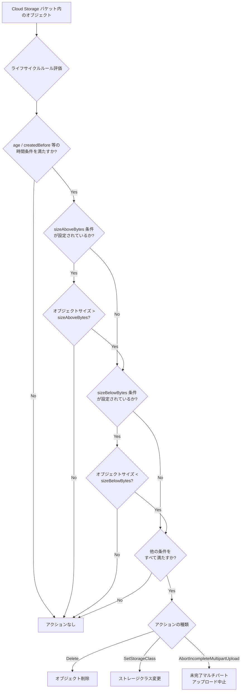

# Cloud Storage: オブジェクトライフサイクル管理のサイズ条件

**リリース日**: 2026-07-20

**サービス**: Cloud Storage

**機能**: Object Lifecycle Management sizeAboveBytes / sizeBelowBytes Conditions

**ステータス**: Feature

[このアップデートのインフォグラフィックを見る](https://takech9203.github.io/google-cloud-news-summary/20260720-cloud-storage-lifecycle-size-conditions.html)

## 概要

Google Cloud Storage の Object Lifecycle Management に `sizeAboveBytes` および `sizeBelowBytes` 条件が追加されました。これにより、オブジェクトのサイズに基づいてライフサイクルアクション（ストレージクラスの変更や削除）を実行するかどうかを制御できるようになります。最小サイズしきい値と最大サイズしきい値を定義することで、コスト効率の高いストレージ管理を実現します。

この機能は、特にストレージクラスの移行コストが保存コストの節約を上回るような小さなオブジェクトを除外したり、特定のサイズ範囲のオブジェクトのみにライフサイクルルールを適用したりするシナリオで大きな価値を発揮します。データレイクやログ管理など、多様なサイズのオブジェクトが混在する環境で、きめ細かいコスト最適化が可能になります。

**アップデート前の課題**

このアップデート以前は、ライフサイクルルールをオブジェクトサイズに基づいてフィルタリングする手段がありませんでした。

- 小さなオブジェクト（数バイト〜数KB）に対してもストレージクラス変更が実行され、Class A オペレーションのコストが保存料金の節約を上回る場合があった
- 特定のサイズ範囲のオブジェクトのみを対象としたライフサイクルルールを設定できず、全オブジェクトに一律で適用するしかなかった
- オブジェクトサイズに基づくストレージ管理のためには、カスタムスクリプトや外部ツールによるバッチ処理が必要だった

**アップデート後の改善**

今回のアップデートにより、ネイティブのライフサイクル条件としてサイズベースのフィルタリングが可能になりました。

- `sizeAboveBytes` を使用して、指定バイト数より大きいオブジェクトのみにアクションを適用可能になった
- `sizeBelowBytes` を使用して、指定バイト数より小さいオブジェクトのみにアクションを適用可能になった
- 両条件を組み合わせることで、特定のサイズ範囲内のオブジェクトを対象としたルールを定義可能になった

## アーキテクチャ図



Object Lifecycle Management がオブジェクトを評価する際の判定フローを示しています。サイズ条件は他の条件（age、matchesStorageClass など）と AND 条件で組み合わされ、すべての条件を満たした場合にのみアクションが実行されます。

## サービスアップデートの詳細

### 主要機能

1. **sizeAboveBytes 条件**
   - オブジェクトのデータサイズが指定値より大きい場合に条件が満たされる
   - ライフサイクルアクションの最小サイズしきい値を定義するために使用
   - 小さなオブジェクトでストレージクラス変更のコストが節約を上回るケースの除外に有効

2. **sizeBelowBytes 条件**
   - オブジェクトのデータサイズが指定値より小さい場合に条件が満たされる
   - ライフサイクルアクションの最大サイズしきい値を定義するために使用
   - 大きなオブジェクトを特定のルールから除外する場合に有効

3. **サイズ範囲指定**
   - `sizeAboveBytes` と `sizeBelowBytes` を同一ルール内で組み合わせて使用可能
   - 特定のサイズ範囲（例: 1MB〜100MB）のオブジェクトのみを対象としたルールを作成可能
   - 既存の条件（age、matchesStorageClass、matchesPrefix/Suffix など）と組み合わせ可能

## 技術仕様

### サイズ条件の仕様

| 項目 | 詳細 |
|------|------|
| sizeAboveBytes | オブジェクトサイズが指定バイト数を超える場合に真 |
| sizeBelowBytes | オブジェクトサイズが指定バイト数未満の場合に真 |
| 最大指定値 | 5 TiB (5,497,558,138,880 bytes) |
| 評価対象 | オブジェクトのデータサイズのみ（メタデータは除外） |
| 組み合わせ | 同一ルール内で両条件を併用可能（サイズ範囲指定） |
| 利用可能アクション | Delete, SetStorageClass, AbortIncompleteMultipartUpload |

### 制約事項

| 項目 | 詳細 |
|------|------|
| 階層的名前空間バケット | sizeBelowBytes で空フォルダの削除は不可 |
| メタデータ | サイズ評価にメタデータは含まれない |
| 反映時間 | 設定変更後、最大 24 時間で反映 |

### JSON 設定形式

```json
{
  "lifecycle": {
    "rule": [
      {
        "action": {
          "type": "SetStorageClass",
          "storageClass": "NEARLINE"
        },
        "condition": {
          "age": 30,
          "matchesStorageClass": ["STANDARD"],
          "sizeAboveBytes": 5242880
        }
      }
    ]
  }
}
```

## 設定方法

### 前提条件

1. Google Cloud プロジェクトが作成済みであること
2. Cloud Storage バケットが作成済みであること
3. `storage.buckets.update` 権限を持つ IAM ロール（Storage Admin など）が付与されていること

### 手順

#### ステップ 1: ライフサイクル設定ファイルの作成

```json
{
  "lifecycle": {
    "rule": [
      {
        "action": {
          "type": "SetStorageClass",
          "storageClass": "NEARLINE"
        },
        "condition": {
          "age": 365,
          "matchesStorageClass": ["STANDARD"],
          "sizeAboveBytes": 5242880
        }
      },
      {
        "action": {
          "type": "Delete"
        },
        "condition": {
          "age": 90,
          "sizeBelowBytes": 1024
        }
      },
      {
        "action": {
          "type": "SetStorageClass",
          "storageClass": "COLDLINE"
        },
        "condition": {
          "age": 180,
          "sizeAboveBytes": 1048576,
          "sizeBelowBytes": 107374182400
        }
      }
    ]
  }
}
```

上記の設定例では、3 つのルールを定義しています。(1) 5MB を超える Standard オブジェクトを 365 日後に Nearline に移行、(2) 1KB 未満のオブジェクトを 90 日後に削除、(3) 1MB〜100GB のオブジェクトを 180 日後に Coldline に移行。

#### ステップ 2: gcloud CLI でライフサイクル設定を適用

```bash
# ライフサイクル設定ファイルを適用
gcloud storage buckets update gs://MY_BUCKET --lifecycle-file=lifecycle.json
```

バケットにライフサイクル設定が適用されます。設定は最大 24 時間以内に有効になります。

#### ステップ 3: 設定の確認

```bash
# 現在のライフサイクル設定を確認
gcloud storage buckets describe gs://MY_BUCKET --format="json(lifecycle)"
```

設定が正しく反映されていることを確認します。

#### ステップ 4: REST API での設定（代替方法）

```bash
# JSON API を使用して設定を適用
curl -X PATCH --data-binary @lifecycle.json \
  -H "Authorization: Bearer $(gcloud auth print-access-token)" \
  -H "Content-Type: application/json" \
  "https://storage.googleapis.com/storage/v1/b/MY_BUCKET?fields=lifecycle"
```

REST API を使用した設定の適用方法です。自動化スクリプトやCI/CDパイプラインに組み込む場合に便利です。

## メリット

### ビジネス面

- **コスト最適化の精度向上**: 小さなオブジェクトのストレージクラス変更による逆効果（オペレーションコストが節約を上回る）を防止でき、実質的なストレージコスト削減が可能
- **運用の簡素化**: カスタムスクリプトや外部ツールなしで、ネイティブのライフサイクル管理のみでサイズベースのポリシーを実装可能
- **ガバナンスの強化**: データサイズに応じた保持・削除ポリシーを宣言的に定義でき、コンプライアンス要件への対応が容易

### 技術面

- **きめ細かいルール定義**: 既存の条件（age、matchesStorageClass、matchesPrefix/Suffix）とサイズ条件を自由に組み合わせ可能
- **宣言的設定**: JSON/XML 設定ファイルで管理でき、Infrastructure as Code (IaC) との統合が容易
- **スケーラビリティ**: バケット内のオブジェクト数に関係なく、Cloud Storage が自動的にルールを評価・適用

## デメリット・制約事項

### 制限事項

- サイズ条件の最大値は 5 TiB まで。それ以上のオブジェクトには対応できない
- オブジェクトのメタデータサイズは評価対象外。カスタムメタデータが大きいオブジェクトの合計サイズでは判定されない
- 階層的名前空間（HNS）が有効なバケットでは、`sizeBelowBytes` 条件で空フォルダの削除は不可
- ライフサイクル設定変更後、反映まで最大 24 時間のタイムラグがある

### 考慮すべき点

- サイズ条件は他の条件と AND で評価されるため、意図しないオブジェクトが対象外にならないよう、ルール全体の設計を慎重に行う必要がある
- 圧縮済みオブジェクトは元のサイズではなく圧縮後のサイズで評価されるため、圧縮率の異なるオブジェクトが混在する場合は注意が必要
- 複数のルールが同時に条件を満たした場合、Delete が SetStorageClass より優先され、SetStorageClass 間ではより低コストのクラスが優先される

## ユースケース

### ユースケース 1: 小さなオブジェクトのストレージクラス移行除外

**シナリオ**: データレイクに数バイトのメタデータファイルから数 GB のデータファイルまでが混在している。365 日経過後に Nearline に移行したいが、小さなファイルは移行コスト（Class A オペレーション）が節約を上回るため除外したい。

**実装例**:
```json
{
  "lifecycle": {
    "rule": [
      {
        "action": {
          "type": "SetStorageClass",
          "storageClass": "NEARLINE"
        },
        "condition": {
          "age": 365,
          "matchesStorageClass": ["STANDARD"],
          "sizeAboveBytes": 5242880
        }
      }
    ]
  }
}
```

**効果**: 5MB 以下のオブジェクトはストレージクラス変更から除外され、不要な Class A オペレーション料金の発生を防止。小さなオブジェクトが多い環境では、年間数百〜数千ドルのコスト削減が見込める。

### ユースケース 2: 一時ファイルのサイズベース自動削除

**シナリオ**: アプリケーションが一時的に生成する小さなログフラグメントや空ファイルを、一定期間後に自動削除したい。ただし、大きなログファイルは監査目的で保持する必要がある。

**実装例**:
```json
{
  "lifecycle": {
    "rule": [
      {
        "action": {
          "type": "Delete"
        },
        "condition": {
          "age": 30,
          "sizeBelowBytes": 1024,
          "matchesPrefix": ["tmp/", "logs/fragments/"]
        }
      }
    ]
  }
}
```

**効果**: 1KB 未満の一時ファイルが 30 日後に自動削除され、ストレージの無駄を排除。大きなログファイルは影響を受けず保持される。

### ユースケース 3: サイズ範囲に基づく段階的アーカイブ

**シナリオ**: メディアファイルを管理しており、中程度のサイズ（1MB〜1GB）のファイルは比較的早期に Coldline へ移行し、1GB 以上の大きなファイルはアクセス頻度が高いため Standard に長く保持したい。

**実装例**:
```json
{
  "lifecycle": {
    "rule": [
      {
        "action": {
          "type": "SetStorageClass",
          "storageClass": "COLDLINE"
        },
        "condition": {
          "age": 90,
          "matchesStorageClass": ["STANDARD"],
          "sizeAboveBytes": 1048576,
          "sizeBelowBytes": 1073741824
        }
      },
      {
        "action": {
          "type": "SetStorageClass",
          "storageClass": "NEARLINE"
        },
        "condition": {
          "age": 365,
          "matchesStorageClass": ["STANDARD"],
          "sizeAboveBytes": 1073741824
        }
      }
    ]
  }
}
```

**効果**: ファイルサイズに応じた最適なストレージクラス移行戦略を実現。中サイズのファイルは早期に低コストクラスへ移行しつつ、大きなファイルへの高速アクセスを維持。

## 料金

Object Lifecycle Management 自体には追加料金は発生しません。ただし、ライフサイクルアクションの実行に伴う以下のコストが発生します。

### 料金例

| 項目 | 料金 (USD) |
|------|------------|
| SetStorageClass アクション (Class A オペレーション) | $0.05 / 10,000 オペレーション (Standard) |
| Delete アクション (無料オペレーション) | 無料 |
| Standard ストレージ保存料金 | $0.020 / GiB / 月〜 |
| Nearline ストレージ保存料金 | $0.010 / GiB / 月〜 |
| Coldline ストレージ保存料金 | $0.004 / GiB / 月〜 |
| Archive ストレージ保存料金 | $0.0012 / GiB / 月〜 |
| Nearline 取得料金 | $0.01 / GiB |
| Coldline 取得料金 | $0.02 / GiB |
| Archive 取得料金 | $0.05 / GiB |

`sizeAboveBytes` 条件を活用することで、SetStorageClass の Class A オペレーション費用が保存料金の節約を上回るケースを回避できます。例えば、1KB のオブジェクトを Standard から Nearline に移行しても月額 $0.00001 の節約にしかならず、Class A オペレーション費用 $0.000005 と比較してもわずかな差です。一方、5MB 以上のオブジェクトでは月額 $0.05 の節約となり、オペレーション費用を大幅に上回ります。

## 利用可能リージョン

この機能はすべての Cloud Storage リージョン、マルチリージョン、およびデュアルリージョンで利用可能です。特定のリージョン制限はありません。

## 関連サービス・機能

- **Autoclass**: オブジェクトのアクセスパターンに基づいてストレージクラスを自動移行する機能。サイズ条件とは異なるアプローチでコスト最適化を実現するが、matchesStorageClass 条件との併用はできない
- **Storage Intelligence**: バケットの使用状況を分析し、コスト最適化の推奨事項を提供するサービス。サイズ条件のしきい値決定に活用可能
- **Object Versioning**: バージョン管理されたオブジェクトにもサイズ条件が適用される。`numNewerVersions` や `isLive` 条件と組み合わせて使用可能
- **Cloud Storage FUSE**: ファイルシステムとしてマウントされたバケットにも、バックグラウンドでライフサイクルルールが適用される
- **Terraform google_storage_bucket リソース**: Infrastructure as Code でサイズ条件を含むライフサイクルルールを管理可能

## 参考リンク

- [インフォグラフィック](https://takech9203.github.io/google-cloud-news-summary/20260720-cloud-storage-lifecycle-size-conditions.html)
- [公式リリースノート](https://cloud.google.com/release-notes#July_20_2026)
- [Object Lifecycle Management ドキュメント](https://cloud.google.com/storage/docs/lifecycle)
- [ライフサイクル設定例](https://cloud.google.com/storage/docs/lifecycle-configurations)
- [ライフサイクル管理の設定方法](https://cloud.google.com/storage/docs/managing-lifecycles)
- [Cloud Storage 料金ページ](https://cloud.google.com/storage/pricing)

## まとめ

Cloud Storage の Object Lifecycle Management に `sizeAboveBytes` と `sizeBelowBytes` 条件が追加されたことで、オブジェクトサイズに基づくきめ細かいライフサイクルポリシーの定義が可能になりました。特にストレージクラス移行のコスト効率を最適化したい場合や、サイズに基づくデータ保持ポリシーを実装したい場合に有効です。既存のライフサイクルルールにサイズ条件を追加することで、即座にコスト最適化を実現できるため、大量のオブジェクトを管理しているすべてのユーザーにおいて設定の見直しを推奨します。

---

**タグ**: Cloud Storage, Object Lifecycle Management, sizeAboveBytes, sizeBelowBytes, Cost Optimization, Storage Management
