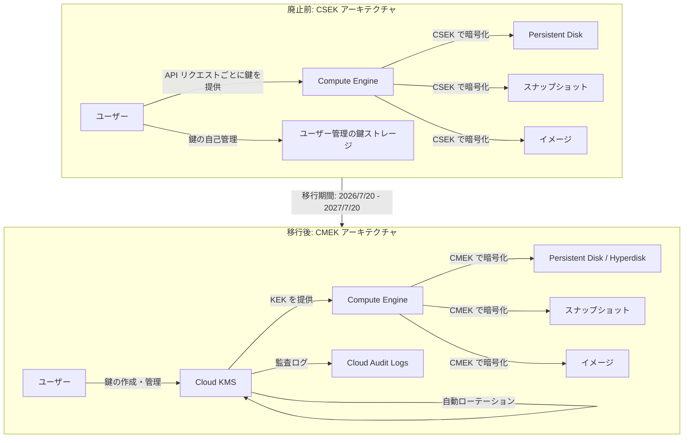

# Compute Engine: 顧客指定の暗号鍵 (CSEK) の廃止予定

**リリース日**: 2026-07-20

**サービス**: Compute Engine

**機能**: Customer-Supplied Encryption Keys (CSEK) Deprecation

**ステータス**: Deprecated (2027年7月20日無効化予定)

📊 [このアップデートのインフォグラフィックを見る](https://takech9203.github.io/google-cloud-news-summary/20260720-compute-engine-csek-deprecation.html)

## 概要

Google Cloud は、Compute Engine リソースにおける顧客指定の暗号鍵 (Customer-Supplied Encryption Keys: CSEK) の使用を廃止することを発表しました。2026年7月20日以降、新規リソースへの CSEK による暗号化はできなくなり、2027年7月20日には CSEK が Compute Engine から完全に削除されます。

CSEK は、ユーザーが自ら暗号鍵を生成・管理し、API リクエストごとに鍵を提供する仕組みでした。しかし、鍵の紛失リスクやローテーション機能の欠如、監査ログの不足など、運用面での課題が多く指摘されていました。今回の廃止により、Cloud KMS を利用した顧客管理の暗号鍵 (CMEK) または Google マネージドの暗号鍵への移行が必要となります。

この変更は、Persistent Disk、イメージ、マシンイメージ、標準スナップショット、アーカイブスナップショット、インスタントスナップショットなど、CSEK で暗号化されたすべての Compute Engine リソースに影響します。既存の CSEK 暗号化リソースを引き続き利用するには、1年以内に CMEK への移行を完了する必要があります。

**アップデート前の課題**

CSEK の運用には以下の課題が存在していました。

- CSEK では鍵のローテーション機能が提供されておらず、手動での鍵管理が必要だった
- 鍵を紛失した場合、暗号化されたデータを復元する手段がなかった
- Cloud Audit Logs による鍵使用の監査が限定的だった
- Hyperdisk ボリュームでは CSEK がサポートされていなかった
- API リクエストごとに鍵を提供する必要があり、運用が煩雑だった

**アップデート後の改善**

CMEK への移行により以下の改善が実現されます。

- Cloud KMS による集中的な鍵管理と自動ローテーションが利用可能になる
- Cloud Audit Logs による完全な鍵使用監査が可能になる
- Hyperdisk を含むすべての Compute Engine ストレージタイプに対応できる
- 鍵の無効化・破棄による即座のアクセス制御が可能になる

## アーキテクチャ図



CSEK では各 API リクエストにユーザーが鍵を直接提供する必要があったのに対し、CMEK では Cloud KMS が鍵のライフサイクル全体を管理します。

## サービスアップデートの詳細

### 主要機能

1. **CSEK の新規利用停止 (2026年7月20日)**
   - 新しいリソースの作成時に CSEK による暗号化を指定することができなくなる
   - 既存の CSEK 暗号化リソースへのアクセスは引き続き可能

2. **CSEK の完全削除 (2027年7月20日)**
   - CSEK で暗号化されたリソースへのアクセスが完全に停止される
   - 移行が完了していないリソースはアクセス不能になるリスクがある

3. **影響を受けるリソースタイプ**
   - Persistent Disk (ゾーナル・リージョナル)
   - カスタムイメージ
   - マシンイメージ
   - 標準スナップショットおよびアーカイブスナップショット
   - インスタントスナップショット

### タイムライン

| マイルストーン | 日付 | 影響 |
|---------------|------|------|
| 廃止発表 | 2026年7月20日 | 新規 CSEK 暗号化の停止 |
| 完全無効化 | 2027年7月20日 | 既存 CSEK リソースへのアクセス停止 |

## 技術仕様

### 暗号化方式の比較

| 項目 | CSEK (廃止) | CMEK (推奨) | Google マネージド鍵 |
|------|------------|-------------|-------------------|
| 鍵の管理者 | ユーザー自身 | ユーザー (Cloud KMS 経由) | Google |
| 鍵の保存場所 | ユーザー環境 | Cloud KMS | Google 内部 Keystore |
| 自動ローテーション | 不可 | 可能 | Google が自動実行 |
| 監査ログ | 限定的 | 完全対応 | 自動 |
| Hyperdisk 対応 | 非対応 | 対応 | 対応 |
| 鍵の紛失リスク | 高 (復元不可) | 低 (Cloud KMS で管理) | なし |
| FIPS 140-3 | Level 1 | Level 1-3 (選択可能) | Level 1 |

### CMEK の鍵階層

```
Root Keystore Master Key
    └── KMS Master Key (ロケーション別)
        └── Key Encryption Key (KEK) - ユーザー管理
            └── Data Encryption Key (DEK) - 自動生成
                └── 暗号化データ (ディスク/スナップショット/イメージ)
```

## 移行手順

### 前提条件

1. Cloud KMS API が有効化されていること
2. Cloud KMS のキーリングとキーが作成済みであること
3. Compute Engine サービスアカウントに Cloud KMS の暗号化/復号の権限が付与されていること

### 手順

#### ステップ 1: Cloud KMS キーリングとキーの作成

```bash
# キーリングの作成
gcloud kms keyrings create my-key-ring \
    --location=asia-northeast1

# 暗号鍵の作成
gcloud kms keys create my-cmek-key \
    --location=asia-northeast1 \
    --keyring=my-key-ring \
    --purpose=encryption \
    --rotation-period=90d
```

Cloud KMS キーリングとキーを作成し、自動ローテーション期間を設定します。

#### ステップ 2: サービスアカウントへの権限付与

```bash
# Compute Engine サービスアカウントに Cloud KMS CryptoKey Encrypter/Decrypter ロールを付与
gcloud kms keys add-iam-policy-binding my-cmek-key \
    --location=asia-northeast1 \
    --keyring=my-key-ring \
    --member=serviceAccount:service-PROJECT_NUMBER@compute-system.iam.gserviceaccount.com \
    --role=roles/cloudkms.cryptoKeyEncrypterDecrypter
```

Compute Engine サービスアカウントが Cloud KMS キーを使用できるように権限を付与します。

#### ステップ 3: CSEK 暗号化ディスクからのスナップショット作成

```bash
# CSEK 暗号化ディスクのスナップショットを作成
gcloud compute disks snapshot CSEK_DISK_NAME \
    --zone=asia-northeast1-a \
    --snapshot-names=csek-migration-snapshot \
    --csek-key-file=csek-key-file.json
```

移行元の CSEK 暗号化ディスクからスナップショットを作成します。

#### ステップ 4: CMEK 暗号化された新規ディスクの作成

```bash
# CSEK スナップショットから CMEK 暗号化ディスクを作成
gcloud compute disks create new-cmek-disk \
    --zone=asia-northeast1-a \
    --source-snapshot=csek-migration-snapshot \
    --csek-key-file=csek-key-file.json \
    --kms-key=projects/PROJECT_ID/locations/asia-northeast1/keyRings/my-key-ring/cryptoKeys/my-cmek-key
```

CSEK 暗号化スナップショットから新しい CMEK 暗号化ディスクを作成します。ソーススナップショットの復号に CSEK キーが、新ディスクの暗号化に CMEK キーが使用されます。

#### ステップ 5: ディスクの入れ替えと検証

```bash
# インスタンスの停止
gcloud compute instances stop INSTANCE_NAME --zone=asia-northeast1-a

# 旧ディスクのデタッチ
gcloud compute instances detach-disk INSTANCE_NAME \
    --disk=CSEK_DISK_NAME \
    --zone=asia-northeast1-a

# 新ディスクのアタッチ (ブートディスクの場合)
gcloud compute instances attach-disk INSTANCE_NAME \
    --disk=new-cmek-disk \
    --zone=asia-northeast1-a \
    --boot

# インスタンスの起動
gcloud compute instances start INSTANCE_NAME --zone=asia-northeast1-a
```

新しい CMEK 暗号化ディスクが正常に動作することを確認した後、古い CSEK 暗号化ディスクとスナップショットを削除します。

## メリット

### ビジネス面

- **運用リスクの低減**: 鍵紛失によるデータ喪失リスクが Cloud KMS の利用により大幅に低減される
- **コンプライアンス対応の強化**: Cloud Audit Logs による完全な鍵使用履歴の記録が可能となり、監査要件への対応が容易になる
- **運用コストの削減**: 鍵管理の自動化により、手動での鍵管理にかかる人的コストが削減される

### 技術面

- **自動鍵ローテーション**: Cloud KMS が鍵のローテーションを自動的に実行し、セキュリティポスチャを維持する
- **Hyperdisk 対応**: CMEK は Hyperdisk を含むすべての最新ストレージタイプをサポートする
- **エンベロープ暗号化**: KEK/DEK の二重構造による強固な暗号化アーキテクチャが適用される
- **HSM/EKM 対応**: Cloud HSM (FIPS 140-3 Level 3) や外部鍵管理 (Cloud EKM) との統合が可能

## デメリット・制約事項

### 制限事項

- CSEK から CMEK への直接的な鍵の置き換えはできない (リソースのコピーが必要)
- 移行にはインスタンスの停止が必要となるケースがある (ブートディスクの場合)
- Cloud KMS の利用には追加コスト (鍵管理料金 + 暗号化オペレーション料金) が発生する
- 移行期間が1年間に限定されており、大規模環境では計画的な移行が必要

### 考慮すべき点

- 移行前に必ず非本番環境でテストを実施すること
- 大量のディスクやスナップショットがある場合、移行に伴う一時的なストレージコスト増加を考慮すること
- マシンイメージからの移行は、一時的なインスタンス作成を経由する必要がありやや複雑
- インスタントスナップショットの移行は、一時的な標準スナップショットとディスクの作成を経由する多段階の手順が必要

## ユースケース

### ユースケース 1: 既存 CSEK 暗号化ブートディスクの移行

**シナリオ**: 本番環境で稼働中の VM のブートディスクが CSEK で暗号化されている場合の移行

**実装例**:
```bash
# 1. メンテナンスウィンドウ中にインスタンスを停止
gcloud compute instances stop prod-vm-01 --zone=asia-northeast1-a

# 2. ブートディスクのスナップショットを作成
gcloud compute disks snapshot prod-boot-disk \
    --zone=asia-northeast1-a \
    --snapshot-names=prod-boot-migration \
    --csek-key-file=prod-csek-key.json

# 3. CMEK 暗号化で新ディスクを作成
gcloud compute disks create prod-boot-cmek \
    --zone=asia-northeast1-a \
    --source-snapshot=prod-boot-migration \
    --csek-key-file=prod-csek-key.json \
    --kms-key=projects/my-project/locations/asia-northeast1/keyRings/prod-ring/cryptoKeys/prod-key

# 4. ディスクの入れ替えとインスタンス起動
gcloud compute instances detach-disk prod-vm-01 --disk=prod-boot-disk --zone=asia-northeast1-a
gcloud compute instances attach-disk prod-vm-01 --disk=prod-boot-cmek --boot --zone=asia-northeast1-a
gcloud compute instances start prod-vm-01 --zone=asia-northeast1-a
```

**効果**: 本番 VM のブートディスクが Cloud KMS 管理の鍵で保護され、自動ローテーションと監査ログが有効になる

### ユースケース 2: Google マネージド鍵への移行 (鍵管理不要)

**シナリオ**: 独自の暗号鍵管理が不要で、Google のデフォルト暗号化で十分なワークロード

**実装例**:
```bash
# CSEK 暗号化ディスクからスナップショットを作成
gcloud compute disks snapshot dev-disk \
    --zone=us-central1-a \
    --snapshot-names=dev-migration-snap \
    --csek-key-file=dev-csek-key.json

# 暗号化キーを指定せずに新規ディスクを作成 (Google デフォルト暗号化が適用される)
gcloud compute disks create dev-disk-default-enc \
    --zone=us-central1-a \
    --source-snapshot=dev-migration-snap \
    --source-snapshot-csek-key-file=dev-csek-key.json
```

**効果**: 鍵管理の運用負荷がゼロになり、追加の Cloud KMS コストも発生しない。コンプライアンス要件が厳しくない開発・テスト環境に最適

## 料金

CMEK への移行に伴い、Cloud KMS の利用料金が追加で発生します。

### 料金例

| 項目 | 月額料金 (概算) |
|------|-----------------|
| Cloud KMS ソフトウェア鍵 (1 アクティブキーバージョン) | $0.06/月 |
| Cloud HSM 鍵 (1 アクティブキーバージョン) | $1.00/月 |
| 暗号化/復号オペレーション (10,000 回) | $0.03 |
| Google マネージド鍵 (デフォルト暗号化) | 無料 |

※ 移行期間中は、一時的なスナップショットやディスクの作成によりストレージコストが一時的に増加する可能性があります。

## 利用可能リージョン

CSEK の廃止はすべてのリージョンで適用されます。移行先の Cloud KMS キーは、暗号化対象のリソースと同じロケーションまたは `global` ロケーションに作成する必要があります。Cloud KMS はすべての Google Cloud リージョンで利用可能です。

## 関連サービス・機能

- **Cloud Key Management Service (Cloud KMS)**: CMEK の鍵管理を行う中核サービス。キーリング、キー、キーバージョンの管理を提供
- **Cloud HSM**: ハードウェアセキュリティモジュールで保護された鍵を提供。FIPS 140-3 Level 3 認証
- **Cloud External Key Manager (Cloud EKM)**: 外部の鍵管理システムと連携し、鍵が Google インフラストラクチャの外部に保持される
- **Cloud KMS Autokey**: CMEK の自動プロビジョニング機能。リソース作成時にキーリングとキーが自動生成される
- **Cloud Audit Logs**: 鍵の使用状況を記録し、コンプライアンス監査に対応
- **Persistent Disk / Hyperdisk**: CMEK による暗号化が適用されるストレージリソース

## 参考リンク

- 📊 [インフォグラフィック](https://takech9203.github.io/google-cloud-news-summary/20260720-compute-engine-csek-deprecation.html)
- [公式リリースノート](https://cloud.google.com/release-notes#July_20_2026)
- [CSEK 廃止に関するドキュメント](https://docs.cloud.google.com/compute/docs/deprecations/csek-deprecation-in-compute-engine)
- [Cloud KMS を使用したリソースの保護](https://docs.cloud.google.com/compute/docs/disks/customer-managed-encryption)
- [Cloud KMS ドキュメント](https://docs.cloud.google.com/kms/docs)
- [Cloud KMS 料金](https://cloud.google.com/kms/pricing)
- [CMEK ベストプラクティス](https://docs.cloud.google.com/kms/docs/cmek-best-practices)

## まとめ

Compute Engine における CSEK の廃止は、Google Cloud のセキュリティポスチャを強化するための重要な変更です。1年間の移行猶予期間が設けられているため、影響を受けるすべてのリソースを特定し、計画的に CMEK または Google マネージド鍵への移行を進めることが推奨されます。特に本番環境のリソースについては、まず非本番環境で移行手順を検証し、メンテナンスウィンドウを計画した上で段階的に移行を実施してください。

---

**タグ**: Compute Engine, CSEK, Encryption, Deprecation, CMEK, Cloud KMS, Security, Migration
