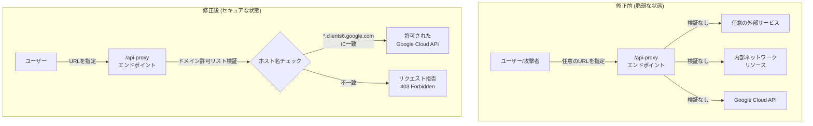

# Gemini Agent Studio: SSRF 脆弱性のセキュリティ修正

**リリース日**: 2026-07-20

**サービス**: Gemini Enterprise Agent Platform (Agent Studio)

**機能**: Server-Side Request Forgery (SSRF) Security Fix

**ステータス**: Security Update

[このアップデートのインフォグラフィックを見る](https://takech9203.github.io/google-cloud-news-summary/20260720-gemini-agent-studio-ssrf-security-fix.html)

## 概要

Gemini Enterprise Agent Platform の Agent Studio において、自動生成されるウェブアプリケーションのバックエンドエンドポイント `/api-proxy` に Server-Side Request Forgery (SSRF) 脆弱性が発見され、セキュリティ修正がリリースされました。この脆弱性は 2026年7月1日以前に Agent Studio を使用して作成されたすべてのウェブアプリケーションに影響します。

SSRF 脆弱性により、攻撃者がバックエンドサーバーを悪用して、本来アクセスできない内部リソースや外部サービスに対して不正なリクエストを送信できる可能性がありました。修正後のバックエンドコードでは、厳格なドメイン許可リスト (allowlist) による検証が実装され、`/api-proxy` エンドポイントの宛先ホスト名が `*-aiplatform.clients6.google.com` などの許可された Google Cloud ドメインで終わることが保証されます。

**対象ユーザーへの緊急対応が必要です。** 2026年7月1日以前に Agent Studio からウェブアプリケーションコードをダウンロード、生成、またはデプロイしたすべてのユーザーは、Agent Studio からアプリを再生成し、新しいバージョンをデプロイする必要があります。

**アップデート前の課題**

修正前の `/api-proxy` エンドポイントには、宛先ホスト名の検証が不十分であるという重大なセキュリティ上の欠陥がありました。

- `/api-proxy` エンドポイントが任意の宛先ホストへのリクエストを中継可能な状態だった
- ドメイン許可リストによるバリデーションが存在せず、攻撃者が内部ネットワークリソースへアクセスするプロキシとして悪用される危険性があった
- Cloud Run 上でホストされたウェブアプリケーションのサービスアカウント権限を利用した内部 API への不正アクセスが可能だった

**アップデート後の改善**

今回のセキュリティ修正により、以下の対策が実施されました。

- 厳格なドメイン許可リスト (allowlist) バリデーションが `/api-proxy` エンドポイントに追加された
- 宛先ホスト名が許可された Google Cloud ドメイン (例: `*-aiplatform.clients6.google.com`) で終わることの検証が必須となった
- 許可リストに含まれないドメインへのリクエストはすべてブロックされるようになった

## アーキテクチャ図



上図は、修正前後の `/api-proxy` エンドポイントの動作の違いを示しています。修正前は宛先の検証なく任意のホストにリクエストが転送されていましたが、修正後はドメイン許可リストに基づく厳格な検証が行われ、許可されたドメイン以外へのリクエストはブロックされます。

## サービスアップデートの詳細

### 主要機能

1. **ドメイン許可リスト (Allowlist) バリデーション**
   - `/api-proxy` エンドポイントにおいて、宛先ホスト名を許可された Google Cloud ドメインに限定
   - ホスト名のサフィックスマッチングにより、`*-aiplatform.clients6.google.com` パターンへの一致を検証
   - 許可リストに含まれないドメインへのリクエストは即座にブロック

2. **SSRF 攻撃の防止**
   - 攻撃者による内部ネットワークリソースへの不正アクセスを完全に遮断
   - サービスアカウント権限を悪用した権限昇格攻撃のベクトルを排除
   - メタデータサーバー (169.254.169.254) やプライベート IP アドレスへのリクエストを防止

3. **Cloud Run 上のウェブアプリケーション保護**
   - Agent Studio から生成・デプロイされたウェブアプリケーションのバックエンドセキュリティを強化
   - 公開アクセスが許可されたアプリケーションにおける攻撃面を大幅に縮小

## 技術仕様

### ドメイン許可リスト

| 項目 | 詳細 |
|------|------|
| 検証対象 | `/api-proxy` エンドポイントの宛先ホスト名 |
| 検証方法 | ホスト名のサフィックスマッチング |
| 許可ドメイン例 | `*-aiplatform.clients6.google.com` |
| 不一致時の動作 | リクエスト拒否 (エラーレスポンス返却) |
| 影響範囲 | 2026年7月1日以前に生成されたウェブアプリケーション |

### SSRF 脆弱性の技術的詳細

| 項目 | 詳細 |
|------|------|
| 脆弱性の種類 | Server-Side Request Forgery (SSRF) |
| 影響を受けるコンポーネント | `/api-proxy` バックエンドエンドポイント |
| 攻撃ベクトル | ネットワーク経由 (公開アプリケーション) |
| 影響範囲 | 機密情報の漏洩、内部サービスへの不正アクセス |
| 修正方法 | ドメイン許可リストによる厳格なバリデーション追加 |

### バリデーションロジック (概念)

```python
# 許可されたドメインパターン
ALLOWED_DOMAIN_SUFFIXES = [
    "-aiplatform.clients6.google.com",
    # その他の許可された Google Cloud ドメイン
]

def validate_destination(hostname: str) -> bool:
    """宛先ホスト名が許可リストに含まれるか検証"""
    return any(
        hostname.endswith(suffix)
        for suffix in ALLOWED_DOMAIN_SUFFIXES
    )
```

## 対応手順

### 前提条件

1. 2026年7月1日以前に Agent Studio を使用してウェブアプリケーションを作成・デプロイしていること
2. Google Cloud コンソールへのアクセス権限があること
3. Agent Studio の該当プロンプトへのアクセス権限があること

### 影響確認

#### ステップ 1: 対象アプリケーションの特定

Agent Studio の「Manage web app」ダイアログを開き、2026年7月1日以前にデプロイされたアプリケーションを特定します。

- Cloud Run コンソールでデプロイ日時を確認
- 複数のアプリケーションがある場合、すべてが対象

#### ステップ 2: アプリケーションの再生成

1. Agent Studio で該当のプロンプトを開く
2. デプロイメニュー (rocket_launch アイコン) から「Deploy as app」を選択
3. Agent Studio がセキュリティ修正を含む新しいソースコードを自動生成
4. デプロイが完了するまで 2-3 分待機

#### ステップ 3: 新バージョンのデプロイ確認

```bash
# Cloud Run サービスのリビジョンを確認
gcloud run revisions list --service=YOUR_SERVICE_NAME \
  --region=YOUR_REGION \
  --format="table(name, creation_timestamp, active)"
```

「Manage web app」ダイアログでステータスが「Ready」になっていることを確認します。

#### ステップ 4: ローカルにダウンロードしたコードの対応

Agent Studio からダウンロードしたソースコードをローカルで使用している場合:
1. Agent Studio から新しいバージョンのコードを再ダウンロード
2. 既存のカスタマイズがある場合は、新しいバックエンドコードとマージ
3. 手動でデプロイし直す

## メリット

### セキュリティ面

- **SSRF 攻撃の完全防止**: 許可リストに基づくバリデーションにより、不正な宛先へのリクエストが確実にブロックされる
- **内部リソースの保護**: メタデータサーバーや内部 API への不正アクセスが不可能となり、資格情報の漏洩リスクが排除される
- **攻撃面の大幅な縮小**: 公開アプリケーションにおけるサーバーサイドの攻撃ベクトルが限定される

### 運用面

- **自動修正の適用**: Agent Studio から再生成するだけで修正が適用され、手動でのコード修正が不要
- **既存機能への影響なし**: 正当な Google Cloud API への通信は引き続き正常に動作
- **Cloud Run の自動スケーリング維持**: バックエンドの修正がパフォーマンスに影響を与えない

## デメリット・制約事項

### 制限事項

- 2026年7月1日以前にデプロイされたアプリケーションは自動的には修正されず、手動での再生成・再デプロイが必須
- Cloud Run 上でソースコードを直接編集・カスタマイズしていた場合、再デプロイにより変更が上書きされる
- ローカルにダウンロードしたコードを使用している場合、手動での対応が必要

### 考慮すべき点

- 許可リスト外のドメインを `/api-proxy` 経由で利用するカスタム実装がある場合、再デプロイ後に通信が遮断される可能性がある
- 再デプロイにより新しい Cloud Run リビジョンが作成されるため、ロールバックが必要な場合は旧リビジョンを把握しておく
- 複数のアプリケーションを運用している場合、すべてのアプリケーションに対して個別に対応が必要
- カスタマイズしたコードがある場合は、再生成前に ZIP ダウンロードでバックアップを取得すること

## ユースケース

### ユースケース 1: 公開ウェブアプリケーションの緊急修正

**シナリオ**: Agent Studio で作成し、「Allow public access」で公開デプロイしたチャットボットアプリケーションを 2026年6月に運用開始した企業

**対応手順**:
1. Google Cloud コンソールで Agent Studio を開く
2. 該当プロンプトの「Manage web app」ダイアログを開く
3. 「Deploy as app」で再デプロイを実行
4. ステータスが「Ready」になったことを確認

**効果**: SSRF 脆弱性が修正され、攻撃者が公開エンドポイント経由で内部リソースにアクセスするリスクが排除される

### ユースケース 2: カスタマイズ済みアプリケーションの対応

**シナリオ**: Agent Studio で生成後、Cloud Run のソースコードエディタで UI やロジックをカスタマイズしていたアプリケーション

**対応手順**:
1. Cloud Run のソースコードエディタで「Download ZIP」をクリックし、現在のコードをバックアップ
2. Agent Studio から再デプロイ (カスタマイズは上書きされる)
3. バックアップしたコードから、バックエンドのバリデーションロジックを維持しつつカスタマイズを再適用
4. Cloud Run で「Save and redeploy」を実行

**効果**: セキュリティ修正を適用しつつ、カスタマイズした機能を維持できる

### ユースケース 3: ローカル開発環境での対応

**シナリオ**: Agent Studio からコードをダウンロードし、ローカル環境で開発・テストを行い、独自の CI/CD パイプラインでデプロイしていた場合

**対応手順**:
1. Agent Studio から新しいバージョンのコードを再ダウンロード
2. 新旧コードを比較し、ドメイン許可リストバリデーションの変更を特定
3. 自プロジェクトのバックエンドコードにバリデーションロジックをマージ
4. テスト後、本番環境に再デプロイ

**効果**: 独自のデプロイメントパイプラインを使用していても、セキュリティ修正を確実に適用できる

## 関連サービス・機能

- **Cloud Run**: Agent Studio から生成されたウェブアプリケーションのホスティング環境。再デプロイにより新しいリビジョンが作成される
- **Identity-Aware Proxy (IAP)**: Agent Studio ウェブアプリケーションのアクセス制御。公開アクセスを無効にすることで追加の防御層を提供
- **Agent Gateway / Model Armor**: Gemini Enterprise Agent Platform のランタイムセキュリティポリシー実行。エージェントのインタラクションを保護
- **Security Command Center**: AI 環境全体のセキュリティ態勢を監視。Agent Platform の脆弱性や脅威を検出

## 参考リンク

- [インフォグラフィック](https://takech9203.github.io/google-cloud-news-summary/20260720-gemini-agent-studio-ssrf-security-fix.html)
- [公式リリースノート](https://cloud.google.com/release-notes#July_20_2026)
- [Quickstart: Deploy your Agent Studio prompt as a web application](https://docs.cloud.google.com/gemini-enterprise-agent-platform/agent-studio/deploy-vais-prompt)
- [Gemini Enterprise Agent Platform Release Notes](https://docs.cloud.google.com/gemini-enterprise-agent-platform/release-notes)
- [Gemini Enterprise Agent Platform Security](https://docs.cloud.google.com/gemini-enterprise-agent-platform/govern/view-security-findings)

## まとめ

本セキュリティアップデートは、Agent Studio で自動生成されるウェブアプリケーションの `/api-proxy` エンドポイントにおける SSRF 脆弱性を修正する重要なパッチです。2026年7月1日以前に Agent Studio を使用してウェブアプリケーションを作成・デプロイしたすべてのユーザーは、速やかに Agent Studio からアプリを再生成し、新しいバージョンをデプロイすることが強く推奨されます。特に「Allow public access」で公開されているアプリケーションは攻撃リスクが高いため、最優先で対応してください。

---

**タグ**: Gemini, Agent Studio, SSRF, Security, Vulnerability, API Proxy, Web Application
