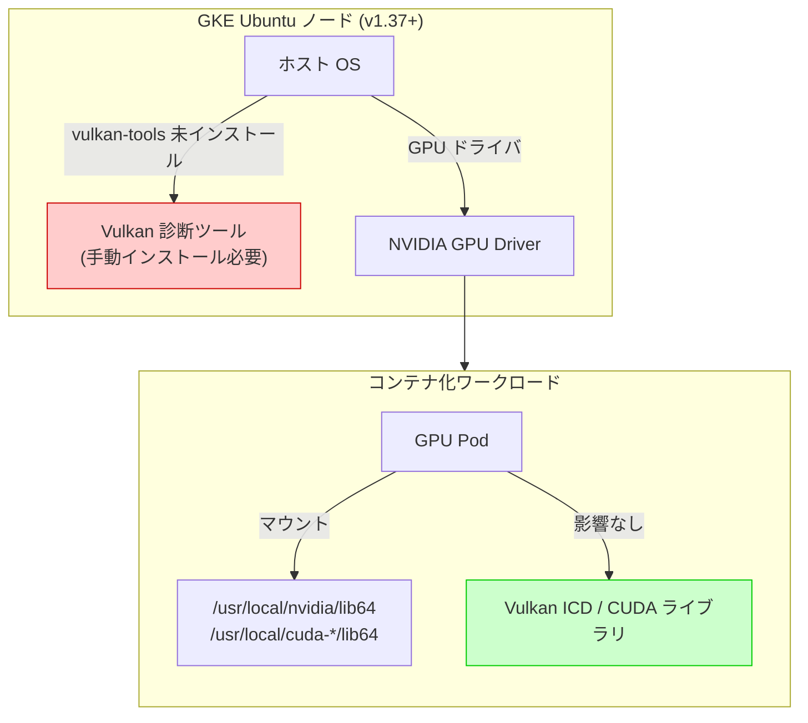

# Google Kubernetes Engine (GKE): Ubuntu ノードイメージからの vulkan-tools パッケージ削除

**リリース日**: 2026-07-20

**サービス**: Google Kubernetes Engine (GKE)

**機能**: Ubuntu ノードイメージのセキュリティ強化 (vulkan-tools パッケージの事前インストール廃止)

**ステータス**: Deprecated

📊 [このアップデートのインフォグラフィックを見る](https://takech9203.github.io/google-cloud-news-summary/20260720-gke-vulkan-tools-removal.html)

## 概要

GKE バージョン 1.37 以降において、Ubuntu ノードイメージから `vulkan-tools` パッケージの事前インストールが廃止されました。これはノードイメージのセキュリティ強化の一環であり、攻撃対象領域 (アタックサーフェス) を削減することを目的としています。

この変更は、GKE Ubuntu ホスト上で直接 Vulkan 診断ツール (`vulkaninfo` など) を実行するユーザーにのみ影響します。コンテナ化された GPU/Vulkan ワークロードには影響しません。GPU ワークロードをコンテナ内で実行している一般的なユースケースでは、対応は不要です。

**アップデート前の課題**

- Ubuntu ノードイメージに `vulkan-tools` パッケージが事前インストールされていた
- ノードの攻撃対象領域が不必要に広がっていた (多くのユーザーがホストレベルで Vulkan ツールを使用しないにもかかわらず)
- セキュリティのベストプラクティスである「必要最小限のパッケージのみインストール」に完全には準拠していなかった

**アップデート後の改善**

- ノードイメージの攻撃対象領域が削減され、セキュリティが向上
- 不要なパッケージが排除され、ノードイメージのサイズがわずかに縮小
- PCI DSS 要件 2.2.4「必要なサービス、プロトコル、デーモン、機能のみを有効にし、不要な機能を削除または無効化する」により適合

## アーキテクチャ図



この図は、ホストレベルの Vulkan ツール (影響あり・手動インストール必要) と、コンテナ化された GPU ワークロード (影響なし) の違いを示しています。コンテナ化されたワークロードは GPU ドライバとライブラリパスを通じて GPU にアクセスするため、ホストの `vulkan-tools` パッケージに依存しません。

## サービスアップデートの詳細

### 主要機能

1. **vulkan-tools パッケージの事前インストール廃止**
   - GKE バージョン 1.37 以降の Ubuntu ノードイメージが対象
   - `vulkaninfo` などの Vulkan 診断ツールがホスト上で利用不可に
   - セキュリティ強化のための攻撃対象領域削減措置

2. **コンテナ化ワークロードへの非影響**
   - コンテナ内で実行される GPU/Vulkan ワークロードは影響を受けない
   - NVIDIA GPU ドライバおよび CUDA ライブラリは引き続き正常に動作
   - GKE の GPU ドライバ自動インストール機能にも影響なし

3. **手動インストールによる回避策**
   - ホスト上で Vulkan 診断ツールが必要な場合は手動インストールが可能
   - DaemonSet を使用してノード再作成後も永続化可能

## 技術仕様

### 影響範囲

| 項目 | 詳細 |
|------|------|
| 対象バージョン | GKE 1.37 以降 |
| 対象ノードイメージ | Ubuntu (`ubuntu_containerd`) |
| 影響を受ける操作 | ホスト上での `vulkaninfo` 等の直接実行 |
| 影響を受けない操作 | コンテナ化された GPU/Vulkan ワークロード |
| 対象外ノードイメージ | Container-Optimized OS (`cos_containerd`) |

## 設定方法

### 前提条件

1. GKE バージョン 1.37 以降のクラスタで Ubuntu ノードイメージを使用
2. ホスト上で Vulkan 診断ツールを直接実行する必要がある

### 手順

#### ステップ 1: ホスト上で手動インストール (一時的)

```bash
# GKE ノードに SSH 接続後
sudo apt-get update && sudo apt-get install -y vulkan-tools
```

この方法ではノードの再作成 (アップグレード、自動修復、自動スケーリング) 時に変更が失われます。

#### ステップ 2: DaemonSet による永続化 (推奨)

```yaml
apiVersion: apps/v1
kind: DaemonSet
metadata:
  name: install-vulkan-tools
  namespace: kube-system
spec:
  selector:
    matchLabels:
      app: install-vulkan-tools
  template:
    metadata:
      labels:
        app: install-vulkan-tools
    spec:
      hostPID: true
      nodeSelector:
        cloud.google.com/gke-os-distribution: ubuntu
      containers:
      - name: installer
        image: ubuntu:22.04
        command:
        - /bin/bash
        - -c
        - |
          apt-get update && apt-get install -y vulkan-tools
          sleep infinity
        securityContext:
          privileged: true
        volumeMounts:
        - name: host-root
          mountPath: /host
      volumes:
      - name: host-root
        hostPath:
          path: /
```

DaemonSet を使用することで、ノード再作成後も自動的に `vulkan-tools` がインストールされます。

## メリット

### セキュリティ面

- **攻撃対象領域の削減**: 不要なパッケージを排除し、潜在的な脆弱性のエントリポイントを最小化
- **最小権限の原則への準拠**: 必要なコンポーネントのみをノードイメージに含める方針を強化
- **コンプライアンス向上**: PCI DSS などのセキュリティ基準への適合性が向上

### 運用面

- **ノードイメージの軽量化**: 不要なパッケージの排除によるわずかなイメージサイズ削減
- **パッチ管理の簡素化**: 管理対象パッケージの削減により、脆弱性対応の負荷が軽減

## デメリット・制約事項

### 制限事項

- GKE バージョン 1.37 以降へのアップグレード時に自動的に適用される (オプトアウト不可)
- ホスト上で `vulkaninfo` を使用した GPU デバイスの診断が即座に利用不可となる

### 考慮すべき点

- GPU ノードのトラブルシューティング時にホストレベルで Vulkan 診断が必要な場合、事前に DaemonSet を準備しておく
- ノード VM への変更は再作成時に失われるため、手動インストールは一時的な対策にしかならない
- Container-Optimized OS を使用しているクラスタには本変更は無関係

## 関連サービス・機能

- **GKE GPU サポート**: コンテナ化された GPU ワークロードの実行基盤。本変更の影響を受けない
- **NVIDIA GPU Operator**: GKE 上の GPU スタック管理の代替手段。Ubuntu/COS 両方で利用可能
- **GKE Sandbox (gVisor)**: GPU ワークロードのセキュリティ隔離機能
- **Container-Optimized OS**: より高度にセキュリティ強化されたノードイメージの代替選択肢

## 参考リンク

- 📊 [インフォグラフィック](https://takech9203.github.io/google-cloud-news-summary/20260720-gke-vulkan-tools-removal.html)
- [公式リリースノート](https://cloud.google.com/release-notes#July_20_2026)
- [GKE ノードイメージの概念](https://cloud.google.com/kubernetes-engine/docs/concepts/node-images)
- [DaemonSet によるノードブートストラップ](https://cloud.google.com/kubernetes-engine/docs/tutorials/automatically-bootstrapping-gke-nodes-with-daemonsets)
- [GKE クラスタのセキュリティ強化](https://cloud.google.com/kubernetes-engine/docs/how-to/hardening-your-cluster)
- [GKE での GPU ワークロード](https://cloud.google.com/kubernetes-engine/docs/concepts/gpus)

## まとめ

本アップデートは、GKE Ubuntu ノードイメージのセキュリティ強化を目的とした比較的マイナーな変更です。コンテナ化された GPU/Vulkan ワークロードには影響がないため、大多数のユーザーは対応不要です。ホスト上で直接 Vulkan 診断ツールを使用しているユーザーのみ、手動インストールまたは DaemonSet による対応が必要です。GKE 1.37 へのアップグレードを計画している場合は、事前にホストレベルでの Vulkan ツール使用有無を確認することを推奨します。

---

**タグ**: #GKE #Kubernetes #Security #Ubuntu #GPU #Vulkan #NodeImage #Deprecated
