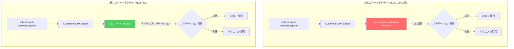

# Google Distributed Cloud for Bare Metal: v1.35.300-gke.87 リリース

**リリース日**: 2026-07-20

**サービス**: Google Distributed Cloud (software only) for bare metal

**機能**: Version 1.35.300-gke.87 Release

**ステータス**: Announcement

📊 [このアップデートのインフォグラフィックを見る](https://takech9203.github.io/google-cloud-news-summary/20260720-google-distributed-cloud-bare-metal-1-35-300.html)

## 概要

Google Distributed Cloud (software only) for bare metal の新しいパッチリリース 1.35.300-gke.87 が公開されました。このリリースは Kubernetes v1.35.3-gke.400 をベースとしており、CSI スナップショットバリデーションの仕組みを大幅に刷新する重要なアーキテクチャ変更と、セキュリティ脆弱性の修正を含んでいます。

最も注目すべき変更点は、非推奨となっていた `csi-snapshot-validation-webhook` コンポーネントの完全削除です。このコンポーネントが担っていた VolumeSnapshot 関連の CRD バリデーション機能は、Kubernetes ネイティブの Common Expression Language (CEL) ルールに置き換えられました。これにより、バリデーション処理がよりシンプルかつ信頼性の高い仕組みで実行されるようになります。

このリリースは、オンプレミスや Edge 環境で Kubernetes クラスタを運用しているエンタープライズユーザーを主な対象としています。GKE On-Prem API クライアント (Google Cloud コンソール、gcloud CLI、Terraform) での利用は、リリース後 7~14 日程度で可能になります。

**アップデート前の課題**

- `csi-snapshot-validation-webhook` が独立したコンポーネントとして稼働しており、追加のリソース消費と運用負荷が発生していた
- Webhook ベースのバリデーションでは、TLS 証明書のローテーションや Webhook サービスへの接続障害が発生した場合にスナップショット操作がブロックされるリスクがあった
- Webhook コンポーネントの証明書管理が必要であり、セキュリティメンテナンスの負担が増加していた

**アップデート後の改善**

- CEL ルールが CRD 定義内に直接組み込まれたため、外部 Webhook への依存が完全に排除された
- バリデーションロジックが Kubernetes API Server 内でネイティブに実行されるようになり、レイテンシが削減された
- 独立した Webhook コンポーネントの運用・監視・証明書管理が不要になった

## アーキテクチャ図



上図は、CSI スナップショットのバリデーション処理が外部 Webhook から CRD 内の CEL ルールに移行した様子を示しています。新アーキテクチャでは、API Server 内で直接バリデーションが実行されるため、外部コンポーネントへのネットワーク通信が不要になりました。

## サービスアップデートの詳細

### 主要機能

1. **csi-snapshot-validation-webhook の削除**
   - 非推奨だった `csi-snapshot-validation-webhook` コンポーネントが完全に削除された
   - VolumeSnapshot、VolumeSnapshotContent、VolumeSnapshotClass の CRD に対するバリデーションが CEL ルールに移行
   - Webhook Pod のデプロイ、Service、ValidatingWebhookConfiguration リソースが不要に

2. **CEL ベースの CRD バリデーション**
   - Kubernetes の Common Expression Language (CEL) を使用して、CRD の `x-kubernetes-validations` フィールドにバリデーションルールを直接定義
   - API Server 内でネイティブに実行されるため、外部通信のオーバーヘッドがゼロ
   - CRD 定義とバリデーションロジックが一体化し、管理が容易に

3. **セキュリティ脆弱性の修正**
   - 複数のセキュリティ脆弱性が修正済み
   - 詳細は Google Distributed Cloud for bare metal の Vulnerability fixes ページを参照

## 技術仕様

### リリース情報

| 項目 | 詳細 |
|------|------|
| リリースバージョン | 1.35.300-gke.87 |
| Kubernetes バージョン | v1.35.3-gke.400 |
| コンテナランタイム | containerd 2.1 |
| cgroups 要件 | cgroupsv2 必須 (cgroupsv1 非対応) |
| GKE On-Prem API 利用可能時期 | リリース後 7~14 日 |

### CEL バリデーションの仕組み

CEL (Common Expression Language) は Kubernetes 1.25 から導入されたバリデーション機構で、CRD の OpenAPI スキーマ内に直接バリデーションルールを記述できます。

```yaml
apiVersion: apiextensions.k8s.io/v1
kind: CustomResourceDefinition
metadata:
  name: volumesnapshots.snapshot.storage.k8s.io
spec:
  versions:
    - name: v1
      schema:
        openAPIV3Schema:
          type: object
          properties:
            spec:
              type: object
              x-kubernetes-validations:
                - rule: "has(self.source.persistentVolumeClaimName) || has(self.source.volumeSnapshotContentName)"
                  message: "source must specify either persistentVolumeClaimName or volumeSnapshotContentName"
                - rule: "!(has(self.source.persistentVolumeClaimName) && has(self.source.volumeSnapshotContentName))"
                  message: "source cannot specify both persistentVolumeClaimName and volumeSnapshotContentName"
```

## 設定方法

### 前提条件

1. Google Distributed Cloud for bare metal 1.34.0 以上が既にインストールされていること
2. bmctl バージョン 1.35.300 がダウンロード済みであること
3. cgroupsv2 が全ノードで有効であること
4. サードパーティストレージベンダーを使用している場合、当該バージョンでの認定を確認済みであること

### 手順

#### ステップ 1: クラスタの事前チェック

```bash
# クラスタの健全性を確認
bmctl check cluster -c CLUSTER_NAME --kubeconfig ADMIN_KUBECONFIG
```

アップグレード前にクラスタの状態を確認し、問題がないことを検証します。

#### ステップ 2: クラスタ構成ファイルの更新

```yaml
apiVersion: baremetal.cluster.gke.io/v1
kind: Cluster
metadata:
  name: cluster1
  namespace: cluster-cluster1
spec:
  type: admin
  anthosBareMetalVersion: 1.35.300-gke.87
```

クラスタ構成ファイルの `anthosBareMetalVersion` を `1.35.300-gke.87` に更新します。

#### ステップ 3: クラスタのアップグレード実行

```bash
# アップグレードの実行
bmctl upgrade cluster -c CLUSTER_NAME --kubeconfig ADMIN_KUBECONFIG
```

アップグレードプロセスはプリフライトチェックを自動実行し、ノードの健全性確認後に順次アップグレードを進めます。管理クラスタを先にアップグレードしてから、関連するユーザークラスタをアップグレードしてください。

#### ステップ 4: アップグレード後の確認

```bash
# クラスタのバージョンを確認
kubectl get cluster -n CLUSTER_NAMESPACE -o yaml | grep anthosBareMetalVersion

# csi-snapshot-validation-webhook が削除されていることを確認
kubectl get pods -n kube-system | grep csi-snapshot-validation

# VolumeSnapshot CRD のバリデーションルールを確認
kubectl get crd volumesnapshots.snapshot.storage.k8s.io -o yaml | grep x-kubernetes-validations
```

## メリット

### ビジネス面

- **運用コスト削減**: Webhook コンポーネントの監視・メンテナンスが不要になり、運用チームの負担が軽減される
- **可用性向上**: 外部 Webhook への依存を排除することで、スナップショット操作の信頼性が向上し、SLA 達成が容易に

### 技術面

- **レイテンシ低減**: API Server 内でバリデーションがネイティブ実行されるため、Webhook への TLS 通信往復が不要になりレスポンス時間が改善
- **障害点の削減**: Webhook サービスの可用性に依存しなくなり、単一障害点 (SPOF) が排除される
- **リソース効率化**: Webhook Pod とそれに関連するリソース (Service, Secret, Certificate) が不要になり、クラスタリソースの消費が削減
- **セキュリティ強化**: 脆弱性修正に加え、TLS 証明書管理の必要がなくなることでアタックサーフェスが縮小

## デメリット・制約事項

### 制限事項

- リリース後 7~14 日間は GKE On-Prem API クライアント (コンソール、gcloud CLI、Terraform) からのアップグレードが利用不可
- cgroupsv2 が必須要件であり、cgroupsv1 のみをサポートする古い OS 環境ではアップグレード不可
- サードパーティストレージベンダーのバージョン互換性確認が必要

### 考慮すべき点

- カスタムの ValidatingWebhookConfiguration を使用して CSI スナップショットのバリデーションをカスタマイズしていた場合、CEL ルールへの移行対応が必要
- アップグレード中は一時的にワーカーノードが利用不可になるため、メンテナンスウィンドウの計画が必要
- RHEL 7/8 環境では cgroupsv2 の手動有効化が前提条件となる

## ユースケース

### ユースケース 1: エンタープライズのオンプレミス Kubernetes 環境

**シナリオ**: 大規模なオンプレミス環境で数百の PersistentVolume のスナップショットを日次で取得しているチームが、Webhook の TLS 証明書期限切れにより定期バックアップが失敗するインシデントを経験している。

**実装例**:
```bash
# 1.35.300-gke.87 にアップグレード
bmctl upgrade cluster -c production-cluster --kubeconfig /path/to/admin-kubeconfig

# アップグレード後、Webhook 関連リソースが自動削除されていることを確認
kubectl get validatingwebhookconfigurations | grep snapshot
# (出力なし = 正常に削除済み)

# スナップショット作成が正常に動作することを確認
kubectl apply -f daily-snapshot.yaml
```

**効果**: 証明書管理の負担がゼロになり、Webhook 起因の障害リスクが完全に排除される。スナップショット操作の信頼性が 100% に向上。

### ユースケース 2: Edge コンピューティング環境でのリソース最適化

**シナリオ**: 小売店舗の Edge ノードで Google Distributed Cloud を運用しており、限られたハードウェアリソース内でコンテナワークロードを最大化したい。

**効果**: Webhook Pod (通常 2 レプリカ) と関連リソースが削除されることで、CPU とメモリの使用量が削減される。リソース制約の厳しい Edge 環境において、ワークロード用に確保できるリソースが増加する。

## 関連サービス・機能

- **Google Kubernetes Engine (GKE)**: クラウドネイティブの Kubernetes マネージドサービス。Google Distributed Cloud は GKE の技術基盤をオンプレミス/Edge に拡張したもの
- **Kubernetes Volume Snapshots**: CSI ドライバを使用した永続ボリュームのスナップショット機能。VolumeSnapshot、VolumeSnapshotContent、VolumeSnapshotClass の 3 つの CRD で構成
- **Common Expression Language (CEL)**: Google が開発したポータブルな式言語。Kubernetes では CRD バリデーション、Admission Policy、RBAC 条件などで活用
- **GKE On-Prem API**: Google Cloud コンソールや gcloud CLI からオンプレミスクラスタを管理するための API

## 参考リンク

- 📊 [インフォグラフィック](https://takech9203.github.io/google-cloud-news-summary/20260720-google-distributed-cloud-bare-metal-1-35-300.html)
- [公式リリースノート](https://cloud.google.com/release-notes#July_20_2026)
- [クラスタのアップグレード手順](https://docs.cloud.google.com/kubernetes-engine/distributed-cloud/bare-metal/docs/how-to/upgrade)
- [Volume Snapshots ドキュメント](https://docs.cloud.google.com/kubernetes-engine/docs/how-to/persistent-volumes/volume-snapshots)
- [脆弱性修正一覧](https://docs.cloud.google.com/kubernetes-engine/distributed-cloud/bare-metal/docs/vulnerabilities)
- [Google Distributed Cloud ダウンロード](https://docs.cloud.google.com/kubernetes-engine/distributed-cloud/bare-metal/docs/downloads)

## まとめ

Google Distributed Cloud for bare metal 1.35.300-gke.87 は、CSI スナップショットバリデーションのアーキテクチャを Webhook から CEL ベースに刷新した重要なリリースです。この変更により、運用の複雑さが軽減され、スナップショット操作の信頼性が向上します。オンプレミスや Edge 環境で Google Distributed Cloud を運用しているユーザーは、セキュリティ修正も含まれているため、計画的なアップグレードを推奨します。

---

**タグ**: Google Distributed Cloud, Bare Metal, GKE, Kubernetes, CEL, CRD, CSI Snapshot, Security
