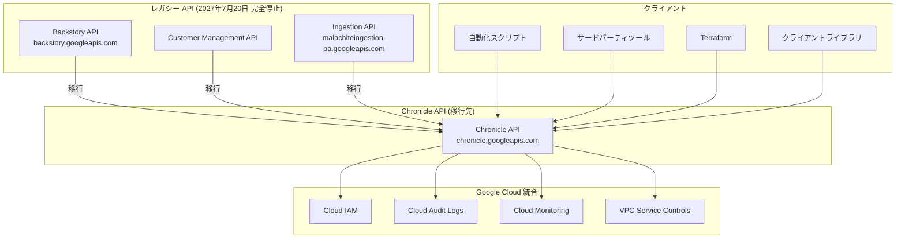

# Google SecOps (Google Security Operations): レガシー SIEM API の廃止

**リリース日**: 2026-07-20

**サービス**: Google SecOps (Google Security Operations) / Google SecOps SIEM

**機能**: レガシー SIEM API (Backstory API / Ingestion API) の廃止と Chronicle API への移行

**ステータス**: Deprecated (非推奨)

[このアップデートのインフォグラフィックを見る](https://takech9203.github.io/google-cloud-news-summary/20260720-google-secops-legacy-siem-api-deprecation.html)

## 概要

Google Security Operations (Google SecOps) は、レガシー SIEM API である **Backstory API** (Customer Management API を含む) および **Ingestion API** を正式に非推奨 (Deprecated) とし、モダンな **Chronicle API** への移行を要求することを発表した。これは Google SecOps プラットフォームのセキュリティ、パフォーマンス、信頼性を向上させるための重要なアーキテクチャ変更である。

レガシー API の継続使用はパフォーマンス問題や予期しない動作を引き起こす可能性があり、すべての利用者は速やかに Chronicle API への移行を完了する必要がある。Chronicle API は Google Cloud API 標準に準拠した RESTful アーキテクチャを採用し、Cloud IAM、Cloud Audit Logs、Cloud Monitoring との統合を強化している。

この廃止は、カスタムインテグレーション、自動化スクリプト、サードパーティツールを通じてレガシー API エンドポイントを呼び出しているすべての組織に影響する。Google SecOps UI のみを使用している組織、または既に Chronicle API エンドポイントを呼び出しているインテグレーションには影響しない。

**アップデート前の課題**

- レガシー API は手動プロセスによる認証情報管理が必要で、Google 担当者を介する必要があった
- データレジデンシー制御、VPC Service Controls、CMEK、FedRAMP などのコンプライアンス標準のサポートが限定的だった
- API 設計がフラットで独自構造であり、一貫性のないエンドポイント命名が開発効率を低下させていた
- 監査ログが旧式のストリームに依存しており、Google Cloud プロジェクトとの統合が不十分だった
- Terraform、クライアントライブラリ、SDK などのモダンなクラウドツールとの連携が非常に限定的だった

**アップデート後の改善**

- Chronicle API はセルフサービスでのサービスアカウント、認証情報、IAM 権限の管理が可能になる
- Data Residency、VPC Service Controls、Access Transparency、CMEK、FedRAMP への組み込みサポートを提供する
- リソース指向設計、RESTful アーキテクチャ、AIP 準拠の標準化された命名規則を採用する
- Cloud Audit Logs が Google Cloud プロジェクトに直接統合され、一元的な監査証跡が実現する
- OneMCP、Terraform、8 言語のクライアントライブラリ (Python, Go, Java, Node.js, C# 等) との統合を実現する

## アーキテクチャ図



レガシー API (Backstory API、Customer Management API、Ingestion API) から Chronicle API への移行パスを示す。Chronicle API は Google Cloud IAM、Cloud Audit Logs、Cloud Monitoring、VPC Service Controls と密接に統合され、モダンな開発ツール (Terraform、クライアントライブラリ等) からのアクセスが標準化される。

## サービスアップデートの詳細

### 廃止タイムライン

| マイルストーン | 日付 | 影響 |
|------|------|------|
| **非推奨宣言** | 2026年7月20日 | レガシー API が正式に非推奨となる |
| **新規インスタンス停止 (EOS)** | 2026年10月26日 | この日以降にプロビジョニングされた新規 Google SecOps インスタンスはレガシー API を呼び出せない |
| **完全停止 (EOL)** | 2027年7月20日 | 既存インスタンスを含むすべてのレガシー API エンドポイントが完全に停止する |

### 対象となるレガシー API

1. **Backstory API**
   - 検索 API (Search API): UDM Search、Raw Log Search、Asset/User 検索
   - ルール API: YARA-L ルールの作成・管理・検出
   - アラート API: アラートのストリーミング・管理
   - フィード管理 API: データフィードの CRUD 操作
   - フォワーダー API: ログフォワーダーの管理
   - パーサー API: CBN パーサーの管理
   - リファレンスリスト API: 参照リストの管理
   - レトロハント API: 過去のログに対するルール実行
   - エンドポイント: `backstory.googleapis.com`
   - OAuth スコープ: `https://www.googleapis.com/auth/chronicle-backstory`

2. **Customer Management API**
   - パートナー向け顧客管理機能
   - テナント作成・設定管理
   - Backstory API のサブセットとして提供

3. **Ingestion API**
   - UDM イベントの一括取り込み
   - 非構造化ログの取り込み
   - ログタイプの取得
   - エンドポイント: `malachiteingestion-pa.googleapis.com`
   - OAuth スコープ: `https://www.googleapis.com/auth/malachite-ingestion`

### 移行先: Chronicle API

Chronicle API は以下の改善を提供する:

1. **リソース指向設計**
   - RESTful アーキテクチャと AIP (API Improvement Proposals) 準拠
   - 標準化されたリソース命名 (`projects/{project}/locations/{location}/instances/{instance}/...`)
   - 一貫性のある CRUD 操作

2. **強化された認証・認可**
   - OAuth 2.0 と Workload Identity Federation のサポート
   - Google Cloud IAM によるきめ細かいアクセス制御
   - 事前定義ロール: Chronicle API Admin / Editor / Viewer / Limited Viewer

3. **コンプライアンスとセキュリティ**
   - VPC Service Controls によるデータ境界の保護
   - CMEK (顧客管理暗号鍵) のサポート
   - Access Transparency による Google アクセスの可視化
   - FedRAMP 準拠

## 技術仕様

### 認証方式の変更

| 項目 | レガシー API | Chronicle API |
|------|------|------|
| 認証方式 | API トークン + サービスアカウント認証情報 | OAuth 2.0 + Workload Identity + サービスアカウント |
| OAuth スコープ | `chronicle-backstory` / `malachite-ingestion` | `https://www.googleapis.com/auth/chronicle` または `cloud-platform` |
| 認証情報管理 | Google 担当者経由の手動プロセス | セルフサービス (Google Cloud Console) |
| IAM | レガシー RBAC (Subject ベース) | Google Cloud IAM (きめ細かい権限) |

### 主要エンドポイントマッピング (一部)

| 機能領域 | レガシーメソッド | Chronicle API メソッド |
|------|------|------|
| ルール作成 | `CreateRule` (RPC v1/v2) | `projects.locations.instances.rules/create` |
| ルール検出 | `ListDetections` (RPC v2) | `legacySearchDetections` |
| フィード作成 | `CreateFeed` (RPC v1) | `projects.locations.instances.feeds/create` |
| フォワーダー作成 | `CreateForwarder` (RPC v2) | `projects.locations.instances.forwarders/create` |
| パーサー作成 | `CreateCbnParser` (RPC v1) | `projects.locations.instances.logTypes.parsers/create` |
| UDM 検索 | `UdmSearch` (RPC v1) | `projects.locations.instances/udmSearch` |
| アラート一覧 | `ListAlerts` (RPC v1) | `legacySearchAlerts` |

### 廃止されるエンドポイント (マッピングなし)

以下のレガシーエンドポイントは Chronicle API にマッピングされず、完全に廃止される:

- レガシー RBAC 関連 (CreateSubject, DeleteSubject, ListRoles 等) - Google Cloud IAM に置き換え
- `ListCbnParserErrors` - モダンパーサー管理ワークフローで不要
- `EnableIAM`, `GenerateIamMigrationCommands` - 既に非推奨
- `GenerateIdPMetadata`, `GetIngestionFilter`, `SetGCPProjectLink` - モダンアーキテクチャで冗長

## 設定方法

### 前提条件

1. Google SecOps インスタンスがモダン SIEM インフラストラクチャ上にデプロイされていること
2. Google Cloud プロジェクトで Chronicle API (`chronicle.googleapis.com`) が有効化されていること
3. 適切な IAM ロールが付与されたサービスアカウントが作成されていること

### 手順

#### ステップ 1: Google Cloud プロジェクトの設定

```bash
# Chronicle API を有効化
gcloud services enable chronicle.googleapis.com --project=YOUR_PROJECT_ID

# サービスアカウントを作成
gcloud iam service-accounts create chronicle-api-sa \
  --display-name="Chronicle API Service Account" \
  --project=YOUR_PROJECT_ID

# IAM ロールを付与 (例: Editor)
gcloud projects add-iam-policy-binding YOUR_PROJECT_ID \
  --member="serviceAccount:chronicle-api-sa@YOUR_PROJECT_ID.iam.gserviceaccount.com" \
  --role="roles/chronicle.editor"
```

#### ステップ 2: 認証情報の設定

```bash
# サービスアカウントキーの作成
gcloud iam service-accounts keys create key.json \
  --iam-account=chronicle-api-sa@YOUR_PROJECT_ID.iam.gserviceaccount.com

# 環境変数の設定
export GOOGLE_APPLICATION_CREDENTIALS="/path/to/your/service-account-key.json"
```

#### ステップ 3: OAuth スコープの更新

```python
# レガシー (変更前)
SCOPES = ['https://www.googleapis.com/auth/chronicle-backstory']

# モダン (変更後)
SCOPES = ['https://www.googleapis.com/auth/chronicle']
# または
SCOPES = ['https://www.googleapis.com/auth/cloud-platform']
```

#### ステップ 4: エンドポイントの更新

```python
# レガシー Backstory API (変更前)
url = 'https://backstory.googleapis.com/v2/lists/COLDRIVER_SHA256'

# Chronicle API (変更後)
url = 'https://chronicle.googleapis.com/v1alpha/projects/{project}/locations/{location}/instances/{instance}/referenceLists/{list_id}'
```

#### ステップ 5: テストと検証

```bash
# 移行後の API 呼び出しテスト
curl -H "Authorization: Bearer $(gcloud auth print-access-token)" \
  "https://chronicle.googleapis.com/v1alpha/projects/YOUR_PROJECT/locations/us/instances/YOUR_INSTANCE/rules"
```

## メリット

### ビジネス面

- **運用の自律性向上**: 認証情報やアクセス権限の管理がセルフサービスとなり、Google 担当者への依頼が不要になる
- **コンプライアンス対応の強化**: VPC Service Controls、CMEK、FedRAMP などの業界標準に対応し、規制要件への準拠が容易になる
- **エコシステムの拡大**: Terraform による Infrastructure as Code、8 言語のクライアントライブラリにより、開発・運用の効率が大幅に向上する

### 技術面

- **セキュリティの強化**: Workload Identity Federation によるキーレス認証、きめ細かい IAM 権限によるゼロトラストアクセス制御
- **可観測性の向上**: Cloud Audit Logs との直接統合により、API 呼び出しの完全な監査証跡を Google Cloud プロジェクト内で一元管理可能
- **API 設計の改善**: AIP 準拠の RESTful 設計により、標準的な Google Cloud クライアントライブラリとツールが利用可能

## デメリット・制約事項

### 制限事項

- 移行完了までの猶予期間は約 12 か月 (2027年7月20日まで) であり、大規模な組織では計画的な移行が必要
- 一部のレガシーエンドポイントは Chronicle API にマッピングされず完全に廃止されるため、代替手段の検討が必要
- 新規インスタンス (2026年10月26日以降にプロビジョニング) は即座にレガシー API が利用不可となる

### 考慮すべき点

- カスタムインテグレーション、自動化スクリプト、サードパーティツールのすべてを棚卸しし、レガシー API 呼び出しを特定する必要がある
- SIEM インフラストラクチャがモダンアーキテクチャにデプロイされていない場合、先に SIEM インフラストラクチャの移行が必要
- OAuth スコープの変更により、既存のすべての認証フローを更新する必要がある
- レガシー RBAC (Subject ベース) から Google Cloud IAM への権限マッピングの見直しが必要

## ユースケース

### ユースケース 1: 自動化スクリプトの移行

**シナリオ**: Python スクリプトで Backstory API を使用してセキュリティアラートを定期的に取得し、チケットシステムに連携している組織

**実装例**:
```python
# 移行前 (レガシー Backstory API)
from google.oauth2 import service_account
from google.auth.transport import requests

SCOPES = ['https://www.googleapis.com/auth/chronicle-backstory']
credentials = service_account.Credentials.from_service_account_file(
    'apikeys.json', scopes=SCOPES)
http_session = requests.AuthorizedSession(credentials)
response = http_session.request("GET",
    "https://backstory.googleapis.com/v1/alert/listalerts")

# 移行後 (Chronicle API)
from google.oauth2 import service_account
from google.auth.transport import requests

SCOPES = ['https://www.googleapis.com/auth/chronicle']
credentials = service_account.Credentials.from_service_account_file(
    'key.json', scopes=SCOPES)
http_session = requests.AuthorizedSession(credentials)
response = http_session.request("GET",
    "https://chronicle.googleapis.com/v1alpha/projects/my-project/locations/us/instances/my-instance/legacy:legacySearchAlerts")
```

**効果**: Cloud IAM によるきめ細かい権限制御と Cloud Audit Logs による完全な監査証跡の取得が可能になる

### ユースケース 2: ログ取り込みパイプラインの移行

**シナリオ**: Ingestion API を使用して複数のソースから UDM イベントを Google SecOps に送信しているセキュリティチーム

**実装例**:
```python
# 移行前 (レガシー Ingestion API)
SCOPES = ['https://www.googleapis.com/auth/malachite-ingestion']
url = 'https://malachiteingestion-pa.googleapis.com/v2/udmevents:batchCreate'
body = {"customerId": CUSTOMER_ID, "events": events}

# 移行後 (Chronicle API Ingestion メソッド)
SCOPES = ['https://www.googleapis.com/auth/chronicle']
url = 'https://chronicle.googleapis.com/v1alpha/projects/my-project/locations/us/instances/my-instance/events:import'
body = {"inlineSource": {"events": events}}
```

**効果**: Workload Identity Federation によるキーレス認証が利用可能となり、サービスアカウントキーの管理負担が軽減される

## 関連サービス・機能

- **Google Cloud IAM**: Chronicle API の認証・認可基盤。きめ細かい事前定義ロール (Admin/Editor/Viewer/Limited Viewer) を提供
- **Cloud Audit Logs**: Chronicle API 呼び出しの監査ログを Google Cloud プロジェクトに一元記録
- **Cloud Monitoring**: API 呼び出しのメトリクスとアラートを統合管理
- **VPC Service Controls**: Chronicle API へのアクセスをサービス境界で制限し、データ流出を防止
- **Workload Identity Federation**: サービスアカウントキーを使用しないキーレス認証を提供
- **Terraform**: Chronicle API リソースの Infrastructure as Code 管理を実現
- **Google SecOps SOAR**: セキュリティオーケストレーション機能。Chronicle API との連携により自動対応ワークフローを構築

## 参考リンク

- [インフォグラフィック](https://takech9203.github.io/google-cloud-news-summary/20260720-google-secops-legacy-siem-api-deprecation.html)
- [公式リリースノート](https://docs.cloud.google.com/release-notes#July_20_2026)
- [レガシー SIEM API から Chronicle API への移行ガイド](https://docs.cloud.google.com/chronicle/docs/administration/migrate-from-legacy-api-to-chronicle-api)
- [SIEM API エンドポイントマッピング](https://docs.cloud.google.com/chronicle/docs/administration/siem-endpoint-mapping-table)
- [Chronicle API リファレンス](https://docs.cloud.google.com/chronicle/docs/reference/rest)
- [Google SecOps クライアントライブラリ](https://docs.cloud.google.com/chronicle/docs/libraries)
- [SIEM インフラストラクチャ移行の概要](https://docs.cloud.google.com/chronicle/docs/administration/migrate-legacy-siem-infra)
- [Google SecOps 廃止一覧](https://docs.cloud.google.com/chronicle/docs/deprecations)
- [Chronicle API 認証ガイド](https://docs.cloud.google.com/chronicle/docs/reference/authentication)

## まとめ

Google SecOps レガシー SIEM API の廃止は、プラットフォームのセキュリティと信頼性を根本的に強化するための重要な変更である。**2027年7月20日の完全停止までに移行を完了する必要がある**ため、直ちに自組織のレガシー API 利用状況を棚卸しし、移行計画を策定することを強く推奨する。特に 2026年10月26日以降に新規インスタンスをプロビジョニングする予定がある組織は、最初から Chronicle API を使用する前提で設計する必要がある。

---

**タグ**: #GoogleSecOps #Chronicle #SIEM #API廃止 #セキュリティ #移行 #Deprecated #BackstoryAPI #IngestionAPI #ChronicleAPI
