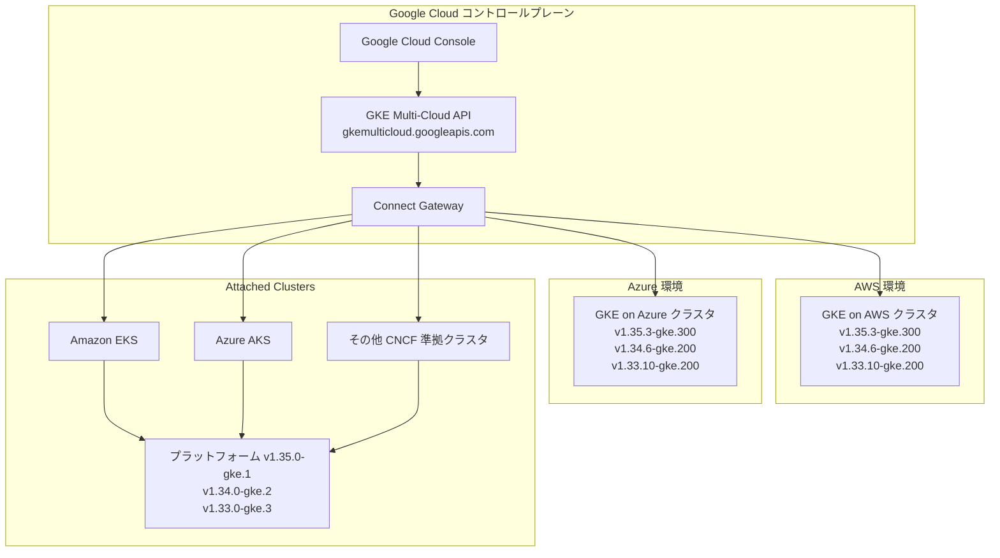

# GKE Multi-Cloud: Kubernetes バージョン更新 (2026年7月)

**リリース日**: 2026-07-21

**サービス**: GKE Multi-Cloud (Attached Clusters, AWS, Azure)

**機能**: Kubernetes 新バージョンのサポート追加

**ステータス**: GA (一般提供)

[このアップデートのインフォグラフィックを見る](https://takech9203.github.io/google-cloud-news-summary/20260721-anthos-multi-cloud-kubernetes-versions-july.html)

## 概要

Google Cloud は GKE Multi-Cloud プラットフォーム全体 (Attached Clusters、GKE on AWS、GKE on Azure) で新しい Kubernetes バージョンのサポートを追加した。今回のリリースでは、Kubernetes 1.35、1.34、1.33 の各マイナーバージョンに対して最新のパッチリリースが提供されている。

このアップデートは、マルチクラウド環境で Kubernetes クラスタを運用する組織にとって重要な意味を持つ。新バージョンには複数のセキュリティ脆弱性 (CVE) の修正が含まれており、クラスタのセキュリティ態勢を最新の状態に保つために、早期のアップグレードが推奨される。

対象となるのは、AWS (EKS)、Azure (AKS)、またはその他の CNCF 準拠クラスタを GKE Multi-Cloud で管理しているすべてのユーザーである。

**アップデート前の課題**

- 以前のパッチバージョンには既知のセキュリティ脆弱性 (CVE-2024-24791、CVE-2025-22868、CVE-2026-2003 など) が存在していた
- Kubernetes 1.35 系は以前のパッチのみが利用可能で、最新のセキュリティ修正が含まれていなかった
- マルチクラウド環境全体でバージョンの統一が困難な場合があった

**アップデート後の改善**

- 20 以上の CVE に対するセキュリティ修正が適用された新バージョンが利用可能になった
- AWS と Azure で同一バージョン (1.35.3-gke.300、1.34.6-gke.200、1.33.10-gke.200) が提供され、マルチクラウド環境でのバージョン統一が容易になった
- Attached Clusters でも対応するプラットフォームバージョンが更新され、サードパーティクラスタの管理が改善された

## アーキテクチャ図



GKE Multi-Cloud API を介して、Google Cloud コンソールから AWS、Azure、および Attached Clusters を統一的に管理する。各環境で同一の Kubernetes バージョンをサポートすることで、一貫した運用体験を提供する。

## サービスアップデートの詳細

### 主要機能

1. **Attached Clusters - 新 Kubernetes バージョン**
   - 1.35.0-gke.1: Kubernetes 1.35 系の最新プラットフォームバージョン
   - 1.34.0-gke.2: 1.34 系のセキュリティ修正パッチ (anthos.googleapis.com の検証廃止、Connect Agent のワークロード ID プールデフォルト化を含む)
   - 1.33.0-gke.3: 1.33 系のセキュリティ修正パッチ

2. **GKE on AWS - 新 Kubernetes バージョン**
   - 1.35.3-gke.300: 最新のセキュリティパッチを含む 1.35 系リリース
   - 1.34.6-gke.200: 1.34 系の最新パッチリリース
   - 1.33.10-gke.200: 1.33 系の最新パッチリリース

3. **GKE on Azure - 新 Kubernetes バージョン**
   - 1.35.3-gke.300: 最新のセキュリティパッチを含む 1.35 系リリース
   - 1.34.6-gke.200: 1.34 系の最新パッチリリース
   - 1.33.10-gke.200: 1.33 系の最新パッチリリース

## 技術仕様

### サポートされる Kubernetes バージョン一覧

| 環境 | Kubernetes 1.35 | Kubernetes 1.34 | Kubernetes 1.33 |
|------|----------------|----------------|----------------|
| Attached Clusters | 1.35.0-gke.1 | 1.34.0-gke.2 | 1.33.0-gke.3 |
| GKE on AWS | 1.35.3-gke.300 | 1.34.6-gke.200 | 1.33.10-gke.200 |
| GKE on Azure | 1.35.3-gke.300 | 1.34.6-gke.200 | 1.33.10-gke.200 |

### 主要なセキュリティ修正 (Attached Clusters 1.35.0-gke.1)

| CVE | 概要 |
|-----|------|
| CVE-2024-24791 | Go net/http の脆弱性 |
| CVE-2025-22868 | Go 暗号ライブラリの脆弱性 |
| CVE-2025-22869 | Go SSH ライブラリの脆弱性 |
| CVE-2025-30204 | JWT トークン処理の脆弱性 |
| CVE-2026-2003 ~ CVE-2026-2006 | 2026年初頭発見の脆弱性群 |
| CVE-2026-22795, CVE-2026-22796 | 最新のセキュリティ脆弱性 |

### アップグレード要件

- マイナーバージョンのアップグレードは順次行う必要がある (例: 1.33 -> 1.34 -> 1.35)
- クラスタのアップグレード後、ノードプールもアップグレードが必要
- ノードプールのバージョンはクラスタバージョンの 2 マイナーバージョン以内である必要がある

## 設定方法

### 前提条件

1. Google Cloud プロジェクトで `gkemulticloud.googleapis.com` API が有効化されていること
2. 適切な IAM 権限 (`gkemulticloud.googleapis.com/awsClusters.update` または対応する Azure/Attached の権限) を持つこと
3. gcloud CLI の最新バージョンがインストールされていること

### 手順

#### ステップ 1: 利用可能なバージョンの確認

```bash
# AWS クラスタの場合
gcloud container aws get-server-config \
  --location=GOOGLE_CLOUD_LOCATION

# Azure クラスタの場合
gcloud container azure get-server-config \
  --location=GOOGLE_CLOUD_LOCATION

# Attached Clusters の場合
gcloud container attached get-server-config \
  --location=GOOGLE_CLOUD_LOCATION
```

`GOOGLE_CLOUD_LOCATION` にはクラスタを管理する Google Cloud リージョン (例: `us-west1`) を指定する。

#### ステップ 2: クラスタバージョンのアップグレード

```bash
# AWS クラスタのアップグレード
gcloud container aws clusters update CLUSTER_NAME \
  --location=GOOGLE_CLOUD_LOCATION \
  --cluster-version=1.35.3-gke.300

# Azure クラスタのアップグレード
gcloud container azure clusters update CLUSTER_NAME \
  --location=GOOGLE_CLOUD_LOCATION \
  --cluster-version=1.35.3-gke.300
```

GKE on AWS/Azure ではローリングアップデートが実行され、コントロールプレーンのノードが順次更新される。

#### ステップ 3: ノードプールのアップグレード

```bash
# AWS ノードプールのアップグレード
gcloud container aws node-pools update NODE_POOL_NAME \
  --cluster=CLUSTER_NAME \
  --location=GOOGLE_CLOUD_LOCATION \
  --node-version=1.35.3-gke.300

# Azure ノードプールのアップグレード
gcloud container azure node-pools update NODE_POOL_NAME \
  --cluster=CLUSTER_NAME \
  --location=GOOGLE_CLOUD_LOCATION \
  --node-version=1.35.3-gke.300
```

クラスタのアップグレードが完了した後にノードプールをアップグレードする。

## メリット

### ビジネス面

- **セキュリティリスクの低減**: 20 以上の CVE に対する修正により、コンプライアンス要件を満たしやすくなる
- **マルチクラウド運用の簡素化**: AWS と Azure で同一バージョンが利用可能なため、統一的な運用ポリシーを適用できる

### 技術面

- **最新の Kubernetes 機能**: Kubernetes 1.35 の最新機能と改善が利用可能
- **Connect Agent の改善**: Attached Clusters では `svc.id.goog` ワークロード ID プールがデフォルトで使用され、設定の簡素化が図られた
- **GKE Standard ティアへの統合**: Attached Clusters は GKE Standard ティアに含まれるようになり、`anthos.googleapis.com` サービスの有効化が不要になった

## デメリット・制約事項

### 制限事項

- マイナーバージョンの飛び越し (例: 1.33 から 1.35 への直接アップグレード) はサポートされていない
- アップグレード中はコントロールプレーンの一部ノードが再起動されるため、一時的な可用性低下の可能性がある
- サポートされていないバージョン (EOL) ではクラスタの新規作成ができない

### 考慮すべき点

- アップグレード前にワークロードの互換性を確認する必要がある (特に Kubernetes API の非推奨化)
- GKE on AWS/Azure では HTTPS アウトバウンド接続 (`{LOCATION}-gkemulticloud.googleapis.com`) が必要
- ノードプールのアップグレードはクラスタのアップグレード完了後に行う必要がある

## ユースケース

### ユースケース 1: マルチクラウド環境のセキュリティパッチ適用

**シナリオ**: 金融機関が AWS と Azure の両方で GKE クラスタを運用しており、セキュリティコンプライアンス要件として 30 日以内のパッチ適用が求められている。

**実装例**:
```bash
# AWS 環境のクラスタを更新
gcloud container aws clusters update prod-aws-cluster \
  --location=us-west1 \
  --cluster-version=1.35.3-gke.300

# Azure 環境のクラスタを更新
gcloud container azure clusters update prod-azure-cluster \
  --location=us-west1 \
  --cluster-version=1.35.3-gke.300
```

**効果**: 両環境で同一バージョンを使用することで、セキュリティ監査の際に一貫したパッチレベルを証明できる。

### ユースケース 2: 既存 EKS/AKS クラスタの Google Cloud 統合

**シナリオ**: 既存の Amazon EKS クラスタを Google Cloud のフリート管理に統合し、統一的な可視性とポリシー管理を実現したい。

**効果**: Attached Clusters の最新プラットフォームバージョン (1.35.0-gke.1) を使用することで、Cloud Logging、Cloud Monitoring、Binary Authorization などの GKE 機能を活用しながら、既存のクラスタインフラを維持できる。

## 料金

GKE Multi-Cloud の料金は、GKE Enterprise ティアに含まれる。

- **GKE Enterprise**: クラスタあたりの管理料金が適用
- **Attached Clusters**: GKE Standard ティアに含まれ、追加の Anthos ライセンス不要
- クラウドプロバイダー側のインフラ料金 (EC2、Azure VM 等) は別途発生

詳細は [GKE の料金ページ](https://cloud.google.com/kubernetes-engine/pricing) を参照。

## 利用可能リージョン

GKE Multi-Cloud API は以下の Google Cloud リージョンで利用可能:

- 北米: us-central1, us-east4, us-east7, us-west1, northamerica-northeast1
- ヨーロッパ: europe-north1, europe-west1, europe-west2, europe-west3, europe-west4, europe-west6, europe-west8, europe-west9, europe-west15
- アジア太平洋: asia-east2, asia-northeast2, asia-south1, asia-southeast1, asia-southeast2, australia-southeast1
- 中東: me-central2
- 南米: southamerica-east1

## 関連サービス・機能

- **GKE on Google Cloud**: Google Cloud 上のネイティブ Kubernetes 環境。Multi-Cloud と合わせてハイブリッド/マルチクラウド戦略を実現
- **Connect Gateway**: マルチクラウドクラスタへの認証済みアクセスを提供するゲートウェイサービス
- **Fleet Management**: 複数クラスタの論理グループ化と統一管理を実現
- **Config Sync**: マルチクラウドクラスタ間での設定の同期と一貫性の維持
- **Binary Authorization**: コンテナイメージのデプロイ時セキュリティ制御
- **Cloud Service Mesh**: マルチクラウド環境でのサービスメッシュ管理

## 参考リンク

- [インフォグラフィック](https://takech9203.github.io/google-cloud-news-summary/20260721-anthos-multi-cloud-kubernetes-versions-july.html)
- [Attached Clusters サポートバージョン (AKS)](https://cloud.google.com/kubernetes-engine/multi-cloud/docs/attached/aks/reference/supported-versions)
- [GKE on AWS サポートバージョン](https://cloud.google.com/kubernetes-engine/multi-cloud/docs/aws/reference/supported-versions)
- [GKE on Azure サポートバージョン](https://cloud.google.com/kubernetes-engine/multi-cloud/docs/azure/reference/supported-versions)
- [GKE on AWS バージョニング](https://cloud.google.com/kubernetes-engine/multi-cloud/docs/aws/reference/versioning)
- [GKE on Azure バージョニング](https://cloud.google.com/kubernetes-engine/multi-cloud/docs/azure/reference/versioning)
- [GKE on AWS クラスタアップグレード手順](https://cloud.google.com/kubernetes-engine/multi-cloud/docs/aws/how-to/upgrade-cluster)
- [GKE Multi-Cloud ドキュメント](https://cloud.google.com/kubernetes-engine/multi-cloud/docs)
- [GKE 料金ページ](https://cloud.google.com/kubernetes-engine/pricing)

## まとめ

今回のアップデートにより、GKE Multi-Cloud の 3 つの環境 (Attached Clusters、AWS、Azure) すべてで Kubernetes 1.33/1.34/1.35 の最新パッチバージョンが利用可能になった。特に 20 以上の CVE に対するセキュリティ修正が含まれているため、本番環境のクラスタについては計画的なアップグレードを推奨する。アップグレードはマイナーバージョンを順次行う必要があるため、現在 1.32 以前を使用している場合は段階的なアップグレード計画を立てることが重要である。

---

**タグ**: #GKE #Multi-Cloud #Kubernetes #AWS #Azure #AttachedClusters #SecurityPatch #VersionUpdate
