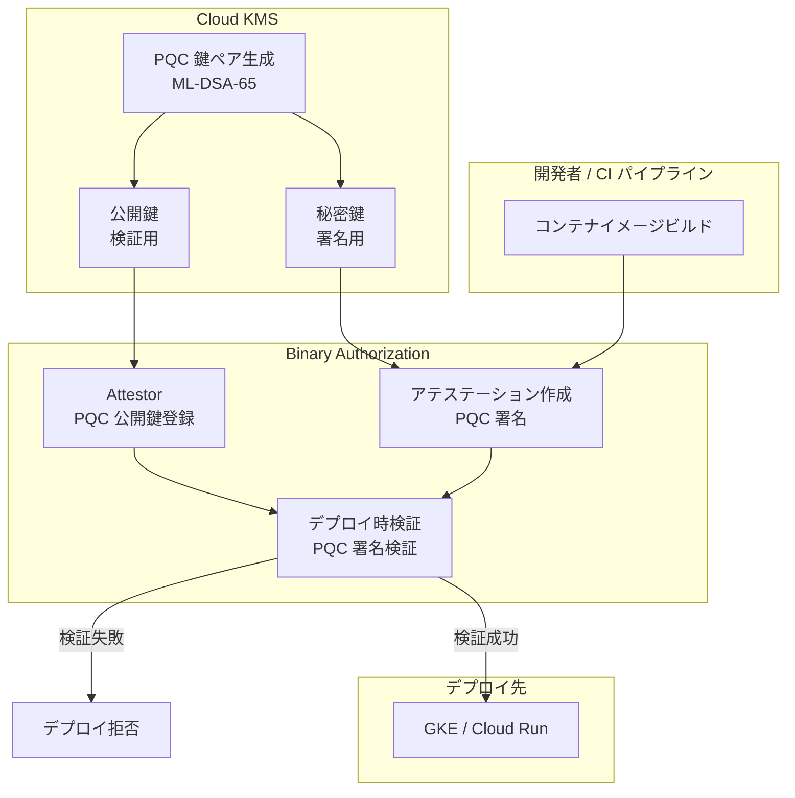

# Binary Authorization: ポスト量子暗号 (PQC) 鍵のサポート

**リリース日**: 2026-07-21

**サービス**: Binary Authorization

**機能**: Post-Quantum Cryptography (PQC) Keys

**ステータス**: Feature

📊 [このアップデートのインフォグラフィックを見る](https://takech9203.github.io/google-cloud-news-summary/20260721-binary-authorization-pqc-keys.html)

## 概要

Google Cloud の Binary Authorization において、ポスト量子暗号 (Post-Quantum Cryptography: PQC) アルゴリズムを使用した鍵のサポートが追加されました。これにより、将来の量子コンピュータによる攻撃に対して長期的なセキュリティを確保しつつ、コンテナイメージのデプロイ検証を行うことが可能になります。

サポートされるアルゴリズムには ML-DSA-65 (Dilithium3) が含まれており、これは NIST (米国国立標準技術研究所) が標準化した、古典コンピュータと量子コンピュータの双方からの攻撃に耐性を持つアルゴリズムです。PQC 鍵は Cloud Key Management Service (Cloud KMS) で管理することが推奨されており、既存の Binary Authorization ワークフローにシームレスに統合できます。

このアップデートは、ソフトウェアサプライチェーンのセキュリティを重視し、「Harvest Now, Decrypt Later (HNDL)」攻撃への対策が必要な組織に特に有用です。

**アップデート前の課題**

- Binary Authorization のアテステーション署名には ECDSA や RSA などの古典的な暗号アルゴリズムのみが使用可能だった
- 将来の量子コンピュータによる署名偽造リスクに対する直接的な防御手段がなかった
- 長期的なセキュリティを確保するために、量子耐性のある署名スキームへの移行準備ができなかった

**アップデート後の改善**

- ML-DSA-65 (Dilithium3) などの PQC 署名アルゴリズムを使用してアテステーションの作成・検証が可能になった
- Cloud KMS との統合により、PQC 鍵の安全な生成・管理が容易に行える
- 古典コンピュータと量子コンピュータの両方からの攻撃に耐性のある長期的なサプライチェーンセキュリティが実現できる

## アーキテクチャ図



Binary Authorization における PQC 鍵を使用したアテステーションの署名・検証フローを示しています。Cloud KMS で生成された ML-DSA-65 鍵ペアの秘密鍵でアテステーションに署名し、Attestor に登録された公開鍵でデプロイ時に検証を行います。

## サービスアップデートの詳細

### 主要機能

1. **PQC 署名アルゴリズムのサポート**
   - ML-DSA-65 (Dilithium3) を使用したアテステーションの署名と検証が可能
   - NIST FIPS-204 に準拠した標準的なポスト量子署名アルゴリズム
   - NIST セキュリティカテゴリ 3 に分類される高いセキュリティレベル

2. **Cloud KMS との統合**
   - PQC 鍵ペアを Cloud KMS で安全に生成・管理
   - 既存の Cloud KMS のキーリング・鍵管理フローをそのまま活用可能
   - ソフトウェア保護レベルでの鍵保管をサポート

3. **既存ワークフローとの互換性**
   - 既存の Attestor 作成・管理コマンドとの統合
   - GKE、Cloud Run、Cloud Service Mesh、Distributed Cloud でのデプロイ検証に対応
   - PKIX 鍵と PQC 鍵のいずれか一方を選択して使用可能

## 技術仕様

### サポートされる PQC アルゴリズム

| アルゴリズム | SDK 名 | API 名 | 秘密鍵サイズ | 公開鍵サイズ | 署名サイズ | NIST セキュリティカテゴリ |
|---|---|---|---|---|---|---|
| ML-DSA-65 | pq-sign-ml-dsa-65 | PQ_SIGN_ML_DSA_65 | 4,032 bytes | 1,952 bytes | 3,309 bytes | 3 |
| ML-DSA-44 | pq-sign-ml-dsa-44 | PQ_SIGN_ML_DSA_44 | 2,560 bytes | 1,312 bytes | 2,420 bytes | 2 |
| ML-DSA-87 | pq-sign-ml-dsa-87 | PQ_SIGN_ML_DSA_87 | 4,896 bytes | 2,592 bytes | 4,627 bytes | 5 |
| SLH-DSA-SHA2-128s | pq-sign-slh-dsa-sha2-128s | PQ_SIGN_SLH_DSA_SHA2_128S | 64 bytes | 32 bytes | 7,856 bytes | 1 |

### Binary Authorization SignatureAlgorithm

Binary Authorization の REST API では、`ML_DSA_65` が `SignatureAlgorithm` enum に追加されています。

```json
{
  "userOwnedGrafeasNote": {
    "noteReference": "projects/PROJECT_ID/notes/NOTE_ID",
    "publicKeys": [
      {
        "id": "KEY_ID",
        "pkixPublicKey": {
          "publicKeyPem": "PEM_ENCODED_PUBLIC_KEY",
          "signatureAlgorithm": "ML_DSA_65"
        }
      }
    ]
  }
}
```

## 設定方法

### 前提条件

1. Binary Authorization が有効化されたプロジェクト
2. Cloud KMS API が有効化されていること
3. 適切な IAM 権限 (Cloud KMS 管理者、Binary Authorization 管理者)

### 手順

#### ステップ 1: 環境変数の設定

```bash
# プロジェクトと鍵の設定
KMS_KEY_PROJECT_ID=my-project-id
KMS_KEY_LOCATION=global
KMS_KEYRING_NAME=my-binauthz-pqc-keyring
KMS_KEY_NAME=my-pqc-attestor-key
KMS_KEY_VERSION=1
KMS_KEY_PURPOSE=asymmetric-signing
KMS_KEY_ALGORITHM=ml-dsa-65
KMS_PROTECTION_LEVEL=software
```

#### ステップ 2: キーリングの作成

```bash
gcloud kms keyrings create ${KMS_KEYRING_NAME} \
    --location ${KMS_KEY_LOCATION}
```

#### ステップ 3: PQC 鍵の作成

```bash
gcloud kms keys create ${KMS_KEY_NAME} \
    --location ${KMS_KEY_LOCATION} \
    --keyring ${KMS_KEYRING_NAME} \
    --purpose ${KMS_KEY_PURPOSE} \
    --default-algorithm ${KMS_KEY_ALGORITHM} \
    --protection-level ${KMS_PROTECTION_LEVEL}
```

#### ステップ 4: Attestor の作成と公開鍵の登録

```bash
# Attestor の作成
ATTESTOR_NAME=pqc-attestor
NOTE_ID=pqc-attestation-note

gcloud container binauthz attestors create ${ATTESTOR_NAME} \
    --attestation-authority-note=${NOTE_ID} \
    --attestation-authority-note-project=${KMS_KEY_PROJECT_ID}

# PQC 公開鍵を Attestor に追加
gcloud container binauthz attestors public-keys add \
    --attestor=${ATTESTOR_NAME} \
    --keyversion-project=${KMS_KEY_PROJECT_ID} \
    --keyversion-location=${KMS_KEY_LOCATION} \
    --keyversion-keyring=${KMS_KEYRING_NAME} \
    --keyversion-key=${KMS_KEY_NAME} \
    --keyversion=${KMS_KEY_VERSION}
```

#### ステップ 5: Attestor の確認

```bash
gcloud container binauthz attestors list \
    --project=${KMS_KEY_PROJECT_ID}
```

## メリット

### ビジネス面

- **長期的なセキュリティ投資の保護**: 量子コンピュータの実用化に先駆けて対策を講じることで、将来のセキュリティリスクを低減し、コンプライアンス要件の変化に先行して対応できる
- **規制対応の先取り**: NIST 標準に準拠した PQC アルゴリズムを採用することで、将来の量子暗号に関する規制要件にいち早く対応可能
- **サプライチェーンの信頼性向上**: ソフトウェアサプライチェーン全体の耐量子セキュリティを確保し、顧客やパートナーへの信頼性を高める

### 技術面

- **暗号アジリティの実現**: PQC アルゴリズムと従来の PKIX アルゴリズムを選択的に使用可能で、段階的な移行が容易
- **Cloud KMS によるシームレスな鍵管理**: 既存の KMS インフラを活用し、PQC 鍵の安全な生成・保管・ローテーションが可能
- **NIST 標準準拠**: FIPS-204 に準拠した ML-DSA アルゴリズムにより、業界標準の量子耐性セキュリティを実現

## デメリット・制約事項

### 制限事項

- PQC 署名のサイズは従来の ECDSA 署名 (64 bytes) と比較して大幅に大きい (ML-DSA-65 で 3,309 bytes)。これによりストレージとネットワーク帯域への影響がある
- ハイブリッド署名 (PQC + 古典的署名の組み合わせ) は現時点で未サポート。NIST によるハイブリッド化の標準が策定されていないため、スタンドアロン実装のみ対応
- PQC アルゴリズムは比較的新しいため、長期的な暗号解析による安全性評価が継続中

### 考慮すべき点

- 既存の PKIX 鍵を使用したアテステーションワークフローからの移行には、Attestor の再作成または新規作成が必要
- PQC 署名の検証は古典的なアルゴリズムと比較して計算コストが高い場合があり、大量のデプロイが発生する環境ではレイテンシへの影響を検証する必要がある
- 鍵サイズと署名サイズが大きいため、ネットワーク帯域幅や Artifact Analysis のストレージコストに影響する可能性がある

## ユースケース

### ユースケース 1: 金融機関の長期的なサプライチェーンセキュリティ

**シナリオ**: 金融機関が規制要件に先行して対応するため、コンテナデプロイメントパイプラインに量子耐性のある署名を導入する。

**実装例**:
```bash
# CI/CD パイプラインでの PQC アテステーション作成
gcloud container binauthz attestations sign-and-create \
    --project=${PROJECT_ID} \
    --artifact-url="us-docker.pkg.dev/${PROJECT_ID}/repo/image@sha256:abcd1234" \
    --attestor=${ATTESTOR_NAME} \
    --attestor-project=${PROJECT_ID} \
    --keyversion-project=${KMS_KEY_PROJECT_ID} \
    --keyversion-location=${KMS_KEY_LOCATION} \
    --keyversion-keyring=${KMS_KEYRING_NAME} \
    --keyversion-key=${KMS_KEY_NAME} \
    --keyversion=${KMS_KEY_VERSION}
```

**効果**: 量子コンピュータが実用化された後も、過去に署名されたアテステーションの偽造が困難な状態を維持でき、長期的な監査証跡の信頼性を確保できる。

### ユースケース 2: 政府・防衛系システムの高セキュリティ要件対応

**シナリオ**: 国家安全保障に関わるシステムにおいて、CNSA 2.0 (Commercial National Security Algorithm Suite) のガイダンスに基づき、量子耐性のある暗号への早期移行が求められるケース。

**効果**: NIST 標準化された PQC アルゴリズムを使用することで、政府系のコンプライアンス要件を満たしつつ、コンテナデプロイメントのセキュリティを将来にわたって保証できる。

### ユースケース 3: ヘルスケア・医療データの長期保護

**シナリオ**: 医療記録を処理するマイクロサービスのデプロイにおいて、数十年単位でのデータ保護が求められる環境で PQC 署名を採用する。

**効果**: 医療データの処理に関わるコンテナの出所と整合性を長期的に証明可能な形で保証し、将来の量子攻撃に対する耐性を確保する。

## 料金

Binary Authorization の PQC 鍵サポートは、既存の Binary Authorization および Cloud KMS の料金体系に従います。

### 料金例

| リソース | 料金 (概算) |
|----------|-------------|
| Binary Authorization (GKE クラスタあたり) | 月額無料枠あり |
| Cloud KMS 鍵バージョン (アクティブ) | $0.06/月 |
| Cloud KMS 暗号化オペレーション (署名/検証) | $0.03/10,000 オペレーション |

## 利用可能リージョン

Cloud KMS の PQC 鍵は全てのリージョンで利用可能です。Binary Authorization 自体はグローバルサービスとして動作し、GKE、Cloud Run などの対応プラットフォームがデプロイされている全リージョンで PQC ベースの検証が利用できます。

## 関連サービス・機能

- **Cloud Key Management Service (Cloud KMS)**: PQC 鍵ペアの生成・管理・保管を担当。ML-DSA、SLH-DSA アルゴリズムをサポート
- **Artifact Analysis**: アテステーションのメタデータを保管するノートとオカレンスを管理
- **Google Kubernetes Engine (GKE)**: Binary Authorization ポリシーに基づくデプロイ時検証の実行環境
- **Cloud Run**: Binary Authorization による serverless コンテナのデプロイ制御
- **Cloud Build**: CI/CD パイプラインでのアテステーション自動作成との連携
- **Cloud Service Mesh**: サービスメッシュレベルでの Binary Authorization 検証

## 参考リンク

- 📊 [インフォグラフィック](https://takech9203.github.io/google-cloud-news-summary/20260721-binary-authorization-pqc-keys.html)
- [公式リリースノート](https://cloud.google.com/release-notes#July_21_2026)
- [PQC 鍵の作成ドキュメント](https://cloud.google.com/binary-authorization/docs/creating-attestors-cli#pqc-keys)
- [Cloud KMS アルゴリズム一覧](https://cloud.google.com/kms/docs/algorithms)
- [Binary Authorization 概要](https://cloud.google.com/binary-authorization/docs/overview)
- [NIST FIPS-204 (ML-DSA)](https://csrc.nist.gov/pubs/fips/204/final)

## まとめ

Binary Authorization への PQC 鍵サポートの追加は、量子コンピュータの脅威に対してソフトウェアサプライチェーンセキュリティを将来にわたって保護するための重要なアップデートです。ML-DSA-65 (Dilithium3) を中心とした NIST 標準準拠のアルゴリズムにより、古典・量子双方の攻撃に耐性のあるアテステーション署名・検証が可能になりました。長期的なセキュリティ計画を持つ組織は、新規の Attestor を PQC 鍵で作成することから段階的な移行を開始することを推奨します。

---

**タグ**: Binary Authorization, PQC, Post-Quantum Cryptography, ML-DSA-65, Dilithium3, Security
