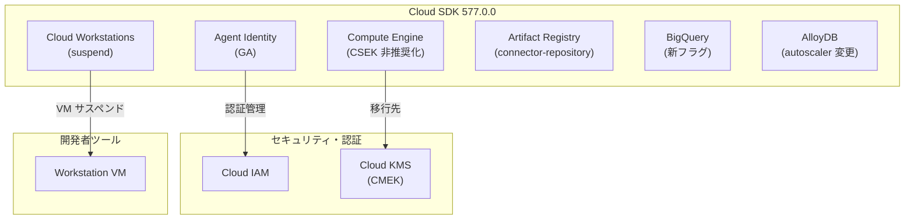

# Cloud SDK: バージョン 577.0.0 リリース

**リリース日**: 2026-07-21

**サービス**: Cloud SDK

**機能**: Cloud SDK 577.0.0 - Agent Identity GA、Compute Engine CSEK 非推奨化、Cloud Workstations suspend 他

**ステータス**: Change (GA / Beta / Alpha 混在)

[このアップデートのインフォグラフィックを見る](https://takech9203.github.io/google-cloud-news-summary/20260721-cloud-sdk-577.html)

## 概要

Cloud SDK 577.0.0 がリリースされ、15 以上のサービスにわたる広範なアップデートが含まれている。今回のリリースで特に注目すべきは、Agent Identity コマンド群の GA 昇格、Compute Engine における CSEK (Customer-Supplied Encryption Keys) フラグの非推奨化、Cloud Workstations への suspend コマンドの追加である。

Agent Identity は AI エージェントの認証・認可を管理するサービスであり、GA 昇格により本番環境での利用が正式にサポートされた。Compute Engine の CSEK 非推奨化は、2027 年 7 月 20 日の完全削除に向けた重要なマイルストーンであり、Cloud KMS の CMEK への移行が必要となる。Cloud Workstations の suspend コマンドは、ワークステーションの VM 割り当てを維持したままコストを削減する新しいオプションを提供する。

**アップデート前の課題**

- Agent Identity の auth-providers と access-summaries は Beta/Alpha ステータスのため、本番環境での利用に SLA 保証がなかった
- CSEK を使用したディスク暗号化ではキーのローテーションや監査機能が制限されていた
- Cloud Workstations では stop (VM 割り当て解除) か稼働継続の二択しかなく、再起動時に新規 VM のプロビジョニングが必要だった

**アップデート後の改善**

- Agent Identity コマンドが GA となり、SLA に基づいた本番運用が可能になった
- CSEK の非推奨化により、Cloud KMS を使用した CMEK への移行が公式に推奨され、キーローテーション・監査証跡・Hyperdisk サポートが利用可能になった
- Cloud Workstations の suspend により、VM 割り当てを維持したまま一時停止でき、resume 時の起動が高速化された

## アーキテクチャ図



Cloud SDK 577.0.0 で更新された主要コンポーネント領域と、セキュリティ/認証基盤との関係を示す。Agent Identity は IAM と連携し、Compute Engine の暗号化は Cloud KMS への移行が推奨される。

## サービスアップデートの詳細

### 主要機能

1. **Agent Identity - GA 昇格**
   - `gcloud agent-identity auth-providers` コマンドグループが GA に昇格
   - `gcloud agent-identity access-summaries` コマンドグループが GA に昇格
   - AI エージェントの認証プロバイダー管理 (作成、削除、有効化、無効化、IAM ポリシー管理) が本番利用可能に
   - アクセスサマリーによるエージェントのアクセス権限の可視化が GA サポート
   - API バージョン: `agentidentity/v1`

2. **Compute Engine - CSEK フラグの非推奨化**
   - Customer-Supplied Encryption Keys (CSEK) 関連の gcloud フラグが非推奨に
   - 2026 年 7 月 20 日以降、CSEK による新規リソースの暗号化が不可
   - 2027 年 7 月 20 日に CSEK が Compute Engine から完全削除予定
   - 対象リソース: Persistent Disks、Images、Machine images、Standard/Archive snapshots、Instant snapshots
   - 代替: Cloud KMS による Customer-Managed Encryption Keys (CMEK) への移行

3. **Cloud Workstations - suspend コマンド追加**
   - `gcloud beta workstations suspend` コマンドが追加
   - `gcloud alpha workstations suspend` コマンドが追加
   - stop との違い: suspend は VM の割り当てを維持したまま一時停止する
   - stop は VM の割り当てを解除するため、再起動時に新規プロビジョニングが必要
   - `--async` フラグによる非同期実行をサポート

4. **AlloyDB - Autoscaler 動作変更**
   - `--no-enable-autoscaler` フラグの動作を修正
   - autoscaler スケジュールフラグが一度に 1 つのみ指定可能に制限

5. **Artifact Registry - connector-repository モード追加**
   - 新しいリポジトリモード `connector-repository` が追加
   - 既存の standard、remote、virtual モードに加わる第 4 のモード

6. **Compute Engine - その他のアップデート**
   - `test-iam-permissions` が machine-images と health-sources に追加
   - `regex_rewrite` が Beta に昇格
   - router named-set コマンドが GA に昇格
   - HTTP ヘッダーのロギングフラグが追加
   - `--local-ssd-encryption-mode` フラグが追加

## 技術仕様

### CSEK から CMEK への移行概要

| 項目 | CSEK (非推奨) | CMEK (推奨) |
|------|---------------|-------------|
| キー管理 | ユーザーが直接管理 | Cloud KMS で管理 |
| キーローテーション | 手動のみ | 自動ローテーション対応 |
| 監査証跡 | なし | Cloud Audit Logs 統合 |
| Hyperdisk サポート | なし | あり |
| 新規暗号化 | 2026-07-20 以降不可 | 利用可能 |
| 完全削除予定 | 2027-07-20 | - |

### Cloud Workstations ライフサイクル管理

| 操作 | コマンド | VM 割り当て | 再開速度 | コスト |
|------|---------|------------|---------|--------|
| 停止 (stop) | `gcloud workstations stop` | 解除 | 遅い (新規プロビジョニング) | 最小 |
| サスペンド (suspend) | `gcloud beta workstations suspend` | 維持 | 速い | 中程度 |
| 稼働中 | - | 維持 | - | 最大 |

### Agent Identity コマンド構造

```
gcloud agent-identity
  |-- auth-providers          (GA)
  |     |-- authorizations
  |     |-- create / delete / describe / list
  |     |-- enable / disable
  |     |-- add-iam-policy-binding / get-iam-policy / set-iam-policy
  |     |-- remove-iam-policy-binding / test-iam-permissions
  |-- access-summaries        (GA)
```

## 設定方法

### CSEK から CMEK への移行手順

#### ステップ 1: Cloud KMS キーリングとキーの作成

```bash
# キーリングの作成
gcloud kms keyrings create my-key-ring \
  --location=us-central1

# 暗号化キーの作成
gcloud kms keys create my-cmek-key \
  --keyring=my-key-ring \
  --location=us-central1 \
  --purpose=encryption
```

#### ステップ 2: CSEK 暗号化ディスクからスナップショットを作成し CMEK ディスクに変換

```bash
# CSEK 暗号化ディスクのスナップショット作成
gcloud compute disks snapshot my-csek-disk \
  --zone=us-central1-a \
  --csek-key-file=my-csek-key.json \
  --snapshot-names=my-csek-snapshot

# CMEK 暗号化した新規ディスクを作成
gcloud compute disks create my-cmek-disk \
  --zone=us-central1-a \
  --source-snapshot=my-csek-snapshot \
  --kms-key=projects/my-project/locations/us-central1/keyRings/my-key-ring/cryptoKeys/my-cmek-key
```

### Cloud Workstations suspend の使用

```bash
# ワークステーションのサスペンド
gcloud beta workstations suspend my-workstation \
  --cluster=my-cluster \
  --config=my-config \
  --region=us-central1

# 非同期実行
gcloud beta workstations suspend my-workstation \
  --cluster=my-cluster \
  --config=my-config \
  --region=us-central1 \
  --async
```

### Agent Identity auth-providers の利用

```bash
# 認証プロバイダーの作成
gcloud agent-identity auth-providers create my-auth-provider \
  --location=us-central1 \
  --project=my-project

# 認証プロバイダーの一覧表示
gcloud agent-identity auth-providers list \
  --location=us-central1 \
  --project=my-project

# アクセスサマリーの取得
gcloud agent-identity access-summaries describe \
  --location=us-central1 \
  --project=my-project
```

## メリット

### ビジネス面

- **Agent Identity GA によるエージェント運用の信頼性向上**: SLA に基づく本番環境での AI エージェント認証管理が可能になり、エンタープライズ導入の障壁が低下
- **Cloud Workstations suspend によるコスト最適化**: 開発者のワークステーションを完全に停止せず一時停止することで、再開時間の短縮とコスト削減を両立
- **CMEK 移行によるコンプライアンス強化**: Cloud KMS 統合により、キー管理の監査証跡が自動的に記録され、コンプライアンス要件への対応が容易に

### 技術面

- **CMEK の優位性**: キーの自動ローテーション、Cloud Audit Logs との統合、Hyperdisk ボリュームのサポート
- **Workstations suspend の高速再開**: VM 割り当てを維持するため、stop からの再起動と比較して大幅に起動時間が短縮
- **Agent Identity の IAM 統合**: 標準的な IAM ポリシーバインディングにより、既存の権限管理ワークフローと統合可能

## デメリット・制約事項

### 制限事項

- CSEK から CMEK への直接的なキー置き換えは不可。リソースのコピーを作成して CMEK で暗号化する必要がある
- Cloud Workstations の suspend は現時点で Beta/Alpha のみ。GA リリースまで本番環境での利用は推奨されない
- AlloyDB の autoscaler スケジュールフラグが一度に 1 つのみに制限され、複数スケジュールの同時設定にはコマンドの繰り返し実行が必要

### 考慮すべき点

- CSEK 暗号化リソースの移行は 2027 年 7 月 20 日までに完了する必要がある。計画的な移行スケジュールの策定を推奨
- Workstations の suspend は VM 割り当てを維持するため、stop と比較してコストが高い。利用パターンに応じた使い分けが必要
- Agent Identity は `agentidentity/v1` API を使用。既存の Beta/Alpha API を使用しているワークロードは GA エンドポイントへの切り替えを推奨

## ユースケース

### ユースケース 1: AI エージェントの本番認証管理

**シナリオ**: 企業が複数の AI エージェントを本番環境にデプロイし、各エージェントに適切な認証と権限を付与する必要がある。

**実装例**:
```bash
# エージェント用の認証プロバイダーを作成
gcloud agent-identity auth-providers create customer-service-agent \
  --location=us-central1 \
  --project=my-production-project

# IAM ポリシーを設定
gcloud agent-identity auth-providers add-iam-policy-binding customer-service-agent \
  --location=us-central1 \
  --member="serviceAccount:agent-sa@my-project.iam.gserviceaccount.com" \
  --role="roles/agentidentity.viewer"
```

**効果**: SLA に裏打ちされた信頼性のある認証基盤上で AI エージェントを運用でき、アクセスサマリーによる権限の可視化も可能。

### ユースケース 2: 開発チームのワークステーション コスト最適化

**シナリオ**: 開発チームが昼休みや会議中にワークステーションを一時停止し、戻ったときに素早く作業を再開したい。

**実装例**:
```bash
# 昼休み前にサスペンド
gcloud beta workstations suspend dev-workstation \
  --cluster=dev-cluster \
  --config=standard-config \
  --region=us-central1
```

**効果**: stop と比較して再開が高速になり、開発者の生産性を維持しつつ不使用時のコストを削減。

## 関連サービス・機能

- **Cloud IAM**: Agent Identity の認証プロバイダーは IAM ポリシーと統合され、標準的な権限管理が可能
- **Cloud KMS**: CSEK 非推奨化に伴い、CMEK (Cloud KMS 管理キー) への移行先として推奨
- **Cloud Audit Logs**: CMEK のキー操作は自動的に監査ログに記録される
- **AlloyDB**: autoscaler のスケジュールベースポリシーと CPU ベースポリシーの組み合わせにより、柔軟なスケーリングが可能
- **Cloud Firestore Emulator**: v1.22.0 で Pipelines API の DML サポート、複合インデックスモデリングが追加

## 参考リンク

- [インフォグラフィック](https://takech9203.github.io/google-cloud-news-summary/20260721-cloud-sdk-577.html)
- [公式リリースノート](https://docs.cloud.google.com/release-notes#July_21_2026)
- [Cloud SDK リリースノート一覧](https://docs.cloud.google.com/sdk/docs/release-notes)
- [CSEK 非推奨化ドキュメント](https://docs.cloud.google.com/compute/docs/deprecations/csek-deprecation-in-compute-engine)
- [Cloud Workstations suspend コマンドリファレンス](https://docs.cloud.google.com/sdk/gcloud/reference/beta/workstations/suspend)
- [Agent Identity gcloud リファレンス](https://docs.cloud.google.com/sdk/gcloud/reference/agent-identity)
- [CMEK によるリソース保護](https://docs.cloud.google.com/compute/docs/disks/customer-managed-encryption)
- [AlloyDB Read Pool Autoscaling](https://docs.cloud.google.com/alloydb/docs/instance-read-pool-scale)

## まとめ

Cloud SDK 577.0.0 は、セキュリティ (CSEK 非推奨化・CMEK 推奨)、AI エージェント管理 (Agent Identity GA)、開発者体験 (Workstations suspend) の 3 軸で重要なアップデートを含む。特に CSEK を使用している環境では、2027 年 7 月の完全削除までに CMEK への移行計画を策定し、段階的な移行テストを開始することを推奨する。

---

**タグ**: #CloudSDK #AgentIdentity #ComputeEngine #CSEK #CMEK #CloudKMS #CloudWorkstations #AlloyDB #ArtifactRegistry #BigQuery #GKE #SecurityUpdate
