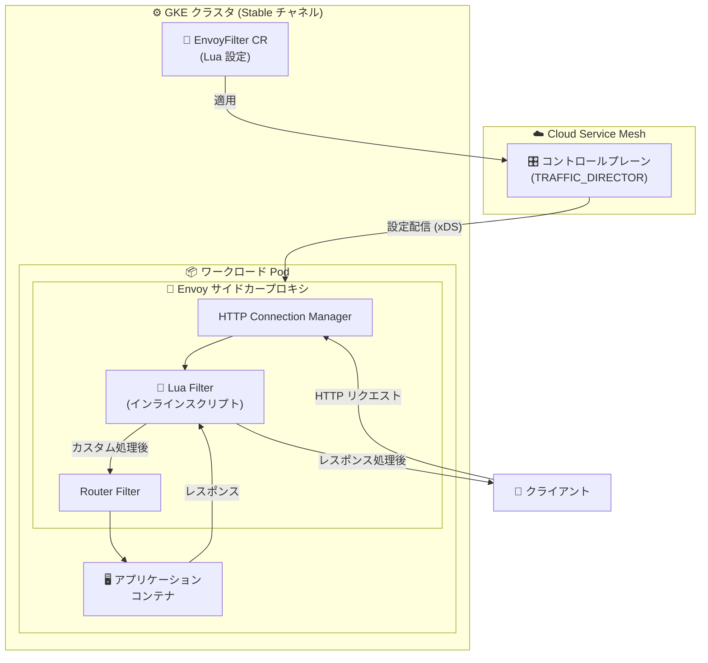

# Cloud Service Mesh: Envoy Lua Filter が Stable チャネルで Preview 利用可能に

**リリース日**: 2026-07-21

**サービス**: Cloud Service Mesh

**機能**: Envoy Lua Filter (Stable リリースチャネル対応)

**ステータス**: Preview (Stable リリースチャネル)

📊 [このアップデートのインフォグラフィックを見る](https://takech9203.github.io/google-cloud-news-summary/20260721-cloud-service-mesh-envoy-lua-filter.html)

## 概要

Cloud Service Mesh の Envoy Lua Filter (`type.googleapis.com/envoy.extensions.filters.http.lua.v3.Lua`) が、Stable リリースチャネルにおいて Preview 機能として利用可能になった。これまで Rapid チャネルのみで提供されていた本機能が、最も安定性を重視する Stable チャネルにまで展開されたことで、本番環境に近い安定したチャネルを利用するユーザーも Lua スクリプトによるデータプレーン拡張を評価・導入できるようになる。

Envoy Lua Filter は、Cloud Service Mesh のデータプレーン拡張 (Data Plane Extensibility) 機能の一部として提供される。EnvoyFilter API を通じて、Envoy プロキシの HTTP フィルターチェーンに Lua スクリプトを挿入し、リクエストおよびレスポンスの処理をカスタマイズできる。Wasm フィルターのようなコンパイルやビルドパイプラインが不要で、インラインスクリプトとして直接記述できるため、迅速なプロトタイピングやシンプルなトラフィック操作に適している。

**アップデート前の課題**

- Envoy Lua Filter は Rapid チャネルでのみ Preview 提供されており、Stable チャネルを使用する本番環境では利用できなかった
- 安定性を重視するチームは、Lua Filter を評価するために Rapid チャネルへの移行が必要だった
- Stable チャネルでデータプレーンのカスタムロジックを実現するには、他の限定された拡張 (LocalRateLimit、GrpcWeb、Compressor) に頼る必要があった

**アップデート後の改善**

- Stable リリースチャネルでも Envoy Lua Filter が Preview として利用可能になり、安定したチャネルで Lua スクリプトの評価・検証が可能になった
- すべてのリリースチャネル (Rapid、Regular、Stable) で統一的に Lua Filter を活用できる
- 本番環境に近い安定した環境で、ヘッダー操作やメタデータ設定などのカスタムロジックをテスト可能になった

## アーキテクチャ図



Envoy Lua Filter は HTTP フィルターチェーン内で動作し、Router フィルターの前に挿入される。クライアントからのリクエストとアプリケーションからのレスポンスの両方を Lua スクリプトで処理できる。EnvoyFilter カスタムリソースで定義した設定は、コントロールプレーン (TRAFFIC_DIRECTOR) を経由して xDS プロトコルで Envoy サイドカーに配信される。

## サービスアップデートの詳細

### 主要機能

1. **インライン Lua スクリプト実行**
   - `default_source_code.inline_string` フィールドで Lua スクリプトを直接記述
   - リクエスト処理用の `envoy_on_request(request_handle)` コールバック
   - レスポンス処理用の `envoy_on_response(response_handle)` コールバック
   - コンパイル不要で、EnvoyFilter リソースの適用のみでデプロイ可能

2. **ヘッダーおよびメタデータ操作**
   - リクエスト/レスポンスヘッダーの読み取り・追加・変更・削除
   - ストリーム情報 (`streamInfo`) を通じた動的メタデータの設定
   - 他のフィルター (例: Apigee データキャプチャ) との連携に活用可能

3. **Stable チャネルでの利用可能性**
   - GKE クラスタの Stable チャネルに対応する Cloud Service Mesh Stable チャネルで利用可能
   - Rapid、Regular に続き、すべてのリリースチャネルで統一的に Preview として提供

## 技術仕様

### サポートされるフィールド

| フィールド | Rapid | Regular | Stable |
|------|------|------|------|
| `stat_prefix` | 対応 | 対応 | 対応 |
| `default_source_code.inline_string` | 対応 | 対応 | 対応 |

### スクリプトのサイズ・数量制限

| 項目 | 制限値 |
|------|------|
| 個別スクリプトサイズ | 50KB 以下 |
| クラスタ内の全 Lua スクリプト合計サイズ | 100KB 以下 |
| クラスタ内の Lua EnvoyFilter configPatches 数 | 最大 10 |

### サポートされない Lua 機能

| カテゴリ | サポートされない機能 |
|------|------|
| Envoy ラッパー | `httpCall`, `filterContext` |
| Lua 標準ライブラリ (Basic) | `collectgarbage`, `dofile`, `getmetatable`, `loadfile`, `rawset`, `setfenv`, `setmetatable` |
| Lua 標準ライブラリ (Modules) | `module` |
| OS パッケージ | `execute`, `remove`, `rename`, `setlocale` |
| I/O・デバッグ | `io`, `debug` ライブラリ全体 |
| LuaJIT 拡張 | `ffi`, `jit` |

## 設定方法

### 前提条件

1. Cloud Service Mesh がプロビジョニングされた GKE クラスタ (Stable チャネル)
2. TRAFFIC_DIRECTOR コントロールプレーン実装の使用
3. サイドカーインジェクションが有効な Namespace

### 手順

#### ステップ 1: EnvoyFilter リソースの作成

```yaml
apiVersion: networking.istio.io/v1alpha3
kind: EnvoyFilter
metadata:
  name: custom-lua-filter
  namespace: my-namespace
spec:
  workloadSelector:
    labels:
      app: my-service
  configPatches:
  - applyTo: HTTP_FILTER
    match:
      context: SIDECAR_INBOUND
      listener:
        filterChain:
          filter:
            name: "envoy.filters.network.http_connection_manager"
            subFilter:
              name: "envoy.filters.http.router"
    patch:
      operation: INSERT_BEFORE
      value:
        name: envoy.filters.http.lua
        typed_config:
          "@type": type.googleapis.com/udpa.type.v1.TypedStruct
          type_url: type.googleapis.com/envoy.extensions.filters.http.lua.v3.Lua
          value:
            stat_prefix: my_lua_filter
            default_source_code:
              inline_string: |
                function envoy_on_request(request_handle)
                  request_handle:headers():add("x-custom-header", "processed")
                end
                function envoy_on_response(response_handle)
                  response_handle:headers():add("x-response-info", "filtered")
                end
```

EnvoyFilter リソースを `INSERT_BEFORE` オペレーションで Router フィルターの前に挿入する。

#### ステップ 2: リソースの適用と確認

```bash
# EnvoyFilter の適用
kubectl apply -f custom-lua-filter.yaml

# ステータスの確認
kubectl get envoyfilter -n my-namespace custom-lua-filter -o yaml
```

ステータスが `Accepted` であることを確認する。

## メリット

### ビジネス面

- **迅速なプロトタイピング**: コンパイル不要でカスタムロジックを試行錯誤でき、開発サイクルを短縮
- **運用コストの削減**: Wasm フィルターのビルドパイプライン構築が不要で、シンプルな変換処理を低コストで実現

### 技術面

- **柔軟なトラフィック操作**: 標準の Istio API では対応できないカスタムヘッダー操作やメタデータ設定が可能
- **全チャネル統一対応**: Stable チャネルでの利用可能化により、段階的なロールアウト戦略 (Rapid → Regular → Stable) に沿ったテストが可能
- **軽量な拡張手段**: スクリプト記述のみでデータプレーンのカスタマイズを実現でき、インフラ変更が最小限

## デメリット・制約事項

### 制限事項

- Preview ステータスのため、「Pre-GA Offerings Terms」が適用され、本番環境での利用は限定的サポート
- `httpCall` (外部 HTTP 呼び出し) がサポートされないため、Lua スクリプトからの外部サービス呼び出し不可
- I/O、デバッグライブラリ、LuaJIT 拡張 (ffi/jit) が利用不可
- 個別スクリプト 50KB、クラスタ合計 100KB、configPatches 最大 10 のサイズ制限あり

### 考慮すべき点

- 複雑な Lua スクリプトはパフォーマンスに影響する可能性があるため、リソース使用量の事前テストが必要
- サポート範囲はユーザー提供の設定をプロキシに伝播するところまでであり、スクリプト自体の正確性は対象外
- サポートされない機能を使用するとEnvoyFilter がリジェクトされるため、事前の動作確認が重要

## ユースケース

### ユースケース 1: カスタムリクエストヘッダーの付与

**シナリオ**: マイクロサービス間の通信で、リクエスト元の識別や追跡のためにカスタムヘッダーを動的に付与したい。

**実装例**:
```lua
function envoy_on_request(request_handle)
  local path = request_handle:headers():get(":path")
  if string.match(path, "^/api/v2/") then
    request_handle:headers():add("x-api-version", "v2")
  end
end
```

**効果**: コードの変更なしに、サービスメッシュ層でリクエストのバージョン識別やルーティング補助情報を付与できる。

### ユースケース 2: 動的メタデータ設定による監視連携

**シナリオ**: 特定のリクエストパターンに基づいてメタデータを設定し、下流のフィルターや監視システムと連携したい。

**実装例**:
```lua
function envoy_on_request(request_handle)
  local metadata = request_handle:streamInfo():dynamicMetadata()
  local user_agent = request_handle:headers():get("user-agent") or "unknown"
  metadata:set("envoy.filters.http.lua", "client_type", user_agent)
end
```

**効果**: リクエストの属性に基づいた動的なメタデータを設定し、Envoy のアクセスログや外部監視システムでの分析に活用できる。

## 料金

Cloud Service Mesh の料金体系に含まれる。Envoy Lua Filter の利用による追加料金は発生しない。Cloud Service Mesh は GKE Enterprise サブスクリプションに含まれるか、スタンドアロンサービスとして利用可能。

詳細は [Cloud Service Mesh の料金ページ](https://cloud.google.com/service-mesh/pricing) を参照。

## 関連サービス・機能

- **Cloud Service Mesh EnvoyFilter API**: Lua Filter を含むデータプレーン拡張の基盤となる API
- **Envoy LocalRateLimit Filter**: EnvoyFilter API で利用可能な別の拡張 (レート制限)
- **Cloud Service Mesh リリースチャネル**: Rapid → Regular → Stable の段階的リリース管理
- **GKE (Google Kubernetes Engine)**: Cloud Service Mesh のワークロード実行基盤
- **Cloud Monitoring / Cloud Logging**: Lua Filter で設定したメタデータを活用した監視・ログ分析

## 参考リンク

- 📊 [インフォグラフィック](https://takech9203.github.io/google-cloud-news-summary/20260721-cloud-service-mesh-envoy-lua-filter.html)
- [公式リリースノート](https://docs.cloud.google.com/release-notes#July_21_2026)
- [Data plane extensibility with EnvoyFilter](https://docs.cloud.google.com/service-mesh/docs/data-plane-extensibility)
- [リリースチャネルの選択](https://docs.cloud.google.com/service-mesh/legacy/anthos-service-mesh/managed-anthos-service-mesh/select-a-release-channel)
- [Cloud Service Mesh 料金](https://cloud.google.com/service-mesh/pricing)

## まとめ

Envoy Lua Filter が Stable リリースチャネルで Preview として利用可能になったことで、安定性を重視する本番環境に近い環境でも Lua スクリプトによるデータプレーン拡張を評価・検証できるようになった。Wasm フィルターに比べてコンパイル不要で導入しやすく、ヘッダー操作やメタデータ設定などの軽量なカスタムロジックを迅速に実装したいチームにとって有用な選択肢となる。Preview ステータスであるためサポート範囲に留意しつつ、本番適用に向けた検証を開始することを推奨する。

---

**タグ**: #CloudServiceMesh #Envoy #LuaFilter #DataPlaneExtensibility #EnvoyFilter #ServiceMesh #Stable #Preview
