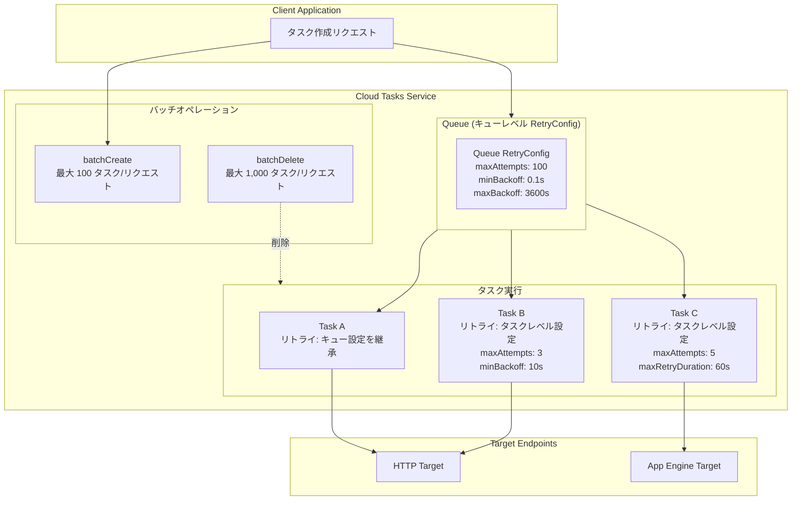

# Cloud Tasks: タスクレベルのリトライパラメータ設定とバッチオペレーション (Preview)

**リリース日**: 2026-07-21

**サービス**: Cloud Tasks

**機能**: タスクレベルのリトライパラメータオーバーライド / バッチタスク作成・削除

**ステータス**: Preview

[このアップデートのインフォグラフィックを見る](https://takech9203.github.io/google-cloud-news-summary/20260721-cloud-tasks-retry-parameters-preview.html)

## 概要

Cloud Tasks に、タスク作成時にリトライパラメータを個別に設定できる機能と、バッチオペレーション (一括作成・一括削除) が Preview として追加された。これまでリトライ設定はキューレベルでのみ可能であり、キュー内の全タスクに同一のリトライポリシーが適用されていた。今回のアップデートにより、タスクごとに異なるリトライ戦略を定義でき、キューレベルの設定をオーバーライドすることが可能になった。

さらに、バッチオペレーションにより、複数タスクの一括作成と一括削除が単一の API リクエストで実行可能となり、大量タスクの管理効率が大幅に向上する。これらの機能は `v2beta3` API エンドポイントで利用可能であり、大規模なタスク処理を行うワークロードや、タスクの重要度に応じてリトライ戦略を変えたいユースケースに特に有効である。

**アップデート前の課題**

- リトライパラメータ (最大リトライ回数、バックオフ間隔など) はキューレベルでのみ設定可能であり、同一キュー内の全タスクに同じリトライポリシーが適用されていた
- 異なるリトライ要件を持つタスクを扱う場合、タスクの種類ごとに別々のキューを作成する必要があった
- タスクの作成・削除は 1 件ずつ API を呼び出す必要があり、大量のタスクを処理する場合に API コール数が増大し、レイテンシとコストが発生していた

**アップデート後の改善**

- タスク作成時にリトライパラメータを個別に指定でき、キューレベルの設定をタスク単位でオーバーライド可能になった
- 最大 100 タスクの一括作成 (`batchCreate`) が単一リクエストで実行可能になった
- 最大 1,000 タスクの一括削除 (`batchDelete`) が単一リクエストで実行可能になった

## アーキテクチャ図



タスクレベルのリトライ設定により、同一キュー内でタスクごとに異なるリトライ戦略を適用できる。バッチオペレーションでは複数タスクの作成・削除を単一 API コールで実行し、オペレーション効率を向上させる。

## サービスアップデートの詳細

### 主要機能

1. **タスクレベルのリトライパラメータ設定**
   - タスク作成時 (`tasks.create`) にリトライ設定を指定可能
   - キューレベルの `RetryConfig` をタスク単位でオーバーライド
   - 設定可能なパラメータ: `maxAttempts`、`maxRetryDuration`、`minBackoff`、`maxBackoff`、`maxDoublings`
   - `projects.locations.queues.tasks.create` メソッド (v2beta3) で利用

2. **バッチタスク作成 (batchCreate)**
   - 複数タスクを 1 回の API リクエストでキューに追加
   - 1 回のバッチで最大 100 タスクを作成可能
   - バッチサイズの上限: 10 MiB
   - 非アトミック操作: 一部のタスク作成が失敗しても他は成功する
   - Long-running operation として返却され、進捗状態を追跡可能

3. **バッチタスク削除 (batchDelete)**
   - 複数タスクを 1 回の API リクエストでキューから削除
   - 1 回のバッチで最大 1,000 タスクを削除可能
   - スケジュール済みまたはディスパッチ済みのタスクのみ削除可能
   - 非アトミック操作: 一部の削除が失敗しても他は成功する

## 技術仕様

### リトライパラメータ

| パラメータ | 説明 | デフォルト値 (キューレベル) |
|------|------|------|
| `maxAttempts` | 最大リトライ回数 (初回含む) | 100 |
| `maxRetryDuration` | リトライ期間の上限 | - |
| `minBackoff` | リトライ間隔の最小値 | 0.100s |
| `maxBackoff` | リトライ間隔の最大値 | 3600s |
| `maxDoublings` | バックオフ間隔が倍増する最大回数 | 16 |

### バッチオペレーションの制限

| 項目 | 制限値 |
|------|------|
| batchCreate 最大タスク数 | 100 タスク/リクエスト |
| batchDelete 最大タスク数 | 1,000 タスク/リクエスト |
| バッチ最大サイズ | 10 MiB |
| バッチオペレーション重複排除ウィンドウ | 7 日間 |
| 最大タスク保持期間 | 31 日間 |

### API エンドポイント (v2beta3)

```json
{
  "batchCreate": "POST https://cloudtasks.googleapis.com/v2beta3/projects/{PROJECT_ID}/locations/{REGION}/queues/{QUEUE_ID}/tasks:batchCreate",
  "batchDelete": "POST https://cloudtasks.googleapis.com/v2beta3/projects/{PROJECT_ID}/locations/{REGION}/queues/{QUEUE_ID}/tasks:batchDelete"
}
```

## 設定方法

### 前提条件

1. Google Cloud プロジェクトで Cloud Tasks API が有効化されていること
2. `cloudtasks.tasks.create` IAM 権限を持つサービスアカウントまたはユーザー
3. v2beta3 API エンドポイントの使用 (Preview 機能のため)

### 手順

#### ステップ 1: タスクレベルのリトライパラメータを指定してタスクを作成

```bash
curl -X POST \
  -H "Authorization: Bearer $(gcloud auth print-access-token)" \
  -H "Content-Type: application/json" \
  -d '{
    "task": {
      "httpRequest": {
        "url": "https://example.com/handler",
        "httpMethod": "POST"
      },
      "retryConfig": {
        "maxAttempts": 5,
        "maxRetryDuration": "120s",
        "minBackoff": "10s",
        "maxBackoff": "300s",
        "maxDoublings": 3
      }
    }
  }' \
  "https://cloudtasks.googleapis.com/v2beta3/projects/PROJECT_ID/locations/REGION/queues/QUEUE_ID/tasks"
```

#### ステップ 2: バッチでタスクを作成

```bash
curl -X POST \
  -H "Authorization: Bearer $(gcloud auth print-access-token)" \
  -H "Content-Type: application/json" \
  -d '{
    "requests": [
      {
        "task": {
          "httpRequest": {
            "url": "https://example.com/handler",
            "httpMethod": "POST"
          }
        }
      },
      {
        "task": {
          "httpRequest": {
            "url": "https://example.com/handler2",
            "httpMethod": "POST"
          },
          "retryConfig": {
            "maxAttempts": 3,
            "minBackoff": "5s"
          }
        }
      }
    ]
  }' \
  "https://cloudtasks.googleapis.com/v2beta3/projects/PROJECT_ID/locations/REGION/queues/QUEUE_ID/tasks:batchCreate"
```

#### ステップ 3: バッチでタスクを削除

```bash
curl -X POST \
  -H "Authorization: Bearer $(gcloud auth print-access-token)" \
  -H "Content-Type: application/json" \
  -d '{
    "names": [
      "projects/PROJECT_ID/locations/REGION/queues/QUEUE_ID/tasks/TASK_ID_1",
      "projects/PROJECT_ID/locations/REGION/queues/QUEUE_ID/tasks/TASK_ID_2"
    ]
  }' \
  "https://cloudtasks.googleapis.com/v2beta3/projects/PROJECT_ID/locations/REGION/queues/QUEUE_ID/tasks:batchDelete"
```

## メリット

### ビジネス面

- **運用効率の向上**: バッチオペレーションにより API コール数を大幅に削減し、大量タスク管理のオーバーヘッドを低減
- **リソース最適化**: タスクの重要度に応じてリトライ戦略を変えることで、不要なリトライによるリソース消費を削減
- **アーキテクチャの簡素化**: 異なるリトライ要件のために複数キューを作成する必要がなくなり、キュー管理が単純化

### 技術面

- **きめ細かいリトライ制御**: クリティカルなタスクには多めのリトライ、一時的なタスクには少ないリトライといった差別化が可能
- **スループット向上**: batchCreate で最大 100 タスクを 1 回の API コールで作成でき、大量投入時のレイテンシを低減
- **クリーンアップの効率化**: batchDelete で最大 1,000 タスクを 1 回の API コールで削除でき、不要タスクの整理が高速化

## デメリット・制約事項

### 制限事項

- Preview ステータスであり、GA 前にインターフェースが変更される可能性がある
- v2beta3 API エンドポイントでのみ利用可能 (v2 安定版では未対応)
- バッチオペレーションは非アトミック: 一部の操作が失敗した場合、個別にエラーハンドリングが必要
- Pre-GA 機能のため限定的なサポート

### 考慮すべき点

- バッチオペレーションの結果は Long-running operation として返されるため、完了確認のためのポーリングロジックが必要
- タスクレベルのリトライ設定を多用すると、運用時のデバッグや監視が複雑化する可能性がある
- Preview から GA への移行時に API の互換性に注意が必要

## ユースケース

### ユースケース 1: 優先度に応じたリトライ戦略の差別化

**シナリオ**: E コマースシステムにおいて、決済処理タスクと通知送信タスクを同一キューで管理したい場合。決済タスクは確実に成功させるために多めのリトライが必要だが、通知タスクはベストエフォートで良い。

**実装例**:
```json
{
  "task": {
    "httpRequest": {
      "url": "https://payment-service/process",
      "httpMethod": "POST"
    },
    "retryConfig": {
      "maxAttempts": 10,
      "maxRetryDuration": "3600s",
      "minBackoff": "30s",
      "maxBackoff": "600s"
    }
  }
}
```

**効果**: 決済タスクには最大 10 回・1 時間のリトライ、通知タスクにはキューデフォルトの軽量なリトライを適用することで、重要度に応じた信頼性を確保しつつリソースを最適化

### ユースケース 2: ETL パイプラインでの大量タスク一括投入

**シナリオ**: データパイプラインで大量のファイル処理タスクを一度にキューに投入する必要がある場合。従来は 1 件ずつ API を呼び出していたため、数千件のタスク投入に時間がかかっていた。

**効果**: batchCreate により 100 タスクずつ一括投入することで、API コール数を 1/100 に削減し、タスク投入のスループットを大幅に向上

### ユースケース 3: 失敗タスクの一括クリーンアップ

**シナリオ**: 外部サービスの障害により大量のタスクが滞留した場合、障害復旧後に不要なタスクをまとめて削除したい。

**効果**: batchDelete により最大 1,000 タスクを 1 回の API コールで削除でき、手動での 1 件ずつの削除に比べてクリーンアップ時間を大幅に短縮

## 料金

Cloud Tasks の料金は操作回数ベースで課金される。バッチオペレーションの料金の詳細については公式料金ページを参照。

- [Cloud Tasks 料金ページ](https://cloud.google.com/tasks/pricing)

## 関連サービス・機能

- **Cloud Scheduler**: 定期的なタスクのスケジューリング。Cloud Tasks と組み合わせてスケジュール駆動のタスク実行に使用
- **Pub/Sub**: イベント駆動型メッセージング。Cloud Tasks が HTTP ターゲットへの確実な配信に特化するのに対し、Pub/Sub はファンアウト型のメッセージ配信に適している
- **Cloud Run / Cloud Run functions**: Cloud Tasks の HTTP ターゲットとして最もよく使用されるサーバーレスコンピューティングサービス
- **Cloud Logging**: Cloud Tasks のキューに対してログサンプリング比率を設定し、タスクの実行ステータスや リトライ状況を監視

## 参考リンク

- [インフォグラフィック](https://takech9203.github.io/google-cloud-news-summary/20260721-cloud-tasks-retry-parameters-preview.html)
- [公式リリースノート](https://docs.cloud.google.com/release-notes#July_21_2026)
- [タスクレベルのリトライパラメータ設定ドキュメント](https://docs.cloud.google.com/tasks/docs/configure-retry-task)
- [タスクの作成 (バッチ作成含む)](https://docs.cloud.google.com/tasks/docs/create-tasks)
- [キューとタスクの管理 (バッチ削除含む)](https://docs.cloud.google.com/tasks/docs/manage-queues-and-tasks)
- [Cloud Tasks キューの設定](https://docs.cloud.google.com/tasks/docs/configuring-queues)
- [Cloud Tasks REST API リファレンス (v2beta3)](https://docs.cloud.google.com/tasks/docs/reference/rest/v2beta3/projects.locations.queues.tasks)
- [Cloud Tasks クォータと制限](https://docs.cloud.google.com/tasks/docs/quotas)
- [Cloud Tasks 料金](https://cloud.google.com/tasks/pricing)

## まとめ

Cloud Tasks のタスクレベルリトライパラメータとバッチオペレーションの Preview 提供により、タスク管理の柔軟性と効率性が大きく向上する。特にタスクレベルのリトライ設定は、従来キューレベルでしか制御できなかった粒度の問題を解決し、同一キュー内で異なる信頼性要件を持つタスクを効率的に管理可能にする。大規模なタスク処理ワークロードを持つチームは、GA 昇格を見据えて Preview 段階での検証を推奨する。

---

**タグ**: #CloudTasks #RetryConfig #BatchOperations #Preview #TaskManagement #Serverless
