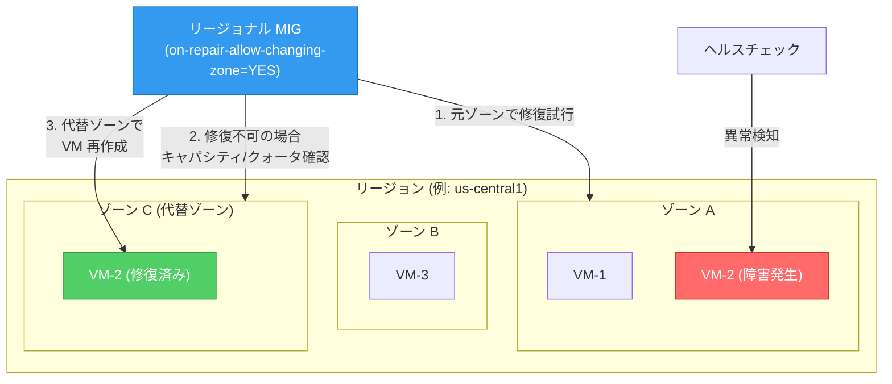

# Compute Engine: リージョナル MIG の代替ゾーン VM 修復 (GA)

**リリース日**: 2026-07-21

**サービス**: Compute Engine

**機能**: Regional MIG Alternate Zone VM Repair

**ステータス**: GA (一般提供)

[このアップデートのインフォグラフィックを見る](https://takech9203.github.io/google-cloud-news-summary/20260721-compute-engine-mig-alternate-zone-repair.html)

## 概要

Google Cloud は、リージョナル マネージド インスタンス グループ (MIG) において、VM を元のゾーンで修復できない場合に代替ゾーンで修復する機能を一般提供 (GA) としてリリースしました。この機能により、ゾーン障害時やリソース不足時でもアプリケーションの可用性を維持できるようになります。

リージョナル MIG を作成する際、複数のゾーンを選択して VM を分散配置します。従来、MIG 内の VM が障害を起こした場合、MIG は元のゾーンでのみ VM の修復 (再作成) を試みていました。本機能を有効にすると、元のゾーンで修復できない場合に、MIG が選択された他のゾーンの中からキャパシティとクォータに基づいて代替ゾーンを選択し、そこで VM を再作成します。

この機能は、GPU や大容量メモリを使用する VM、Spot VM など、特定のハードウェアリソースの需要が高い環境において特に有効です。

**アップデート前の課題**

- VM が障害を起こした場合、MIG は元のゾーンでのみ修復を試みるため、ゾーン全体の障害やキャパシティ不足時に修復が完了しない可能性があった
- GPU や大容量コアの VM など需要の高いハードウェアでは、特定のゾーンでリソースが確保できず修復が長時間停滞することがあった
- ゾーン障害からの復旧にはユーザーが手動で別ゾーンへの移行を行う必要があった

**アップデート後の改善**

- MIG が自動的に代替ゾーンを選択して VM を修復するため、ゾーン障害時の可用性が向上した
- キャパシティとクォータに基づいてインテリジェントにゾーンが選択されるため、リソース確保の成功率が向上した
- 手動介入なしで自動復旧が可能になり、運用負荷が軽減された

## アーキテクチャ図



リージョナル MIG が VM の障害を検知すると、まず元のゾーンで修復を試み、修復できない場合はキャパシティとクォータに基づいて代替ゾーンを自動選択し VM を再作成します。

## サービスアップデートの詳細

### 主要機能

1. **代替ゾーンでの自動 VM 修復**
   - 元のゾーンで VM を修復できない場合、MIG が自動的に他の選択済みゾーンで VM を再作成
   - ゾーン選択はキャパシティとクォータに基づいてインテリジェントに実行
   - VM の URL はゾーン情報を含むため、ゾーン変更時に URL が変更される

2. **Update on Repair との連携**
   - 代替ゾーン修復を有効にする場合、update on repair (修復時更新) の有効化が必須
   - 修復時に最新のインスタンステンプレートとインスタンスごとの構成が適用される

3. **柔軟なターゲット分散シェイプとの統合**
   - BALANCED シェイプ: リソース可用性を優先しつつ、可能な限り均等に分散
   - ANY シェイプ: リソース取得を最大限に優先し、リザベーション活用も最適化

## 技術仕様

### 対応構成

| 項目 | 詳細 |
|------|------|
| 対象 MIG タイプ | リージョナル MIG のみ (ゾーナル MIG は対象外) |
| 対応分散シェイプ | BALANCED、ANY |
| 非対応分散シェイプ | EVEN、ANY_SINGLE_ZONE |
| ステートフル MIG | 非対応 (ステートフル構成を持つ MIG では利用不可) |
| 必須設定 | update on repair (forceUpdateOnRepair) の有効化 |
| instance redistribution | NONE に設定する必要あり (BALANCED シェイプの場合) |

### REST API 設定

```json
{
  "instanceLifecyclePolicy": {
    "onRepair": {
      "allowChangingZone": "YES"
    },
    "forceUpdateOnRepair": "YES"
  }
}
```

## 設定方法

### 前提条件

1. リージョナル MIG が作成済みであること (または新規作成すること)
2. ターゲット分散シェイプが BALANCED または ANY であること
3. ステートフル構成を使用していないこと

### 手順

#### ステップ 1: 既存の MIG に代替ゾーン修復を有効化 (gcloud)

```bash
gcloud compute instance-groups managed update MIG_NAME \
  --on-repair-allow-changing-zone=YES \
  --force-update-on-repair \
  --region=REGION
```

#### ステップ 2: 新規 MIG の作成時に代替ゾーン修復を有効化 (gcloud)

```bash
gcloud compute instance-groups managed create MIG_NAME \
  --template=INSTANCE_TEMPLATE_URL \
  --size=SIZE \
  --zones=ZONES \
  --target-distribution-shape=SHAPE \
  --instance-redistribution-type=none \
  --on-repair-allow-changing-zone=YES \
  --force-update-on-repair
```

#### ステップ 3: Terraform での設定

```hcl
resource "google_compute_region_instance_group_manager" "default" {
  name               = "example-rmig"
  base_instance_name = "example-rmig-instance"
  region             = "us-central1"
  target_size        = 3

  distribution_policy_target_shape = "BALANCED"

  version {
    instance_template = google_compute_instance_template.default.id
  }

  instance_lifecycle_policy {
    default_action_on_failure = "REPAIR"
    force_update_on_repair    = "YES"
    on_repair {
      allow_changing_zone = "YES"
    }
  }

  update_policy {
    instance_redistribution_type = "NONE"
    type                         = "OPPORTUNISTIC"
    minimal_action               = "REPLACE"
    max_surge_fixed              = 0
    max_unavailable_fixed        = 6
  }
}
```

#### ステップ 4: REST API での設定 (既存 MIG の更新)

```bash
curl -X PATCH \
  "https://compute.googleapis.com/compute/v1/projects/PROJECT_ID/regions/REGION/instanceGroupManagers/MIG_NAME" \
  -H "Authorization: Bearer $(gcloud auth print-access-token)" \
  -H "Content-Type: application/json" \
  -d '{
    "instanceLifecyclePolicy": {
      "onRepair": {
        "allowChangingZone": "YES"
      },
      "forceUpdateOnRepair": "YES"
    }
  }'
```

## メリット

### ビジネス面

- **アプリケーション可用性の向上**: ゾーン障害時にも自動で代替ゾーンに VM を移行するため、サービスダウンタイムを最小化
- **運用コストの削減**: 手動でのゾーン間移行作業が不要になり、オンコール対応の負荷が軽減
- **SLA 達成の支援**: マルチゾーン構成における高可用性を自動化し、ビジネス継続性を確保

### 技術面

- **リソース取得性の向上**: GPU、大容量メモリ VM、Spot VM など需要の高いリソースの確保成功率が向上
- **自動フェイルオーバー**: キャパシティとクォータに基づくインテリジェントなゾーン選択により、最適な修復先を自動決定
- **既存ワークフローとの互換性**: gcloud、REST API、Terraform、Console すべてから設定可能で、既存の IaC パイプラインに容易に統合

## デメリット・制約事項

### 制限事項

- EVEN および ANY_SINGLE_ZONE のターゲット分散シェイプでは利用不可
- ステートフル MIG (ステートフル構成を持つ MIG) では利用不可
- update on repair の有効化が必須 (修復時にインスタンステンプレートが更新される)
- VM のゾーンが変更されるため、VM の URL (ゾーンを含む) が変更される

### 考慮すべき点

- ゾーン変更後の VM URL が変わるため、VM の URL を直接参照しているシステムがある場合は影響を受ける可能性がある
- 代替ゾーンへの修復によりゾーン間の VM 分散が偏る可能性がある (BALANCED シェイプでも均等分散は保証されない)
- instance redistribution を NONE に設定する必要があるため、プロアクティブな再分散は行われない
- ステートフルディスクや IP アドレスを持つワークロードでは本機能を利用できないため、別途高可用性設計が必要

## ユースケース

### ユースケース 1: GPU ワークロードの高可用性確保

**シナリオ**: AI/ML トレーニングジョブで GPU 付き VM を使用するリージョナル MIG を運用している。特定のゾーンで GPU キャパシティが逼迫した場合にもワークロードを継続したい。

**実装例**:
```bash
gcloud compute instance-groups managed create ml-training-mig \
  --template=gpu-instance-template \
  --size=8 \
  --zones=us-central1-a,us-central1-b,us-central1-c \
  --target-distribution-shape=any \
  --instance-redistribution-type=none \
  --on-repair-allow-changing-zone=YES \
  --force-update-on-repair
```

**効果**: GPU リソースが利用可能なゾーンへ自動的に VM が移行されるため、ハードウェア不足によるワークロード停止を回避できる。

### ユースケース 2: Spot VM を使用するバッチ処理の耐障害性向上

**シナリオ**: コスト最適化のために Spot VM でバッチ処理を実行している。Spot VM はプリエンプトされる可能性があり、特定ゾーンのキャパシティが不足する場合がある。

**効果**: Spot VM がプリエンプトされた後の再作成時に、元のゾーンでキャパシティが不足していても代替ゾーンで VM が復旧するため、バッチ処理の完了率が向上する。

### ユースケース 3: ゾーン障害に対するサービスの自動復旧

**シナリオ**: Web アプリケーションをリージョナル MIG で運用しており、ゾーン障害発生時にも自動的にサービスを復旧させたい。

**効果**: ゾーン障害が発生しても、MIG が自動的に正常なゾーンで VM を再作成するため、手動介入なしでサービスが復旧し、ダウンタイムが最小化される。

## 料金

本機能自体に追加料金は発生しません。通常の Compute Engine VM の料金が適用されます。代替ゾーンで修復された VM も、そのゾーンの通常の VM 料金で課金されます。

詳細は [Compute Engine 料金ページ](https://cloud.google.com/compute/pricing) を参照してください。

## 関連サービス・機能

- **[Cloud Monitoring](https://cloud.google.com/monitoring)**: MIG のヘルスステータスとオートヒーリングイベントの監視
- **[Cloud Logging](https://cloud.google.com/logging)**: VM 修復操作のログ記録と監査
- **[ヘルスチェック](https://cloud.google.com/load-balancing/docs/health-check-concepts)**: アプリケーションベースのヘルスチェックによる異常検知とオートヒーリングトリガー
- **[Update on Repair](https://docs.cloud.google.com/compute/docs/instance-groups/update-on-repair)**: 修復時にインスタンステンプレートを更新する機能 (本機能の前提条件)
- **[リージョナル MIG の分散ポリシー](https://docs.cloud.google.com/compute/docs/instance-groups/regional-mig-distribution-shape)**: BALANCED/ANY シェイプによるゾーン間の VM 分散制御
- **[Cloud Load Balancing](https://cloud.google.com/load-balancing)**: MIG と連携したトラフィック分散とヘルスチェック

## 参考リンク

- [インフォグラフィック](https://takech9203.github.io/google-cloud-news-summary/20260721-compute-engine-mig-alternate-zone-repair.html)
- [公式リリースノート](https://cloud.google.com/release-notes#July_21_2026)
- [Repair a VM in an alternate zone - ドキュメント](https://docs.cloud.google.com/compute/docs/instance-groups/repair-vm-in-alternate-zone)
- [About repairing VMs for high availability](https://docs.cloud.google.com/compute/docs/instance-groups/about-repair)
- [Regional MIG distribution shape](https://docs.cloud.google.com/compute/docs/instance-groups/regional-mig-distribution-shape)
- [Autohealing instances in MIGs](https://docs.cloud.google.com/compute/docs/instance-groups/autohealing-instances-in-migs)
- [Compute Engine 料金](https://cloud.google.com/compute/pricing)

## まとめ

リージョナル MIG の代替ゾーン VM 修復機能の GA により、ゾーン障害やリソース不足時における VM の自動復旧が実現しました。特に GPU ワークロードや Spot VM を利用する環境では、リソース取得性の向上が大きなメリットとなります。既存のリージョナル MIG に対しても `--on-repair-allow-changing-zone=YES` フラグの追加のみで有効化できるため、高可用性が求められるワークロードでは積極的な導入を推奨します。

---

**タグ**: Compute Engine, MIG, Managed Instance Group, High Availability, Zone Repair, Resiliency
