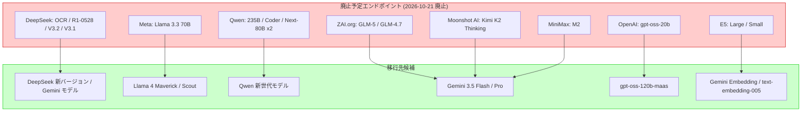

# Gemini Enterprise Agent Platform: オープンモデルエンドポイントの廃止予定

**リリース日**: 2026-07-21

**サービス**: Gemini Enterprise Agent Platform

**機能**: Open Model Endpoint Deprecations

**ステータス**: Deprecated (2026年10月21日廃止予定)

[このアップデートのインフォグラフィックを見る](https://takech9203.github.io/google-cloud-news-summary/20260721-gemini-agent-platform-open-model-deprecations.html)

## 概要

Google Cloud は、Gemini Enterprise Agent Platform の Model-as-a-Service (MaaS) で提供されている16のオープンモデルエンドポイントの廃止を発表しました。これらのエンドポイントは2026年7月21日付で非推奨 (Deprecated) となり、2026年10月21日に完全に廃止 (Retired) されます。廃止後は、該当エンドポイントへの API リクエストは 400 エラーを返すようになります。

対象となるモデルは DeepSeek、GLM (ZAI.org)、OpenAI gpt-oss、Moonshot AI (Kimi)、Meta Llama、MiniMax、Multilingual E5 (Embedding)、Qwen の各ファミリーにわたる16モデルです。これらはすべてサードパーティ製のオープンモデルであり、Google は後継モデルや代替サービスへの移行を推奨しています。

この変更は、Agent Platform のオープンモデルエコシステムの整理統合を目的としており、より新しいバージョンのモデルや、より高性能な代替モデルへの移行を促すものです。影響を受けるユーザーは、3か月間の猶予期間内に移行計画を策定し実行する必要があります。

**アップデート前の課題**

- 多数のオープンモデルエンドポイントが並行して提供されており、バージョン管理の複雑性が増加していた
- 旧バージョンのモデルが継続提供されることで、セキュリティパッチやパフォーマンス改善の適用が遅れる可能性があった
- ユーザーが最新モデルへの移行インセンティブを持ちにくい状況にあった

**アップデート後の改善**

- プラットフォーム全体のモデルポートフォリオが整理され、サポート品質の向上が期待される
- ユーザーはより新しく高性能なモデルへの移行により、推論精度やレイテンシの改善を享受できる
- Google Cloud のインフラリソースがより効率的に活用され、サービス全体の安定性向上に寄与する

## アーキテクチャ図



廃止予定の16モデルエンドポイントから、推奨される移行先モデルへの移行パスを示しています。

## サービスアップデートの詳細

### 廃止対象モデル一覧

以下の16モデルエンドポイントが2026年10月21日に廃止されます。

1. **deepseek-ocr-maas**
   - DeepSeek-OCR: 光学文字認識 (OCR) モデル
   - 数式認識、曲線/回転/重なりテキストの処理に特化

2. **deepseek-r1-0528-maas**
   - DeepSeek R1 (0528): 推論特化モデル
   - 深い推論能力と推論能力を大幅に向上させた最新版

3. **deepseek-v3.2-maas**
   - DeepSeek-V3.2: 高効率推論・エージェントモデル
   - Sparse Attention、スケーラブル RL、大規模エージェントタスク合成パイプライン採用

4. **deepseek-v3.1-maas**
   - DeepSeek-V3.1: ハイブリッドシンキングモデル
   - thinking モードと non-thinking モード両対応

5. **glm-5-maas**
   - GLM 5 (ZAI.org): 複雑なシステムエンジニアリングおよび長期的エージェントタスク向け
   - 実験的 (experimental) ステータス

6. **glm-4.7-maas**
   - GLM 4.7 (ZAI.org): コーディング、ツール使用、複雑な推論向け

7. **gpt-oss-20b-maas**
   - OpenAI gpt-oss 20B: 効率性重視の20Bモデル
   - コンシューマーおよびエッジハードウェアへのデプロイに最適化

8. **kimi-k2-thinking-maas**
   - Kimi K2 Thinking (Moonshot AI): ステップバイステップ推論エージェントモデル
   - ツールを活用した複雑な問題解決に特化

9. **llama-3.3-70b-instruct-maas**
   - Llama 3.3 70B (Meta): テキスト専用の70B命令追従モデル
   - Llama 3.1 70B および Llama 3.2 90B を上回る性能

10. **minimax-m2-maas**
    - MiniMax M2: エージェント・コード関連タスク向け
    - 複雑なツール呼び出しタスクの計画・実行に強み

11. **multilingual-e5-large-instruct-maas**
    - Multilingual E5 Large: 多言語テキスト埋め込みモデル (大規模版)

12. **multilingual-e5-small-maas**
    - Multilingual E5 Small: 多言語テキスト埋め込みモデル (小規模版)

13. **qwen3-235b-a22b-instruct-2507-maas**
    - Qwen3 235B: ハイブリッドシンキング機能搭載
    - 体系的推論と迅速な会話を切り替え可能

14. **qwen3-coder-480b-a35b-instruct-maas**
    - Qwen3 Coder: 高度なソフトウェア開発タスク向けモデル

15. **qwen3-next-80b-a3b-instruct-maas**
    - Qwen3-Next-80B Instruct: 命令追従に特化したモデル

16. **qwen3-next-80b-a3b-thinking-maas**
    - Qwen3-Next-80B Thinking: 推論重視のモデル

## 技術仕様

### 廃止タイムライン

| マイルストーン | 日付 | 内容 |
|------|------|------|
| 廃止予告 (Deprecated) | 2026-07-21 | 公式に非推奨化、移行猶予期間開始 |
| 移行期間 | 2026-07-21 ~ 2026-10-20 | 既存エンドポイントは引き続き動作 |
| 完全廃止 (Retired) | 2026-10-21 | API リクエストが 400 エラーを返却 |

### 影響を受ける API エンドポイント

```
https://aiplatform.googleapis.com/v1/projects/<PROJECT_ID>/locations/<LOCATION>/endpoints/openapi/chat/completions
```

廃止後、上記エンドポイントに対して廃止対象モデル ID を指定したリクエストは失敗します。

### 対象リージョン

| リージョンタイプ | 対象 |
|------|------|
| Global | global |
| Multi-region | us, eu |
| US リージョン | us-west1, us-west4, us-central1, us-east1, us-east4, us-east5, us-south1 |
| Americas | northamerica-northeast1, southamerica-east1 |
| Europe | europe-west1 ~ west9, europe-north1, europe-central2 |

## 移行手順

### 前提条件

1. 対象プロジェクトで Gemini Enterprise Agent Platform API が有効化されていること
2. 適切な IAM ロール (Vertex AI User 以上) を持つサービスアカウントまたはユーザーアカウント
3. 移行先モデルの利用可能リージョンの確認

### 手順

#### ステップ 1: 現在の使用状況の把握

```bash
# Cloud Logging で対象モデルの使用状況を確認
gcloud logging read 'resource.type="aiplatform.googleapis.com/Endpoint" AND jsonPayload.model=~"deepseek|glm|gpt-oss-20b|kimi|llama-3.3|minimax-m2|multilingual-e5|qwen3"' \
  --project=YOUR_PROJECT_ID \
  --limit=100 \
  --format=json
```

使用中のモデルエンドポイント、リクエスト頻度、使用リージョンを確認します。

#### ステップ 2: 移行先モデルの選定

```bash
# Model Garden で利用可能なモデルを確認
gcloud ai models list \
  --project=YOUR_PROJECT_ID \
  --region=us-central1 \
  --filter="displayName~'llama-4|deepseek|qwen|gemini'"
```

推奨移行先:
- DeepSeek モデル → 後継 DeepSeek バージョンまたは Gemini 3.5 Flash
- Llama 3.3 → Llama 4 Maverick 17B-128E / Llama 4 Scout 17B-16E
- gpt-oss-20b → gpt-oss-120b-maas
- E5 Embedding → Gemini Embedding 2 / text-embedding-005
- GLM / Kimi / MiniMax / Qwen → 対応する新世代モデルまたは Gemini モデル

#### ステップ 3: コードの更新

```python
# 変更前 (廃止予定)
from google.cloud import aiplatform

response = client.predict(
    endpoint="projects/my-project/locations/global/endpoints/openapi",
    instances=[{"model": "deepseek-v3.1-maas", "messages": [...]}]
)

# 変更後 (移行先)
response = client.predict(
    endpoint="projects/my-project/locations/global/endpoints/openapi",
    instances=[{"model": "llama-4-maverick-17b-128e-instruct-maas", "messages": [...]}]
)
```

#### ステップ 4: テストと検証

```bash
# Chat Completions API での動作確認
curl -X POST \
  -H "Authorization: Bearer $(gcloud auth print-access-token)" \
  -H "Content-Type: application/json" \
  "https://aiplatform.googleapis.com/v1/projects/YOUR_PROJECT/locations/global/endpoints/openapi/chat/completions" \
  -d '{
    "model": "meta/llama-4-maverick-17b-128e-instruct-maas",
    "messages": [{"role": "user", "content": "Hello, world!"}]
  }'
```

#### ステップ 5: 本番環境への段階的ロールアウト

移行先モデルでの品質・性能確認後、トラフィックを段階的に移行します。2026年10月21日の廃止日前に完全移行を完了してください。

## メリット

### ビジネス面

- **最新モデルによる品質向上**: 後継モデルは一般的に推論精度、速度、コスト効率が改善されている
- **長期的なサポート保証**: 最新のサポート対象モデルに移行することで、継続的なアップデートとセキュリティパッチを受けられる
- **コスト最適化の機会**: 新世代モデルは同等性能をより低コストで提供する場合が多い

### 技術面

- **性能向上**: Llama 4 は Llama 3.3 比でマルチモーダル対応と MoE アーキテクチャにより大幅な性能向上を実現
- **エコシステムの統一**: 最新モデルへの統一により、API 互換性やツーリングの一貫性が向上
- **セキュリティ強化**: Model Armor などのセキュリティ統合が最新モデルでより充実している

## デメリット・制約事項

### 制限事項

- 廃止日 (2026-10-21) 以降は対象モデルへのアクセスが完全に遮断される
- 移行先モデルの出力が既存モデルと完全に互換であるとは限らない (プロンプトの再調整が必要な場合がある)
- 一部の移行先モデルは利用可能リージョンが異なる場合がある
- gpt-oss-120b-maas 以外に gpt-oss-20b の直接的な後継は存在しない

### 考慮すべき点

- 移行先モデルとの出力互換性テストに十分な時間を確保する必要がある
- E5 埋め込みモデルから Gemini Embedding への移行では、埋め込み次元数が変わる可能性があるため、ベクトルデータベースの再インデックスが必要
- Fine-tuning を行っていた場合、移行先モデルで再度チューニングが必要
- 料金体系が移行先モデルで異なる可能性があるため、コスト影響を事前に試算すること

## 関連サービス・機能

- **Gemini Enterprise Agent Platform Model Garden**: モデルの検索・デプロイ・管理を行うプラットフォーム
- **Model Armor**: LLM のプロンプトとレスポンスを各種セキュリティ・安全性リスクからスクリーニングするサービス
- **Provisioned Throughput**: 移行先モデルでの安定したスループットを確保するための事前購入オプション
- **Llama 4 (Maverick / Scout)**: Llama 3.3 の後継として推奨される最新 MoE モデル
- **Gemini 3.5 Flash**: 汎用的な代替として最も推奨される Google ファーストパーティモデル
- **Gemini Embedding 2**: E5 モデルの代替として推奨される埋め込みモデル

## 参考リンク

- [インフォグラフィック](https://takech9203.github.io/google-cloud-news-summary/20260721-gemini-agent-platform-open-model-deprecations.html)
- [公式リリースノート](https://cloud.google.com/release-notes#July_21_2026)
- [Agent Platform オープンモデル一覧](https://docs.cloud.google.com/gemini-enterprise-agent-platform/models/maas/use-open-models)
- [モデル移行ガイド](https://docs.cloud.google.com/gemini-enterprise-agent-platform/models/migrate)
- [DeepSeek モデル ドキュメント](https://docs.cloud.google.com/gemini-enterprise-agent-platform/models/maas/deepseek)
- [オープンモデルのサービング選択ガイド](https://docs.cloud.google.com/gemini-enterprise-agent-platform/models/open-models/choose-serving-option)
- [リージョン・ロケーション情報](https://docs.cloud.google.com/gemini-enterprise-agent-platform/resources/locations)

## まとめ

Gemini Enterprise Agent Platform における16のオープンモデルエンドポイントが2026年10月21日に廃止されます。影響を受けるすべてのユーザーは、3か月の猶予期間内に後継モデルまたは代替モデルへの移行を完了する必要があります。特に Llama 3.3 ユーザーは Llama 4 ファミリーへ、DeepSeek ユーザーは最新バージョンまたは Gemini モデルへ、E5 埋め込みユーザーは Gemini Embedding 2 への移行を検討してください。移行前に必ずプロンプトの互換性テストと性能評価を実施し、本番環境への影響を最小限に抑えることを推奨します。

---

**タグ**: Gemini, Agent Platform, Model Deprecation, DeepSeek, Qwen, Llama, Open Models, MaaS
