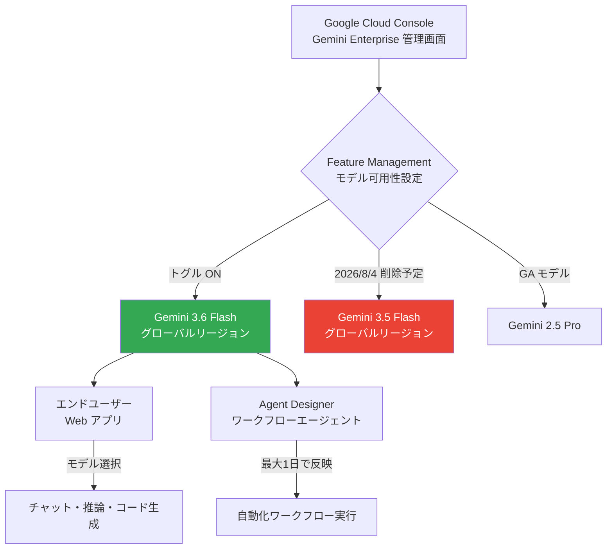

# Gemini Enterprise: Gemini 3.6 Flash がグローバルリージョンで利用可能に

**リリース日**: 2026-07-21

**サービス**: Gemini Enterprise

**機能**: Gemini 3.6 Flash グローバルリージョン対応

**ステータス**: GA (一般提供)

[このアップデートのインフォグラフィックを見る](https://takech9203.github.io/google-cloud-news-summary/20260721-gemini-enterprise-3-6-flash-global.html)

## 概要

Google Cloud は Gemini Enterprise アプリにおいて、最新モデル Gemini 3.6 Flash をグローバルリージョンで利用可能にしました。管理者が Feature Management から Gemini 3.6 Flash のトグルを有効にすることで、エンドユーザーがこの新モデルを選択できるようになります。

Gemini 3.6 Flash は、エージェント時代に最適化されたフロンティアレベルの知性を提供するモデルで、コード生成、エージェント実行、空間推論に優れています。従来の Gemini 3.5 Flash と比較してトークン効率が向上し、マルチステップワークフローをより少ないターンで完了できます。

また、Agent Designer のワークフローエージェントでも Gemini 3.6 Flash が利用可能です。ワークフローエージェントへの反映には最大 1 日かかる場合があります。なお、Gemini 3.5 Flash は 2026 年 8 月 4 日にグローバルリージョンから削除される予定であり、早めの移行計画が必要です。

**アップデート前の課題**

- グローバルリージョンでは Gemini 3.5 Flash が最新の Flash モデルであり、トークン効率やコード生成精度に改善の余地があった
- マルチステップのエージェントワークフローで多くのターン数を要し、コストと時間がかかっていた
- 複雑なコーディングサイクルにおいてコンパイル失敗率やリビジョン率が高い場面があった

**アップデート後の改善**

- Gemini 3.6 Flash により、トークン効率が向上し少ないトークンでタスクを完了可能に
- コード生成のコンパイル失敗率とリビジョン率が低減
- マルチモーダル推論（チャート解釈、設計図変換、Web レイアウト生成）が強化
- 読み取り専用の診断タスクで不要な編集を行わないアクションバイアスの低減

## アーキテクチャ図

管理者が Feature Management でトグルを有効にすると、エンドユーザーの Web アプリおよび Agent Designer のワークフローエージェントで Gemini 3.6 Flash が利用可能になります。Gemini 3.5 Flash は 2026 年 8 月 4 日に削除予定です。

## サービスアップデートの詳細

### 主要機能

1. **Gemini 3.6 Flash のグローバルリージョン提供**
   - グローバルリージョンで GA として利用可能
   - 管理者による Feature Management トグルの有効化が必要
   - Enable model selector が有効な環境でユーザーがモデルを選択可能

2. **Agent Designer ワークフローエージェント対応**
   - Agent Designer で作成されたワークフローエージェントでも Gemini 3.6 Flash を利用可能
   - モデル更新がワークフローエージェントに反映されるまで最大 1 日を要する
   - シングルステップ・マルチステップの両エージェントタイプに対応

3. **Gemini 3.5 Flash のグローバルリージョン削除予告**
   - 2026 年 8 月 4 日にグローバルリージョンから Gemini 3.5 Flash が削除
   - Gemini 3.6 Flash への移行猶予期間は約 2 週間
   - US/EU マルチリージョンや各国リージョンの 3.5 Flash には影響なし

## 技術仕様

### Gemini 3.6 Flash モデル仕様

| 項目 | 詳細 |
|------|------|
| モデル ID | gemini-3.6-flash |
| 入力コンテキストウィンドウ | 1,048,576 トークン |
| 最大出力トークン | 65,536 トークン |
| 入力モダリティ | テキスト、画像、動画、音声、PDF |
| 出力モダリティ | テキスト |
| Thinking（思考） | サポート |
| 構造化出力 | サポート |
| 関数呼び出し | サポート |
| コード実行 | サポート |
| コンテキストキャッシュ | 暗黙的・明示的の両方をサポート |
| Google 検索によるグラウンディング | サポート |
| Google Maps によるグラウンディング | サポート |
| URL コンテキスト | サポート |
| リリース日 | 2026 年 7 月 21 日 |
| 利用可能リージョン | グローバル (global) のみ |

### Gemini 3.5 Flash からの改善点

| 改善領域 | 詳細 |
|----------|------|
| トークン効率 | 少ないトークンでマルチステップワークフローを完了 |
| コード生成 | コンパイル失敗率とリビジョン率の低減 |
| アクションバイアス | 読み取り専用タスクでの不要な編集を抑制 |
| マルチモーダル推論 | チャート解釈、設計図変換、Web レイアウト生成の改善 |

### 破壊的変更（注意点）

| 項目 | 詳細 |
|------|------|
| temperature / top-K / top-P | カスタム値は無視される（エラーにはならない） |
| frequency / presence penalty | カスタム値を設定するとエラーが返される |
| 最後の入力ターンが Model ロール | リクエストがエラーになる |

## 設定方法

### 前提条件

1. Gemini Enterprise Admin ロールが付与されていること
2. 既存の Gemini Enterprise Web アプリが作成済みであること
3. Web アプリで「Enable model selector」が有効化されていること

### 手順

#### ステップ 1: Feature Management 画面を開く

Google Cloud コンソールで Gemini Enterprise ページに移動し、対象のアプリ名をクリックします。「Configurations」を選択し、「Feature Management」タブをクリックします。

#### ステップ 2: Gemini 3.6 Flash トグルを有効化

「Model availability」セクションで、Gemini 3.6 Flash のトグルを ON に切り替えます。

#### ステップ 3: Agent Designer での利用（オプション）

Agent Designer でワークフローエージェントを作成または編集する際に、モデル選択で Gemini 3.6 Flash を指定します。既存のワークフローエージェントへの反映には最大 1 日かかります。

## メリット

### ビジネス面

- **コスト効率の向上**: トークン効率の改善により、同じタスクをより少ないトークンで完了でき、API コストを削減
- **生産性向上**: マルチステップワークフローの完了ターン数削減により、エージェント実行の迅速化を実現
- **コード品質の改善**: コンパイル失敗率の低減により、開発者の手戻り作業が減少

### 技術面

- **エージェント性能の強化**: 複雑なコーディングサイクルや反復作業に特化した最適化
- **マルチモーダル能力の拡張**: チャート解釈や設計図変換など、実務で頻出するタスクへの対応力向上
- **セキュリティコントロール**: データレジデンシー、CMEK、VPC-SC、AXT をサポート

## デメリット・制約事項

### 制限事項

- グローバルリージョンでのみ利用可能（US/EU マルチリージョンや各国リージョンでは利用不可）
- temperature、top-K、top-P のカスタム値がサポートされない
- frequency / presence penalty のカスタム値を設定するとエラーが発生
- 最後の入力ターンが Model ロールのリクエストはエラーになる
- ワークフローエージェントへの反映に最大 1 日のラグがある

### 考慮すべき点

- Gemini 3.5 Flash は 2026 年 8 月 4 日にグローバルリージョンから削除されるため、移行計画を早急に策定する必要がある
- データレジデンシー要件がある場合、グローバルリージョンでは at-rest DRZ や MLP が保証されない点に注意
- 既存のワークフローエージェントで 3.5 Flash を指定している場合、削除日までにモデル変更が必要

## ユースケース

### ユースケース 1: エージェントによる定型業務の自動化

**シナリオ**: Agent Designer で作成したマルチステップエージェントが、毎日のレポート生成やデータ集約を自動実行する。Gemini 3.6 Flash の改善されたトークン効率により、同じワークフローをより低コストかつ高速に実行できる。

**効果**: エージェント実行コストの削減と処理速度の向上。複雑なマルチステップフローでもターン数が減少し、スケジュール実行の信頼性が向上。

### ユースケース 2: 開発チームでのコード生成・レビュー

**シナリオ**: 開発チームが Gemini Enterprise Web アプリを使用してコード生成やリファクタリングを行う。Gemini 3.6 Flash のコード生成改善により、初回生成時のコンパイル成功率が向上し、反復修正の回数が減少する。

**効果**: 開発サイクルの短縮とコード品質の向上。プロトタイピングから本番コードまで、より少ないイテレーションで目標品質に到達。

## 料金

Gemini Enterprise アプリ内での Gemini 3.6 Flash の利用は、Gemini Enterprise のライセンス（Standard または Plus Edition）に含まれます。

API 経由で直接 Gemini 3.6 Flash を利用する場合の参考料金:

| 項目 | 料金 |
|------|------|
| 入力トークン | $1.50 / 100 万トークン |
| 出力トークン | $7.50 / 100 万トークン |

## 利用可能リージョン

| リージョン | 利用可否 |
|-----------|---------|
| グローバル (global) | 利用可能 |
| US マルチリージョン | 利用不可 |
| EU マルチリージョン | 利用不可 |
| 各国リージョン (CA, IN, JP, SG, UK) | 利用不可 |

データレジデンシーや規制上の要件がない場合、Google はグローバルリージョンの利用を推奨しています。グローバルリージョンでは最新モデルバージョンと最新機能が最も早く利用可能になるためです。

## 移行タイムライン

| 日付 | イベント |
|------|---------|
| 2026-07-21 | Gemini 3.6 Flash がグローバルリージョンで GA |
| 2026-07-21 ~ 2026-08-04 | 移行猶予期間（両モデル利用可能） |
| **2026-08-04** | **Gemini 3.5 Flash がグローバルリージョンから削除** |

## 関連サービス・機能

- **Gemini Enterprise Agent Designer**: ワークフローエージェントの作成・管理プラットフォーム。Gemini 3.6 Flash をモデルとして選択可能
- **Gemini Enterprise Agent Platform**: AI エージェントの構築・デプロイ・管理を行う統合プラットフォーム
- **Gemini Notebook Enterprise**: ノートブック環境での AI 活用。Gemini 3.6 Flash も利用可能
- **Model Armor**: モデルのセキュリティポリシー適用（グローバルリージョンでは利用不可）

## 参考リンク

- [インフォグラフィック](https://takech9203.github.io/google-cloud-news-summary/20260721-gemini-enterprise-3-6-flash-global.html)
- [公式リリースノート](https://docs.cloud.google.com/release-notes#July_21_2026)
- [Gemini Enterprise Web アプリ機能管理](https://docs.cloud.google.com/gemini/enterprise/docs/manage-web-app-features)
- [Gemini 3.6 Flash モデルページ](https://docs.cloud.google.com/gemini-enterprise-agent-platform/models/gemini/3-6-flash)
- [Gemini Enterprise データレジデンシー](https://docs.cloud.google.com/gemini/enterprise/docs/locations)
- [Agent Designer 概要](https://docs.cloud.google.com/gemini/enterprise/docs/agent-designer)

## まとめ

Gemini 3.6 Flash のグローバルリージョン提供は、Gemini Enterprise ユーザーにとってトークン効率、コード生成品質、マルチモーダル推論のすべてにおいて実質的な改善をもたらします。管理者は Feature Management から速やかにトグルを有効化し、2026 年 8 月 4 日の Gemini 3.5 Flash 削除に備えた移行計画を策定することを推奨します。

---

**タグ**: #GeminiEnterprise #Gemini3.6Flash #AI #LLM #AgentDesigner #グローバルリージョン #モデルアップデート
