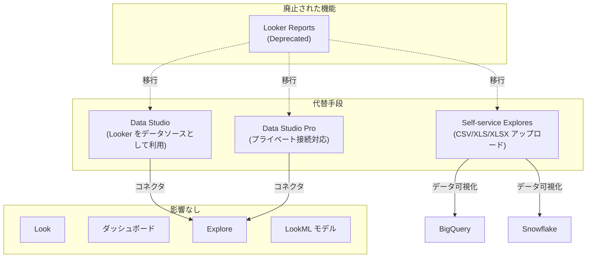

# Looker: レポート機能の廃止 (Deprecated)

**リリース日**: 2026-07-21

**サービス**: Looker (Google Cloud core) / Looker (original)

**機能**: Looker Reports (レポート機能)

**ステータス**: Deprecated (廃止)

[このアップデートのインフォグラフィックを見る](https://takech9203.github.io/google-cloud-news-summary/20260721-looker-reports-deprecated.html)

## 概要

2026 年 7 月 13 日をもって、Looker のレポート機能 (Looker Reports) が正式に廃止された。この機能はプレビュー段階にあり、Looker インスタンス内で Data Studio レポートを作成・表示・編集できる機能を提供していたが、今後は利用できなくなる。

既に Looker レポートのプレビューを有効にしていたユーザーは、新規レポートの作成ができなくなり、プレビュー期間中に作成したレポートの表示・編集もできなくなる。ただし、Looker インスタンス内のその他のコンテンツ (Look、ダッシュボード、Explore など) へのアクセスには影響がなく、Data Studio および Data Studio Pro からのデータソースとしての Looker の利用も引き続き可能である。

代替手段として、Looker のセルフサービス Explores 機能が案内されている。この機能を使用することで、LookML モデルの設定や Git バージョン管理のセットアップなしに、CSV/XLS/XLSX ファイルをアップロードしてデータの可視化・分析が可能である。

**アップデート前の状態**

- Looker レポートのプレビューを有効にしているインスタンスでは、Looker 内で Data Studio レポートを作成・表示・編集できた
- 2025 年 12 月 4 日以降、新規インスタンスでの Looker レポートの有効化は既に停止されていた
- 2026 年 6 月 15 日に Looker レポートプレビューのサポートが終了していた

**アップデート後の影響**

- 新規レポートの作成が不可能になった
- プレビュー期間中に作成したレポートの表示・編集が不可能になった
- Looker インスタンス内の他のコンテンツへのアクセスは影響なし
- Data Studio / Data Studio Pro からのデータソースとしての Looker 利用は継続可能
- 代替として Self-service Explores 機能が利用可能

## アーキテクチャ図

Looker レポートの廃止に伴い、ユーザーはセルフサービス Explores、Data Studio、Data Studio Pro のいずれかに移行する必要がある。既存の Looker コンテンツ (Look、ダッシュボード、Explore、LookML モデル) には影響がない。

## サービスアップデートの詳細

### 主要な変更点

1. **新規レポート作成の停止**
   - Looker インスタンス内での新規レポート作成オプションが削除された
   - 以前のように Looker UI からレポートを作成することはできなくなった

2. **既存レポートへのアクセス喪失**
   - プレビュー期間中に作成されたレポートの表示・編集ができなくなった
   - レポートデータは Cloud Data Processing Addendum に基づき削除される

3. **影響を受けないコンテンツ**
   - Looker インスタンス内の Look、ダッシュボード、Explore は引き続き利用可能
   - LookML モデルおよびプロジェクトへのアクセスも維持される
   - Data Studio / Data Studio Pro でのデータソースとしての利用に変更なし

### 代替機能: Self-service Explores

セルフサービス Explores は、LookML モデルの設定や Git バージョン管理なしでデータの可視化・分析を可能にする機能である。

| 項目 | 詳細 |
|------|------|
| 対応データソース (BigQuery 接続) | CSV、XLS、XLSX、Google Sheets、BigQuery テーブル |
| 対応データソース (Snowflake 接続) | CSV、XLS、XLSX |
| ファイルサイズ上限 | 100 MB |
| 必要な Looker バージョン (BigQuery) | 25.20 以降 |
| 必要な Looker バージョン (Snowflake) | 26.8 以降 |
| 必要な権限 | `upload_data` パーミッション |

### 代替機能: Data Studio / Data Studio Pro 連携

Looker コネクタを使用して、Looker の Explore をデータソースとして Data Studio レポートに追加できる。

| 項目 | 詳細 |
|------|------|
| 接続方式 | Looker コネクタ (BI Connectors) |
| 認証 | Google アカウントと Looker アカウントのリンク |
| 必要な権限 | `explore`、`access_data`、`clear_cache_refresh` |
| Data Studio Pro の追加機能 | プライベート接続インスタンスへの接続対応 |

## 廃止のタイムライン

| 日付 | イベント |
|------|---------|
| 2025 年 12 月 4 日 | 新規インスタンスでの Looker レポート有効化を停止 |
| 2026 年 6 月 15 日 | Looker レポートプレビューのサポート終了 |
| 2026 年 7 月 13 日 | Looker レポートの正式廃止 (レポートへのアクセス不可) |
| 2026 年 7 月 21 日 | Release Notes での公式アナウンス |

## 対応が必要なユーザー

### 影響を受けるユーザー

- Looker レポートのプレビューを有効にしていたインスタンスの管理者
- Looker 内でレポートを作成・利用していたユーザー

### 影響を受けないユーザー

- Looker レポートを有効にしていなかったインスタンスのユーザー
- 通常の Look やダッシュボードのみを利用しているユーザー
- Data Studio から Looker をデータソースとして利用しているユーザー

## 推奨される移行アクション

### アドホック分析が必要な場合: Self-service Explores

1. Looker 管理者が Self-service Explores を有効化する
2. BigQuery または Snowflake への接続を設定する (All Projects スコープ、PDT 有効)
3. `upload_data` 権限をユーザーに付与する
4. CSV/XLS/XLSX ファイルをアップロードしてデータ分析を開始する

### レポート作成が必要な場合: Data Studio / Data Studio Pro

1. Looker 管理者が BI Connectors の Data Studio 設定を有効化する
2. Data Studio にサインインし、Looker コネクタを選択する
3. Looker インスタンス URL を入力し、アカウントをリンクする
4. Explore を選択してデータソースとして追加する

## 関連サービス・機能

- **Data Studio**: Looker をデータソースとして使用できるレポーティングツール。Looker レポートの廃止後も、Data Studio から Looker データへのアクセスは継続可能
- **Data Studio Pro**: Data Studio の拡張版。プライベート接続の Looker (Google Cloud core) インスタンスへの接続をサポート
- **Self-service Explores**: LookML 設定なしでデータをアップロード・可視化できる Looker の機能。BigQuery および Snowflake をバックエンドとして利用
- **Looker Explore**: Looker のコアとなるデータ探索・分析機能。廃止対象ではなく、引き続き利用可能

## 参考リンク

- [インフォグラフィック](https://takech9203.github.io/google-cloud-news-summary/20260721-looker-reports-deprecated.html)
- [公式リリースノート](https://docs.cloud.google.com/release-notes#July_21_2026)
- [Looker Reports ドキュメント](https://docs.cloud.google.com/looker/docs/create-view-edit-reports)
- [Self-service Explores ドキュメント](https://docs.cloud.google.com/looker/docs/exploring-self-service)
- [Self-service Explores 管理者設定](https://docs.cloud.google.com/looker/docs/admin-panel-self-service-explore)
- [Data Studio - Looker コネクタ](https://docs.cloud.google.com/data-studio/connect-to-looker)
- [Looker BI Connectors 設定](https://docs.cloud.google.com/looker/docs/bi-connectors)

## まとめ

Looker レポート機能はプレビュー段階のまま正式に廃止された。既存の Looker コンテンツや Data Studio 連携には影響がないため、大多数のユーザーにとって直接的な影響は限定的である。レポート機能を利用していたユーザーは、用途に応じてセルフサービス Explores (アドホック分析向け) または Data Studio / Data Studio Pro (レポート作成向け) への移行を検討すべきである。

---

**タグ**: #Looker #Deprecated #DataStudio #SelfServiceExplores #Migration
