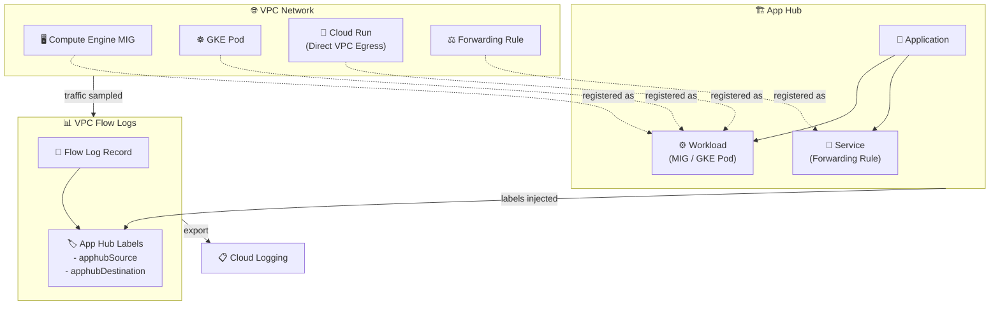

# Virtual Private Cloud: VPC Flow Logs に App Hub ラベルアノテーション機能を追加

**リリース日**: 2026-07-21

**サービス**: Virtual Private Cloud (VPC)

**機能**: VPC Flow Logs App Hub Labels

**ステータス**: Feature

📊 [このアップデートのインフォグラフィックを見る](https://takech9203.github.io/google-cloud-news-summary/20260721-vpc-flow-logs-app-hub-annotations.html)

## 概要

Google Cloud の VPC Flow Logs に App Hub ラベルアノテーション機能が追加されました。App Hub にワークロードまたはサービスとして登録された Google Cloud リソースについて、VPC Flow Logs のレコードにアプリケーション固有のラベル（application-specific labels）が自動的に付与されるようになります。

この機能により、ネットワークフローログにアプリケーションレベルのコンテキストが追加され、トラフィックがどのアプリケーション、サービス、ワークロードに関連しているかを直接的に把握できるようになります。従来はネットワークレベルの情報（IP アドレス、ポート、VM インスタンスなど）のみで通信を分析する必要がありましたが、App Hub のアプリケーション階層構造と統合されることで、ビジネスロジックに基づいたネットワーク分析が可能になります。

**アップデート前の課題**

- VPC Flow Logs はネットワークレイヤーの情報（IP、ポート、プロトコル）のみを記録しており、どのアプリケーションに属するトラフィックなのかを特定するには別途マッピング作業が必要だった
- マルチアプリケーション環境で、特定のアプリケーションに起因するネットワーク問題を切り分けるのに手間がかかっていた
- ネットワークフローログとアプリケーションのオーナーシップ情報が分離しており、インシデント対応時のエスカレーション先特定に時間を要していた

**アップデート後の改善**

- App Hub に登録されたリソースのトラフィックに対して、アプリケーション ID、環境タイプ、重要度などのラベルが自動的に付与される
- VPC Flow Logs のレコードから直接アプリケーションコンテキストを参照できるため、ネットワーク分析とアプリケーション管理の統合が実現
- ソースとデスティネーションの両方にラベルが付与されるため、アプリケーション間の通信パターンを可視化できる

## アーキテクチャ図



VPC Flow Logs が VPC ネットワーク内のトラフィックをサンプリングし、App Hub に登録されたリソースに関連するフローレコードにアプリケーション固有のラベルを自動付与する仕組みを示しています。

## サービスアップデートの詳細

### 主要機能

1. **App Hub ラベルの自動付与**
   - App Hub にワークロードまたはサービスとして登録されたリソースのトラフィックに対して、アプリケーション固有のラベルが自動的に VPC Flow Logs レコードに含まれる
   - 追加設定なしで、登録済みリソースのフローログに自動反映される

2. **対応リソースタイプ**
   - Compute Engine マネージドインスタンスグループ (MIG)
   - GKE Pod（CRON_JOB、DAEMON_SET、DEPLOYMENT、STATEFUL_SET ワークロードタイプ）
   - Cloud Run サービスおよびジョブ（Direct VPC Egress 設定済み）
   - フォワーディングルール

3. **ソース・デスティネーション両方のラベル付与**
   - 各フローログレコードに対して、最大 1 つのソースリソースと 1 つのデスティネーションリソースに App Hub ラベルが付与される
   - フォワーディングルールの場合、CLIENT/BACKEND フィールドによってソースかデスティネーションかが決定される

## 技術仕様

### App Hub ラベルのフォーマット

VPC Flow Logs の LogEntry に含まれる App Hub 関連フィールドは以下の 3 種類です。

| フィールド名 | 用途 |
|------|------|
| `apphub` | 一般的なリソースのアプリケーション情報 |
| `apphubSource` | エッジ型データ（VPC Flow Logs）のソース側アプリケーション情報 |
| `apphubDestination` | エッジ型データ（VPC Flow Logs）のデスティネーション側アプリケーション情報 |

### AppHub オブジェクトの構造

各フィールドには以下の階層構造でラベルが格納されます。

```json
{
  "apphubSource": {
    "application": {
      "container": "projects/my-project",
      "id": "my-app",
      "location": "us-central1"
    },
    "workload": {
      "criticalityType": "MISSION_CRITICAL",
      "environmentType": "PRODUCTION",
      "id": "my-workload-id"
    }
  },
  "apphubDestination": {
    "application": {
      "container": "projects/another-project",
      "id": "backend-app",
      "location": "us-central1"
    },
    "service": {
      "criticalityType": "HIGH",
      "environmentType": "PRODUCTION",
      "id": "my-service-id"
    }
  }
}
```

### メタデータとの関係

| 項目 | 詳細 |
|------|------|
| メタデータ設定との独立性 | App Hub ラベルは VPC Flow Logs メタデータアノテーションとは独立しており、メタデータやログフィルタリング設定の影響を受けない |
| ログフィルタリング | VPC Flow Logs のフィルタ設定は App Hub ラベルには適用されない |
| 追加料金 | App Hub ラベルは VPC Flow Logs の標準レコードの一部として含まれるため、追加のラベル固有料金は発生しない |

## 設定方法

### 前提条件

1. App Hub が有効化されたプロジェクトまたはフォルダ
2. App Hub にアプリケーションが作成済み
3. 対象リソースが App Hub にワークロードまたはサービスとして登録済み
4. VPC Flow Logs が対象サブネットまたはネットワークで有効化済み

### 手順

#### ステップ 1: App Hub でアプリケーションを作成しリソースを登録

```bash
# アプリケーションの作成
gcloud apphub applications create my-application \
  --project=PROJECT_ID \
  --location=global

# ワークロードの登録
gcloud apphub applications workloads create my-workload \
  --project=PROJECT_ID \
  --application=my-application \
  --location=global \
  --discovered-workload=DISCOVERED_WORKLOAD_URI
```

#### ステップ 2: VPC Flow Logs を有効化（未設定の場合）

```bash
# サブネットレベルで VPC Flow Logs を有効化
gcloud compute networks subnets update SUBNET_NAME \
  --region=REGION \
  --enable-flow-logs \
  --logging-metadata=include-all
```

#### ステップ 3: App Hub ラベルの確認

App Hub にリソースを登録すると、そのリソースに関連する VPC Flow Logs レコードに自動的に App Hub ラベルが付与されます。Cloud Logging で以下のようなクエリでフィルタリングできます。

```
resource.type="gce_subnetwork"
logName="projects/PROJECT_ID/logs/compute.googleapis.com%2Fvpc_flows"
labels.apphubSource.application.id="my-app"
```

## メリット

### ビジネス面

- **アプリケーションオーナーシップの明確化**: ネットワークトラフィックをアプリケーション単位で帰属させることで、コスト配分やインシデント対応のエスカレーション先が明確になる
- **コンプライアンス対応の強化**: 重要度（criticalityType）や環境（environmentType）によるトラフィック分類が自動化され、監査レポートの作成が容易になる

### 技術面

- **アプリケーション間通信の可視化**: ソースとデスティネーション両方の App Hub ラベルにより、アプリケーション間のトラフィックパターンを分析可能
- **トラブルシューティングの効率化**: ネットワーク問題発生時に、影響を受けるアプリケーションとその重要度を即座に特定できる
- **Google Cloud Observability との統合**: App Hub ラベルはメトリクス、トレースにも付与されるため、ネットワーク・アプリケーション・インフラの横断的な分析が可能

## デメリット・制約事項

### 制限事項

- 各フローログレコードには最大 1 つのソースリソースと 1 つのデスティネーションリソースの App Hub ラベルのみが付与される
- App Hub ラベルは VPC Flow Logs のメタデータフィルタリング設定の影響を受けない（常に含まれる/除外できない）
- 対象リソースが App Hub に登録されていない場合はラベルが付与されない

### 考慮すべき点

- App Hub へのリソース登録が前提条件となるため、既存環境への適用には App Hub のセットアップが必要
- GKE Pod のラベル付与は CRON_JOB、DAEMON_SET、DEPLOYMENT、STATEFUL_SET の 4 種類のワークロードタイプに限定される
- Cloud Run は Direct VPC Egress が設定されている場合のみ対応

## ユースケース

### ユースケース 1: マルチアプリケーション環境でのネットワークコスト配分

**シナリオ**: 共有 VPC 環境で複数のアプリケーションが稼働しており、アプリケーション単位でのネットワークコストを把握したい場合。

**効果**: VPC Flow Logs の App Hub ラベルを利用して、アプリケーション ID ごとにトラフィック量を集計し、正確なコスト配分レポートを自動生成できる。

### ユースケース 2: セキュリティインシデント対応での影響範囲特定

**シナリオ**: 不正なトラフィックが検出された際に、影響を受けるアプリケーションとその重要度を迅速に特定したい場合。

**効果**: App Hub の criticalityType ラベルを利用して、MISSION_CRITICAL なアプリケーションへのトラフィック異常を優先的に対処できる。Cloud Logging でアプリケーション単位のフローログを即座にフィルタリング可能。

### ユースケース 3: アプリケーション間依存関係の可視化

**シナリオ**: マイクロサービスアーキテクチャ環境で、アプリケーション間のネットワーク依存関係を把握し、アーキテクチャの最適化や障害影響分析を行いたい場合。

**効果**: apphubSource と apphubDestination の組み合わせから、アプリケーション間のトラフィックフローを自動的にマッピングし、依存関係グラフを構築できる。

## 料金

VPC Flow Logs の料金は [Network Telemetry pricing](https://cloud.google.com/vpc/pricing#network-telemetry) に準拠します。App Hub ラベルの付与自体に追加料金は発生しませんが、ラベル情報が含まれることでログレコードのサイズが増加するため、Cloud Logging への取り込み・保存料金に若干の影響があります。

App Hub 自体の料金については [App Hub の料金ページ](https://cloud.google.com/app-hub/pricing) を参照してください。

## 関連サービス・機能

- **[App Hub](https://cloud.google.com/app-hub/docs/overview)**: アプリケーション単位でリソースを管理・登録する基盤サービス。本機能の前提条件
- **[Cloud Logging](https://cloud.google.com/logging/docs)**: VPC Flow Logs の出力先。App Hub ラベルを含むフローログの検索・分析が可能
- **[Google Cloud Observability (Application Monitoring)](https://cloud.google.com/stackdriver/docs/observability/application-monitoring-labels)**: App Hub ラベルはメトリクスやトレースにも同様に付与され、統合的なアプリケーション監視を実現
- **[Network Intelligence Center](https://cloud.google.com/network-intelligence-center/docs)**: VPC Flow Logs を活用したネットワーク分析・トラブルシューティングツール

## 参考リンク

- 📊 [インフォグラフィック](https://takech9203.github.io/google-cloud-news-summary/20260721-vpc-flow-logs-app-hub-annotations.html)
- [公式リリースノート](https://docs.cloud.google.com/release-notes#July_21_2026)
- [VPC Flow Logs レコードフォーマット - App Hub labels](https://docs.cloud.google.com/vpc/docs/about-flow-logs-records)
- [App Hub 概要](https://docs.cloud.google.com/app-hub/docs/overview)
- [Application Monitoring Labels](https://docs.cloud.google.com/stackdriver/docs/observability/application-monitoring-labels)
- [VPC Flow Logs の設定](https://docs.cloud.google.com/vpc/docs/using-flow-logs)
- [Network Telemetry 料金](https://cloud.google.com/vpc/pricing#network-telemetry)

## まとめ

VPC Flow Logs への App Hub ラベルアノテーション機能は、ネットワーク可観測性とアプリケーション管理の統合における重要なアップデートです。App Hub にリソースを登録するだけで、VPC Flow Logs にアプリケーションコンテキストが自動付与されるため、マルチアプリケーション環境でのネットワーク分析・コスト配分・セキュリティ対応が大幅に効率化されます。既に App Hub を利用している組織は追加設定なしで恩恵を受けることができ、未導入の組織にとっては App Hub 導入を検討する動機となる機能です。

---

**タグ**: #VPC #FlowLogs #AppHub #Networking #Observability #ApplicationMonitoring #NetworkTelemetry
