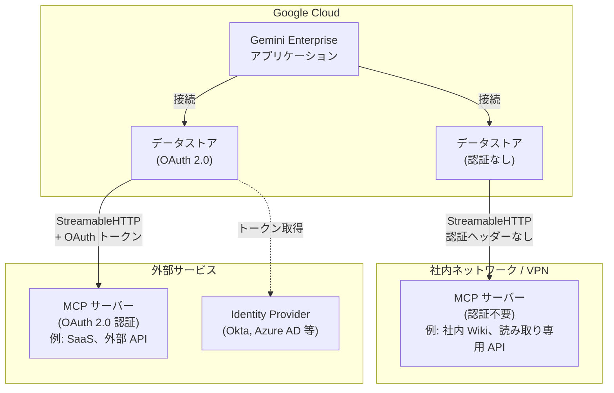

# Gemini Enterprise: 認証不要カスタム MCP サーバーデータストアのサポート (Preview)

**リリース日**: 2026-07-22

**サービス**: Gemini Enterprise

**機能**: 認証不要カスタム MCP サーバーデータストア (No Authentication)

**ステータス**: Public Preview

[このアップデートのインフォグラフィックを見る](https://takech9203.github.io/google-cloud-news-summary/20260722-gemini-enterprise-unauthenticated-mcp-server.html)

## 概要

Gemini Enterprise のカスタム MCP (Model Context Protocol) サーバーデータストアの設定において、認証が不要な MCP サーバーに接続する際に「No authentication (認証なし)」オプションを選択できるようになりました。これにより、社内向けの読み取り専用 MCP サーバーや、ネットワークレベルのセキュリティで保護された MCP サーバーへの接続が大幅に簡素化されます。

カスタム MCP サーバーデータストア機能自体が Public Preview として提供されており、今回のアップデートでは認証方式の選択肢が拡充されました。従来は OAuth 2.0 認証の設定が必須でしたが、MCP サーバー側で認証を必要としない構成の場合、MCP サーバーの URL を入力するだけで接続が完了します。

この機能は、社内ツールやレガシーシステムを MCP プロトコル経由で Gemini Enterprise に統合したい組織にとって、導入の障壁を下げる重要なアップデートです。

**アップデート前の課題**

- カスタム MCP サーバーデータストアの作成時に OAuth 2.0 認証の設定が必須であり、認証が不要なサーバーへの接続にも OAuth の構成が求められていた
- 社内ネットワーク内の読み取り専用 MCP サーバーを接続するために、不要な OAuth インフラの構築が必要だった
- 認証設定の複雑さにより、PoC (概念実証) やプロトタイピング段階での検証に時間がかかっていた

**アップデート後の改善**

- 認証不要の MCP サーバーに対して「No authentication」を選択し、URL を入力するだけで接続が完了するようになった
- OAuth インフラが不要な MCP サーバーへの接続設定が大幅に簡素化された
- PoC やプロトタイピング段階での迅速な検証が可能になった

## アーキテクチャ図



Gemini Enterprise からカスタム MCP サーバーへの接続パターンを示しています。認証不要パス (左) では URL 指定のみで接続が完了し、OAuth 2.0 パス (右) では Identity Provider を介したトークン取得が必要です。

## サービスアップデートの詳細

### 主要機能

1. **認証なし (No Authentication) オプション**
   - MCP サーバーが認証を必要としない場合に選択可能
   - 必要な入力は MCP サーバー URL のみ
   - HTTPS URL が必須 (例: `https://mcp.example.com/mcp`)

2. **StreamableHTTP トランスポート対応**
   - Gemini Enterprise は StreamableHTTP トランスポートのみをサポート
   - 旧来の Server-Sent Events (SSE) トランスポートは非対応
   - URL は通常 `/mcp` で終わる形式

3. **アクション管理**
   - 接続後、MCP サーバーのツールはデータストアの「アクション」としてインポートされる
   - デフォルトではすべてのアクションが無効化されており、管理者が個別に有効化する
   - 最適なパフォーマンスのため、同時に有効化できるアクションは最大 100 個

4. **ツールアノテーション対応**
   - `readOnlyHint` アノテーションにより、読み取り専用操作のユーザー確認をスキップ可能
   - `destructiveHint` アノテーションにより、データ変更操作は確認を維持

## 技術仕様

### 認証方式の比較

| 項目 | No Authentication | OAuth 2.0 |
|------|-------------------|-----------|
| 必要な入力 | MCP サーバー URL のみ | URL + Authorization URL + Token URL + Client ID + Client Secret + Scopes |
| 前提条件 | HTTPS URL | OAuth アプリケーション登録、Identity Provider 設定 |
| ユースケース | 社内読み取り専用サーバー、ネットワークレベル認証 | 外部 SaaS 連携、ユーザーレベル認証が必要な場合 |
| PKCE サポート | 不要 | オプションで有効化可能 |

### 制限事項

| 項目 | 詳細 |
|------|------|
| トランスポート | StreamableHTTP のみ (SSE 非対応) |
| Private Service Connect | 現バージョンでは非対応 |
| VPC Service Controls | 現プレビューでは非対応 |
| アクション上限 | 同時有効化は最大 100 |
| URL 要件 | HTTPS 必須 |

## 設定方法

### 前提条件

1. Organization Policy Administrator ロール (`roles/orgpolicy.policyAdmin`) を持つユーザーが、カスタム MCP サーバーのブロック制約をオーバーライドしていること
2. Discovery Engine Editor ロール (`roles/discoveryengine.editor`) が付与されていること
3. MCP サーバーの FQDN がエグレスポリシーで許可されていること

### 手順

#### ステップ 1: 組織ポリシーのオーバーライド

Google Cloud コンソールで Organization Policies ページに移動し、「Disable custom MCP server connector for Gemini Enterprise」ポリシーを「Not enforced」に設定します。

```
Organization Policies > Disable custom MCP server connector for Gemini Enterprise
  > Manage Policy > Override parent's policy > Enforcement: OFF
```

#### ステップ 2: データストアの作成

```
Google Cloud コンソール > Gemini Enterprise > Data stores > Create data store
  > Custom MCP Server を選択 > Add MCP server
```

#### ステップ 3: 認証方式の選択

認証が不要な MCP サーバーの場合:

1. 「No authentication」を選択
2. MCP サーバー URL を入力 (例: `https://mcp.internal.example.com/mcp`)
3. 「Continue」をクリック

#### ステップ 4: データストアの構成

1. MCP Server Description フィールドにサーバーの説明を入力
2. ロケーション (Multi-region) を選択
3. データコネクタ名を入力
4. 「Create」をクリック

#### ステップ 5: アクションの有効化

1. データストアの状態が「Active」になるまで待機
2. Actions > Reload custom actions をクリック
3. 有効化するアクションを選択
4. 「Enable actions」をクリック

## メリット

### ビジネス面

- **導入コスト削減**: OAuth インフラの構築・管理が不要になり、初期導入のコストと時間を削減
- **PoC の迅速化**: 認証設定なしですぐに MCP サーバーとの連携をテスト可能
- **社内データ活用の促進**: 社内システムへの接続障壁が下がり、AI エージェントによるデータ活用が加速

### 技術面

- **設定の簡素化**: URL 入力のみでデータストア作成が完了
- **柔軟な認証モデル**: ネットワークレベル認証 (VPN、ファイアウォール等) との組み合わせが容易
- **段階的なセキュリティ実装**: 開発時は認証なしで開始し、本番では OAuth に切り替える段階的アプローチが可能

## デメリット・制約事項

### 制限事項

- Preview 段階のため、本番ワークロードでの使用は推奨されない
- StreamableHTTP トランスポートのみ対応 (SSE は非対応)
- Private Service Connect (PSC) 非対応
- VPC Service Controls 非対応

### 考慮すべき点

- 認証なしの MCP サーバーはネットワークレベルのセキュリティ (VPN、IAP、ファイアウォールルール等) で保護することを強く推奨
- データストア経由のトラフィックは Agent Gateway を経由しないため、Agent Gateway ポリシーは適用されない
- 組織ポリシーのオーバーライドはプロジェクト単位で行うこと (組織全体への適用は避ける)

## ユースケース

### ユースケース 1: 社内ナレッジベースへの接続

**シナリオ**: 社内 Wiki や技術ドキュメントシステムが MCP サーバーとして公開されており、VPN 内からのアクセスに認証が不要な場合。

**実装例**:
```
MCP サーバー URL: https://wiki.internal.corp.example.com/mcp
認証: No authentication
有効化アクション: search_documents, get_page_content
アノテーション: readOnlyHint: true
```

**効果**: 従業員が Gemini Enterprise を通じて社内ナレッジに自然言語でアクセスでき、情報検索の効率が向上する。

### ユースケース 2: レガシー API のラッパー

**シナリオ**: レガシーシステムの REST API を MCP プロトコルでラップし、Gemini Enterprise から利用可能にする。API はネットワークファイアウォールで保護されている。

**効果**: レガシーシステムの改修なしに、AI エージェント経由でのデータアクセスが実現する。

### ユースケース 3: 開発・検証環境での PoC

**シナリオ**: 新しい MCP サーバーの開発中に、認証なしで素早く Gemini Enterprise との統合をテストしたい場合。

**効果**: OAuth 設定なしで迅速に統合テストを実施でき、開発サイクルが短縮される。

## 料金

Gemini Enterprise のカスタム MCP サーバーデータストアの料金は、Gemini Enterprise のライセンス体系に含まれます。データストア作成時に「General pricing」または「Configurable pricing」を選択できます。

詳細な料金情報については以下を参照してください:
- [Gemini Enterprise ライセンス](https://docs.cloud.google.com/gemini/enterprise/docs/licenses)

## 利用可能リージョン

カスタム MCP サーバーデータストアは以下のリージョンで利用可能です:

| Gemini Enterprise アプリのロケーション | Agent Gateway ロケーション | Agent Registry ロケーション |
|--------------------------------------|---------------------------|---------------------------|
| global | us-central1 | us-central1, us, または global |
| us | us-central1 | us-central1 または us |
| eu | europe-west1 | europe-west1 または eu |

## 関連サービス・機能

- **Agent Registry**: MCP サーバーの一元管理カタログ。カスタム MCP サーバー以外の MCP サーバーは Agent Registry から追加可能
- **Agent Gateway**: MCP サーバーへのトラフィック制御とランタイムポリシー適用を担当 (ただし直接設定のカスタム MCP サーバーには適用されない)
- **Organization Policy Service**: カスタム MCP サーバーの有効化/無効化を組織ポリシーで制御
- **VPC Service Controls**: データストアのエグレス制御 (現プレビューでは非対応)
- **Discovery Engine**: Gemini Enterprise のデータストア基盤

## 参考リンク

- [インフォグラフィック](https://takech9203.github.io/google-cloud-news-summary/20260722-gemini-enterprise-unauthenticated-mcp-server.html)
- [カスタム MCP サーバーデータストアの設定](https://docs.cloud.google.com/gemini/enterprise/docs/connectors/custom-mcp-server/set-up-custom-mcp-server)
- [カスタム MCP データストアの組織ポリシーオーバーライド](https://docs.cloud.google.com/gemini/enterprise/docs/connectors/custom-mcp-server/override-constraint-for-custom-mcp-data-stores)
- [Agent Registry からの MCP サーバーインポート](https://docs.cloud.google.com/gemini/enterprise/docs/connectors/custom-mcp-server/import-govern-mcp-server-agent-registry)
- [コネクタとデータストアの概要](https://docs.cloud.google.com/gemini/enterprise/docs/connectors/introduction-to-connectors-and-data-stores)

## まとめ

Gemini Enterprise のカスタム MCP サーバーデータストアに「認証なし」オプションが追加されたことで、OAuth 設定が不要な社内 MCP サーバーへの接続が大幅に簡素化されました。ネットワークレベルでセキュリティが確保された社内システムや PoC 環境での活用に特に有効です。Preview 段階であるため本番運用には注意が必要ですが、MCP プロトコルを活用した社内データ統合を検討している組織は、まず開発環境でこの機能を試し、Gemini Enterprise と社内ツールの統合パターンを検証することを推奨します。

---

**タグ**: #GeminiEnterprise #MCP #ModelContextProtocol #DataStore #Preview #Authentication #Connector #AgentPlatform
