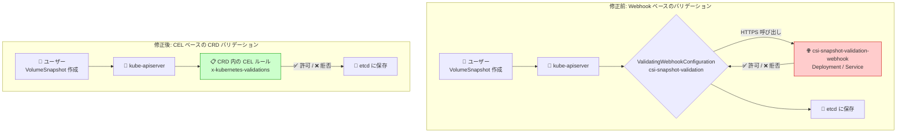

# Google Distributed Cloud (software only) for bare metal: バージョン 1.34.700-gke.93 リリース (CSI スナップショット検証の CEL 移行)

**リリース日**: 2026-07-22

**サービス**: Google Distributed Cloud (software only) for bare metal

**機能**: バージョン 1.34.700-gke.93 - csi-snapshot-validation-webhook の廃止と CEL ベース CRD バリデーションへの移行

**ステータス**: Feature / Fixed

📊 [このアップデートのインフォグラフィックを見る](https://takech9203.github.io/google-cloud-news-summary/20260722-google-distributed-cloud-bare-metal-1-34-700.html)

## 概要

Google Distributed Cloud (software only) for bare metal のバージョン 1.34.700-gke.93 がリリースされた。本リリースは Kubernetes v1.34.7-gke.200 上で動作し、非推奨となっていた `csi-snapshot-validation-webhook` コンポーネントの削除が主要な変更点である。ボリュームスナップショットのバリデーションは、Kubernetes ネイティブの Common Expression Language (CEL) ルールによって CRD (Custom Resource Definition) 内で直接処理されるようになった。

この変更は Kubernetes エコシステム全体で進行している「Webhook ベースのバリデーションから CRD 内蔵の CEL バリデーションへの移行」という大きなアーキテクチャ変更の一環である。Webhook を排除することで、クラスタの運用複雑性が低減し、バリデーションのレイテンシが改善され、可用性に関する単一障害点が削除される。

リリース後、GKE On-Prem API クライアント (Google Cloud コンソール、gcloud CLI、Terraform) でインストールまたはアップグレードが可能になるまで約 7〜14 日かかる。

**アップデート前の課題**

- CSI ボリュームスナップショットのバリデーションには、専用の Webhook サーバー (`csi-snapshot-validation-webhook`) が Deployment として稼働する必要があった
- Webhook が利用不能な場合 (Pod 再起動中、ノード障害時など)、VolumeSnapshot リソースの作成・更新がブロックまたはタイムアウトする可能性があった
- Webhook の TLS 証明書管理、Service 設定、ValidatingWebhookConfiguration のメンテナンスが必要で運用負荷が高かった
- Webhook 呼び出しによるネットワークホップが API リクエストのレイテンシを増加させていた

**アップデート後の改善**

- `csi-snapshot-validation-webhook` が完全に削除され、関連する Deployment、Service、ValidatingWebhookConfiguration が不要になった
- バリデーションは CRD 内の CEL ルールとして定義され、kube-apiserver が直接評価するためネットワークホップが不要になった
- Webhook の可用性に依存しなくなり、バリデーションの信頼性が向上した
- 運用すべきコンポーネントが減少し、クラスタのリソース消費が軽減された

## アーキテクチャ図



本図は、VolumeSnapshot リソースのバリデーション処理が Webhook ベースから CRD 内蔵 CEL ルールへ移行した前後のアーキテクチャ比較を示している。修正後はネットワークホップが不要となり、kube-apiserver 内で直接バリデーションが完結する。

## サービスアップデートの詳細

### 主要機能

1. **csi-snapshot-validation-webhook の削除**
   - 非推奨 (deprecated) であった `csi-snapshot-validation-webhook` コンポーネントが完全に削除された
   - 関連する Deployment、Service、ValidatingWebhookConfiguration、RBAC リソースが不要になった
   - アップグレード時に自動的にクリーンアップされる

2. **CEL ベースの CRD バリデーションへの移行**
   - VolumeSnapshot および VolumeSnapshotContent CRD に `x-kubernetes-validations` フィールドとして CEL ルールが埋め込まれた
   - Kubernetes の upstream で導入された CEL admission control の仕組みをそのまま活用
   - バリデーションロジックの変更なし (同等のルールが CEL で表現される)

3. **セキュリティ脆弱性の修正**
   - 詳細は [Vulnerability fixes](https://cloud.google.com/kubernetes-engine/distributed-cloud/bare-metal/docs/vulnerabilities) を参照

## 技術仕様

### バージョン情報

| 項目 | 詳細 |
|------|------|
| リリースバージョン | 1.34.700-gke.93 |
| Kubernetes バージョン | v1.34.7-gke.200 |
| マイナーバージョン系列 | 1.34 |
| API クライアント利用可能日 | リリース後 7〜14 日 |

### CEL バリデーション技術詳細

| 項目 | 詳細 |
|------|------|
| CEL バージョン | Kubernetes 1.34 組み込み CEL ライブラリ |
| 対象 CRD | VolumeSnapshot (snapshot.storage.k8s.io/v1) |
| 対象 CRD | VolumeSnapshotContent (snapshot.storage.k8s.io/v1) |
| 対象 CRD | VolumeSnapshotClass (snapshot.storage.k8s.io/v1) |
| バリデーション方式 | CRD の `spec.versions[].schema.openAPIV3Schema` 内の `x-kubernetes-validations` |
| 評価タイミング | API リクエスト受信時 (kube-apiserver 内部) |

### 削除されたコンポーネント

| リソース種別 | リソース名 |
|------|------|
| Deployment | csi-snapshot-validation-webhook |
| Service | csi-snapshot-validation-webhook |
| ValidatingWebhookConfiguration | validation-webhook.snapshot.storage.k8s.io |
| ServiceAccount | csi-snapshot-validation-webhook |
| ClusterRole | csi-snapshot-validation-webhook |
| ClusterRoleBinding | csi-snapshot-validation-webhook |

### CEL ルールの例

```yaml
# VolumeSnapshot CRD 内のバリデーション例 (概念的表現)
x-kubernetes-validations:
  - rule: "has(self.spec.source.persistentVolumeClaimName) || has(self.spec.source.volumeSnapshotContentName)"
    message: "spec.source must specify either persistentVolumeClaimName or volumeSnapshotContentName"
  - rule: "!(has(self.spec.source.persistentVolumeClaimName) && has(self.spec.source.volumeSnapshotContentName))"
    message: "spec.source must specify only one of persistentVolumeClaimName or volumeSnapshotContentName"
```

## 設定方法

### 前提条件

1. 最新の `bmctl` バイナリ (1.34.700-gke.93) をダウンロード済みであること
2. Application Default Credentials (ADC) が設定済みであること
3. サードパーティストレージベンダーを使用している場合、[Google Distributed Cloud-ready storage partners](https://cloud.google.com/kubernetes-engine/enterprise/docs/resources/partner-storage) ドキュメントで互換性を確認すること
4. CSI ドライバーがボリュームスナップショットをサポートしている場合、ドライバー側の互換性も確認すること

### 手順

#### ステップ 1: 現在のバージョンの確認

```bash
kubectl get cluster <CLUSTER_NAME> -n cluster-<CLUSTER_NAME> \
  --kubeconfig <ADMIN_KUBECONFIG> \
  -o jsonpath='{.status.anthosBareMetalVersion}'
```

#### ステップ 2: クラスタ構成ファイルの更新

```yaml
apiVersion: baremetal.cluster.gke.io/v1
kind: Cluster
metadata:
  name: my-cluster
  namespace: cluster-my-cluster
spec:
  anthosBareMetalVersion: 1.34.700-gke.93
```

#### ステップ 3: クラスタのアップグレード

```bash
bmctl upgrade cluster -c CLUSTER_NAME --kubeconfig ADMIN_KUBECONFIG
```

アップグレード時に `csi-snapshot-validation-webhook` 関連リソースは自動的に削除される。

#### ステップ 4: アップグレード後の確認

```bash
# Webhook が削除されていることを確認
kubectl get validatingwebhookconfiguration | grep snapshot

# CRD にバリデーションルールが含まれていることを確認
kubectl get crd volumesnapshots.snapshot.storage.k8s.io -o yaml | grep "x-kubernetes-validations"

# VolumeSnapshot の作成テスト (CSI ドライバーがインストールされている場合)
kubectl apply -f - <<EOF
apiVersion: snapshot.storage.k8s.io/v1
kind: VolumeSnapshot
metadata:
  name: test-snapshot
spec:
  source:
    persistentVolumeClaimName: my-pvc
EOF
```

## メリット

### ビジネス面

- **運用負荷の軽減**: Webhook の監視、証明書更新、トラブルシューティングが不要になり、SRE チームの負担が軽減される
- **可用性の向上**: Webhook Pod のダウンタイムがバリデーション全体に影響を与えなくなり、ストレージ操作の信頼性が向上
- **アップグレードの簡素化**: 管理すべきコンポーネントが減少し、クラスタアップグレード時の問題発生リスクが低下

### 技術面

- **レイテンシの改善**: Webhook へのネットワークホップが不要となり、VolumeSnapshot 作成時の API レイテンシが低減
- **リソース消費の削減**: Webhook 用の Deployment (Pod、CPU、メモリ) が不要になり、クラスタリソースが節約される
- **単一障害点の排除**: バリデーションが kube-apiserver 内で完結するため、Webhook Pod の障害による影響がなくなる
- **セキュリティ面の簡素化**: Webhook 用 TLS 証明書の管理が不要になる

## デメリット・制約事項

### 制限事項

- リリース後、GKE On-Prem API クライアント (コンソール、gcloud CLI、Terraform) で利用可能になるまで 7〜14 日かかる
- CEL ルールは kube-apiserver のバージョンに依存するため、カスタム CEL ルールの追加には制約がある
- Webhook ベースのカスタムバリデーション (外部ポリシーエンジンなど) を併用していた場合は、別途対応が必要

### 考慮すべき点

- `csi-snapshot-validation-webhook` に依存するカスタム監視やアラートルールを設定している場合は、アップグレード前に削除または更新すること
- サードパーティ CSI ドライバーが独自の Webhook を提供している場合は影響を受けない (本変更は Kubernetes の snapshot CRD のバリデーションのみが対象)
- アップグレード中も既存の VolumeSnapshot リソースは影響を受けない (データの損失はない)

## ユースケース

### ユースケース 1: CSI ボリュームスナップショットの運用

**シナリオ**: オンプレミス環境で CSI ドライバー (NetApp Trident、Pure Storage など) を使用してステートフルアプリケーションのデータ保護を行っている。VolumeSnapshot を定期的に作成してバックアップとして利用したい。

**実装例**:
```yaml
apiVersion: snapshot.storage.k8s.io/v1
kind: VolumeSnapshot
metadata:
  name: database-backup-20260722
  namespace: production
spec:
  volumeSnapshotClassName: csi-snapclass
  source:
    persistentVolumeClaimName: postgres-data
---
apiVersion: snapshot.storage.k8s.io/v1
kind: VolumeSnapshotClass
metadata:
  name: csi-snapclass
driver: csi.example.com
deletionPolicy: Retain
```

**効果**: Webhook の可用性を気にすることなく、いつでも安定してスナップショットのバリデーションと作成が実行される。

### ユースケース 2: 大規模クラスタでのリソース効率化

**シナリオ**: 数百ノードの大規模オンプレミスクラスタを運用しており、コントロールプレーンのリソース効率を最大化したい。

**効果**: csi-snapshot-validation-webhook の Deployment が削除されることで、コントロールプレーンノードの CPU とメモリが節約される。また Webhook 呼び出しに伴う kube-apiserver のゴルーチンやネットワーク接続も削減され、高負荷時のパフォーマンスが改善される。

## 料金

Google Distributed Cloud (software only) for bare metal の料金は、クラスタの vCPU 数に基づく課金モデルとなっている。詳細は [料金ページ](https://cloud.google.com/kubernetes-engine/distributed-cloud/bare-metal/pricing) を参照。本パッチリリース自体による追加料金は発生しない。

## 利用可能リージョン

Google Distributed Cloud for bare metal はオンプレミス環境で動作するため、特定の Google Cloud リージョンに依存しない。ただし、GKE On-Prem API クライアント (コンソール、gcloud CLI、Terraform) を使用する場合は、クラスタ登録時に指定した Google Cloud リージョンに関連付けられる。

## 関連サービス・機能

- **GKE Enterprise**: Google Distributed Cloud for bare metal は GKE Enterprise の一部として提供され、マルチクラスタ管理、ポリシー管理、サービスメッシュなどの機能を利用可能
- **CSI ドライバー**: サードパーティストレージベンダーが提供する CSI ドライバーと連携し、VolumeSnapshot 機能を提供。GDC Ready ストレージパートナーとの互換性が確認されている
- **Kubernetes VolumeSnapshot API**: snapshot.storage.k8s.io/v1 API グループの VolumeSnapshot、VolumeSnapshotContent、VolumeSnapshotClass リソースが CEL バリデーション付きで提供される
- **Cloud Monitoring / Cloud Logging**: クラスタのメトリクスとログを Google Cloud に送信し、統合的な可観測性を実現
- **Config Sync**: GitOps ベースの構成管理により、CSI ドライバー設定やストレージクラスの一貫したデプロイが可能

## 参考リンク

- 📊 [インフォグラフィック](https://takech9203.github.io/google-cloud-news-summary/20260722-google-distributed-cloud-bare-metal-1-34-700.html)
- [公式リリースノート](https://cloud.google.com/kubernetes-engine/distributed-cloud/bare-metal/docs/release-notes#July_22_2026)
- [クラスタのアップグレード手順](https://cloud.google.com/kubernetes-engine/distributed-cloud/bare-metal/docs/how-to/upgrade)
- [ボリュームスナップショットの使用](https://cloud.google.com/kubernetes-engine/docs/how-to/persistent-volumes/volume-snapshots)
- [脆弱性修正一覧](https://cloud.google.com/kubernetes-engine/distributed-cloud/bare-metal/docs/vulnerabilities)
- [CSI ドライバーのインストール](https://cloud.google.com/kubernetes-engine/distributed-cloud/bare-metal/docs/installing/install-csi-driver)
- [GDC Ready ストレージパートナー](https://cloud.google.com/kubernetes-engine/enterprise/docs/resources/partner-storage)
- [料金ページ](https://cloud.google.com/kubernetes-engine/distributed-cloud/bare-metal/pricing)

## まとめ

Google Distributed Cloud for bare metal 1.34.700-gke.93 は、非推奨の `csi-snapshot-validation-webhook` を削除し、Kubernetes ネイティブの CEL ベース CRD バリデーションへ移行した重要なリリースである。この変更により、ボリュームスナップショットのバリデーション処理から Webhook という単一障害点が排除され、レイテンシの改善とクラスタ運用の簡素化が実現される。CSI ボリュームスナップショットを利用している環境では、アップグレード後にカスタム監視ルールの更新を確認することを推奨する。

---

**タグ**: #GoogleDistributedCloud #BareMetal #CSI #VolumeSnapshot #CEL #Kubernetes #GKEEnterprise #オンプレミス #CRD #バリデーション
