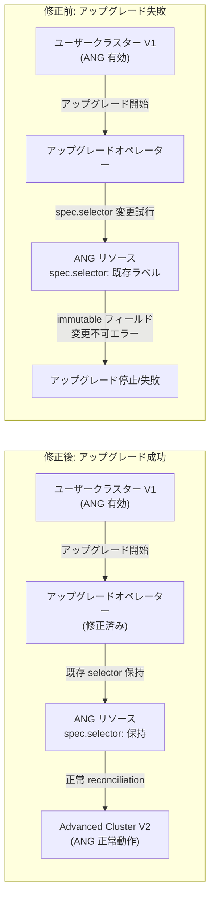

# Google Distributed Cloud (software only) for VMware: バージョン 1.35.300 / 1.34.700 リリース - ANG アップグレード問題の修正

**リリース日**: 2026-07-22

**サービス**: Google Distributed Cloud (software only) for VMware

**機能**: Anthos Network Gateway (ANG) アップグレード問題の修正、脆弱性対応

**ステータス**: GA (一般提供)

[このアップデートのインフォグラフィックを見る](https://takech9203.github.io/google-cloud-news-summary/20260722-google-distributed-cloud-vmware-1-35-300.html)

## 概要

Google Distributed Cloud (software only) for VMware の 2 つの新バージョンがリリースされた。1.35.300-gke.87 (Kubernetes v1.35.3-gke.400) と 1.34.700-gke.93 (Kubernetes v1.34.7-gke.200) がダウンロード可能になっている。

今回のリリースの主要な修正は、Anthos Network Gateway (ANG) が有効なユーザークラスターを Advanced Cluster にアップグレードする際に、処理が停止または失敗する問題の解決である。以前のバージョンでは、アップグレードプロセスが既存の ANG リソースの不変 (immutable) な `spec.selector` フィールドを変更しようとしていたため、V1 から V2 へのクラスターマイグレーションが完了しなかった。この修正はバージョン 1.35.300 と 1.34.700 の両方に含まれており、既存環境の段階的なアップグレードパスを提供している。

**アップデート前の課題**

- ANG が有効なユーザークラスターを Advanced Cluster にアップグレードすると、プロセスが停止 (stall) または失敗していた
- アップグレードオペレーターが既存の ANG リソースの不変な `spec.selector` フィールドを変更しようとしていた
- V1 から V2 (Advanced Cluster) へのクラスターマイグレーションが正常に完了しなかった
- ANG を使用している環境では、手動での回避策なしにアップグレードを進めることができなかった

**アップデート後の改善**

- アップグレードオペレーターが reconciliation 時に既存のラベルセレクターを保持するようになった
- ANG が有効なクラスターでも V1 から V2 (Advanced Cluster) へのマイグレーションが正常に完了する
- 1.34 系と 1.35 系の両方で修正が提供され、アップグレードパスの柔軟性が確保された

## アーキテクチャ図



修正前はアップグレードオペレーターが ANG リソースの不変フィールドを変更しようとして失敗していたが、修正後はオペレーターが既存のラベルセレクターを保持したまま reconciliation を行うため、V1 から V2 へのマイグレーションが正常に完了する。

## サービスアップデートの詳細

### 主要機能

1. **ANG アップグレード問題の修正 (1.35.300-gke.87 / 1.34.700-gke.93)**
   - Anthos Network Gateway が有効なユーザークラスターの Advanced Cluster へのアップグレードが正常に動作するようになった
   - アップグレードオペレーターが reconciliation 中に既存のラベルセレクターを保持する
   - `spec.selector` フィールドは Kubernetes の Service や Deployment で不変として扱われるフィールドであり、既存リソースに対する変更は拒否される
   - V1 (非 Advanced) から V2 (Advanced Cluster) へのクラスターマイグレーションが正常に完了する

2. **脆弱性修正 (1.34.700-gke.93)**
   - セキュリティ脆弱性の修正が含まれている
   - 詳細は Google Distributed Cloud の脆弱性修正ページで公開

3. **Kubernetes バージョン対応**
   - 1.35.300-gke.87: Kubernetes v1.35.3-gke.400 で動作
   - 1.34.700-gke.93: Kubernetes v1.34.7-gke.200 で動作

## 技術仕様

### リリースバージョン詳細

| 項目 | 1.35.300-gke.87 | 1.34.700-gke.93 |
|------|-----------------|-----------------|
| Kubernetes バージョン | v1.35.3-gke.400 | v1.34.7-gke.200 |
| ANG アップグレード修正 | 含む | 含む (バックポート) |
| 脆弱性修正 | - | 含む |
| GKE On-Prem API 利用可能 | リリース後 7-14 日 | リリース後 7-14 日 |

### Anthos Network Gateway (ANG) の技術的背景

| 項目 | 詳細 |
|------|------|
| 機能 | Egress NAT Gateway によるソース IP の予測可能性の確保 |
| 対象リソース | NetworkGatewayGroup (旧 AnthosNetworkGateway) |
| 問題箇所 | `spec.selector` フィールド (Kubernetes の immutable フィールド) |
| 修正内容 | アップグレードオペレーターが reconciliation 時に既存セレクターを保持 |
| 影響範囲 | ANG が有効な V1 クラスターから Advanced Cluster (V2) へのアップグレード |

### Advanced Cluster について

Advanced Cluster は Google Distributed Cloud for VMware の新しいクラスターアーキテクチャで、以下の特徴がある:

- バージョン 1.33 以降、新規作成されるクラスターはすべて Advanced Cluster
- バージョン 1.34 へのアップグレード時、非 Advanced クラスターは自動的に Advanced Cluster に変換される
- Google Distributed Cloud for Bare Metal と共通のプラットフォームアーキテクチャを使用
- トポロジードメイン、VM-Host アフィニティグループなどの高度な機能にアクセス可能

## 設定方法

### 前提条件

1. Google Distributed Cloud (software only) for VMware 環境が構築済みであること
2. アップグレード先バージョン (1.35.300-gke.87 または 1.34.700-gke.93) をダウンロード済みであること
3. サードパーティストレージベンダーを使用している場合、対応バージョンの認定を確認済みであること

### 手順

#### ステップ 1: アップグレードバージョンの確認

```bash
# 現在のクラスターバージョンを確認
gkectl version

# ダウンロードしたバンドルの確認
ls /path/to/bundle/
```

ANG が有効かどうかは、ユーザークラスター構成ファイルの `enableAnthosNetworkGateway` または `advancedNetworking` フィールドで確認できる。

#### ステップ 2: クラスターのアップグレード実行

```bash
# ユーザークラスターのアップグレード
gkectl upgrade cluster \
  --kubeconfig /path/to/admin-kubeconfig \
  --config /path/to/user-cluster-config.yaml
```

非 Advanced クラスターから Advanced Cluster へのアップグレードは `gkectl` コマンドラインツールを使用する必要がある (GKE On-Prem API クライアント、Terraform、Google Cloud コンソール、gcloud CLI は非対応)。

#### ステップ 3: アップグレード後の確認

```bash
# クラスターの状態を確認
gkectl diagnose cluster \
  --kubeconfig /path/to/admin-kubeconfig \
  --cluster-name <user-cluster-name>

# ANG リソースの状態確認
kubectl get networkgatewaygroups -A
```

## メリット

### ビジネス面

- **アップグレードパスの確保**: ANG を使用している環境でもダウンタイムなくクラスターの最新化が可能になった
- **運用リスクの低減**: 以前は手動回避策が必要だったアップグレード作業が自動的に成功するようになった
- **マルチバージョン対応**: 1.34 系と 1.35 系の両方で修正が提供され、段階的なアップグレード計画に柔軟に対応

### 技術面

- **Kubernetes セマンティクスの遵守**: immutable フィールドを変更しようとする問題が解消され、Kubernetes API の仕様に準拠したアップグレード動作になった
- **Reconciliation の改善**: アップグレードオペレーターが既存リソースの状態を適切に保持するようになった
- **セキュリティ強化**: 1.34.700 には追加の脆弱性修正が含まれている

## デメリット・制約事項

### 制限事項

- リリース後、GKE On-Prem API クライアント (Google Cloud コンソール、gcloud CLI、Terraform) で利用可能になるまで約 7-14 日かかる
- 非 Advanced クラスターから Advanced Cluster へのアップグレードには `gkectl` コマンドラインツールが必須
- Advanced Cluster への変換後は、非 Advanced に戻すことはできない

### 考慮すべき点

- admin クラスターのアップグレードが失敗した場合、外部ブートストラップクラスターを削除しないこと (バージョン 1.32 以降)
- 再試行時は `--reuse-bootstrap-cluster` フラグを追加する必要がある
- cert-manager が Advanced Cluster で自動インストールされるため、既存のカスタム cert-manager 設定との競合に注意

## ユースケース

### ユースケース 1: ANG 利用環境のクラスター最新化

**シナリオ**: Egress NAT Gateway を使用して外部サービスへの通信元 IP を固定している環境で、セキュリティパッチ適用のためにクラスターを最新バージョンにアップグレードしたい。

**実装例**:
```bash
# 1. 現在のバージョン確認
gkectl version

# 2. ANG の状態確認
kubectl get networkgatewaygroups -n kube-system

# 3. アップグレード実行 (修正済みバージョンへ)
gkectl upgrade cluster \
  --kubeconfig /path/to/admin-kubeconfig \
  --config /path/to/user-cluster-config.yaml
```

**効果**: 以前は停止していた ANG 有効環境のアップグレードが正常に完了し、Egress NAT Gateway の設定を維持したまま Advanced Cluster の機能にアクセスできる。

### ユースケース 2: 段階的なマルチクラスター環境のアップグレード

**シナリオ**: 複数のユーザークラスターを運用しており、まず 1.34.700 にアップグレードして安定性を確認した後、1.35.300 にアップグレードする段階的なアプローチを取りたい。

**効果**: 両バージョンで同じ ANG 修正が含まれているため、段階的なアップグレード戦略でも一貫した動作が保証される。

## 料金

Google Distributed Cloud (software only) for VMware の料金は、Google Distributed Cloud のサブスクリプションモデルに基づく。詳細は以下を参照:

- [Google Distributed Cloud 料金ページ](https://cloud.google.com/distributed-cloud/pricing)

## 利用可能リージョン

Google Distributed Cloud (software only) for VMware はオンプレミス環境で動作するソフトウェア製品であり、特定のクラウドリージョンに依存しない。管理用の GKE On-Prem API はグローバルに利用可能。

## 関連サービス・機能

- **Anthos Network Gateway (ANG)**: Egress NAT Gateway 機能を提供するバンドルコンポーネント。Pod からの送信トラフィックに予測可能なソース IP を割り当てる
- **GKE On-Prem API**: Google Cloud コンソール、gcloud CLI、Terraform からクラスターを管理するための API
- **Advanced Cluster**: Google Distributed Cloud for Bare Metal と共通アーキテクチャを使用する新しいクラスター形式
- **Dataplane V2**: ANG を使用するための前提となるデータプレーン実装 (Cilium ベース)
- **NetworkGatewayGroup**: ANG のフローティング IP アドレスを管理するカスタムリソース

## 参考リンク

- [このアップデートのインフォグラフィック](https://takech9203.github.io/google-cloud-news-summary/20260722-google-distributed-cloud-vmware-1-35-300.html)
- [公式リリースノート](https://docs.cloud.google.com/kubernetes-engine/distributed-cloud/vmware/docs/release-notes)
- [クラスターのアップグレード手順](https://docs.cloud.google.com/kubernetes-engine/distributed-cloud/vmware/docs/how-to/upgrading)
- [Advanced Cluster の概要](https://docs.cloud.google.com/kubernetes-engine/distributed-cloud/vmware/docs/concepts/advanced-clusters)
- [Egress NAT Gateway の設定](https://docs.cloud.google.com/kubernetes-engine/distributed-cloud/vmware/docs/how-to/egress-nat-gateway)
- [脆弱性修正一覧](https://docs.cloud.google.com/kubernetes-engine/distributed-cloud/vmware/docs/vulnerabilities)
- [GDC Ready ストレージパートナー](https://docs.cloud.google.com/kubernetes-engine/enterprise/docs/resources/partner-storage)

## まとめ

今回のリリースは、Anthos Network Gateway (ANG) が有効な環境で Advanced Cluster へのアップグレードが停止・失敗する重要な問題を修正したものである。バージョン 1.33 以降すべての新規クラスターが Advanced Cluster として作成され、既存クラスターも段階的に Advanced Cluster への移行が求められている中、ANG を利用している環境ではこの修正の適用が強く推奨される。特に Egress NAT Gateway で外部通信の送信元 IP を制御している環境では、早期のアップグレード計画の策定を検討すべきである。

---

**タグ**: #GoogleDistributedCloud #VMware #AnthoNetworkGateway #AdvancedCluster #ClusterUpgrade #EgressNATGateway #Kubernetes #OnPremise #BugFix #SecurityFix
