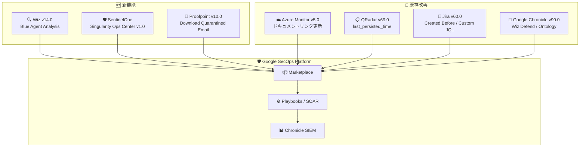

# Google SecOps Marketplace: 複数インテグレーションの一括アップデート

**リリース日**: 2026-07-22

**サービス**: Google SecOps Marketplace

**機能**: Wiz, SentinelOne Singularity Operations Center, Proofpoint Email Protection, Azure Monitor, QRadar, Jira, Google Chronicle インテグレーション更新

**ステータス**: GA (一般提供)

📊 [このアップデートのインフォグラフィックを見る](https://takech9203.github.io/google-cloud-news-summary/20260722-google-secops-marketplace-updates.html)

## 概要

Google SecOps Marketplace において、7 つのサードパーティインテグレーションが同時にアップデートされた。新機能の追加 (Wiz、SentinelOne Singularity Operations Center、Proofpoint Email Protection) と既存インテグレーションの改善 (Azure Monitor、QRadar、Jira、Google Chronicle) が含まれる。

今回のアップデートは、SOC (Security Operations Center) チームの脅威検知・対応ワークフローを強化する内容となっている。特に、Wiz の Blue Agent Analysis 機能の追加、SentinelOne Singularity Operations Center の新規統合、Proofpoint の隔離メールダウンロード機能は、インシデントレスポンスの自動化を大幅に進化させる。また、QRadar コネクタのタイムスタンプ処理改善や Jira の柔軟なクエリサポートなど、運用面の信頼性向上にも注力されている。

対象ユーザーは、Google SecOps を利用してセキュリティオペレーションを運用している SOC アナリスト、セキュリティエンジニア、SOAR (Security Orchestration, Automation and Response) プラットフォーム管理者である。

**アップデート前の課題**

- Wiz でランタイムの脅威分析結果 (Blue Agent Analysis) を SecOps プレイブック内から直接取得する手段がなかった
- SentinelOne Singularity Operations Center との統合が存在せず、運用センターレベルでの連携ができなかった
- Proofpoint で隔離されたメールの内容をフォレンジック目的で直接ダウンロードする自動化手段がなかった
- QRadar コネクタでオフェンスの変更追跡に適切なタイムスタンプが使用されておらず、更新の見落としが発生する可能性があった
- Jira の「List Issues」アクションで日付範囲やカスタム JQL による柔軟なフィルタリングができなかった
- Google Chronicle コネクタで Wiz Defend の検出やオントロジーマッピングが最適化されていなかった

**アップデート後の改善**

- Wiz の Blue Agent Analysis を SOAR プレイブック内で自動取得し、ランタイム脅威のコンテキストを即座に得られるようになった
- SentinelOne Singularity Operations Center との統合が可能になり、統合運用ダッシュボードとの連携が実現した
- Proofpoint の隔離メールをプレイブックから直接ダウンロードし、マルウェア分析やフォレンジック調査を自動化できるようになった
- QRadar コネクタが `last_persisted_time` を使用することで、オフェンスの変更を確実に追跡できるようになった
- Jira で「Created Before」日付フィルタとカスタム JQL クエリによる高度なイシュー検索が可能になった
- Google Chronicle コネクタが Wiz Defend の検出結果を適切に処理し、オントロジーマッピングが改善された

## アーキテクチャ図



Google SecOps Marketplace を中心に、各サードパーティツールがインテグレーションとして接続され、プレイブックや SIEM と連携するエコシステムを構成している。今回のアップデートにより、新規 3 インテグレーション機能と既存 4 インテグレーションの改善が実施された。

## サービスアップデートの詳細

### 新機能 (Features)

1. **Wiz v14.0 - "Get Blue Agent Analysis" アクション追加**
   - Wiz のランタイムセンサー (Blue Agent) による脅威分析結果をプレイブック内から直接取得可能に
   - ランタイムで検出された脅威のコンテキスト情報 (プロセス実行、ネットワーク接続、ファイル操作) を SOAR ワークフローに統合
   - インシデント調査時に Wiz コンソールへの切り替えが不要になり、対応速度が向上

2. **SentinelOne Singularity Operations Center v1.0 - 新規インテグレーション**
   - SentinelOne の統合運用センター (Singularity Operations Center) との初の直接統合
   - 既存の SentinelOne (v1) / SentinelOneV2 インテグレーションとは異なり、運用センターレベルの統合管理機能に対応
   - 複数サイトやテナントにまたがるセキュリティイベントの統合的な管理・対応が可能

3. **Proofpoint Email Protection v10.0 - "Download Quarantined Email" アクション追加**
   - 隔離されたメールのコンテンツを直接ダウンロードする機能を追加
   - 既存の「Search Quarantined Emails」「Move Quarantined Email」「Delete Quarantined Email」「Resubmit Quarantined Email」に加え、フォレンジック分析用のダウンロード機能が利用可能に
   - マルウェア分析ツールへの自動転送やメール本文の証拠保全をプレイブックで自動化

### 変更 (Changes)

4. **Azure Monitor v5.0 - ドキュメントリンク更新**
   - インテグレーションのドキュメントリンクが最新のものに更新
   - 設定手順やパラメータのリファレンスへのアクセスが改善

5. **QRadar v69.0 - タイムスタンプフィルタリング改善**
   - 「QRadar Offenses Connector」で変更追跡用のタイムスタンプが `last_persisted_time` に変更
   - オフェンスの更新・変更がより正確に検出されるようになり、取りこぼしのリスクが低減
   - 特に高負荷環境でのオフェンス同期の信頼性が向上

6. **Jira v60.0 - 検索フィルタリング強化**
   - 「List Issues」アクションに「Created Before」日付フィルタパラメータを追加
   - 「Custom JQL」クエリパラメータのサポートを追加し、任意の Jira Query Language 式でのイシュー検索が可能に
   - セキュリティインシデントの時系列分析や、複雑な条件でのチケット検索を自動化

7. **Google Chronicle v90.0 - Wiz Defend 検出処理とオントロジーマッピング改善**
   - 「Chronicle Alerts Connector」で Wiz Defend の検出結果の処理ロジックを更新
   - オントロジーマッピングが改善され、Wiz Defend からのアラートが Chronicle SIEM 内でより正確に分類・表示

## 技術仕様

### インテグレーションバージョン一覧

| インテグレーション | バージョン | 変更種別 | 主な変更内容 |
|---|---|---|---|
| Wiz | 14.0 | Feature | "Get Blue Agent Analysis" アクション追加 |
| SentinelOne Singularity Operations Center | 1.0 | Feature | 新規インテグレーション |
| Proofpoint Email Protection | 10.0 | Feature | "Download Quarantined Email" アクション追加 |
| Azure Monitor | 5.0 | Change | ドキュメントリンク更新 |
| QRadar | 69.0 | Change | `last_persisted_time` によるタイムスタンプ追跡 |
| Jira | 60.0 | Change | "Created Before" / "Custom JQL" パラメータ追加 |
| Google Chronicle | 90.0 | Change | Wiz Defend 検出処理・オントロジーマッピング改善 |

### Content Hub カテゴリ

Google SecOps Marketplace (Content Hub) のインテグレーションは以下のカテゴリに分類される:

| カテゴリ | 説明 |
|---|---|
| Google | Google SecOps が開発・検証・保守するコンテンツ |
| Partner | パートナーが開発・保守するコンテンツ (Verified バッジ対象) |
| Community | コミュニティユーザーが開発・保守するコンテンツ |
| Custom | ユーザー固有のプライベートコンテンツ |

## 設定方法

### 前提条件

1. Google SecOps プラットフォームが有効化されていること
2. Marketplace (Content Hub) へのアクセス権限があること
3. 各サードパーティサービスの API 認証情報が準備されていること

### 手順

#### ステップ 1: インテグレーションのアップデート

Google SecOps コンソールの Content Hub から対象インテグレーションを選択し、最新バージョンへアップデートする。

```
Content Hub > Integrations > [対象インテグレーション] > Update
```

アップデート時にオントロジーマッピングの処理を選択する:
- **Override (replace mapping)**: 既存のマッピングを完全に置換
- **Retain (keep existing mapping)**: 既存のカスタムマッピングを保持

#### ステップ 2: 新規インテグレーションの設定 (SentinelOne Singularity Operations Center)

```
Content Hub > Integrations > SentinelOne Singularity Operations Center > Install
```

API ルートと認証情報を設定後、プレイブックで使用可能になる。

#### ステップ 3: プレイブックへの組み込み

新しいアクション (Get Blue Agent Analysis、Download Quarantined Email) をプレイブックに追加し、ワークフローを更新する。

## メリット

### ビジネス面

- **インシデント対応時間の短縮**: Wiz Blue Agent Analysis やメールフォレンジックの自動化により、平均対応時間 (MTTR) が短縮
- **統合運用の実現**: SentinelOne Singularity Operations Center の統合により、マルチサイト・マルチテナント環境の一元管理が可能
- **コンプライアンス対応**: 隔離メールのダウンロード・保全自動化により、証拠収集の確実性が向上

### 技術面

- **データ整合性の向上**: QRadar コネクタの `last_persisted_time` 対応により、オフェンス同期の信頼性が向上
- **検索の柔軟性**: Jira の Custom JQL サポートにより、SOAR プレイブックから任意の複雑なクエリを実行可能
- **マッピング精度の向上**: Chronicle コネクタの Wiz Defend 対応により、アラートの正確な分類・優先度付けが実現

## デメリット・制約事項

### 制限事項

- SentinelOne Singularity Operations Center v1.0 は初期リリースのため、既存の SentinelOne / SentinelOneV2 インテグレーションと比較して利用可能なアクション数が限定的な可能性がある
- QRadar コネクタのタイムスタンプ変更により、既存のカスタムフィルタリングロジックに影響が出る可能性がある
- オントロジーマッピングの Override を選択した場合、既存のカスタムマッピングが失われる

### 考慮すべき点

- インテグレーションのアップデート前に、既存のプレイブックとの互換性をテスト環境で確認することを推奨
- QRadar v69.0 へのアップデート時は、既存のオフェンスコネクタ設定の動作確認が必要
- Google Chronicle v90.0 のオントロジーマッピング変更により、既存の検出ルールや相関ルールに影響する可能性がある

## ユースケース

### ユースケース 1: Wiz + SecOps によるランタイム脅威自動調査

**シナリオ**: Wiz がクラウドワークロード上でランタイムの不審な挙動を検出した際、SecOps プレイブックが自動的に Blue Agent Analysis を取得してコンテキストを補完し、重要度に応じてエスカレーションまたは自動対処を行う。

**効果**: アナリストが Wiz コンソールに切り替えることなく、SecOps 内で完結した脅威調査が可能になり、MTTR が大幅に短縮される。

### ユースケース 2: フィッシングメールの自動フォレンジック分析

**シナリオ**: Proofpoint がフィッシングメールを隔離した際、SecOps プレイブックが自動的にメールをダウンロードし、添付ファイルをサンドボックスに送信してマルウェア分析を実施。結果に基づいて IOC を Chronicle SIEM に登録する。

**効果**: メールセキュリティインシデントの証拠収集から IOC 登録までの一連のフローが自動化され、手動作業が排除される。

### ユースケース 3: Jira を活用したセキュリティインシデント管理の高度化

**シナリオ**: セキュリティインシデント発生時に Custom JQL を使用して関連チケットを横断検索し、過去の類似インシデントの対応履歴を自動取得してアナリストに提示する。

**効果**: 過去のインシデント対応のナレッジが自動的に活用され、一貫性のある対応と学習効果の向上が実現される。

## 料金

Google SecOps Marketplace のインテグレーション利用自体には追加料金は発生しない。Google SecOps プラットフォームの利用料金に含まれる。ただし、連携先のサードパーティサービス (Wiz、SentinelOne、Proofpoint、QRadar、Jira など) の利用には各サービスの個別ライセンスが必要。

詳細は [Google SecOps 料金ページ](https://cloud.google.com/chronicle/pricing) を参照。

## 利用可能リージョン

Google SecOps は複数のリージョナルエンドポイントを提供している。Marketplace インテグレーションは Google SecOps が利用可能なすべてのリージョンで使用可能。

- US: `https://backstory.googleapis.com`
- Europe: `https://europe-backstory.googleapis.com`
- Asia Southeast: `https://asia-southeast1-backstory.googleapis.com`

## 関連サービス・機能

- **Google SecOps SIEM (Chronicle)**: セキュリティイベントの収集・分析基盤。Marketplace インテグレーションから取り込まれたデータを統合的に管理
- **Google SecOps SOAR**: プレイブックによるセキュリティオペレーションの自動化。インテグレーションのアクションを組み合わせたワークフローを実行
- **Wiz Defend**: クラウドワークロードのランタイム脅威検知。Blue Agent Analysis の結果を SecOps で活用
- **SentinelOne**: エンドポイント保護・検知・対応 (EDR/XDR)。Singularity Operations Center による統合管理
- **Proofpoint Email Protection**: メールセキュリティゲートウェイ。隔離・フィルタリング機能と SecOps の連携
- **IBM QRadar**: SIEM プラットフォーム。オフェンス (インシデント) の SecOps への取り込み

## 参考リンク

- 📊 [インフォグラフィック](https://takech9203.github.io/google-cloud-news-summary/20260722-google-secops-marketplace-updates.html)
- [公式リリースノート](https://cloud.google.com/release-notes)
- [Google SecOps Marketplace ドキュメント](https://docs.cloud.google.com/chronicle/docs/soar/marketplace-integrations)
- [Content Hub 概要](https://docs.cloud.google.com/chronicle/docs/secops/content_hub)
- [Wiz インテグレーション](https://docs.cloud.google.com/chronicle/docs/soar/marketplace-integrations/wiz)
- [SentinelOne インテグレーション](https://docs.cloud.google.com/chronicle/docs/soar/marketplace-integrations/sentinelone)
- [Proofpoint Email Protection インテグレーション](https://docs.cloud.google.com/chronicle/docs/soar/marketplace-integrations/proofpoint-ps)
- [Jira インテグレーション](https://docs.cloud.google.com/chronicle/docs/soar/marketplace-integrations/jira)
- [Google Chronicle インテグレーション](https://docs.cloud.google.com/chronicle/docs/soar/marketplace-integrations/google-chronicle)

## まとめ

今回の Google SecOps Marketplace アップデートは、セキュリティオペレーションの自動化と統合管理を推進する重要なリリースである。特に Wiz Blue Agent Analysis、SentinelOne Singularity Operations Center 統合、Proofpoint メールダウンロード機能の追加により、脅威検知からインシデント対応までの一貫したワークフロー自動化が可能になった。既存インテグレーションの改善 (QRadar タイムスタンプ、Jira JQL、Chronicle オントロジー) もデータ品質と運用効率の向上に寄与する。Google SecOps を利用する SOC チームは、影響を受けるインテグレーションのアップデートをテスト環境で検証した上で、本番環境への適用を推奨する。

---

**タグ**: #GoogleSecOps #Marketplace #SOAR #Wiz #SentinelOne #Proofpoint #QRadar #Jira #Chronicle #セキュリティ #インテグレーション #SOC
