# Looker: Cross-Site Scripting (XSS) 脆弱性の修正 (CVE-2026-15810)

**リリース日**: 2026-07-22

**サービス**: Looker

**機能**: セキュリティパッチ - XSS 脆弱性修正

**ステータス**: 修正済み (Patched)

[このアップデートのインフォグラフィックを見る](https://takech9203.github.io/google-cloud-news-summary/20260722-looker-xss-vulnerability.html)

## 概要

Looker において Cross-Site Scripting (XSS) 脆弱性が発見され、修正パッチがリリースされた。攻撃者が悪意のある URL を作成し、Looker 管理者がその URL を開いた場合、攻撃者が管理者の権限で任意のスクリプトを実行し、管理者アカウントを侵害する可能性があった。

Looker ホスト型インスタンスおよびセルフホスト型インスタンスの両方が影響を受けるが、Looker ホスト型インスタンスについては既に緩和措置が適用されている。セルフホスト型インスタンスの管理者は、速やかにパッチ適用済みバージョンへのアップデートが必要である。

本脆弱性は CVE-2026-15810 として追跡されており、過去に報告された Looker の XSS 脆弱性 (CVE-2025-12739) と類似した攻撃パターンを持つ。管理者アカウントが標的であるため、データアクセス権限やシステム設定の不正変更につながるリスクがあり、重大度は高い。

**アップデート前の課題**

- 攻撃者が悪意のある URL を作成し、Looker 管理者に開かせることで任意のスクリプトを実行可能だった
- 管理者アカウントの侵害により、データアクセス権限の不正変更やシステム設定の改ざんが可能だった
- Looker ホスト型・セルフホスト型の両方のインスタンスが脆弱な状態だった

**アップデート後の改善**

- XSS 脆弱性が修正され、悪意のある URL によるスクリプト実行が防止される
- Looker ホスト型インスタンスは自動的に保護されている
- セルフホスト型インスタンスはパッチ適用済みバージョンへのアップデートで保護可能

## アーキテクチャ図

```mermaid
flowchart TD
    attacker["&#x1f3ad; 攻撃者"]
    malicious_url["&#x1f517; 悪意のある URL<br/>(XSS ペイロード埋め込み)"]
    admin["&#x1f464; Looker 管理者"]
    browser["&#x1f310; 管理者のブラウザ"]
    looker["&#x1f4ca; Looker インスタンス"]
    script["&#x26a0;&#xfe0f; 任意スクリプト実行"]
    compromise["&#x1f6a8; アカウント侵害"]
    patch["&#x1f6e1;&#xfe0f; パッチ適用済み<br/>バージョン"]
    block["&#x2705; スクリプト実行ブロック"]

    attacker -->|"1. URL 作成"| malicious_url
    malicious_url -->|"2. URL 送付<br/>(フィッシング等)"| admin
    admin -->|"3. URL クリック"| browser
    browser -->|"4. リクエスト送信"| looker

    subgraph vuln["脆弱な状態 (パッチ適用前)"]
        looker -->|"5. XSS 発動"| script
        script -->|"6. 管理者権限で実行"| compromise
    end

    subgraph fixed["修正後 (パッチ適用済み)"]
        patch -->|"入力サニタイズ"| block
    end
```



XSS 攻撃のフローと、パッチ適用による防御を示す図。攻撃者が悪意のある URL を管理者に開かせることでスクリプトを実行するが、パッチ適用後は入力のサニタイズによりスクリプト実行がブロックされる。

## サービスアップデートの詳細

### 主要機能

1. **XSS 脆弱性の修正 (CVE-2026-15810)**
   - 悪意のある URL を介した任意スクリプト実行の防止
   - URL パラメータの適切なサニタイズ処理の実装
   - 管理者アカウントを標的とした攻撃ベクトルの遮断

2. **Looker ホスト型インスタンスの自動保護**
   - Google 管理の Looker ホスト型インスタンスは既に緩和措置が適用済み
   - ユーザー側のアクション不要
   - Looker (Google Cloud core) および Looker (original) の両方が対象

3. **セルフホスト型インスタンス向けパッチ**
   - サポート対象の全バージョンで修正パッチをリリース
   - 複数のリリースブランチで修正バージョンを提供
   - ダウンロードページから最新バージョンを取得可能

## 技術仕様

### パッチ対象バージョン

| バージョンブランチ | 修正済みバージョン |
|------|------|
| Looker 26.8 | 26.8.7 以降の全バージョン |
| Looker 26.6 | 26.6.28+ |
| Looker 26.4 | 26.4.36+ |
| Looker 26.2 | 26.2.47+ |
| Looker 26.0 | 26.0.66+ |
| Looker 25.18 | 25.18.68+ |
| Looker 25.12 | 25.12.65+ |
| Looker 25.6 | 25.6.103+ |

### 脆弱性の詳細

| 項目 | 詳細 |
|------|------|
| CVE ID | CVE-2026-15810 |
| 脆弱性タイプ | Cross-Site Scripting (XSS) |
| 攻撃ベクトル | 悪意のある URL 経由 |
| 標的 | Looker 管理者 |
| 影響範囲 | Looker ホスト型・セルフホスト型の両方 |
| 前提条件 | 管理者が悪意のある URL を開く必要がある |

## 設定方法

### 前提条件

1. セルフホスト型 Looker インスタンスを運用していること
2. Looker ダウンロードページ (https://download.looker.com/) へのアクセス権限

### 手順

#### ステップ 1: 現在のバージョンの確認

Looker 管理パネルの「System」 > 「General」から現在のバージョンを確認する。

#### ステップ 2: バックアップの作成

```bash
# Looker ディレクトリ全体をバックアップ (隠しディレクトリ含む)
sudo su - looker
cp -r /home/looker/looker /home/looker/looker_backup_$(date +%Y%m%d)
```

外部 MySQL データベースを使用している場合は、データベースのバックアップも取得する。

#### ステップ 3: JAR ファイルのダウンロードと配置

```bash
# Looker プロセスを停止
cd /home/looker/looker
./looker stop

# 新しい JAR ファイルをダウンロード (バージョンはパッチ対象バージョン表を参照)
# looker-x.x.x.jar を looker.jar にリネームして配置
mv looker-x.x.x.jar looker.jar
mv looker-dependencies-x.x.x.jar looker-dependencies.jar
```

#### ステップ 4: Looker の再起動

```bash
# Looker プロセスを開始
./looker start
```

クラスタ環境の場合は、最初のノードのアップデートが完了してから他のノードを更新する。

## メリット

### ビジネス面

- **データ保護**: 管理者アカウントの侵害を防止し、組織のデータ資産を保護
- **コンプライアンス維持**: セキュリティパッチの迅速な適用により、セキュリティポリシーへの準拠を維持

### 技術面

- **攻撃面の縮小**: XSS による任意コード実行ベクトルを排除
- **多層防御の強化**: Looker ホスト型インスタンスは自動保護、セルフホスト型もパッチで対応可能

## デメリット・制約事項

### 制限事項

- セルフホスト型インスタンスは管理者による手動アップデートが必要
- アップデート中は Looker サービスが一時的に利用不可となる (通常数分程度)
- 内部データベースの更新に最大 1 時間かかる場合がある (複数バージョンをスキップしている場合)

### 考慮すべき点

- パッチ適用前のインスタンスは引き続き脆弱な状態であるため、早急な対応が推奨される
- クラスタ構成の場合、ノードごとの順次アップデートが必要
- ロールバックは推奨されず、アップデート前のバックアップが必須

## ユースケース

### ユースケース 1: Looker ホスト型インスタンス (Looker (Google Cloud core) / Looker (original))

**シナリオ**: Google 管理の Looker ホスト型インスタンスを使用している組織

**効果**: アクション不要。Google のリリース・運用チームにより、既に緩和措置が自動適用されている。メンテナンスウィンドウ中にパッチが展開され、ユーザーへの影響は最小限。

### ユースケース 2: セルフホスト型 Looker インスタンス (単一ノード)

**シナリオ**: 自社インフラで Looker をセルフホストしている組織が、セキュリティパッチを適用する

**効果**: パッチ適用済みバージョンへのアップデートにより、XSS 脆弱性が修正され、管理者アカウントの侵害リスクが排除される。

### ユースケース 3: セルフホスト型 Looker クラスタ環境

**シナリオ**: 複数ノードで構成された Looker クラスタ環境で、順次パッチを適用する

**効果**: 1 ノードずつ順次アップデートすることで、サービスの可用性を維持しながらセキュリティパッチを適用可能。

## 関連サービス・機能

- **Looker (Google Cloud core)**: Google Cloud 上でフルマネージドで提供される Looker。今回の脆弱性は自動修正済み
- **Looker (original)**: Google がホストする従来の Looker インスタンス。自動修正済み
- **Google Cloud Security Command Center**: セキュリティ脆弱性の一元管理と可視化
- **Cloud Audit Logs**: Looker インスタンスへのアクセスログの監査

## 参考リンク

- [このアップデートのインフォグラフィック](https://takech9203.github.io/google-cloud-news-summary/20260722-looker-xss-vulnerability.html)
- [公式リリースノート](https://docs.cloud.google.com/release-notes#July_22_2026)
- [Looker インスタンスのアップデート手順](https://docs.cloud.google.com/looker/docs/updating-looker-instance)
- [Looker セキュリティのベストプラクティス](https://docs.cloud.google.com/looker/docs/best-practices/how-to-keep-looker-secure)
- [Looker ダウンロードページ](https://download.looker.com/)
- [Google Cloud セキュリティ速報](https://docs.cloud.google.com/support/bulletins)

## まとめ

Looker における XSS 脆弱性 (CVE-2026-15810) が修正された。管理者が悪意のある URL を開いた場合にアカウントが侵害される深刻な脆弱性であり、セルフホスト型 Looker インスタンスを運用している組織は、速やかにパッチ対象バージョンへのアップデートを実施することが強く推奨される。Looker ホスト型インスタンスについては既に自動修正が適用されており、追加のアクションは不要である。

---

**タグ**: #Looker #Security #XSS #CVE-2026-15810 #脆弱性修正 #セキュリティパッチ
