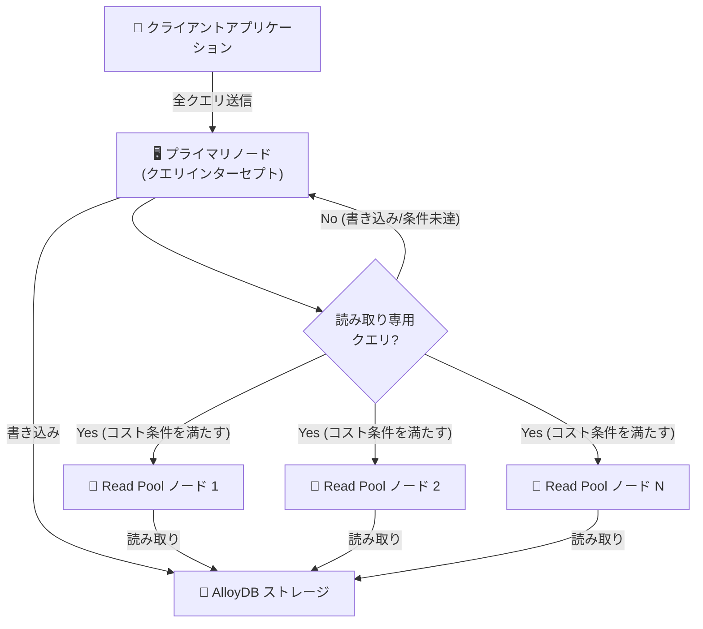

# AlloyDB for PostgreSQL: Transparent Query Forwarding (Preview)

**リリース日**: 2026-07-23

**サービス**: AlloyDB for PostgreSQL

**機能**: Transparent Query Forwarding (Preview)

**ステータス**: Feature (Preview)

📊 [このアップデートのインフォグラフィックを見る](https://takech9203.github.io/google-cloud-news-summary/20260723-alloydb-transparent-query-forwarding-preview.html)

## 概要

AlloyDB for PostgreSQL に Transparent Query Forwarding (透過的クエリ転送) 機能が Preview として追加されました。この機能は PostgreSQL 17 および 18 と互換性のあるクラスタで利用可能で、プライマリノードが読み取り専用クエリをインターセプトし、Read Pool インスタンスに選択的に転送することで、read-your-writes 一貫性を維持しながらリソースを最適化します。

この機能の最大の価値は、アプリケーション側のコード変更を一切必要とせずに、読み取りクエリの負荷分散を実現できる点にあります。従来はリーダーエンドポイントとライターエンドポイントを使い分けるためのアプリケーションリファクタリングが必要でしたが、Transparent Query Forwarding により、データベースレベルで自動的に最適なルーティングが行われます。

対象ユーザーは、HTAP (Hybrid Transactional and Analytical Processing) ワークロードを運用するチーム、モノリシックアプリケーションからのマイグレーションを検討するチーム、および予測不可能な読み取りトラフィックスパイクに対応する必要があるチームです。

**アップデート前の課題**

- Read Pool を活用するには、アプリケーション側でリーダーエンドポイントとライターエンドポイントを明示的に使い分けるリファクタリングが必要だった
- モノリシックなアプリケーションでは、接続先の切り替えが困難で Read Pool の恩恵を受けにくかった
- プライマリノードに読み取りクエリが集中し、書き込みレイテンシに影響を与える可能性があった
- 読み取りトラフィックのスパイク時にプライマリノードの負荷が急増しても、手動でクエリルーティングを調整する以外に対処法がなかった

**アップデート後の改善**

- アプリケーションコードを変更せずに、プライマリノードが自動的に読み取りクエリを Read Pool に転送するようになった
- read-your-writes 一貫性が保証されるため、転送されたクエリもプライマリでの実行と同等の結果を返す
- SQL コマンド一つで機能を有効化でき、セッションレベルまたはデータベースレベルで制御可能
- プライマリノードの負荷が高い場合に自動的に Read Pool へオフロードし、書き込みレイテンシへの影響を低減

## アーキテクチャ図



プライマリノードが全クエリを受信し、読み取り専用かつコスト条件を満たすクエリのみを Read Pool インスタンスに転送します。転送されたクエリは read-your-writes 一貫性を維持した状態で実行されます。

## サービスアップデートの詳細

### 主要機能

1. **透過的なクエリ転送**
   - プライマリノードが読み取り専用 SELECT 文をインターセプトし、Read Pool インスタンスに自動転送
   - アプリケーション側のコード変更やエンドポイント切り替えが不要
   - 同一リージョン内の Read Pool インスタンスにのみ転送 (セカンダリクラスタへの転送は対象外)

2. **Read-Your-Writes 一貫性の保証**
   - 転送されたクエリの結果は、プライマリノードで実行した場合と同等の一貫性を維持
   - スナップショットの復元によりレプリカ上での一貫性を確保
   - トランザクション分離レベルに基づく正確な結果を保証

3. **コストベースの転送判定**
   - クエリのオーバーヘッドコストが総コストに比べて十分小さい場合のみ転送
   - インデックススキャンを使用するクエリは通常除外 (オーバーヘッドがクエリコストを上回るため)
   - EXPLAIN コマンドで転送適格性を事前確認可能

4. **柔軟な有効化制御**
   - セッションレベルまたはデータベースレベルで有効化/無効化
   - データベースの再起動不要で動的に設定変更可能

## 技術仕様

### クエリ適格性条件

| 条件 | 詳細 |
|------|------|
| クエリタイプ | 読み取り専用 SELECT 文のみ |
| ロック | `SELECT ... FOR UPDATE` 等の行レベルロックは不可 |
| トランザクション | マルチステートメントトランザクション内の SELECT は限定的サポート |
| テーブル | 一時テーブル、UNLOGGED テーブル、カタログテーブルは参照不可 |
| 関数 | volatile 関数、UDF、SQL 値関数 (CURRENT_DATE, USER 等) は不可 |
| シーケンス | NEXTVAL() 式を含むクエリは不可 |
| データ型 | バイナリ送受信関数を実装するデータ型のみ |
| コスト | オーバーヘッドがクエリ総コストに比べて十分小さいこと |
| 転送先 | HA ホットスタンバイノードへの転送は非対応 |

### 前提条件

| 項目 | 要件 |
|------|------|
| PostgreSQL バージョン | 17 または 18 互換クラスタ |
| Read Pool | クラスタ内に少なくとも 1 つのアクティブな Read Pool インスタンスが必要 |
| 権限 | alloydbsuperuser ロール、または postgres ユーザーでのログイン |

### 設定パラメータ

```sql
-- セッションレベルで有効化
SET alloydb.enable_query_forwarding = TRUE;

-- データベースレベルで有効化
ALTER DATABASE my_database SET alloydb.enable_query_forwarding = ON;
```

## 設定方法

### 前提条件

1. AlloyDB クラスタが PostgreSQL 17 または 18 と互換性があること
2. クラスタ内に少なくとも 1 つのアクティブな Read Pool インスタンスが構成されていること
3. alloydbsuperuser データベースロールを持っているか、postgres ユーザーでログインしていること

### 手順

#### ステップ 1: Read Pool インスタンスの確認

```bash
# Read Pool インスタンスの状態を確認
gcloud alloydb instances describe READ_POOL_ID \
  --region=REGION_ID \
  --cluster=CLUSTER_ID \
  --project=PROJECT_ID \
  --view=FULL
```

クラスタ内にアクティブな Read Pool インスタンスが存在することを確認します。存在しない場合は先に Read Pool インスタンスを作成してください。

#### ステップ 2: セッションレベルでの有効化

```sql
-- 現在のセッションで有効化
SET alloydb.enable_query_forwarding = TRUE;
```

現在の接続セッションのみで Transparent Query Forwarding が有効になります。

#### ステップ 3: データベースレベルでの有効化 (推奨)

```sql
-- 特定のデータベースで有効化 (新規接続から有効)
ALTER DATABASE my_database SET alloydb.enable_query_forwarding = ON;
```

ALTER DATABASE コマンド実行後、そのデータベースへの新規接続から Transparent Query Forwarding が有効になります。

#### ステップ 4: クエリ適格性の確認

```sql
-- クエリが転送対象かどうかを確認
EXPLAIN SELECT count(*) FROM large_table t1, large_table t2;
```

出力に `Query Forwarding: Eligible. (overhead=...)` が表示されれば、そのクエリは転送対象です。

## メリット

### ビジネス面

- **アプリケーションリファクタリング不要**: 既存のモノリシックアプリケーションからのマイグレーション時に、エンドポイント分離のための開発工数を削減
- **運用コストの最適化**: プライマリノードの負荷を自動的に Read Pool にオフロードすることで、プライマリのスケールアップを回避できる可能性
- **開発速度の向上**: データベース層で自動的にクエリルーティングを最適化するため、アプリケーション開発者が接続管理の複雑さを意識する必要がない

### 技術面

- **Read-Your-Writes 一貫性**: 転送後も一貫性が保証されるため、アプリケーションの動作に影響を与えない
- **動的な有効化/無効化**: データベース再起動なしで設定変更が可能で、段階的なロールアウトが容易
- **EXPLAIN による事前検証**: クエリの転送適格性を事前に確認でき、パフォーマンスチューニングに活用可能
- **Cloud Monitoring 連携**: TQF のクエリカウントメトリクスで転送状況を可視化・監視可能

## デメリット・制約事項

### 制限事項

- PostgreSQL 17 または 18 互換クラスタのみが対象 (16 以前は非対応)
- volatile 関数やユーザー定義関数を含むクエリは転送対象外
- SELECT ... FOR UPDATE のようなロック取得を伴うクエリは転送されない
- 一時テーブル、UNLOGGED テーブル、カタログテーブルへのクエリは除外
- HA ホットスタンバイノードへの転送は非対応
- セカンダリクラスタ (クロスリージョンレプリカ) への転送は非対応
- Preview 段階のため SLA 保証がなく、サポートも限定的

### 考慮すべき点

- インデックススキャンを使用する軽量クエリは転送のオーバーヘッドが大きくなるため、通常はプライマリで実行される
- 転送にはスナップショット復元等のオーバーヘッドが発生するため、すべてのクエリがパフォーマンス向上するわけではない
- マルチステートメントトランザクション内の SELECT は限定的なサポートに留まる
- CURRENT_DATE や USER などの SQL 値関数を含むクエリは転送されないため、レポートクエリ等で注意が必要

## ユースケース

### ユースケース 1: HTAP ワークロードにおける負荷分離

**シナリオ**: EC サイトのデータベースで、トランザクション処理 (注文、在庫更新) と分析クエリ (売上レポート、在庫分析) が同一データベース上で実行されている。分析クエリがプライマリに負荷をかけ、書き込みレイテンシが悪化している。

**実装例**:
```sql
-- データベースレベルで有効化
ALTER DATABASE ecommerce_db SET alloydb.enable_query_forwarding = ON;

-- 重い分析クエリが自動的に Read Pool に転送される
-- アプリケーションは従来通りプライマリエンドポイントに接続するだけでよい
SELECT category, SUM(amount), COUNT(*) 
FROM orders 
WHERE order_date >= NOW() - INTERVAL '30 days'
GROUP BY category;
```

**効果**: 重い分析クエリが Read Pool にオフロードされ、プライマリノードの書き込みレイテンシが安定。アプリケーション変更ゼロで実現。

### ユースケース 2: モノリシックアプリケーションの段階的モダナイゼーション

**シナリオ**: レガシーなモノリシック Web アプリケーションが単一のデータベース接続文字列を使用している。リーダー/ライター分離のためのリファクタリングには数ヶ月かかる見積もりだが、読み取り負荷の増加に早急に対応する必要がある。

**効果**: アプリケーションのリファクタリングを待たずに、Read Pool のキャパシティを活用して読み取り負荷を分散。将来的なアーキテクチャ刷新までの暫定対策として機能する。

### ユースケース 3: 予測不可能なトラフィックスパイクへの対応

**シナリオ**: SaaS アプリケーションで、月末のレポート生成やキャンペーン期間中に読み取りトラフィックが急増する。スパイクのタイミングが不規則で事前のスケーリングが困難。

**効果**: Read Pool のオートスケーリングと組み合わせることで、トラフィックスパイク時にプライマリの負荷を自動的に分散し、サービスの安定性を維持。

## 料金

Transparent Query Forwarding 自体に追加料金はありません。ただし、Read Pool インスタンスの利用に対して通常の AlloyDB 料金が発生します。

### AlloyDB 主要料金

| 項目 | 料金 (USD) |
|------|------------|
| vCPU | $0.06608/vCPU 時間~ |
| メモリ | $0.0112/GB 時間~ |
| リージョナルクラスタストレージ | $0.0004109/GB 時間~ |
| バックアップストレージ | $0.000137/GB 時間~ |

### 料金例 (Read Pool インスタンス)

| 構成 | 月額料金 (概算) |
|------|-----------------|
| 4 vCPU / 32 GB (1 ノード) | 約 $451/月 |
| 16 vCPU / 128 GB (2 ノード) | 約 $3,635/月 |
| 16 vCPU / 128 GB (2 ノード, 1年 CUD 25%割引) | 約 $2,726/月 |

※ Committed Use Discounts (CUD) で 1 年契約 25%、3 年契約 52% の割引が適用可能

## 利用可能リージョン

AlloyDB for PostgreSQL が利用可能な全リージョンで Transparent Query Forwarding を使用できます。ただし、クエリの転送先は同一リージョン内の Read Pool インスタンスに限定されます。詳細なリージョン情報は [AlloyDB のロケーションページ](https://cloud.google.com/alloydb/docs/locations) を参照してください。

## 関連サービス・機能

- **AlloyDB Read Pool オートスケーリング**: Read Pool ノード数を CPU 使用率やスケジュールに基づいて自動調整。Transparent Query Forwarding と組み合わせることで、負荷に応じた動的なスケーリングを実現
- **AlloyDB Columnar Engine**: Read Pool インスタンスでカラムナーエンジンを有効化し、分析クエリのパフォーマンスをさらに向上
- **Cloud Monitoring**: `alloydb.googleapis.com/internal/database/postgresql/workload/distributed/tqf_query_count` メトリクスで転送クエリの状況を監視
- **AlloyDB Query Insights**: クエリパフォーマンスの分析と最適化を支援。転送対象クエリの特定にも活用可能
- **Database Insights MCP サーバー**: 高度なクエリ統計と待機イベント統計の取得が可能

## 参考リンク

- 📊 [インフォグラフィック](https://takech9203.github.io/google-cloud-news-summary/20260723-alloydb-transparent-query-forwarding-preview.html)
- [公式リリースノート](https://docs.cloud.google.com/release-notes#July_23_2026)
- [Transparent Query Forwarding ドキュメント](https://docs.cloud.google.com/alloydb/docs/transparent-query-forwarding)
- [Read Pool インスタンスの作成](https://docs.cloud.google.com/alloydb/docs/instance-read-pool-create)
- [Read Pool のスケーリング](https://docs.cloud.google.com/alloydb/docs/instance-read-pool-scale)
- [AlloyDB 料金ページ](https://cloud.google.com/alloydb/pricing)
- [AlloyDB リリースノート](https://docs.cloud.google.com/alloydb/docs/release-notes)

## まとめ

AlloyDB の Transparent Query Forwarding は、アプリケーション変更なしで読み取りクエリを Read Pool にオフロードできる画期的な機能です。特に HTAP ワークロードやモノリシックアプリケーションを運用するチームにとって、段階的な負荷分散の実現に大きく貢献します。Preview 段階ではありますが、PostgreSQL 17/18 互換クラスタで Read Pool を利用しているユーザーは、セッションレベルでの有効化から試験的に導入し、EXPLAIN コマンドでクエリの転送適格性を確認しながら段階的に展開することを推奨します。

---

**タグ**: #AlloyDB #PostgreSQL #ReadPool #QueryForwarding #HTAP #Preview #データベース #パフォーマンス最適化
