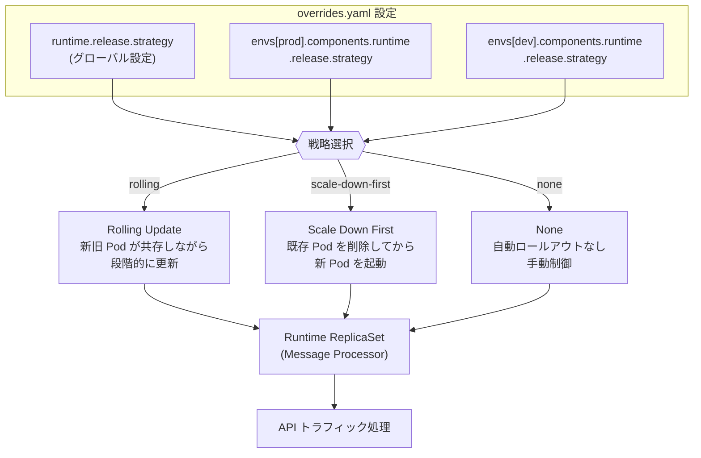

# Apigee hybrid: ランタイムロールアウト戦略設定 (v1.14.7)

**リリース日**: 2026-07-23

**サービス**: Apigee hybrid

**機能**: Runtime rollout strategy configuration

**ステータス**: GA (パッチリリース)

[このアップデートのインフォグラフィックを見る](https://takech9203.github.io/google-cloud-news-summary/20260723-apigee-hybrid-v1-14-7.html)

## 概要

Apigee hybrid v1.14.7 がリリースされ、ランタイム (Message Processor) ReplicaSet の更新時に使用されるロールアウト戦略を設定可能にする新機能が追加されました。これにより、API トラフィックを処理するランタイムコンポーネントのアップデート方法を、運用要件に合わせてきめ細かく制御できるようになります。

新しい `runtime.release.strategy` プロパティにより、`rolling` (ローリングアップデート)、`scale-down-first` (スケールダウン優先)、`none` (手動制御) の 3 つの戦略から選択可能です。さらに、環境ごとに異なる戦略を `envs[].components.runtime.release.strategy` で指定できるため、本番環境と開発環境で異なるアップデート戦略を適用するといった柔軟な運用が実現します。

このアップデートは、API ゲートウェイの可用性を維持しながら安全にアップデートを実行したいプラットフォームエンジニアや SRE チームに特に有用です。また、セキュリティおよび CVE 修正も含まれるパッチリリースです。

**アップデート前の課題**

- ランタイム ReplicaSet のアップデート戦略がデフォルトのローリングアップデートに固定されており、運用要件に合わせた制御ができなかった
- リソースが制約された環境では、ローリングアップデート時に一時的にリソース使用量が増加し、問題が発生する可能性があった
- 環境ごとに異なるアップデート戦略を適用する手段がなく、すべての環境で同一の戦略が適用されていた

**アップデート後の改善**

- 3 つのロールアウト戦略 (`rolling`、`scale-down-first`、`none`) から選択可能になった
- 環境ごとに個別の戦略を設定でき、本番/開発で異なるアプローチを取れるようになった
- リソース制約のある環境では `scale-down-first` を使用して追加リソースなしにアップデートが可能になった
- `none` 戦略により、完全に手動でロールアウトを制御するオプションが提供された

## アーキテクチャ図



この図は、overrides.yaml で設定されたロールアウト戦略がグローバルまたは環境単位で適用され、選択した戦略に応じて Runtime ReplicaSet (Message Processor) の更新方法が決定される仕組みを示しています。

## サービスアップデートの詳細

### 主要機能

1. **ランタイムロールアウト戦略設定**
   - `runtime.release.strategy` プロパティで ReplicaSet のアップデート戦略を制御
   - デフォルト値は `rolling` (従来の動作と互換)
   - overrides 設定ファイルでグローバルまたは環境単位で設定可能

2. **3 つのロールアウト戦略オプション**
   - `rolling`: 新旧の Pod が共存しながら段階的にアップデート。ダウンタイムなし
   - `scale-down-first`: 既存の Pod をスケールダウンしてから新しい Pod を起動。リソース制約のある環境向け
   - `none`: 自動ロールアウトを無効化。完全に手動制御

3. **環境単位の設定**
   - `envs[].components.runtime.release.strategy` で環境ごとに異なる戦略を指定可能
   - グローバル設定よりも環境単位の設定が優先される
   - 本番環境では `rolling`、開発環境では `scale-down-first` のように使い分け可能

4. **セキュリティおよび CVE 修正**
   - 各種セキュリティ脆弱性への対応が含まれる
   - パッチリリースとして提供され、Helm チャートによる自動イメージ更新に対応

## 技術仕様

### ロールアウト戦略の比較

| 戦略 | 動作 | ダウンタイム | リソース使用 | 推奨環境 |
|------|------|-------------|-------------|---------|
| `rolling` (デフォルト) | 新旧 Pod が共存しながら段階的に更新 | なし | 一時的に増加 | 本番環境 |
| `scale-down-first` | 既存 Pod を削除後に新 Pod を起動 | あり (短時間) | 追加リソース不要 | 開発/テスト環境、リソース制約のある環境 |
| `none` | 自動更新なし | N/A (手動制御) | 変化なし | カスタムデプロイフロー使用時 |

### 設定プロパティ

| プロパティ | スコープ | デフォルト | 説明 |
|-----------|---------|-----------|------|
| `runtime.release.strategy` | グローバル | `rolling` | すべての環境に適用されるデフォルト戦略 |
| `envs[].components.runtime.release.strategy` | 環境単位 | (グローバル設定を継承) | 特定環境のみに適用される戦略 |

### 設定例

```yaml
# overrides.yaml - グローバル設定
runtime:
  release:
    strategy: rolling  # rolling | scale-down-first | none

# 環境単位の設定 (グローバル設定を上書き)
envs:
  - name: prod-env
    components:
      runtime:
        release:
          strategy: rolling
  - name: dev-env
    components:
      runtime:
        release:
          strategy: scale-down-first
```

## 設定方法

### 前提条件

1. Apigee hybrid v1.14.x がインストール済み
2. Helm チャートによる管理が構成済み
3. `overrides.yaml` ファイルへのアクセス権限

### 手順

#### ステップ 1: Helm チャートの取得

```bash
export CHART_REPO=oci://us-docker.pkg.dev/apigee-release/apigee-hybrid-helm-charts
export CHART_VERSION=1.14.7

helm pull $CHART_REPO/apigee-env --version $CHART_VERSION --untar
```

v1.14.7 の Helm チャートを取得します。パッチリリースのため、コンテナイメージはチャートに統合されています。

#### ステップ 2: overrides.yaml の更新

```yaml
# overrides.yaml にロールアウト戦略を追加
runtime:
  release:
    strategy: rolling  # デフォルト値。必要に応じて変更

# 必要に応じて環境単位で設定
envs:
  - name: prod-env
    components:
      runtime:
        release:
          strategy: rolling
```

#### ステップ 3: Helm チャートのアップグレード

```bash
# ドライラン (変更内容の確認)
helm upgrade ENV_RELEASE_NAME apigee-env/ \
  --install \
  --namespace APIGEE_NAMESPACE \
  --set env=ENV_NAME \
  -f OVERRIDES_FILE \
  --dry-run=server

# 実際のアップグレード
helm upgrade ENV_RELEASE_NAME apigee-env/ \
  --install \
  --namespace APIGEE_NAMESPACE \
  --set env=ENV_NAME \
  -f OVERRIDES_FILE
```

環境ごとに 1 つずつアップグレードを実行します。

#### ステップ 4: 状態の確認

```bash
kubectl -n APIGEE_NAMESPACE get apigeeenv

# 出力例:
# NAME                    STATE    AGE   GATEWAYTYPE
# apigee-org1-prod-xxx    running  2d
```

`STATE` が `running` になっていることを確認します。

## メリット

### ビジネス面

- **可用性の向上**: 本番環境ではローリングアップデートにより API ダウンタイムをゼロに維持
- **コスト最適化**: リソース制約のある環境で `scale-down-first` を使用し、一時的なリソース追加コストを削減
- **運用柔軟性**: 環境ごとに最適な戦略を選択でき、ビジネス要件に合わせた運用が可能

### 技術面

- **きめ細かい制御**: 環境ごとの設定により、本番と非本番で異なるアプローチを採用可能
- **安全なアップグレード**: Helm チャートによる自動イメージ更新とロールアウト戦略の組み合わせで安全性を確保
- **互換性維持**: デフォルト値が `rolling` のため、既存環境への影響なし

## デメリット・制約事項

### 制限事項

- `scale-down-first` 戦略を使用する場合、一時的な API トラフィックの中断が発生する可能性がある
- `none` 戦略を選択した場合、手動でのロールアウト管理が必要となり運用負荷が増加する
- ロールアウト戦略の変更はランタイム (Message Processor) のみに適用され、他のコンポーネント (Synchronizer、Cassandra 等) には影響しない

### 考慮すべき点

- 本番環境で `scale-down-first` を使用する場合は、メンテナンスウィンドウの設定を検討すべき
- `none` 戦略は CI/CD パイプラインでカスタムデプロイフローを使用する上級ユーザー向け
- パッチリリースにはセキュリティ修正が含まれるため、速やかな適用を推奨

## ユースケース

### ユースケース 1: 本番環境のゼロダウンタイムアップデート

**シナリオ**: 大規模な API トラフィックを処理する本番環境で、サービス中断なしにランタイムをアップデートしたい

**実装例**:
```yaml
envs:
  - name: production
    components:
      runtime:
        release:
          strategy: rolling
```

**効果**: 新旧の Pod が共存しながら段階的に更新されるため、API トラフィックへの影響なしにアップデートを完了できる

### ユースケース 2: リソース制約環境でのコスト効率的なアップデート

**シナリオ**: 開発/テスト環境でリソースが限られており、ローリングアップデート時の一時的なリソース増加を避けたい

**実装例**:
```yaml
envs:
  - name: dev
    components:
      runtime:
        release:
          strategy: scale-down-first
```

**効果**: 既存の Pod を先に削除するため追加のコンピュートリソースが不要。開発環境では短時間の中断は許容可能

### ユースケース 3: カスタム CI/CD パイプラインとの統合

**シナリオ**: 独自のデプロイメントオーケストレーションを使用しており、Helm の自動ロールアウトを無効化したい

**実装例**:
```yaml
runtime:
  release:
    strategy: none
```

**効果**: 自動ロールアウトが無効化され、GitOps やカスタム CI/CD ツールによる完全な制御が可能

## 料金

Apigee hybrid は Apigee Subscription ライセンスの一部として提供されます。Pay-as-you-go 料金モデルは Apigee hybrid には適用されません。ロールアウト戦略設定機能自体による追加課金はありません。

料金の詳細については、Apigee の営業担当者にお問い合わせいただくか、以下のページを参照してください。

- [Apigee Pricing](https://cloud.google.com/apigee/pricing)

## 利用可能リージョン

Apigee hybrid はお客様が管理する Kubernetes クラスタ上で動作するため、サポートされているすべての Kubernetes プラットフォーム (GKE、AKS、EKS、OpenShift 等) で利用可能です。リージョンの制約は Kubernetes クラスタのデプロイ先に依存します。

## 関連サービス・機能

- **Apigee hybrid Helm チャート**: ランタイムコンポーネントのデプロイと管理に使用。v1.14.7 チャートにロールアウト戦略設定が統合
- **Kubernetes ReplicaSet**: ランタイム (Message Processor) Pod の管理単位。ロールアウト戦略はこの ReplicaSet の更新方法を制御
- **Apigee hybrid Metrics-based Scaling**: HPA を使用したランタイムのオートスケーリング。ロールアウト戦略と組み合わせて使用可能
- **Apigee hybrid Guardrails**: アップグレード前のバックアップ確認等の安全チェック機能

## 参考リンク

- [インフォグラフィック](https://takech9203.github.io/google-cloud-news-summary/20260723-apigee-hybrid-v1-14-7.html)
- [Apigee hybrid v1.14 アップグレードガイド](https://cloud.google.com/apigee/docs/hybrid/v1.14/upgrade)
- [Apigee hybrid v1.14 新規インストール](https://cloud.google.com/apigee/docs/hybrid/v1.14/big-picture)
- [Apigee hybrid Release Notes](https://cloud.google.com/apigee/docs/hybrid/release-notes)
- [Apigee hybrid ランタイムサービス設定](https://cloud.google.com/apigee/docs/hybrid/v1.14/service-config)
- [Apigee hybrid 設定プロパティリファレンス](https://cloud.google.com/apigee/docs/hybrid/v1.14/config-prop-ref)
- [Apigee hybrid スケーリングとオートスケーリング](https://cloud.google.com/apigee/docs/hybrid/v1.14/scale-and-autoscale)
- [Apigee Pricing](https://cloud.google.com/apigee/pricing)

## まとめ

Apigee hybrid v1.14.7 のランタイムロールアウト戦略設定は、API ゲートウェイのアップデート時の可用性とリソース効率のバランスを、運用要件に合わせて最適化できる重要な改善です。セキュリティ修正も含まれるため、既存の Apigee hybrid v1.14.x ユーザーは速やかなアップグレードが推奨されます。デフォルト値が `rolling` のため、既存の設定に変更を加えずとも従来通りの動作が保証されており、安全に適用可能です。

---

**タグ**: #Apigee #ApigeeHybrid #APIManagement #Kubernetes #Helm #RolloutStrategy #Security #PatchRelease
