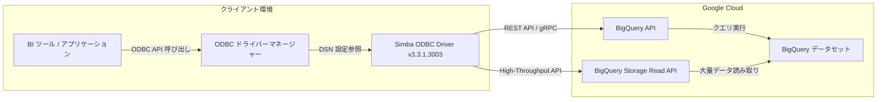

# BigQuery: Simba ODBC ドライバーの更新版リリース

**リリース日**: 2026-07-23

**サービス**: BigQuery

**機能**: Simba ODBC ドライバー バージョン更新

**ステータス**: 変更 (Change)

[このアップデートのインフォグラフィックを見る](https://takech9203.github.io/google-cloud-news-summary/20260723-bigquery-simba-odbc-driver.html)

## 概要

BigQuery 向け Simba ODBC ドライバーの更新版がリリースされました。Simba ODBC ドライバーは、insightsoftware 社が開発するデータベース接続ドライバーであり、ODBC (Open Database Connectivity) 標準インターフェースを通じて、さまざまなアプリケーションから BigQuery へのシームレスな接続を提供します。

このドライバーは、Excel、Tableau、Power BI などの BI ツールやレポーティングツールから BigQuery のデータにアクセスする際に広く利用されています。定期的なドライバー更新により、接続の安定性、パフォーマンス、セキュリティ、BigQuery の新機能への対応が継続的に改善されます。

なお、Google は現在 Google 自社開発の ODBC Driver for BigQuery (Preview) も提供しており、Simba ドライバーの代替オプションとして利用可能です。

**アップデート前の課題**

- 以前のバージョンのドライバーでは、最新の BigQuery 機能やセキュリティパッチが反映されていない可能性がある
- ドライバーのバグや互換性の問題が残存している可能性がある

**アップデート後の改善**

- 最新バージョン (3.3.1.3003) により、接続の安定性とパフォーマンスが向上
- セキュリティ修正とバグ修正が含まれている
- BigQuery の最新機能との互換性が改善

## アーキテクチャ図



クライアントアプリケーションが ODBC ドライバーマネージャーを介して Simba ODBC ドライバーに接続し、BigQuery API または BigQuery Storage Read API を通じてデータにアクセスするアーキテクチャを示しています。

## サービスアップデートの詳細

### 主要機能

1. **マルチプラットフォーム対応**
   - Windows (32-bit / 64-bit)、Linux (32-bit / 64-bit)、macOS に対応
   - 最新バージョン: 3.3.1.3003

2. **複数の認証方式サポート**
   - サービスアカウント認証 (OAuthMechanism=0)
   - Application Default Credentials (OAuthMechanism=3)
   - Workload Identity Federation / Workforce Identity Federation (OAuthMechanism=4)

3. **High-Throughput API (BigQuery Storage Read API)**
   - 大量データの読み取り時に BigQuery Storage Read API を利用可能
   - 標準 API よりも高速なデータ転送を実現

## 技術仕様

### 対応プラットフォームとダウンロード

| プラットフォーム | ダウンロードリンク |
|------|------|
| Windows 32-bit | [SimbaODBCDriverforGoogleBigQuery32_3.3.1.3003.msi](https://storage.googleapis.com/simba-bq-release/odbc/SimbaODBCDriverforGoogleBigQuery32_3.3.1.3003.msi) |
| Windows 64-bit | [SimbaODBCDriverforGoogleBigQuery64_3.3.1.3003.msi](https://storage.googleapis.com/simba-bq-release/odbc/SimbaODBCDriverforGoogleBigQuery64_3.3.1.3003.msi) |
| Linux 32-bit / 64-bit | [SimbaODBCDriverforGoogleBigQuery_3.3.1.3003-Linux.tar.gz](https://storage.googleapis.com/simba-bq-release/odbc/SimbaODBCDriverforGoogleBigQuery_3.3.1.3003-Linux.tar.gz) |
| macOS | [SimbaODBCDriverforGoogleBigQuery-3.3.1.3003.dmg](https://storage.googleapis.com/simba-bq-release/odbc/SimbaODBCDriverforGoogleBigQuery-3.3.1.3003.dmg) |

### 主要な接続プロパティ

| プロパティ | 説明 | 必須 |
|------|------|------|
| ProjectId | デフォルトの Google Cloud プロジェクト ID | はい |
| OAuthMechanism | 認証タイプ (0, 3, 4) | はい |
| KeyFilePath | サービスアカウントキーのパス | OAuthMechanism=0 の場合 |
| DefaultDataset | デフォルトのデータセット | いいえ |
| Location | データセットのロケーション | いいえ |
| AllowHtapiForLargeResults | Storage Read API の使用許可 | いいえ |

## 設定方法

### 前提条件

1. Google Cloud プロジェクトで BigQuery API が有効化されていること
2. 適切な IAM ロール (BigQuery ユーザーロールなど) が付与されていること
3. High-Throughput API を使用する場合は `roles/bigquery.readSessionUser` ロールが必要

### 手順

#### ステップ 1: ドライバーのダウンロードとインストール

**Windows の場合:**

対応するアーキテクチャの .msi ファイルをダウンロードし、インストーラーを実行します。

**Linux の場合:**

```bash
# ドライバーのダウンロードと展開
wget https://storage.googleapis.com/simba-bq-release/odbc/SimbaODBCDriverforGoogleBigQuery_3.3.1.3003-Linux.tar.gz
tar -xzf SimbaODBCDriverforGoogleBigQuery_3.3.1.3003-Linux.tar.gz
```

#### ステップ 2: DSN の設定 (接続文字列の例)

```
Driver=Simba ODBC Driver for Google BigQuery;
ProjectId=my-project-id;
OAuthMechanism=0;
KeyFilePath=/path/to/service-account-key.json;
DefaultDataset=my_dataset;
```

## メリット

### ビジネス面

- **既存ツールとの連携**: Excel、Tableau、Power BI など、ODBC 対応の BI ツールから直接 BigQuery にアクセス可能
- **無償提供**: ドライバー自体は無料でダウンロード・利用可能 (BigQuery の利用料金は別途発生)

### 技術面

- **標準インターフェース**: ODBC 標準に準拠しており、幅広いアプリケーションとの互換性を確保
- **高速データ転送**: BigQuery Storage Read API (High-Throughput API) のサポートにより大量データの読み取りを高速化

## デメリット・制約事項

### 制限事項

- BigQuery のロード機能 (データインポート) は非サポート
- BigQuery のエクスポート機能は非サポート
- クエリプレフィックスは非サポート
- DML の制限事項がすべて適用される
- パラメータ化クエリはクエリ検証のみ提供 (パフォーマンスへの影響なし)

### 考慮すべき点

- Google 開発の ODBC Driver for BigQuery (Preview) が代替オプションとして利用可能。将来的な移行を検討する価値がある
- 定期的なドライバー更新に追従し、最新バージョンを使用することを推奨

## 料金

Simba ODBC ドライバー自体は無料でダウンロード・使用可能です。追加ライセンスも不要です。ただし、ドライバー経由で BigQuery を利用する際には以下の料金が発生します:

| 項目 | 料金体系 |
|--------|-----------------|
| クエリ実行 (コンピューティング) | BigQuery の通常のコンピューティング料金 |
| ストレージ | 大きな結果セットをテーブルに書き込む場合のストレージ料金 |
| Storage Read API | High-Throughput API 使用時のデータ抽出料金 |

## 関連サービス・機能

- **ODBC Driver for BigQuery (Preview)**: Google 自社開発の ODBC ドライバー (Apache 2.0 ライセンス)。Simba ドライバーの代替として利用可能
- **Simba JDBC Driver for BigQuery**: Java アプリケーション向けの JDBC ドライバー (現在のバージョン: 1.7.0.1001)
- **JDBC Driver for BigQuery**: Google 自社開発の JDBC ドライバー (現在のバージョン: 1.1.0)
- **BigQuery Storage Read API**: 大量データの高速読み取りを可能にする API
- **BigQuery BI Engine**: BI ツールからのクエリを高速化するインメモリ分析サービス

## 参考リンク

- [インフォグラフィック](https://takech9203.github.io/google-cloud-news-summary/20260723-bigquery-simba-odbc-driver.html)
- [公式ドキュメント: Simba ODBC/JDBC ドライバー](https://cloud.google.com/bigquery/docs/reference/odbc-jdbc-drivers)
- [Google 開発 ODBC Driver for BigQuery (Preview)](https://cloud.google.com/bigquery/docs/odbc-for-bigquery)
- [インストール・設定ガイド (PDF)](https://storage.googleapis.com/simba-bq-release/odbc/Simba%20Google%20BigQuery%20ODBC%20Connector%20Install%20and%20Configuration%20Guide-3.3.1.3003.pdf)
- [リリースノート](https://storage.googleapis.com/simba-bq-release/odbc/release-notes-3.3.1.3003.txt)
- [BigQuery 料金ページ](https://cloud.google.com/bigquery/pricing)

## まとめ

BigQuery 向け Simba ODBC ドライバーの更新版 (3.3.1.3003) がリリースされました。ODBC 経由で BigQuery に接続している環境では、接続の安定性とセキュリティを維持するため、最新バージョンへのアップデートを推奨します。また、今後の方向性として Google 自社開発の ODBC Driver for BigQuery (現在 Preview) への移行も検討に値します。

---

**タグ**: #BigQuery #ODBC #Simba #ドライバー更新 #データ接続 #BI
