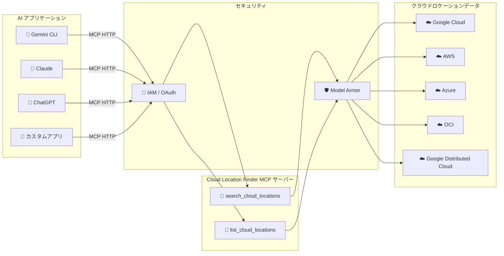

# Cloud Location Finder: Model Context Protocol (MCP) Integration (Preview)

**リリース日**: 2026-07-23

**サービス**: Cloud Location Finder

**機能**: Model Context Protocol (MCP) Integration (Preview)

**ステータス**: Feature (Preview)

📊 [このアップデートのインフォグラフィックを見る](https://takech9203.github.io/google-cloud-news-summary/20260723-cloud-location-finder-mcp-integration-preview.html)

## 概要

Cloud Location Finder に Model Context Protocol (MCP) 統合機能が Preview として追加されました。この組み込みインテグレーションにより、LLM パワードのエージェントが標準的な MCP ツール（`search_cloud_locations` および `list_cloud_locations`）を使用して、クラウドロケーションデータを安全に取得できるようになります。

Cloud Location Finder は、Google Cloud、Google Distributed Cloud、Microsoft Azure、Amazon Web Services、Oracle Cloud Infrastructure のリージョンやゾーンにわたるクラウドロケーションを、近接性、地理的位置、カーボンフットプリントに基づいて特定・フィルタリングするサービスです。今回の MCP 統合により、AI エージェントがこのデータにプログラマティックにアクセスし、レイテンシ、サステナビリティ、コンプライアンス境界を考慮したマルチクラウドやハイブリッドデプロイメントの管理を支援できるようになります。

この機能は、Gemini CLI、ChatGPT、Claude、カスタムアプリケーションなど、MCP をサポートする AI アプリケーションから利用可能です。Cloud Location Finder API を有効化すると、リモート MCP サーバーが自動的に有効になります。

**アップデート前の課題**

- Cloud Location Finder のデータを AI エージェントから利用するには、REST API や gcloud CLI を直接呼び出すカスタム統合を構築する必要があった
- LLM エージェントがクラウドロケーションの選定を支援する場合、手動でデータを取得し整形してコンテキストに渡す必要があった
- マルチクラウド環境でのロケーション最適化を AI に委ねるための標準化されたインターフェースが存在しなかった

**アップデート後の改善**

- MCP 標準プロトコルにより、AI エージェントが直接 Cloud Location Finder のデータにアクセス可能になった
- `search_cloud_locations` と `list_cloud_locations` ツールにより、自然言語での問い合わせからロケーション検索が実行可能
- IAM による細粒度のアクセス制御と Model Armor によるセキュリティ保護がビルトインで提供される

## アーキテクチャ図



AI アプリケーションが MCP プロトコル経由で Cloud Location Finder リモートサーバーに接続し、IAM 認証と Model Armor を経由して、マルチクラウドのロケーションデータを安全に取得するフローを示しています。

## サービスアップデートの詳細

### 主要機能

1. **search_cloud_locations ツール**
   - ソースロケーションからの近接性（レイテンシ）に基づいてクラウドロケーションを検索
   - クラウドプロバイダー、ロケーションタイプ、テリトリーコードによるフィルタリング
   - 例: 「AWS us-east-1 に最も近い Google Cloud ゾーンを検索」

2. **list_cloud_locations ツール**
   - プロジェクト配下のクラウドロケーションを一覧表示
   - フィルター式によるロケーションタイプ、テリトリー、カーボンフリーエネルギー比率での絞り込み
   - 例: 「カーボンフリーエネルギー比率が 80% 以上の Google Cloud リージョンを一覧表示」

3. **リモート MCP サーバーとしてのホスティング**
   - Google Cloud インフラストラクチャ上でホストされるリモート MCP サーバー
   - HTTP エンドポイント（`cloudlocationfinder.googleapis.com/mcp`）経由で AI アプリケーションと通信
   - Cloud Location Finder API 有効化時に自動的にアクティベート

## 技術仕様

### MCP ツール仕様

| 項目 | 詳細 |
|------|------|
| プロトコル | Model Context Protocol (MCP) - JSON-RPC 2.0 |
| トランスポート | HTTP (リモートサーバー) |
| エンドポイント | `https://cloudlocationfinder.googleapis.com/mcp` |
| 認証 | OAuth 2.0 / Application Default Credentials (ADC) |
| 必要な IAM ロール | `roles/mcp.toolUser` (MCP Tool User) |
| 必要な権限 | `mcp.tools.call` |

### search_cloud_locations パラメータ

| パラメータ | 必須 | 説明 |
|-----------|------|------|
| sourceCloudLocation | はい | 検索起点のクラウドロケーション |
| query | いいえ | 検索クエリ文字列（プロバイダー、タイプ、テリトリーなど） |
| pageSize | いいえ | 返却する最大ロケーション数 |
| pageToken | いいえ | ページネーション用トークン |

### list_cloud_locations パラメータ

| パラメータ | 必須 | 説明 |
|-----------|------|------|
| filter | いいえ | フィルター式（例: `cloudLocationType=CLOUD_LOCATION_TYPE_REGION`） |
| pageSize | いいえ | ページあたりの最大ロケーション数 |
| pageToken | いいえ | ページネーション用トークン |

### MCP クライアント設定例（Gemini CLI）

```json
{
  "name": "cloud-location-finder",
  "version": "1.0.0",
  "mcpServers": {
    "cloud_location_finder": {
      "httpUrl": "https://cloudlocationfinder.googleapis.com/mcp",
      "authProviderType": "google_credentials",
      "oauth": {
        "scopes": ["https://www.googleapis.com/auth/cloud-platform"]
      },
      "timeout": 30000,
      "headers": {
        "x-goog-user-project": "YOUR_PROJECT_ID"
      }
    }
  }
}
```

## 設定方法

### 前提条件

1. Google Cloud プロジェクトが作成済みであること
2. Cloud Location Finder API が有効化されていること
3. 適切な IAM ロール（`roles/mcp.toolUser`）が付与されていること

### 手順

#### ステップ 1: Cloud Location Finder API の有効化

```bash
gcloud services enable cloudlocationfinder.googleapis.com --project PROJECT_ID
```

API を有効化すると、MCP サーバーも自動的に利用可能になります。

#### ステップ 2: IAM ロールの付与

```bash
# MCP ツール呼び出し用のロール
gcloud projects add-iam-policy-binding PROJECT_ID \
  --member="user:YOUR_EMAIL@example.com" \
  --role="roles/mcp.toolUser"

# Cloud Location Finder の閲覧ロール（必要に応じて）
gcloud projects add-iam-policy-binding PROJECT_ID \
  --member="user:YOUR_EMAIL@example.com" \
  --role="roles/cloudlocationfinder.viewer"
```

#### ステップ 3: AI アプリケーションでの設定（Gemini CLI の例）

```bash
# ADC の設定
gcloud auth application-default login

# 拡張ファイルの作成
mkdir -p ~/.gemini/extensions/cloud-location-finder
```

以下の内容で `~/.gemini/extensions/cloud-location-finder/gemini-extension.json` を作成:

```json
{
  "name": "cloud-location-finder",
  "version": "1.0.0",
  "mcpServers": {
    "cloud_location_finder": {
      "httpUrl": "https://cloudlocationfinder.googleapis.com/mcp",
      "authProviderType": "google_credentials",
      "oauth": {
        "scopes": ["https://www.googleapis.com/auth/cloud-platform"]
      },
      "headers": {
        "x-goog-user-project": "YOUR_PROJECT_ID"
      }
    }
  }
}
```

#### ステップ 4: 動作確認

```bash
# Gemini CLI を起動
gemini

# MCP サーバーの確認
/mcp
```

## メリット

### ビジネス面

- **マルチクラウド戦略の加速**: AI エージェントが最適なクラウドロケーションを自動的に推奨し、インフラ配置の意思決定を支援
- **コンプライアンス対応の効率化**: テリトリーコードによるフィルタリングで、データレジデンシー要件を満たすリージョンの特定が自然言語で可能
- **サステナビリティ目標の推進**: カーボンフリーエネルギー比率に基づくロケーション選定を AI が支援

### 技術面

- **標準プロトコルによる統合**: MCP 標準に準拠しているため、対応するあらゆる AI アプリケーションから即座に利用可能
- **セキュリティの確保**: IAM によるきめ細かいアクセス制御と、Model Armor によるプロンプトインジェクション防止
- **マルチクラウド対応**: Google Cloud だけでなく AWS、Azure、OCI、Google Distributed Cloud のロケーション情報を横断的に検索

## デメリット・制約事項

### 制限事項

- Preview 段階のため、SLA は適用されず、機能変更の可能性がある
- Pre-GA サービス条件が適用される（「Pre-GA Offerings Terms」）
- CFE（カーボンフリーエネルギー）データは Google Cloud ロケーションのみに限定

### 考慮すべき点

- MCP クライアントのセットアップが AI アプリケーションごとに異なるため、各アプリのドキュメントを確認する必要がある
- OAuth トークンの有効期限管理（ADC 使用時は 1 時間ごとの更新が必要な場合がある）
- Dynamic Client Registration は未サポート

## ユースケース

### ユースケース 1: マルチクラウド環境でのレイテンシ最適化

**シナリオ**: AWS us-east-1 で稼働中のアプリケーションに対して、最もレイテンシの低い Google Cloud ゾーンを AI エージェントに問い合わせる。

**実装例**:
```
プロンプト: "AWS us-east-1 に最も近い Google Cloud ゾーンを見つけて"
```

エージェントが `search_cloud_locations` ツールを使用し、レイテンシデータに基づいて最適なゾーンを返却。

**効果**: インフラチームがマルチクラウド設計時に手動でドキュメントを調査する時間を削減し、データに基づいた迅速な意思決定を実現。

### ユースケース 2: データレジデンシーコンプライアンスの確認

**シナリオ**: 欧州のデータ保護規制に準拠するため、EU 域内のクラウドロケーションのみを特定する。

**実装例**:
```
プロンプト: "GDPR コンプライアンスのため、ヨーロッパ域内のすべてのクラウドロケーションを一覧表示して"
```

エージェントが `list_cloud_locations` ツールをテリトリーコードフィルター付きで呼び出し。

**効果**: コンプライアンスチームが規制要件に合致するロケーションを即座に特定でき、監査対応を効率化。

### ユースケース 3: サステナビリティ目標に基づくリージョン選定

**シナリオ**: 企業のカーボンニュートラル目標達成のため、カーボンフリーエネルギー比率の高いリージョンでデプロイしたい。

**実装例**:
```
プロンプト: "カーボンフリーエネルギー比率が 90% 以上の Google Cloud リージョンをリストして"
```

**効果**: サステナビリティ要件をインフラ設計の初期段階から組み込むことが可能に。

## 料金

Cloud Location Finder の MCP 統合に関する固有の追加料金は、公式ドキュメントでは明示されていません。Cloud Location Finder API 自体の料金体系に準じるものと考えられます。

詳細な料金情報については以下を参照してください:
- [Cloud Location Finder ドキュメント](https://docs.cloud.google.com/location-finder/docs)

## 利用可能リージョン

Cloud Location Finder MCP サーバーは、Google Cloud のマネージドグローバル HTTP エンドポイントとして提供されます。検索対象のクラウドロケーションデータは以下のプロバイダーをカバーします:

- Google Cloud（リージョンおよびゾーン）
- Google Distributed Cloud（Connected ゾーン）
- Amazon Web Services
- Microsoft Azure
- Oracle Cloud Infrastructure

## 関連サービス・機能

- **[Google Cloud MCP サーバー概要](https://docs.cloud.google.com/mcp/overview)**: Cloud Location Finder を含む Google Cloud リモート MCP サーバーの全体像
- **[Model Armor](https://docs.cloud.google.com/model-armor)**: MCP ツールコールとレスポンスのセキュリティサニタイズ機能
- **[VPC Service Controls](https://docs.cloud.google.com/vpc-service-controls)**: Cloud Location Finder は VPC Service Controls に Preview 対応済み
- **[Cloud Location Finder REST API](https://docs.cloud.google.com/location-finder/docs/reference/rest)**: 従来の REST API によるプログラマティックアクセス

## 参考リンク

- 📊 [インフォグラフィック](https://takech9203.github.io/google-cloud-news-summary/20260723-cloud-location-finder-mcp-integration-preview.html)
- [公式リリースノート](https://docs.cloud.google.com/release-notes#July_23_2026)
- [Cloud Location Finder MCP ドキュメント](https://docs.cloud.google.com/location-finder/docs/use-cloud-location-finder-mcp)
- [Cloud Location Finder Quickstart](https://docs.cloud.google.com/location-finder/docs/quickstart)
- [Google Cloud MCP サーバー概要](https://docs.cloud.google.com/mcp/overview)
- [MCP 認証ガイド](https://docs.cloud.google.com/mcp/authenticate-mcp)
- [Cloud Location Finder REST API リファレンス](https://docs.cloud.google.com/location-finder/docs/reference/rest)

## まとめ

Cloud Location Finder の MCP 統合は、AI エージェントによるマルチクラウドインフラ管理を標準化されたプロトコルで実現する重要なアップデートです。レイテンシ、コンプライアンス、サステナビリティを考慮したロケーション選定が自然言語で可能になり、Solutions Architect やプラットフォームエンジニアの意思決定を大幅に加速します。Preview 段階ですが、既に Gemini CLI、Claude、ChatGPT など主要な AI アプリケーションとの連携が可能なため、早期に評価を開始し、マルチクラウド戦略への組み込みを検討することを推奨します。

---

**タグ**: #CloudLocationFinder #MCP #ModelContextProtocol #Preview #AI #マルチクラウド #LLM #エージェント
