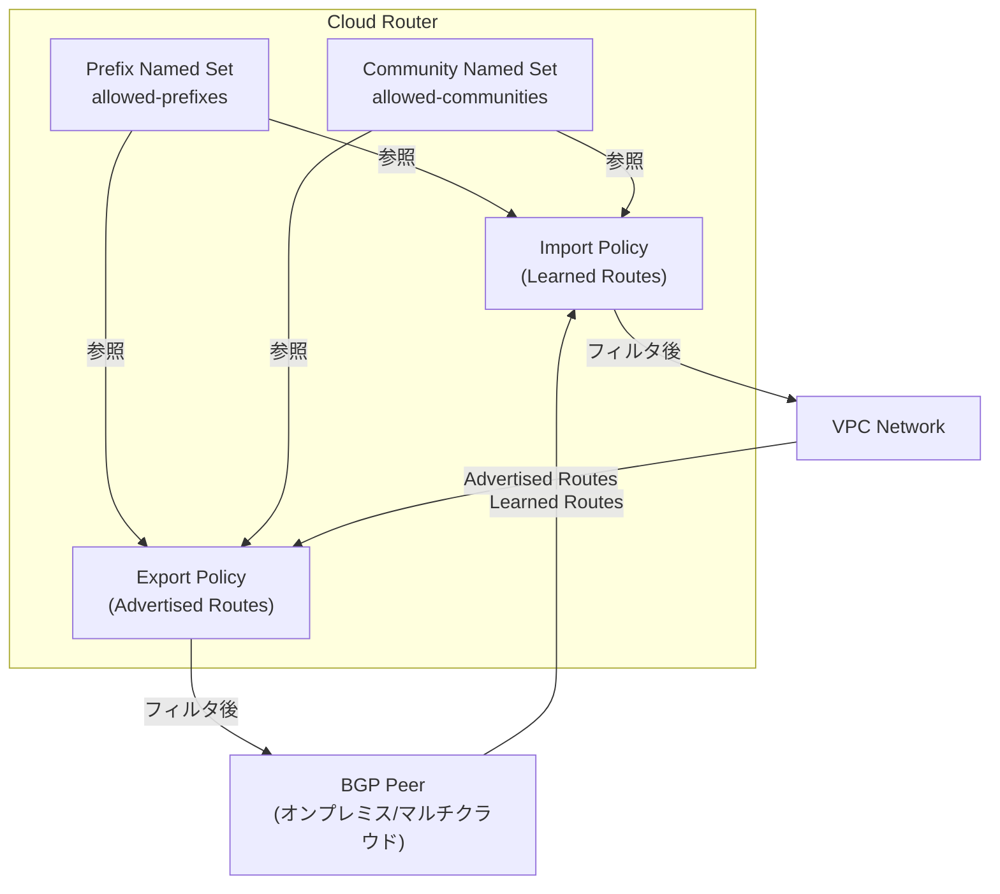

# Cloud Router: Named Sets for BGP Route Policies (GA)

**リリース日**: 2026-07-23

**サービス**: Cloud Router

**機能**: Named Sets for BGP Route Policies (GA)

**ステータス**: Feature (GA)

[このアップデートのインフォグラフィックを見る](https://takech9203.github.io/google-cloud-news-summary/20260723-cloud-router-named-sets-bgp-route-policies-ga.html)

## 概要

Cloud Router の BGP ルートポリシー向け Named Sets（名前付きセット）機能が一般提供（GA）となりました。Named Sets は、BGP ルートポリシーで使用するプレフィックスやコミュニティの集合をグループ化し、単一のエンティティとして管理・参照できる機能です。Common Expression Language（CEL）を使用してポリシーを定義する際に、Named Sets を参照することで、複雑なルーティングポリシーをよりシンプルかつ再利用可能な形で構成できます。

Named Sets は各 Cloud Router に固有のリソースとして定義され、同じ Cloud Router 上の任意の数の BGP ルートポリシーから参照できます。プレフィックスセット（NAMED_SET_TYPE_PREFIX）とコミュニティセット（NAMED_SET_TYPE_COMMUNITY）の 2 種類が利用可能で、ハイブリッドネットワーキング環境におけるルート制御の柔軟性と管理性を大幅に向上させます。

この機能は、Cloud Interconnect、HA VPN、Router Appliance を使用してオンプレミスやマルチクラウド環境と接続している組織に特に有用です。ネットワークエンジニアは、複数のポリシーで共通のプレフィックスリストやコミュニティリストを一元管理できるようになります。

**アップデート前の課題**

- BGP ルートポリシーの各条件式（match expression）に、プレフィックスやコミュニティの値を直接リテラルとして記述する必要があった
- 同じプレフィックスリストを複数のポリシーで使用する場合、各ポリシーに個別に値を記述する必要があり、変更時にすべてのポリシーを個別に更新する必要があった
- ポリシーが複雑になるにつれて、条件式の可読性と保守性が低下していた

**アップデート後の改善**

- プレフィックスやコミュニティの集合を Named Sets として一元管理し、複数のポリシーから名前で参照可能になった
- Named Sets の要素を変更するだけで、参照しているすべてのポリシーに変更が反映されるようになった
- ポリシー定義がシンプルになり、可読性と保守性が向上した
- gcloud CLI および YAML/JSON ファイルでの管理に対応し、Infrastructure as Code との統合が容易になった

## アーキテクチャ図



Cloud Router 内で Named Sets がどのように BGP ルートポリシーに参照され、インバウンド（学習ルート）およびアウトバウンド（広告ルート）の両方向でルートフィルタリングに使用されるかを示しています。

## サービスアップデートの詳細

### 主要機能

1. **Prefix Named Sets（プレフィックス名前付きセット）**
   - IPv4 および IPv6 プレフィックスのグループを定義可能
   - CEL 式で `prefix('10.0.0.0/20').orLonger()` のようなサブネット範囲指定をサポート
   - ルートポリシーの条件式から `destination.inNamedSet('set-name')` で参照可能

2. **Community Named Sets（コミュニティ名前付きセット）**
   - BGP コミュニティ値のグループを定義可能
   - `'64500:100'` のような標準コミュニティ形式をサポート
   - ルートポリシーの条件式から `communities.matchesAnyInNamedSet('set-name')` で参照可能

3. **Named Sets の管理操作**
   - gcloud CLI による作成・追加・削除・更新の全操作をサポート
   - YAML/JSON ファイルのアップロード・ダウンロードによるバッチ管理
   - fingerprint フィールドによる競合更新の防止

## 技術仕様

### クォータと制限事項

| 項目 | 制限値 | 備考 |
|------|--------|------|
| Cloud Router あたりの最大 Named Sets 数 | 500 | ポリシーリソース全体のサイズ制限に貢献 |
| Named Set あたりの最大要素数 | 1,000 | - |
| Cloud Router あたりのポリシーリソース最大サイズ | 35 KB (35,000 bytes) | Named Sets を含む全ポリシーリソースの合計 |
| BGP ピアまたは方向あたりの最大ポリシー条件数 | 1,000 | 全適用ポリシーの合計 |
| 単一 match 式の最大マッチ要素数 | 100 | destination と community マッチの合計 |
| Cloud Router あたりの最大 BGP ルートポリシー数 | 500 | - |

### Named Set の種類

| タイプ | 型名 | 用途 |
|--------|------|------|
| プレフィックスセット | `NAMED_SET_TYPE_PREFIX` | IP プレフィックスのグループ化（ルートの宛先でのフィルタリング） |
| コミュニティセット | `NAMED_SET_TYPE_COMMUNITY` | BGP コミュニティ値のグループ化（コミュニティ属性でのフィルタリング） |

### Named Set の YAML 定義例

```yaml
# Prefix set
resource:
  elements:
  - expression: "'192.168.0.0/16'"
  - expression: "'fd00::/8'"
  - expression: "prefix('10.0.0.0/20').orLonger()"
  name: allowed-prefixes
  type: NAMED_SET_TYPE_PREFIX
```

```yaml
# Community set
resource:
  elements:
  - expression: "'64500:100'"
  - expression: "'64500:200'"
  name: allowed-communities
  type: NAMED_SET_TYPE_COMMUNITY
```

## 設定方法

### 前提条件

1. Google Cloud プロジェクトで Compute Engine API が有効化されていること
2. Cloud Router が作成済みであること
3. gcloud CLI の最新バージョンがインストールされていること

### 手順

#### ステップ 1: Named Set の作成（gcloud CLI）

```bash
# 空のプレフィックス Named Set を作成
gcloud compute routers add-named-set ROUTER_NAME \
  --set-name=allowed-prefixes \
  --set-type=prefix \
  --region=REGION

# プレフィックス要素を追加
gcloud compute routers add-named-set-element ROUTER_NAME \
  --set-name=allowed-prefixes \
  --new-set-element="'192.168.0.0/16'" \
  --region=REGION

gcloud compute routers add-named-set-element ROUTER_NAME \
  --set-name=allowed-prefixes \
  --new-set-element="prefix('10.0.0.0/20').orLonger()" \
  --region=REGION
```

`ROUTER_NAME` を Cloud Router の名前に、`REGION` をリージョンに置き換えてください。

#### ステップ 2: Named Set のアップロード（YAML ファイル使用）

```bash
# YAML ファイルを作成して Named Set をアップロード
gcloud compute routers upload-named-set ROUTER_NAME \
  --set-name=allowed-prefixes \
  --file-name=allowed-prefixes.yaml \
  --file-format=yaml \
  --region=REGION
```

YAML ファイルを事前に作成し、アップロードすることで一括設定が可能です。

#### ステップ 3: Named Set の確認

```bash
# Cloud Router に定義されている Named Sets を一覧表示
gcloud compute routers list-named-sets ROUTER_NAME \
  --region=REGION

# Named Set をダウンロードして内容を確認
gcloud compute routers download-named-set ROUTER_NAME \
  --set-name=allowed-prefixes \
  --file-name=output.yaml \
  --file-format=yaml \
  --region=REGION
```

#### ステップ 4: BGP ルートポリシーから Named Set を参照

BGP ルートポリシーの条件式で Named Set を参照することで、グループ化されたプレフィックスやコミュニティに基づくフィルタリングが可能になります。

## メリット

### ビジネス面

- **運用コストの削減**: ルーティングポリシーの管理が一元化され、変更作業の工数と人的エラーのリスクが低減
- **コンプライアンス管理の容易化**: 許可・拒否するプレフィックスやコミュニティを Named Sets として定義することで、ネットワークセキュリティポリシーの可視化と監査が容易に

### 技術面

- **再利用性の向上**: 同一の Named Set を複数のポリシーから参照でき、DRY 原則に則ったポリシー設計が可能
- **保守性の改善**: Named Set の要素を変更するだけで、参照するすべてのポリシーに即座に反映
- **Infrastructure as Code との統合**: YAML/JSON ファイル形式での管理により、Git バージョン管理や CI/CD パイプラインとの統合が容易
- **競合防止**: fingerprint メカニズムにより、複数のオペレーターによる同時変更での競合を防止

## デメリット・制約事項

### 制限事項

- Named Sets は各 Cloud Router に固有であり、複数の Cloud Router 間で共有することはできない
- カスタム学習ルート（Custom Learned Routes）には BGP ルートポリシーを適用できない
- BGP ピアから 5,000 プレフィックスを超える広告があった場合、BGP セッションがリセットされる（Named Sets の使用に関わらず）
- ポリシーリソース全体のサイズが 35 KB に制限されている

### 考慮すべき点

- 本番環境にポリシーを適用する前に、テスト環境での検証が推奨されている
- Named Set が BGP ルートポリシーで参照されている間は削除できない
- Named Sets はリージョン単位のリソースであり、グローバルな共有はできない

## ユースケース

### ユースケース 1: マルチサイトオンプレミス接続でのプレフィックスフィルタリング

**シナリオ**: 企業が複数のオンプレミスサイトから Cloud Interconnect で接続しており、特定のプレフィックス群のみを各サイトに広告したい場合

**実装例**:
```yaml
# 許可するプレフィックスを Named Set で定義
resource:
  elements:
  - expression: "'10.100.0.0/16'"
  - expression: "'10.200.0.0/16'"
  - expression: "prefix('172.16.0.0/12').orLonger()"
  name: site-a-allowed-prefixes
  type: NAMED_SET_TYPE_PREFIX
```

**効果**: 各サイト向けのルートポリシーで同じ Named Set を参照することで、プレフィックスリストの変更を一箇所で管理可能

### ユースケース 2: BGP コミュニティベースのトラフィックエンジニアリング

**シナリオ**: マルチクラウド環境で特定の BGP コミュニティが付与されたルートに対して MED 値を変更し、トラフィックの優先経路を制御したい場合

**実装例**:
```yaml
# 優先経路を示すコミュニティを Named Set で定義
resource:
  elements:
  - expression: "'65000:100'"
  - expression: "'65000:200'"
  name: preferred-path-communities
  type: NAMED_SET_TYPE_COMMUNITY
```

**効果**: コミュニティ値の追加・変更が発生しても、Named Set を更新するだけで全ポリシーに反映され、トラフィックエンジニアリングの管理が簡素化

## 料金

Cloud Router 自体の利用料金は無料です。ただし、Cloud Router を使用する接続サービス（Cloud Interconnect、HA VPN など）には別途料金が発生します。Named Sets 機能の利用に追加料金はありません。

詳細は [Cloud Router 料金ページ](https://cloud.google.com/network-connectivity/docs/router/pricing) を参照してください。

## 利用可能リージョン

Cloud Router が利用可能なすべてのリージョンで Named Sets 機能を使用できます。Cloud Router は Google Cloud の全リージョンで利用可能です。

## 関連サービス・機能

- **Cloud Interconnect (Dedicated/Partner)**: Cloud Router と組み合わせてオンプレミスとの BGP セッションを管理。Named Sets でルート広告を精密に制御可能
- **HA VPN**: Cloud Router を使用した動的ルーティングで VPN トンネル経由のルート交換を管理。Named Sets で学習ルートのフィルタリングが可能
- **Network Connectivity Center**: Router Appliance を使用した BGP セッションで Named Sets を活用可能
- **BGP Route Policies**: Named Sets の親機能。ルートのフィルタリングや属性変更を CEL 式で定義
- **VPC Network**: Cloud Router が広告するサブネットルートの制御に Named Sets を活用可能

## 参考リンク

- [インフォグラフィック](https://takech9203.github.io/google-cloud-news-summary/20260723-cloud-router-named-sets-bgp-route-policies-ga.html)
- [公式リリースノート](https://docs.cloud.google.com/release-notes#July_23_2026)
- [BGP Route Policies 概要ドキュメント](https://docs.cloud.google.com/network-connectivity/docs/router/concepts/bgp-route-policies-overview)
- [Named Sets の作成ガイド](https://docs.cloud.google.com/network-connectivity/docs/router/how-to/bgp-route-policies/create-named-sets)
- [Named Sets の管理ガイド](https://docs.cloud.google.com/network-connectivity/docs/router/how-to/bgp-route-policies/update-named-sets)
- [Cloud Router クォータと制限](https://docs.cloud.google.com/network-connectivity/docs/router/quotas)
- [料金ページ](https://cloud.google.com/network-connectivity/docs/router/pricing)

## まとめ

Cloud Router の BGP ルートポリシー向け Named Sets が GA となり、ハイブリッド・マルチクラウドネットワーキング環境でのルーティングポリシー管理が大幅に改善されました。プレフィックスやコミュニティの集合を一元的に管理し、複数のポリシーから再利用可能な形で参照できるため、大規模ネットワーク環境での運用負荷が軽減されます。Cloud Interconnect や HA VPN を使用してオンプレミス接続を行っている組織は、この機能を活用してルートフィルタリングの管理をよりシンプルかつ堅牢にすることを推奨します。

---

**タグ**: #CloudRouter #BGP #RoutePolicies #NamedSets #NetworkConnectivity #HybridCloud #GA
