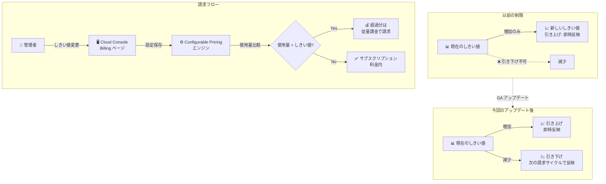

# Vertex AI Search (Agent Search): Configurable Pricing Threshold Decrease (GA)

**リリース日**: 2026-07-23

**サービス**: Vertex AI Search (Agent Search)

**機能**: Configurable Pricing Threshold Decrease

**ステータス**: GA (一般提供)

📊 [このアップデートのインフォグラフィックを見る](https://takech9203.github.io/google-cloud-news-summary/20260723-vertex-ai-search-configurable-pricing-threshold-decrease.html)

## 概要

Vertex AI Search (Agent Search) の Configurable Pricing (構成可能な料金設定) において、サブスクリプションのしきい値を引き下げる機能が一般提供 (GA) となりました。これにより、ストレージサイズおよびクエリ毎分 (QPM) のサブスクリプションしきい値を、必要に応じて減少させることが可能になります。

Configurable Pricing は、従来の従量課金モデル (Pay-as-you-go) に代わる柔軟な月額サブスクリプションモデルです。ストレージ容量と検索クエリ数 (QPM) の 2 つのサブスクリプションを中心に、セマンティック検索や AI オーバービューなどのアドオンを組み合わせることで、利用パターンに最適化されたコスト構造を実現します。今回のアップデートにより、ビジネス要件の変化に合わせてしきい値を上下両方向に調整できるようになり、コスト最適化の柔軟性が大幅に向上しました。

このアップデートは、Agent Search を利用する全てのユーザー、特にコスト管理を重視するエンタープライズ顧客や、トラフィックパターンが季節性を持つサービスを運用するチームにとって重要です。

**アップデート前の課題**

- サブスクリプションしきい値は増加のみ可能で、一度引き上げた後に引き下げることができなかった
- ビジネス要件が縮小した場合やトラフィックが減少した際に、過剰なサブスクリプションコストが発生し続けた
- しきい値を下げるには、Configurable Pricing 自体を無効化して再設定する必要があり、運用負荷が高かった

**アップデート後の改善**

- ストレージサイズと QPM の両方のサブスクリプションしきい値を引き下げ可能になった
- 引き下げたしきい値は次の請求サイクルの開始時に有効になる (即時反映ではない安全設計)
- Google Cloud Console の Billing ページから簡単に操作でき、増減の両方向でしきい値を柔軟に管理可能

## アーキテクチャ図



この図は、以前はしきい値の引き上げのみが可能だった制限と、今回のアップデートにより引き下げも可能になった変更を示しています。また、実際の請求フローにおけるしきい値と使用量の比較ロジックを表しています。

## サービスアップデートの詳細

### 主要機能

1. **サブスクリプションしきい値の引き下げ**
   - ストレージサイズ (GiB) のサブスクリプションしきい値を減少可能
   - クエリ毎分 (QPM) のサブスクリプションしきい値を減少可能
   - 最小しきい値: ストレージ 50 GiB/月、QPM 1000 クエリ/分/プロジェクト

2. **次の請求サイクルでの反映**
   - 引き下げたしきい値は即時には反映されず、次の請求サイクル開始時に有効化
   - 引き上げたしきい値は従来通り即時反映
   - この非対称な反映タイミングにより、請求の予測可能性を確保

3. **変更後のクールダウン期間**
   - しきい値変更後、次の変更まで最大 2 時間の待機が必要
   - 2 時間以内の再変更リクエストは失敗する可能性がある
   - これにより、頻繁な変更による請求の不整合を防止

## 技術仕様

### サブスクリプションしきい値の詳細

| 項目 | 詳細 |
|------|------|
| ストレージ最小しきい値 | 50 GiB/月 |
| QPM 最小しきい値 | 1000 クエリ/分/プロジェクト |
| 引き上げ反映タイミング | 即時 |
| 引き下げ反映タイミング | 次の請求サイクル開始時 |
| 変更間クールダウン | 最大 2 時間 |
| 超過時の課金 | 従量課金モデル (General Pricing) に準拠 |

### 必要な IAM 権限

| ロール | 権限 |
|--------|------|
| Discovery Engine Admin (`roles/discoveryengine.admin`) | `discoveryengine.projects.update` |

## 設定方法

### 前提条件

1. Google Cloud プロジェクトで Configurable Pricing が有効化されていること
2. Discovery Engine Admin ロール (`roles/discoveryengine.admin`) または `discoveryengine.projects.update` 権限を持つユーザーであること
3. 消費データの蓄積のため、有効化から数週間経過していること

### 手順

#### ステップ 1: 現在の消費量を確認

Google Cloud Console で Billing ページに移動し、現在の消費データを確認します。

1. Google Cloud Console にログイン
2. Billing ページに移動
3. **Consumption** をクリックして消費データを確認

#### ステップ 2: サブスクリプションしきい値を変更

```
1. Billing ページで「Subscriptions」をクリック
2. プロジェクト全体のしきい値 (Storage / QPM) を確認
3. 必要に応じて値を減少させる
4. 「Save project settings」をクリック
```

注意: しきい値を引き下げた場合、Subscriptions ページ上の表示は次の請求サイクル開始まで更新されません。

#### ステップ 3: 変更の確認

- 引き上げの場合: 即座に新しいしきい値が反映される
- 引き下げの場合: 次の請求サイクル開始時まで待機が必要
- 次の変更は 2 時間以上間隔を空けて実行

## メリット

### ビジネス面

- **コスト最適化の柔軟性**: ビジネスの成長や縮小に合わせてサブスクリプションコストを最適化でき、不要な支出を削減
- **季節性への対応**: トラフィックの季節変動に合わせてしきい値を調整し、オフピーク時のコストを抑制
- **予算管理の改善**: 請求サイクル単位での予測可能なコスト管理が可能に

### 技術面

- **運用の簡素化**: Console の UI から直接操作可能で、API やサポートチケット不要
- **安全な変更設計**: 引き下げが次の請求サイクルで反映される設計により、予期しない課金変動を防止
- **段階的スケーリング**: 利用パターンの変化に応じて段階的にリソース割り当てを調整可能

## デメリット・制約事項

### 制限事項

- 引き下げたしきい値は即時反映されず、次の請求サイクル開始時まで待機が必要
- しきい値変更後、次の変更まで最大 2 時間のクールダウン期間が必要
- 最小しきい値 (ストレージ 50 GiB、QPM 1000) 以下には設定不可
- 引き下げ後の表示更新は次の請求サイクルまで行われないため、現在の設定値の確認に注意が必要

### 考慮すべき点

- しきい値を下げすぎると、超過分が従量課金で請求されるため、消費データを十分に確認してから調整すべき
- 月の途中でしきい値を変更しても、引き下げは当月には反映されないため、計画的な変更が必要
- 複数のアプリやデータストアの使用量が合算されてしきい値と比較されるため、個別のアプリ単位での削減が全体に影響する点を考慮

## ユースケース

### ユースケース 1: 季節性のあるECサイト

**シナリオ**: EC サイトを運営する企業が、年末商戦期に QPM しきい値を引き上げて対応し、閑散期に引き下げてコストを最適化する。

**実装例**:
```
1. 11月: QPM しきい値を 5000 に引き上げ (即時反映)
2. 年末商戦対応 (12月〜1月)
3. 2月: QPM しきい値を 2000 に引き下げ (3月の請求サイクルから反映)
```

**効果**: 閑散期の不要なサブスクリプションコストを削減し、年間コストを最適化

### ユースケース 2: パイロットプロジェクトからの移行

**シナリオ**: 大規模なパイロットテスト後に本番環境のリソース要件が明確になり、当初設定したしきい値が過大であることが判明した。

**効果**: 消費データに基づいてしきい値を適正値に引き下げ、不要コストを排除。従来はしきい値を下げられなかったため、過剰な支出が継続していた問題を解消。

### ユースケース 3: データストア統廃合

**シナリオ**: 複数のデータストアを統合し、全体のストレージ使用量が減少した際に、ストレージしきい値を引き下げる。

**効果**: 統合によるストレージ削減効果をサブスクリプションコストにも反映させ、TCO (総所有コスト) を削減

## 料金

Configurable Pricing は以下の 2 つのサブスクリプションとアドオンで構成されます。

### サブスクリプション構成

| コンポーネント | 最小しきい値 | 説明 |
|---------------|-------------|------|
| ストレージ | 50 GiB/月 | 構造化/非構造化/ウェブサイトデータのインデックスストレージ |
| 検索クエリ (QPM) | 1000 QPM/プロジェクト | 標準キーワード検索およびフィルタリング |

### アドオン

| アドオン | 種別 | 説明 |
|---------|------|------|
| Semantic Embedding | ストレージ | ドキュメントのベクトル埋め込み生成・維持 |
| Semantic Query | 検索リクエスト | セマンティック検索 (埋め込みによる複雑なクエリ対応) |
| KPI & Personalization | 検索リクエスト | ユーザーイベントベースのリランキングとパーソナライゼーション |
| AI Overview | 検索リクエスト | 生成的要約やフォローアップ質問 |

### 超過時の課金

しきい値を超過した場合、超過分は General Pricing (従量課金) モデルに基づいて課金されます。

詳細な料金情報は [Agent Search Configurable Pricing](https://cloud.google.com/generative-ai-app-builder/pricing#vertex-ai-search-configurable-pricing) を参照してください。

## 利用可能リージョン

Agent Search の Configurable Pricing は、Agent Search が利用可能な全リージョン (Global、US、EU) で利用できます。詳細は [Agent Search のクォータとリージョン](https://docs.cloud.google.com/generative-ai-app-builder/quotas) を確認してください。

## 関連サービス・機能

- **Cloud Billing**: サブスクリプションの管理、消費データの確認、しきい値変更の実行に使用
- **Agent Search (Configurable Pricing)**: 本アップデートの対象。2025 年 12 月に GA となった Configurable Pricing モデルの拡張機能
- **Discovery Engine API**: Agent Search の基盤 API。クォータと課金は Discovery Engine API を通じて管理される
- **Gemini Enterprise**: Discovery Engine API のクォータを Agent Search と共有。課金レポートでは Vertex AI Search サービスとして表示される

## 参考リンク

- 📊 [インフォグラフィック](https://takech9203.github.io/google-cloud-news-summary/20260723-vertex-ai-search-configurable-pricing-threshold-decrease.html)
- [公式リリースノート](https://docs.cloud.google.com/release-notes#July_23_2026)
- [Modify subscription thresholds ドキュメント](https://docs.cloud.google.com/generative-ai-app-builder/docs/enable-configurable-pricing#modify-thresholds)
- [Enable configurable pricing for custom search](https://docs.cloud.google.com/generative-ai-app-builder/docs/enable-configurable-pricing)
- [Vertex AI Search 料金ページ](https://cloud.google.com/generative-ai-app-builder/pricing)
- [Agent Search クォータ](https://docs.cloud.google.com/generative-ai-app-builder/quotas)

## まとめ

今回のアップデートにより、Vertex AI Search (Agent Search) の Configurable Pricing でサブスクリプションしきい値の引き下げが GA として正式にサポートされました。これは、コスト最適化において重要な機能改善であり、特にトラフィックの変動が大きいワークロードや、リソース要件が変化するプロジェクトにおいて大きな価値を提供します。推奨されるアクションとして、現在 Configurable Pricing を利用中のユーザーは Billing ページで消費データを確認し、しきい値が現在の利用パターンに対して過大でないかを検証することをお勧めします。

---

**タグ**: #VertexAISearch #AgentSearch #ConfigurablePricing #コスト最適化 #GA #Billing #サブスクリプション
