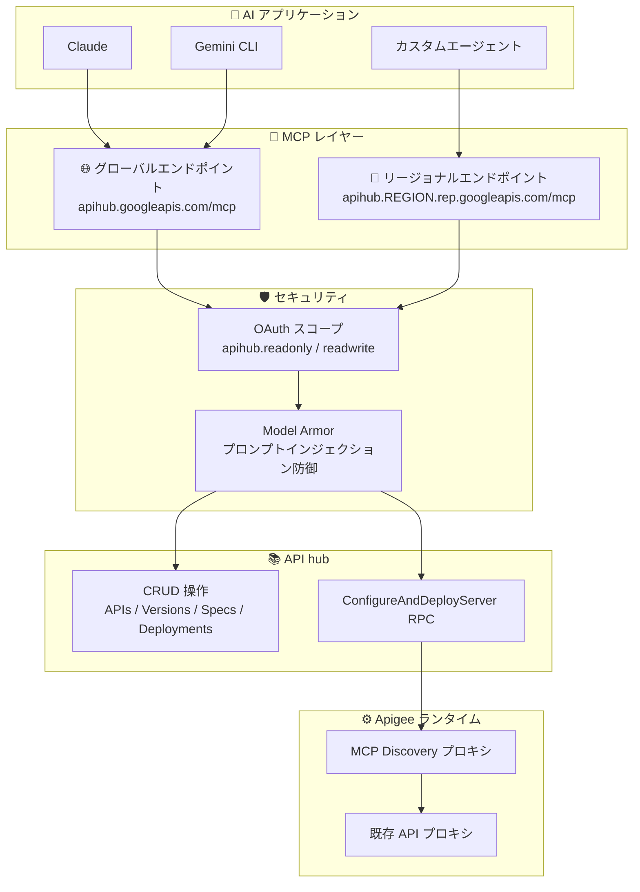

# Apigee API hub: Model Context Protocol (MCP) サーバー GA および ConfigureAndDeployServer RPC

**リリース日**: 2026-07-24

**サービス**: Apigee API hub

**機能**: Model Context Protocol (MCP) サーバーの一般提供開始 + ConfigureAndDeployServer RPC

**ステータス**: GA (一般提供)

📊 [このアップデートのインフォグラフィックを見る](https://takech9203.github.io/google-cloud-news-summary/20260724-apigee-api-hub-mcp-ga.html)

## 概要

Apigee API hub の Model Context Protocol (MCP) サーバーが一般提供 (GA) となった。このリリースにより、AI エージェントと API hub の間のシームレスな統合が実現し、アプリケーションが自然言語を使用して API エコシステムの検出、クエリ、管理を行えるようになった。

GA リリースでは、読み取り/書き込み機能の拡張、グローバルエンドポイントルーティング、きめ細かい OAuth スコープ、Model Armor 統合といった主要な機能強化が含まれている。また、新しい RPC `ConfigureAndDeployServer` により、MCP サーバーの構成とデプロイを API hub から直接 Apigee ランタイムに対して実行できるようになった。

このアップデートは、エンタープライズの API 管理にエージェンティック AI を活用したい組織にとって重要な進展であり、従来の手動による API カタログ管理から AI 駆動の自動化への移行を加速させる。

**アップデート前の課題**

- MCP サーバーは Preview 段階で読み取り専用の機能のみ提供されており、AI エージェントから API リソースの作成・更新・削除ができなかった
- MCP サーバーへの接続はリージョナルエンドポイントのみで、グローバルなルーティングには対応していなかった
- OAuth スコープが `cloud-platform` のような広範なスコープに限定され、きめ細かいアクセス制御ができなかった
- MCP ツール呼び出しに対するプロンプトインジェクションなどのセキュリティ保護機構がなかった
- MCP プロキシの構成とデプロイは Apigee 側で手動設定が必要であり、API hub からの一元的な管理ができなかった

**アップデート後の改善**

- AI エージェントが API、バージョン、スペック、デプロイメントの作成・更新・削除を自然言語で実行可能になった
- グローバルエンドポイント (`apihub.googleapis.com/mcp`) を使用して世界中からアクセス可能になった
- サービス固有の OAuth スコープ (`apihub.readonly`, `apihub.readwrite`) による最小権限アクセスが実現した
- Model Armor 統合により、プロンプトインジェクション攻撃からの保護が有効になった
- `ConfigureAndDeployServer` RPC により、API hub から MCP サーバーの構成・デプロイを一元管理できるようになった

## アーキテクチャ図



AI エージェントがグローバル/リージョナルエンドポイントを通じて API hub MCP サーバーに接続し、OAuth 認証と Model Armor によるセキュリティ検査を経て、API リソースの管理や MCP プロキシのデプロイを実行するフローを示している。

## サービスアップデートの詳細

### 主要機能

1. **読み取り/書き込み機能の拡張**
   - AI エージェントが API、バージョン、スペック、デプロイメントの CRUD 操作を実行可能
   - MCP Discovery プロキシの構成とデプロイを Apigee 環境に対して実行可能
   - 40 以上の MCP ツールが利用可能 (create_api, update_api, delete_api, create_version, create_spec, create_deployment など)

2. **グローバルエンドポイントルーティング**
   - グローバルエンドポイント: `https://apihub.googleapis.com/mcp`
   - リージョナルエンドポイント: `https://apihub.REGION.rep.googleapis.com/mcp`
   - 9 リージョン対応: asia-east1, asia-south1, asia-southeast1, europe-north1, europe-west1, europe-west9, us-central1, us-east1, us-west1

3. **きめ細かい OAuth スコープ**
   - `apihub.readonly`: データの読み取りのみ許可
   - `apihub.readwrite`: データの読み取りと変更を許可
   - 最小権限の原則に基づくセキュアなアクセス制御

4. **Model Armor 統合**
   - MCP ツール呼び出し (tools/call) のリクエスト/レスポンスをサニタイズ
   - プロンプトインジェクション、ジェイルブレイク攻撃の検出とブロック
   - 悪意のある URI の検出
   - Inspect only / Inspect and block の 2 つの動作モード

5. **ConfigureAndDeployServer RPC**
   - API hub から直接 Apigee X ランタイムに MCP サーバーを構成・デプロイ
   - 既存の Apigee プロキシの API オペレーションを MCP ツールとしてバンドル
   - 既にデプロイ済みの場合は新しいリビジョンで上書き

## 技術仕様

### ConfigureAndDeployServer RPC

| 項目 | 詳細 |
|------|------|
| HTTP メソッド | POST |
| エンドポイント | `https://apihub.googleapis.com/v1/{parent=projects/*/locations/*}/servers:configureAndDeployServer` |
| 認証スコープ | `apihub.readwrite` または `cloud-platform` |
| 必要な IAM 権限 | `apihub.apiOperations.listAll`, `apihub.apis.list`, `apihub.deployments.list`, `apihub.specs.listAll`, `apihub.versions.listAll` |
| サポートターゲット | Apigee X のみ (Apigee hybrid は非対応) |
| レスポンス | Operation (長時間実行オペレーション) |

### MCP ツール一覧 (主要なもの)

| カテゴリ | ツール名 | 説明 |
|---------|---------|------|
| API 管理 | create_api, get_api, list_apis, update_api, delete_api | API リソースの CRUD |
| バージョン管理 | create_version, get_version, list_versions, update_version, delete_version | API バージョンの CRUD |
| スペック管理 | create_spec, get_spec, get_spec_contents, list_specs, update_spec, delete_spec | API 仕様の CRUD |
| デプロイメント | create_deployment, get_deployment, list_deployments, update_deployment, delete_deployment | デプロイメントの CRUD |
| 検索 | search_resources | API hub 内リソースの検索 |
| 依存関係 | create_dependency, get_dependency, list_dependencies, update_dependency, delete_dependency | API 間依存関係の管理 |

### McpServerConfig (リクエストボディ)

```json
{
  "mcpServerConfig": {
    "tools": [
      {
        "toolId": "get-user-profile",
        "description": "Retrieves user profile information",
        "operation": {
          "httpOperation": {
            "spec": "projects/my-project/locations/us-central1/apis/user-api/versions/v1/specs/openapi",
            "path": "/users/{userId}",
            "method": "GET"
          }
        }
      }
    ],
    "apigeeXTargetDetails": {
      "environment": "prod",
      "proxy": "mcp-discovery-server",
      "targetProject": "my-runtime-project",
      "metadata": {
        "displayName": "User API MCP Server",
        "description": "MCP server for user management APIs"
      }
    }
  }
}
```

## 設定方法

### 前提条件

1. Apigee API hub が有効化されたプロジェクト
2. 適切な IAM ロールの付与 (roles/mcp.toolUser, roles/apihub.viewer 以上)
3. MCP クライアント対応の AI アプリケーション (Claude, Gemini CLI, ChatGPT など)

### 手順

#### ステップ 1: MCP クライアントの設定

AI アプリケーションの MCP 設定に以下を追加する:

```json
{
  "mcpServers": {
    "apigee-api-hub": {
      "url": "https://apihub.googleapis.com/mcp",
      "transport": "http",
      "auth": {
        "type": "oauth2",
        "scope": "https://www.googleapis.com/auth/apihub.readwrite"
      }
    }
  }
}
```

#### ステップ 2: IAM ロールの付与

```bash
# MCP ツール呼び出し権限
gcloud projects add-iam-policy-binding PROJECT_ID \
  --member="user:USER_EMAIL" \
  --role="roles/mcp.toolUser"

# API hub リソース管理権限
gcloud projects add-iam-policy-binding PROJECT_ID \
  --member="user:USER_EMAIL" \
  --role="roles/apihub.editor"
```

#### ステップ 3: Model Armor の有効化 (推奨)

```bash
gcloud model-armor floorsettings update \
  --full-uri='projects/PROJECT_ID/locations/global/floorSetting' \
  --enable-floor-setting-enforcement=TRUE \
  --add-integrated-services=GOOGLE_MCP_SERVER \
  --google-mcp-server-enforcement-type=INSPECT_AND_BLOCK \
  --enable-google-mcp-server-cloud-logging \
  --malicious-uri-filter-settings-enforcement=ENABLED
```

#### ステップ 4: MCP プロキシのデプロイ (ConfigureAndDeployServer)

```bash
curl -X POST \
  "https://apihub.googleapis.com/v1/projects/PROJECT_ID/locations/LOCATION/servers:configureAndDeployServer" \
  -H "Authorization: Bearer $(gcloud auth print-access-token)" \
  -H "Content-Type: application/json" \
  -d '{
    "mcpServerConfig": {
      "tools": [
        {
          "toolId": "list-products",
          "description": "List all available products",
          "operation": {
            "httpOperation": {
              "spec": "projects/PROJECT_ID/locations/LOCATION/apis/product-api/versions/v1/specs/openapi-spec",
              "path": "/products",
              "method": "GET"
            }
          }
        }
      ],
      "apigeeXTargetDetails": {
        "environment": "prod",
        "proxy": "mcp-discovery-server",
        "targetProject": "RUNTIME_PROJECT_ID"
      }
    }
  }'
```

## メリット

### ビジネス面

- **API ガバナンスの自動化**: AI エージェントが自然言語で API カタログを管理でき、開発者の生産性が大幅に向上
- **エージェンティック AI の実現**: 既存の API アセットを AI エージェントから直接利用可能にし、新しいビジネス価値を創出
- **運用コスト削減**: MCP プロキシの構成・デプロイの自動化により、手動設定作業を排除

### 技術面

- **標準プロトコルによる相互運用性**: MCP 標準に準拠しており、Claude、Gemini、ChatGPT など主要な AI プラットフォームと互換
- **セキュリティファースト**: Model Armor 統合により、プロンプトインジェクション攻撃を本番環境で防御
- **柔軟なデプロイモデル**: グローバルエンドポイントとリージョナルエンドポイントの選択により、レイテンシ要件とデータレジデンシー要件の両方に対応

## デメリット・制約事項

### 制限事項

- Apigee 組織あたりの MCP ツール数は最大 1,000 に制限
- Apigee hybrid 組織では MCP は利用不可
- サポートされる OpenAPI バージョンは 3.0.0, 3.0.1, 3.0.2, 3.0.3 のみ
- VPC-SC が有効な Apigee 組織では、MCP API やツールに対する API Insights は利用不可
- MCP エラーレスポンスに対する GET 呼び出しは 405 エラーを返す (SSE ストリーム非対応)
- 一部リージョン (europe-central2, europe-southwest1, europe-west9, me-central2) ではインフラ容量制限あり

### 考慮すべき点

- Model Armor のデータレジデンシー: Model Armor が利用できないリージョンでは、セキュリティスクリーニングのために別のリージョンにデータが送信される可能性がある
- 既存の API リソースに対して API スタイル属性を MCP に変更することはできない
- ConfigureAndDeployServer は既存デプロイを上書き (既存ツールはすべて削除されて新しいセットがデプロイされる)

## ユースケース

### ユースケース 1: AI エージェントによる API カタログ管理

**シナリオ**: 開発チームが数百の API を管理しており、新しい API の登録やメタデータの更新を自動化したい。

**実装例**:
```
AI Agent: "user-management API の v2 バージョンを作成し、
OpenAPI スペックをアップロードして、prod 環境にデプロイしてください"

→ MCP ツール呼び出し: create_version, create_spec, create_deployment
```

**効果**: API カタログの維持管理にかかる時間を大幅に削減し、最新の状態を常に維持できる。

### ユースケース 2: MCP Discovery プロキシによる API の AI エージェント公開

**シナリオ**: 社内の既存 API を AI エージェントから利用可能にしたいが、各 API ごとに MCP サーバーを手動構成する工数を削減したい。

**実装例**:
```bash
# API hub で既存 API オペレーションを選択し、MCP プロキシとして自動デプロイ
POST /v1/projects/my-project/locations/us-central1/servers:configureAndDeployServer
{
  "mcpServerConfig": {
    "tools": [...],  // 選択した API オペレーション
    "apigeeXTargetDetails": {
      "environment": "prod",
      "proxy": "mcp-discovery-server",
      "targetProject": "my-runtime-project"
    }
  }
}
```

**効果**: 既存の Apigee プロキシを自動的に MCP ツールとしてバンドルし、AI エージェントから利用可能にする。手動での MCP 仕様作成が不要になる。

### ユースケース 3: セキュアなエージェンティックワークフロー

**シナリオ**: 本番環境で AI エージェントが API 操作を行うが、プロンプトインジェクション攻撃のリスクを最小化したい。

**効果**: Model Armor の Inspect and block モードにより、悪意のあるプロンプトが API hub のツール呼び出しに到達する前にブロックされ、本番 API の安全性が確保される。

## 料金

API hub は無料サービスとして提供されている (Apigee API hub の有効化に追加料金は発生しない)。ただし、以下の関連コストが発生する可能性がある:

- **Apigee ランタイム**: MCP Discovery プロキシのデプロイには Apigee 環境が必要であり、Apigee の Pay-as-you-go 料金が適用される
- **API 呼び出し**: MCP プロキシ経由の API 呼び出しには Apigee の API コール料金が適用される
- **Model Armor**: Model Armor によるセキュリティスキャンには別途料金が発生する可能性がある

### 料金例 (Apigee ランタイム参考)

| 環境タイプ | 月額料金 (1 リージョン) |
|-----------|----------------------|
| Base 環境 (20 プロキシまで) | $365/月 |
| Intermediate 環境 (50 プロキシまで) | $1,460/月 |
| Comprehensive 環境 (100 プロキシまで) | $3,431/月 |

## 利用可能リージョン

MCP サーバーは以下の 9 リージョンでリージョナルエンドポイントとして利用可能:

| リージョン | エンドポイント |
|-----------|--------------|
| asia-east1 (台湾) | `apihub.asia-east1.rep.googleapis.com/mcp` |
| asia-south1 (ムンバイ) | `apihub.asia-south1.rep.googleapis.com/mcp` |
| asia-southeast1 (シンガポール) | `apihub.asia-southeast1.rep.googleapis.com/mcp` |
| europe-north1 (フィンランド) | `apihub.europe-north1.rep.googleapis.com/mcp` |
| europe-west1 (ベルギー) | `apihub.europe-west1.rep.googleapis.com/mcp` |
| europe-west9 (パリ) | `apihub.europe-west9.rep.googleapis.com/mcp` |
| us-central1 (アイオワ) | `apihub.us-central1.rep.googleapis.com/mcp` |
| us-east1 (サウスカロライナ) | `apihub.us-east1.rep.googleapis.com/mcp` |
| us-west1 (オレゴン) | `apihub.us-west1.rep.googleapis.com/mcp` |

グローバルエンドポイント: `https://apihub.googleapis.com/mcp`

## 関連サービス・機能

- **Apigee**: MCP Discovery プロキシのランタイム環境を提供。既存の API プロキシを MCP ツールとして公開
- **Model Armor**: MCP ツール呼び出しに対するプロンプトインジェクション防御とセキュリティスキャンを提供
- **Agent Registry**: API hub と統合して MCP サーバー/ツールのメタデータを自動同期
- **Cloud IAM**: OAuth スコープとIAM ロールによるきめ細かいアクセス制御
- **Google Cloud MCP servers**: BigQuery、Cloud Storage、Cloud SQL など他の Google Cloud サービスの MCP サーバーとの統合

## 参考リンク

- 📊 [インフォグラフィック](https://takech9203.github.io/google-cloud-news-summary/20260724-apigee-api-hub-mcp-ga.html)
- [公式リリースノート](https://docs.cloud.google.com/release-notes#July_24_2026)
- [API hub MCP リファレンス](https://docs.cloud.google.com/apigee/docs/reference/apis/apihub/mcp)
- [API hub MCP サーバーの使用](https://docs.cloud.google.com/apigee/docs/reference/apis/apihub/mcp/use-apihub-mcp)
- [ConfigureAndDeployServer REST API リファレンス](https://docs.cloud.google.com/apigee/docs/reference/apis/apihub/rest/v1/projects.locations.servers/configureAndDeployServer)
- [MCP プロキシの管理](https://docs.cloud.google.com/apigee/docs/apihub/manage-mcp-proxies)
- [Model Armor と MCP の統合](https://docs.cloud.google.com/model-armor/model-armor-mcp-google-cloud-integration)
- [Google Cloud MCP サーバー概要](https://docs.cloud.google.com/mcp/overview)
- [Apigee 料金ページ](https://cloud.google.com/apigee/pricing)

## まとめ

Apigee API hub の MCP サーバー GA は、エンタープライズ API 管理とエージェンティック AI の融合における重要なマイルストーンである。AI エージェントが自然言語で API エコシステム全体を管理・操作できるようになったことで、開発者の生産性向上と API ガバナンスの自動化が実現する。特に ConfigureAndDeployServer RPC による MCP プロキシの自動デプロイと Model Armor 統合によるセキュリティ保護は、本番環境での採用を強力に後押しする機能である。既存の Apigee ユーザーは、まず読み取り専用スコープで MCP サーバーへの接続を試み、段階的に書き込み機能と MCP プロキシデプロイの活用を検討することを推奨する。

---

**タグ**: #Apigee #APIhub #MCP #ModelContextProtocol #GA #AI #エージェンティックAI #ModelArmor #APIマネジメント
