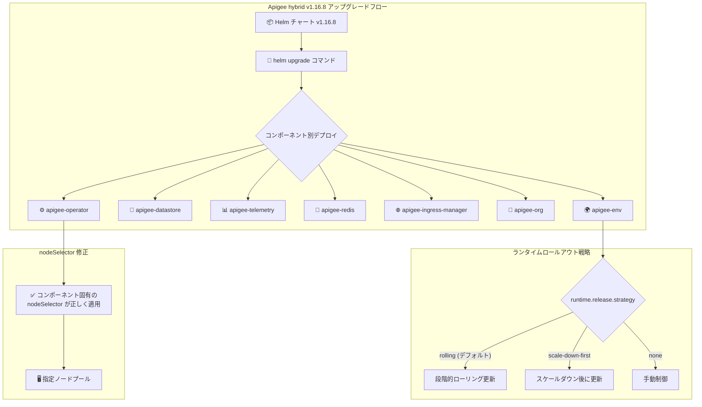

# Apigee hybrid: v1.16.8 パッチリリース

**リリース日**: 2026-07-24

**サービス**: Apigee hybrid

**機能**: v1.16.8 パッチリリース (バグ修正、ランタイムロールアウト戦略設定、セキュリティ修正)

**ステータス**: Patch Release

📊 [このアップデートのインフォグラフィックを見る](https://takech9203.github.io/google-cloud-news-summary/20260724-apigee-hybrid-v1-16-8.html)

## 概要

2026年7月24日、Google Cloud は Apigee hybrid ソフトウェアの更新バージョン v1.16.8 をリリースした。本リリースはパッチリリースであり、コンテナイメージが Apigee hybrid Helm チャートに統合されている。Helm チャート経由でパッチにアップグレードすると、イメージが自動的に更新されるため、手動でのイメージ変更は通常不要である。

このパッチリリースには、Helm チャートにおけるコンポーネント固有の nodeSelector 設定が無視されるバグの修正、ランタイム (メッセージプロセッサ) ReplicaSet の更新時に使用するロールアウト戦略を設定可能にする新機能、および各種セキュリティ/CVE 修正が含まれる。特にマルチノードプール環境で Apigee hybrid を運用しているユーザーや、本番環境でのアップデート時にダウンタイムを最小化したいユーザーにとって重要なアップデートである。

**アップデート前の課題**

- コンポーネント固有の nodeSelector 設定が Helm チャートで無視され、特定のノードプールへのワークロード配置が正しく機能しなかった (Bug 493354568)
- ランタイム (メッセージプロセッサ) ReplicaSet の更新時、ロールアウト戦略を制御する手段がなく、デフォルトの動作に依存していた
- 環境ごとに異なるロールアウト戦略を選択することができなかった

**アップデート後の改善**

- nodeSelector 設定が正しく反映されるようになり、コンポーネントを意図したノードプールに確実に配置可能になった
- `runtime.release.strategy` プロパティにより、rolling、scale-down-first、none の3種類のロールアウト戦略から選択可能になった
- `envs[].components.runtime.release.strategy` により環境ごとに異なるロールアウト戦略を設定可能になった

## アーキテクチャ図



Apigee hybrid v1.16.8 のアップグレードフローと、本パッチで修正・追加された nodeSelector の正常動作およびランタイムロールアウト戦略の設定オプションを示す。

## サービスアップデートの詳細

### 主要機能

1. **バグ修正: コンポーネント固有 nodeSelector の無視 (Bug 493354568)**
   - Helm チャートにおいて、コンポーネント固有の nodeSelector 設定が無視される問題を修正
   - これにより、各コンポーネント (runtime、synchronizer、cassandra など) を特定のノードプールに配置する設定が正しく機能するようになった
   - マルチノードプール構成で、ワークロードの分離やリソースの最適化を行っている環境に特に影響が大きい

2. **新機能: ランタイムロールアウト戦略設定**
   - ランタイム (メッセージプロセッサ) ReplicaSet の更新時に使用するロールアウト戦略を設定可能に
   - `runtime.release.strategy` プロパティで全体設定、`envs[].components.runtime.release.strategy` で環境ごとの設定が可能
   - 選択可能な戦略: `rolling` (デフォルト)、`scale-down-first`、`none`

3. **セキュリティ修正**
   - 各種セキュリティおよび CVE 修正が含まれる
   - 本番環境のセキュリティポスチャを維持するため、速やかな適用を推奨

## 技術仕様

### ロールアウト戦略オプション

| 戦略 | 動作 | ユースケース |
|------|------|------------|
| `rolling` (デフォルト) | 新しいレプリカを段階的に起動しながら古いレプリカを段階的に停止 | 高可用性を維持しながら更新 |
| `scale-down-first` | 既存のレプリカをすべてスケールダウンしてから新しいレプリカを起動 | リソース制約がある環境 |
| `none` | 自動ロールアウトを無効化し手動で制御 | カスタムデプロイフローや段階的リリース |

### 対応プラットフォーム (v1.16)

| プラットフォーム | 対応バージョン |
|-----------------|---------------|
| GKE on Google Cloud | 1.31.x - 1.35.x |
| GKE on AWS | 1.31.x - 1.35.x |
| GKE on Azure | 1.31.x - 1.35.x |
| EKS | 1.31.x - 1.35.x |
| AKS | 1.31.x - 1.35.x |
| OpenShift | 4.16, 4.18 - 4.20 |
| Helm | 3.17.0+ |

### 設定例

```yaml
# overrides.yaml - グローバル設定
runtime:
  nodeSelector:
    key: cloud.google.com/gke-nodepool
    value: apigee-runtime
  replicaCountMin: 2
  replicaCountMax: 10
  release:
    strategy: rolling  # rolling, scale-down-first, none

# 環境ごとの設定
envs:
  - name: prod
    components:
      runtime:
        release:
          strategy: rolling
  - name: staging
    components:
      runtime:
        release:
          strategy: scale-down-first
```

## 設定方法

### 前提条件

1. Helm v3.17.0 以上がインストールされていること
2. Apigee hybrid v1.16.x が既にインストールされていること
3. Kubernetes クラスタへのアクセス権限があること
4. cert-manager 1.16.0+、1.17.2+、1.18.0+、または 1.19.0+ がインストールされていること

### 手順

#### ステップ 1: Helm チャートのダウンロード

```bash
# Apigee hybrid Helm チャート v1.16.8 を取得
export CHART_VERSION=1.16.8
```

公式ドキュメントに従い、最新の Helm チャートを取得する。

#### ステップ 2: overrides.yaml の更新 (オプション)

```yaml
# ランタイムロールアウト戦略を設定する場合
runtime:
  release:
    strategy: rolling
```

新機能のロールアウト戦略を使用する場合は、overrides ファイルにプロパティを追加する。

#### ステップ 3: Apigee Operator のアップグレード

```bash
# Dry run で確認
helm upgrade operator apigee-operator/ \
  --install \
  --namespace APIGEE_NAMESPACE \
  --atomic \
  -f overrides.yaml \
  --dry-run=server

# アップグレード実行
helm upgrade operator apigee-operator/ \
  --install \
  --namespace APIGEE_NAMESPACE \
  --atomic \
  -f overrides.yaml
```

#### ステップ 4: 残りのコンポーネントを順次アップグレード

```bash
# 推奨アップグレード順序:
# apigee-datastore → apigee-telemetry → apigee-redis →
# apigee-ingress-manager → apigee-org → apigee-env → apigee-virtualhost

helm upgrade datastore apigee-datastore/ \
  --install \
  --namespace APIGEE_NAMESPACE \
  --atomic \
  -f overrides.yaml
```

各コンポーネントのアップグレード後、状態を確認してから次のコンポーネントに進む。

## メリット

### ビジネス面

- **運用信頼性の向上**: nodeSelector バグ修正により、意図した通りのリソース配置が保証され、パフォーマンスと安定性が向上
- **ダウンタイムの最小化**: ロールアウト戦略の選択により、本番環境での更新時に最適なアプローチを選択可能

### 技術面

- **ワークロード分離の確実な実現**: コンポーネント固有の nodeSelector が正しく動作することで、高トラフィック環境でのリソース競合を回避
- **柔軟なデプロイ制御**: 環境ごとに異なるロールアウト戦略を設定でき、本番と検証環境で異なるアプローチが可能
- **セキュリティ強化**: CVE 修正により攻撃面が縮小

## デメリット・制約事項

### 制限事項

- パッチリリースのため、Apigee hybrid v1.16.x からのみアップグレード可能 (v1.14 や v1.15 からの直接アップグレードはメジャーバージョンアップが必要)
- Autopilot クラスタでは Apigee hybrid はサポートされていない
- Pay-as-you-go 料金モデルは Apigee hybrid には利用不可 (サブスクリプションモデルのみ)

### 考慮すべき点

- ロールアウト戦略 `scale-down-first` はダウンタイムが発生するため、本番環境での使用には注意が必要
- ロールアウト戦略 `none` を使用する場合、手動での管理が必要となり運用負荷が増加する
- nodeSelector 修正により、以前は意図せず任意のノードに配置されていたコンポーネントが、設定通りのノードプールに移動する可能性がある

## ユースケース

### ユースケース 1: マルチノードプール環境でのワークロード分離

**シナリオ**: 高トラフィックの API ゲートウェイ環境で、ランタイム (メッセージプロセッサ) を高性能ノードプールに、Cassandra を高ストレージノードプールに分離したい。

**実装例**:
```yaml
runtime:
  nodeSelector:
    key: cloud.google.com/gke-nodepool
    value: high-cpu-pool
  replicaCountMin: 3
  replicaCountMax: 20

cassandra:
  nodeSelector:
    key: cloud.google.com/gke-nodepool
    value: high-storage-pool
```

**効果**: Bug 493354568 の修正により、上記の設定が確実に適用され、リソースの最適化とパフォーマンスの向上が実現される。

### ユースケース 2: 本番環境でのゼロダウンタイム更新

**シナリオ**: 24時間365日稼働する API プラットフォームで、ランタイムの更新時にサービス中断を防ぎたい。

**実装例**:
```yaml
envs:
  - name: production
    components:
      runtime:
        release:
          strategy: rolling
  - name: staging
    components:
      runtime:
        release:
          strategy: scale-down-first
```

**効果**: 本番環境では rolling 戦略で段階的に更新しサービス継続性を確保、ステージング環境では scale-down-first で迅速に更新を完了させる。

## 料金

Apigee hybrid はサブスクリプション料金モデルで提供されている。Pay-as-you-go 料金は Apigee hybrid には適用されない。具体的な料金については、Apigee のサブスクリプションプランを参照のこと。

- API コールは Apigee、Apigee hybrid、Apigee Adapter for Envoy のユースケースで使用可能
- Proxy Deployment Unit (PDU) が hybrid 組織でも追跡される
- 詳細は [Apigee Subscription Entitlements](https://cloud.google.com/apigee/docs/api-platform/reference/subscription-entitlements) を参照

## 利用可能リージョン

Apigee hybrid はハイブリッドデプロイメントモデルであり、ランタイムプレーンはユーザーが管理する Kubernetes クラスタ上で動作する。以下のプラットフォームで動作可能:

- Google Cloud (GKE)
- AWS (EKS、GKE on AWS)
- Azure (AKS、GKE on Azure)
- オンプレミス (Google Distributed Cloud on VMware/bare metal)
- Red Hat OpenShift
- Rancher Kubernetes Engine (RKE)
- VMware Tanzu

## 関連サービス・機能

- **Apigee X**: Google Cloud のフルマネージド API 管理プラットフォーム (Apigee hybrid のコントロールプレーン)
- **Google Kubernetes Engine (GKE)**: Apigee hybrid ランタイムプレーンのホスティング基盤
- **Helm**: Apigee hybrid コンポーネントのインストール・管理ツール
- **Cloud Service Mesh**: Apigee hybrid 1.9 以降で自動インストールされるサービスメッシュ
- **cert-manager**: TLS 証明書の自動管理 (v1.16 では 1.16.0+/1.17.2+/1.18.0+/1.19.0+ をサポート)
- **Cloud Monitoring / Cloud Logging**: Apigee hybrid のテレメトリ・ログ収集

## 参考リンク

- 📊 [インフォグラフィック](https://takech9203.github.io/google-cloud-news-summary/20260724-apigee-hybrid-v1-16-8.html)
- [公式リリースノート](https://cloud.google.com/release-notes#July_24_2026)
- [Apigee hybrid リリースノート](https://cloud.google.com/apigee/docs/hybrid/release-notes)
- [Apigee hybrid v1.16 アップグレードガイド](https://cloud.google.com/apigee/docs/hybrid/v1.16/upgrade)
- [Configuration Property Reference (runtime.release.strategy)](https://cloud.google.com/apigee/docs/hybrid/v1.16/config-prop-ref#runtime-release-strategy)
- [Helm チャートリファレンス](https://cloud.google.com/apigee/docs/hybrid/v1.16/helm-reference)
- [サポートされるプラットフォーム](https://cloud.google.com/apigee/docs/hybrid/supported-platforms)
- [サービス設定のカスタマイズ](https://cloud.google.com/apigee/docs/hybrid/v1.16/customize-services)
- [Apigee リリースプロセス](https://cloud.google.com/apigee/docs/release/apigee-release-process)

## まとめ

Apigee hybrid v1.16.8 は、nodeSelector 設定のバグ修正とランタイムロールアウト戦略設定の追加により、マルチノードプール環境での運用信頼性とデプロイの柔軟性を大幅に向上させるパッチリリースである。セキュリティ修正も含まれるため、Apigee hybrid v1.16 を運用しているすべてのユーザーに速やかなアップグレードを推奨する。特にコンポーネントごとのノード配置を利用している環境では、本修正により設定が正しく反映されるようになるため、早期の適用が重要である。

---

**タグ**: #Apigee #ApigeeHybrid #APIManagement #Helm #Kubernetes #PatchRelease #NodeSelector #RolloutStrategy #Security
