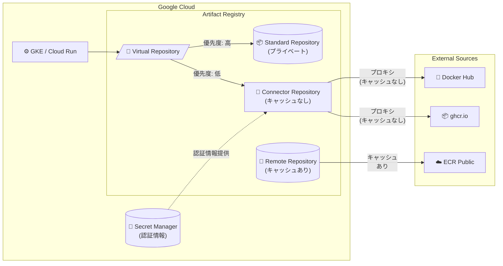

# Artifact Registry: Connector Repositories

**リリース日**: 2026-07-24

**サービス**: Artifact Registry

**機能**: Connector Repositories (コネクタリポジトリ)

**ステータス**: Preview

📊 [このアップデートのインフォグラフィックを見る](https://takech9203.github.io/google-cloud-news-summary/20260724-artifact-registry-connector-repositories.html)

## 概要

Artifact Registry に新しいリポジトリモード「Connector Repositories (コネクタリポジトリ)」が Preview として追加された。コネクタリポジトリはアップストリームソースへのプロキシとして機能し、すべてのリクエストをアップストリームソースに転送する。従来のリモートリポジトリとは異なり、アーティファクトを Artifact Registry にキャッシュしない点が最大の特徴である。

この機能は、アップストリームソースの完全な監査可能性が求められる環境や、サードパーティのポリシーによりアーティファクトのキャッシュが禁止されているケースに対応する。規制の厳しい業界 (金融、医療、公共機関など) でコンテナイメージの依存関係管理を行う組織に特に有用である。

現時点では Docker フォーマットのみがサポートされており、Docker Hub、GitHub Container Registry (ghcr.io)、AWS ECR Public Gallery、Kubernetes Container Registry、Nexus、JFrog Artifactory などのアップストリームソースに接続可能である。

**アップデート前の課題**

- リモートリポジトリはアーティファクトをキャッシュするため、アップストリームソースの完全な監査証跡を維持できなかった
- サードパーティのライセンスポリシーでキャッシュが禁止されている場合、リモートリポジトリを使用できなかった
- キャッシュなしのプロキシ機能を実現するには、自前で中間プロキシサーバーを構築する必要があった
- 依存関係の混乱攻撃 (dependency confusion attack) に対する防御策が限定的だった

**アップデート後の改善**

- コネクタリポジトリにより、アーティファクトをキャッシュせずにアップストリームソースへのプロキシが可能になった
- すべてのリクエストがアップストリームソースに直接転送されるため、完全な監査証跡が維持される
- バーチャルリポジトリと組み合わせることで、プライベートリポジトリを優先した安全な依存関係解決が可能になった
- VPC Service Controls との統合により、サービス境界内での外部ソースへのアクセスを制御可能になった

## アーキテクチャ図



コネクタリポジトリはアップストリームソースへの純粋なプロキシとして動作し、バーチャルリポジトリと組み合わせることで安全な依存関係解決を実現する。リモートリポジトリ (キャッシュあり) との使い分けにより、要件に応じた柔軟な構成が可能。

## サービスアップデートの詳細

### 主要機能

1. **キャッシュなしプロキシ**
   - すべてのリクエストがアップストリームソースに直接転送される
   - Artifact Registry にアーティファクトが保存されないため、完全な監査可能性を確保
   - アップストリームソースが利用できない場合、リクエストは失敗する (キャッシュからの提供なし)

2. **バーチャルリポジトリとの統合**
   - コネクタリポジトリをバーチャルリポジトリのアップストリームとして設定可能
   - プライベートリポジトリに高い優先度を設定することで、dependency confusion 攻撃を防御
   - クライアント側で複数リポジトリの検索順序を制御する必要がなくなる

3. **VPC Service Controls 対応**
   - サービス境界内での利用が可能
   - 特定のロケーションのコネクタリポジトリに対して、境界外の外部ソースへのアクセスを許可する設定が可能
   - デフォルトでは境界外のアップストリームソースへのアクセスは拒否される

4. **メタデータの自動更新**
   - Docker タグリスト/取得のキャッシュは 1 時間で更新される
   - パッケージインデックスやメタデータなどのミュータブルファイルは、デフォルト期間経過後にアップストリームから更新

## 技術仕様

### サポートフォーマットと対応アップストリーム

| 項目 | 詳細 |
|------|------|
| サポートフォーマット | Docker のみ |
| 認証方式 | Basic 認証 (RFC 7617) |
| 認証情報の保存 | Secret Manager |
| メタデータ更新間隔 | Docker タグキャッシュ: 1 時間 |
| アップストリーム要件 | インターネットアクセス可能であること |

### 対応アップストリームソース

| アップストリーム | URI |
|----------------|-----|
| Docker Hub | https://registry-1.docker.io |
| GitHub Container Registry | https://ghcr.io |
| AWS ECR Public Gallery | https://public.ecr.aws |
| Kubernetes Container Registry | https://registry.k8s.io |
| Nexus | https://{MY_NEXUS_IP} |
| JFrog Artifactory | https://{INSTANCE}.jfrog.io/{REPO} |

### 必要な IAM ロール

| ロール | 用途 |
|--------|------|
| Artifact Registry Admin (roles/artifactregistry.admin) | コネクタリポジトリの作成とアクセス管理 |
| Secret Manager Admin (roles/secretmanager.admin) | アップストリーム認証情報のシークレット管理 |
| Access Context Manager Editor (roles/accesscontextmanager.policyEditor) | VPC Service Controls 境界外のアクセス許可設定 |

## 設定方法

### 前提条件

1. Artifact Registry API の有効化
2. Secret Manager API の有効化
3. Google Cloud CLI のインストールと設定
4. (VPC Service Controls 使用時) Access Context Manager API の有効化

### 手順

#### ステップ 1: アップストリーム認証情報の設定

```bash
# Secret Manager API を有効化
gcloud services enable secretmanager.googleapis.com \
  --project=PROJECT_ID

# アクセストークンをシークレットとして保存
echo -n "YOUR_UPSTREAM_TOKEN" | gcloud secrets create upstream-token \
  --project=PROJECT_ID \
  --data-file=-

# Artifact Registry サービスエージェントにシークレットへのアクセスを許可
gcloud secrets add-iam-policy-binding upstream-token \
  --project=PROJECT_ID \
  --member="serviceAccount:service-PROJECT_NUMBER@gcp-sa-artifactregistry.iam.gserviceaccount.com" \
  --role="roles/secretmanager.secretAccessor"
```

#### ステップ 2: コネクタリポジトリの作成

```bash
# Docker Hub をアップストリームとするコネクタリポジトリの作成
gcloud artifacts repositories create my-connector-repo \
  --project=PROJECT_ID \
  --location=us-east1 \
  --repository-format=docker \
  --mode=connector-repository \
  --remote-docker-repo=DOCKER-HUB \
  --remote-username=my-username \
  --remote-password-secret-version=projects/PROJECT_ID/secrets/upstream-token/versions/1
```

`--mode=connector-repository` フラグがコネクタリポジトリであることを定義する。

#### ステップ 3: カスタムアップストリームの設定 (JFrog Artifactory の例)

```bash
gcloud artifacts repositories create my-jfrog-connector \
  --project=my-project \
  --location=us-east1 \
  --repository-format=docker \
  --mode=connector-repository \
  --remote-docker-repo=https://my-account.jfrog.io/scoped-repo \
  --remote-username=my-username \
  --remote-password-secret-version=projects/my-project/secrets/my-secret/versions/1
```

#### ステップ 4: バーチャルリポジトリとの連携 (推奨)

```bash
# バーチャルリポジトリを作成し、プライベートリポジトリを高優先度で設定
gcloud artifacts repositories create my-virtual-repo \
  --project=PROJECT_ID \
  --location=us-east1 \
  --repository-format=docker \
  --mode=virtual-repository \
  --upstream-policy="id=private,repository=my-private-repo,priority=100" \
  --upstream-policy="id=connector,repository=my-connector-repo,priority=10"
```

## メリット

### ビジネス面

- **コンプライアンス対応**: サードパーティポリシーでキャッシュが禁止されている場合でも、Artifact Registry を介した統一的なアクセス管理が可能
- **完全な監査証跡**: すべてのアーティファクト取得がアップストリームソースへ直接行われるため、利用実態の完全な可視化が可能
- **ガバナンス強化**: VPC Service Controls と組み合わせることで、組織の外部依存関係を一元管理

### 技術面

- **セキュリティ向上**: バーチャルリポジトリとの組み合わせにより、dependency confusion 攻撃を軽減
- **統一的なアクセス制御**: IAM によるアクセス管理を外部リポジトリへのアクセスにも適用可能
- **シンプルなクライアント設定**: クライアント側で複数リポジトリの検索順序を管理する必要がなくなる
- **Secret Manager 統合**: 認証情報を安全に管理し、ローテーションも容易

## デメリット・制約事項

### 制限事項

- Docker フォーマットのみサポート (npm、Maven、Python 等は未対応)
- アップストリームソースはインターネットからアクセス可能である必要がある (オンプレミスや VPC 内のプライベートソースは非対応)
- アーティファクトがキャッシュされないため、アップストリームがダウンした場合はリクエストが失敗する
- Preview ステータスのため、SLA の対象外であり、今後の変更がある可能性がある

### 考慮すべき点

- キャッシュがないため、同じイメージを繰り返し取得する場合はレイテンシが増加する
- アップストリームソースのレート制限 (例: Docker Hub の pull 制限) に直接影響を受ける
- リモートリポジトリと比較して、ネットワーク転送コストが増加する可能性がある
- 作成後にリポジトリモード、フォーマット、アップストリームソース、ロケーションは変更不可

## ユースケース

### ユースケース 1: 規制業界でのコンプライアンス対応

**シナリオ**: 金融機関で、外部コンテナレジストリからのイメージ取得について完全な監査証跡が求められている。サードパーティのライセンスポリシーにより、コンテナイメージのキャッシュコピーを保持することが禁止されている。

**実装例**:
```bash
# 監査対象のアップストリームソースへのコネクタリポジトリ
gcloud artifacts repositories create regulated-connector \
  --project=finance-prod \
  --location=asia-northeast1 \
  --repository-format=docker \
  --mode=connector-repository \
  --remote-docker-repo=https://vendor-registry.example.com \
  --remote-username=audit-user \
  --remote-password-secret-version=projects/finance-prod/secrets/vendor-cred/versions/latest
```

**効果**: すべてのイメージ取得がアップストリームへ直接行われるため、監査時にどのバージョンがいつ取得されたかを完全にトレース可能。キャッシュコピーが存在しないためライセンス違反のリスクを排除。

### ユースケース 2: dependency confusion 攻撃の防御

**シナリオ**: 開発チームがプライベートコンテナイメージと公開イメージの両方を使用しており、依存関係の混乱攻撃を防ぎたい。

**実装例**:
```bash
# プライベートリポジトリ (標準)
gcloud artifacts repositories create private-images \
  --location=us-central1 --repository-format=docker --mode=standard-repository

# 公開ソースへのコネクタリポジトリ
gcloud artifacts repositories create public-connector \
  --location=us-central1 --repository-format=docker \
  --mode=connector-repository --remote-docker-repo=DOCKER-HUB

# バーチャルリポジトリ (プライベートを優先)
gcloud artifacts repositories create unified-repo \
  --location=us-central1 --repository-format=docker \
  --mode=virtual-repository \
  --upstream-policy="id=private,repository=private-images,priority=100" \
  --upstream-policy="id=public,repository=public-connector,priority=10"
```

**効果**: クライアントはバーチャルリポジトリのみを参照すればよく、プライベートリポジトリが常に優先される。悪意のある同名パッケージが公開リポジトリに存在しても、プライベート版が優先して提供される。

## 料金

Artifact Registry の料金体系に準じる。コネクタリポジトリはアーティファクトをキャッシュしないため、ストレージ料金は発生しない。ただし、ネットワーク転送料金は通常どおり適用される。

### 料金への影響

| 項目 | コネクタリポジトリ | リモートリポジトリ |
|------|-------------------|-------------------|
| ストレージ料金 | 発生しない | キャッシュ分が課金される |
| ネットワーク転送 | 毎回アップストリームから取得 | 初回のみアップストリームから取得 |
| リクエスト料金 | 通常どおり適用 | 通常どおり適用 |

詳細な料金は [Artifact Registry の料金ページ](https://cloud.google.com/artifact-registry/pricing) を参照。

## 利用可能リージョン

Artifact Registry がサポートするすべてのリージョンおよびマルチリージョンで利用可能。リポジトリ作成時に `gcloud artifacts locations list` コマンドで対応ロケーションを確認可能。

## 関連サービス・機能

- **Artifact Registry Remote Repository**: アップストリームソースのプロキシとしてアーティファクトをキャッシュするモード。レイテンシ低減やオフライン耐性が必要な場合に使用
- **Artifact Registry Virtual Repository**: 複数のアップストリームリポジトリ (標準、リモート、コネクタ) への単一アクセスポイント。優先度設定による依存関係制御が可能
- **Secret Manager**: コネクタリポジトリのアップストリーム認証情報を安全に保存・管理
- **VPC Service Controls**: サービス境界内でのコネクタリポジトリのアクセス制御を提供
- **Binary Authorization**: コンテナイメージのデプロイポリシーを強制し、信頼されたイメージのみを許可
- **Artifact Analysis**: コンテナイメージの脆弱性スキャンと SBOM 生成

## 参考リンク

- 📊 [インフォグラフィック](https://takech9203.github.io/google-cloud-news-summary/20260724-artifact-registry-connector-repositories.html)
- [公式リリースノート](https://docs.cloud.google.com/release-notes#July_24_2026)
- [Connector repositories overview](https://docs.cloud.google.com/artifact-registry/docs/repositories/connector-overview)
- [Create connector repositories](https://docs.cloud.google.com/artifact-registry/docs/repositories/connector-repo)
- [Configure authentication to connector repository upstreams](https://docs.cloud.google.com/artifact-registry/docs/repositories/configure-connector-authentication)
- [Remote repository overview (比較用)](https://docs.cloud.google.com/artifact-registry/docs/repositories/remote-overview)
- [Virtual repository overview](https://docs.cloud.google.com/artifact-registry/docs/repositories/virtual-overview)
- [Artifact Registry 料金](https://cloud.google.com/artifact-registry/pricing)

## まとめ

Artifact Registry のコネクタリポジトリは、アーティファクトをキャッシュせずにアップストリームソースへのプロキシを提供する新しいリポジトリモードである。コンプライアンス要件が厳しい環境でのコンテナイメージ管理に特に有効であり、バーチャルリポジトリと組み合わせることで dependency confusion 攻撃への防御も強化される。現時点では Docker フォーマットのみの Preview 対応だが、外部依存関係の監査可能性とセキュリティを重視する組織にとって、評価・検証を始めるべき機能である。

---

**タグ**: #ArtifactRegistry #ContainerSecurity #Docker #SupplyChainSecurity #Compliance #Preview #DependencyManagement
