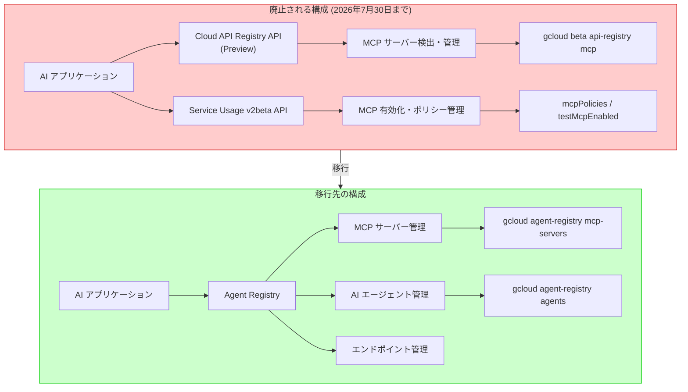

# Cloud API Registry / Service Usage: MCP サーバーサポート廃止

**リリース日**: 2026-07-24

**サービス**: Cloud API Registry / Service Usage

**機能**: MCP Server Support Deprecated (Cloud API Registry and Service Usage v2beta)

**ステータス**: Deprecated (2026年7月30日シャットダウン予定)

[このアップデートのインフォグラフィックを見る](https://takech9203.github.io/google-cloud-news-summary/20260724-cloud-api-registry-service-usage-mcp-deprecated.html)

## 概要

Google Cloud は、Cloud API Registry API および Service Usage v2beta API における Model Context Protocol (MCP) サーバーとツールの管理サポートを 2026年7月30日に完全シャットダウンすることを発表した。これは 2026年4月30日 (Cloud API Registry) および 2026年6月3日 (Service Usage) に開始された非推奨化プロセスの最終段階である。

Cloud API Registry は 2025年12月に Preview としてリリースされ、Google Cloud が提供する MCP サーバーやツールの検出・管理を行うための集中カタログとして機能していた。しかし、Google Cloud は MCP サーバー管理のアーキテクチャを刷新し、新サービス「Agent Registry」に移行することを決定した。Agent Registry は Gemini Enterprise Agent Platform のガバナンス基盤として位置づけられ、MCP サーバーだけでなく AI エージェントやエンドポイントの統合管理を提供する。

この変更は、MCP サーバー管理を Cloud API Registry と Service Usage v2beta API で行っていたすべてのユーザーに影響する。特に gcloud beta api-registry mcp コマンドや Service Usage v2beta の MCP ポリシー管理 API を使用していた場合、7月30日以降はこれらの機能が利用できなくなる。

**アップデート前の課題**

- Cloud API Registry API を使って MCP サーバーの取得・一覧・有効化・無効化を管理する必要があった
- Service Usage v2beta API で MCP サーバーの有効化状態やコンシューマーポリシーを別途管理する必要があった
- MCP サーバーを使うために個別の有効化手順 (enablement) が必要だった
- MCP サーバー管理と AI エージェント管理が別々のサービスに分散していた

**アップデート後の改善**

- MCP サーバーの個別有効化が不要になり、基盤サービスの有効化のみで十分になった
- Agent Registry に移行することで、MCP サーバー・AI エージェント・エンドポイントを一元管理できるようになった
- Agent Registry による自動登録メカニズムにより、サポート対象の Google Cloud ランタイムにデプロイされた MCP サーバーが自動的に登録される
- gcloud agent-registry コマンドで統一されたインターフェースから管理できるようになった

## アーキテクチャ図



Cloud API Registry と Service Usage v2beta の MCP 管理機能から Agent Registry への移行パスを示す。廃止されるコンポーネント (赤) から新しい統合管理基盤 (緑) への移行が必要である。

## サービスアップデートの詳細

### 主要機能

1. **Cloud API Registry MCP サポート廃止**
   - MCP サーバーとツールの取得 (get)、一覧 (list)、有効化 (enable)、無効化 (disable) が利用不可に
   - 対応する gcloud CLI コマンド (`gcloud beta api-registry mcp`) も廃止
   - 関連する IAM 権限も廃止

2. **Service Usage v2beta MCP 管理廃止**
   - MCP サーバーの有効化管理 (enablement) が不要に
   - コンシューマーポリシー管理 (`mcpPolicies`) のシャットダウン
   - `testMcpEnabled`、`getEffectiveMcpPolicy` メソッドの廃止
   - MCP サーバーの利用には基盤サービスの有効化のみで十分に

3. **移行先: Agent Registry**
   - Gemini Enterprise Agent Platform のガバナンス基盤として提供
   - MCP サーバー、AI エージェント、エンドポイントの統合カタログ
   - 自動登録と手動登録の両方をサポート
   - gcloud agent-registry コマンドで操作可能

## 技術仕様

### 廃止タイムライン

| サービス | 非推奨開始日 | シャットダウン日 | 影響範囲 |
|----------|-------------|-----------------|----------|
| Cloud API Registry (MCP) | 2026年4月30日 | 2026年7月30日 | MCP サーバー/ツールの CRUD 操作 |
| Service Usage v2beta (MCP) | 2026年6月3日 | 2026年7月30日 | MCP 有効化・ポリシー管理 |

### 廃止される API メソッド

| API | メソッド | 代替手段 |
|-----|---------|----------|
| Cloud API Registry | MCP servers/tools の list, get, enable, disable | Agent Registry API |
| Service Usage v2beta | `testMcpEnabled` | 不要 (サービス有効化で十分) |
| Service Usage v2beta | `mcpPolicies.patch` | 不要 (サービス有効化で十分) |
| Service Usage v2beta | `getEffectiveMcpPolicy` | 不要 (サービス有効化で十分) |

### 廃止される gcloud コマンド

```bash
# 以下のコマンドは 2026年7月30日以降使用不可
gcloud beta api-registry mcp servers list
gcloud beta api-registry mcp tools list
gcloud beta api-registry mcp enable SERVICE
gcloud beta api-registry mcp disable SERVICE
```

## 設定方法

### 前提条件

1. Agent Registry API の有効化
2. 適切な IAM ロールの付与
3. 対象の Google Cloud プロジェクト

### 手順

#### ステップ 1: Agent Registry のセットアップ

```bash
# Agent Registry API を有効化
gcloud services enable agentregistry.googleapis.com --project=PROJECT_ID
```

#### ステップ 2: MCP サーバーの一覧確認 (新コマンド)

```bash
# Agent Registry で MCP サーバーを一覧表示
gcloud agent-registry mcp-servers list \
  --project=PROJECT_ID \
  --location=REGION
```

#### ステップ 3: MCP サーバーの利用

```bash
# MCP Tool User ロールの付与
gcloud projects add-iam-policy-binding PROJECT_ID \
  --member="PRINCIPAL" \
  --role="roles/mcp.toolUser"
```

MCP サーバーの個別有効化 (enablement) は不要になった。基盤サービスを有効化し、IAM ロールを付与するだけで MCP サーバーを利用できる。

## メリット

### ビジネス面

- **統合管理の簡素化**: MCP サーバー、AI エージェント、エンドポイントを単一のサービスから管理でき、運用コストが削減される
- **ガバナンスの強化**: Agent Registry による集中的なセキュリティ境界の定義と権限管理が可能になる

### 技術面

- **有効化プロセスの簡素化**: MCP サーバー専用の有効化手順が不要になり、サービス有効化のみで利用可能に
- **自動登録**: サポート対象ランタイム (GKE、Agent Runtime) にデプロイされたコンポーネントが自動的に Agent Registry に登録される
- **標準プロトコル対応**: Agent2Agent (A2A) プロトコルもサポートし、エージェント間連携が容易に

## デメリット・制約事項

### 制限事項

- 2026年7月30日のシャットダウン後、既存の Cloud API Registry MCP 呼び出しはすべて失敗する
- gcloud beta api-registry mcp コマンドに依存するスクリプトやパイプラインは修正が必要
- Service Usage v2beta の MCP ポリシーに依存した IAM 設定の見直しが必要

### 考慮すべき点

- シャットダウンまでの猶予は実質 6 日間 (7月24日発表、7月30日シャットダウン)。ただし非推奨化自体は 4月30日から予告されていた
- Agent Registry はまだ比較的新しいサービスであり、ドキュメントや事例が限定的な場合がある
- 自動登録がサポートされていないランタイムの場合、手動で Service リソースを作成する必要がある

## ユースケース

### ユースケース 1: 既存 CI/CD パイプラインの移行

**シナリオ**: gcloud beta api-registry mcp コマンドを使って MCP サーバーの有効化/無効化を自動化していた DevOps チーム

**実装例**:
```bash
# 旧: Cloud API Registry (廃止)
gcloud beta api-registry mcp enable bigquery.googleapis.com

# 新: Agent Registry で MCP サーバーを確認
gcloud agent-registry mcp-servers list \
  --project=my-project \
  --location=us-central1

# 新: サービス有効化のみで MCP 利用可能
gcloud services enable bigquery.googleapis.com --project=my-project
```

**効果**: MCP サーバーの個別有効化が不要になり、パイプラインが簡素化される

### ユースケース 2: AI エージェントからの MCP サーバー検出

**シナリオ**: AI アプリケーションが利用可能な MCP サーバーをプログラム的に検出する

**実装例**:
```bash
# Agent Registry API で MCP サーバーを検出
gcloud agent-registry mcp-servers list \
  --project=my-project \
  --location=global \
  --filter="displayName='BigQuery MCP Server'"
```

**効果**: Agent Registry の統合カタログにより、MCP サーバーだけでなく AI エージェントやエンドポイントも同時に検出可能

## 関連サービス・機能

- **Agent Registry**: MCP サーバー管理の移行先。Gemini Enterprise Agent Platform のガバナンス基盤として、MCP サーバー・AI エージェント・エンドポイントの統合カタログを提供
- **Apigee API hub MCP (GA)**: 同日 (2026年7月24日) に GA リリース。API hub の MCP サーバーが正式版となり、AI エージェントから API エコシステムの検出・管理が可能に
- **Gemini Enterprise Agent Platform**: Agent Registry が属するプラットフォーム。エージェントのデプロイ、管理、ガバナンスを統合提供
- **Model Armor**: MCP ツール呼び出しのセキュリティスキャン。Agent Registry と連携してプロンプトインジェクション攻撃からの保護を提供

## 参考リンク

- [このアップデートのインフォグラフィック](https://takech9203.github.io/google-cloud-news-summary/20260724-cloud-api-registry-service-usage-mcp-deprecated.html)
- [公式リリースノート (Cloud API Registry)](https://docs.cloud.google.com/api-registry/release-notes)
- [公式リリースノート (Service Usage)](https://docs.cloud.google.com/service-usage/docs/release-notes)
- [Cloud API Registry 機能廃止ページ](https://docs.cloud.google.com/api-registry/docs/deprecations)
- [Service Usage 機能廃止ページ](https://docs.cloud.google.com/service-usage/docs/deprecations)
- [Agent Registry 概要](https://docs.cloud.google.com/agent-registry/overview)
- [MCP サーバーの管理 (新)](https://docs.cloud.google.com/mcp/manage-mcp-servers)
- [Agent Registry での MCP ツール管理](https://docs.cloud.google.com/agent-registry/manage-mcp-tools)
- [Apigee API hub MCP GA リリースノート](https://docs.cloud.google.com/apigee/docs/apihub/release-notes)

## まとめ

Cloud API Registry と Service Usage v2beta における MCP サーバー管理機能は 2026年7月30日に完全シャットダウンされる。影響を受けるユーザーは直ちに Agent Registry への移行を完了する必要がある。Agent Registry は単なる代替ではなく、MCP サーバー・AI エージェント・エンドポイントを統合管理する次世代のガバナンス基盤であり、自動登録や A2A プロトコル対応など大幅な機能拡張が含まれている。MCP サーバーの個別有効化も不要になるため、移行後は運用が簡素化される。

---

**タグ**: #CloudAPIRegistry #ServiceUsage #MCP #Deprecated #AgentRegistry #GeminiEnterprise #AIAgent #Migration
