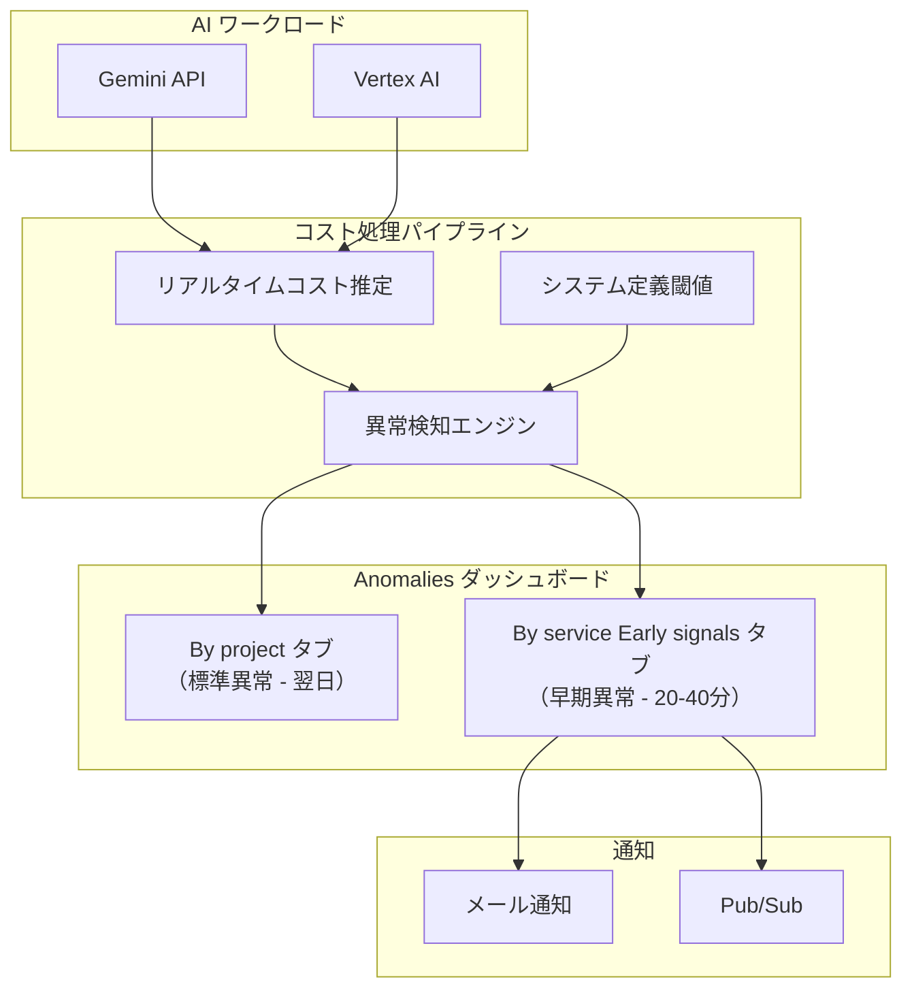

# Cloud Billing: AI ワークロード向けアーリーシグナル（早期異常検知）

**リリース日**: 2026-07-24

**サービス**: Cloud Billing

**機能**: AI ワークロード向けアーリーシグナル（Early signals for AI workloads）

**ステータス**: Preview

[このアップデートのインフォグラフィックを見る](https://takech9203.github.io/google-cloud-news-summary/20260724-cloud-billing-early-signals-ai-workloads.html)

## 概要

Google Cloud は Cloud Billing の異常検知機能に「アーリーシグナル（Early signals）」を追加しました。この新機能により、Gemini API や Vertex AI などの AI ワークロードにおけるコスト異常を、確定請求前のニアリアルタイムで検出できるようになります。

従来の異常検知は翌日ベースでのプロジェクトレベルの検知に限られていましたが、アーリーシグナルでは利用から 20〜40 分の遅延で日次・サービスレベルのインサイトを提供します。これにより、AI ワークロードの急激なコスト増加や不正利用を早期に発見し、迅速な対応が可能になります。

対象ユーザーは、Gemini API や Vertex AI を利用する全ての組織の請求管理者、プロジェクトオーナー、FinOps チームです。特に AI ワークロードは使用量の予測が難しく、意図しないコスト急増が発生しやすいため、この機能は非常に有用です。

**アップデート前の課題**

従来の Cloud Billing 異常検知には、AI ワークロード特有の以下の課題がありました。

- 異常検知は翌日ベースでしか実行されず、AI ワークロードの急激なコスト増加に対してリアルタイムでの対応ができなかった
- サービスレベルでの日次インサイトがなく、どの AI サービスでコスト異常が発生しているか即座に特定できなかった
- AI ワークロード（特に LLM 推論や大規模トレーニング）は短時間で大量のコストが発生する可能性があるが、検知までに最大 24 時間以上のタイムラグがあった

**アップデート後の改善**

今回のアーリーシグナル機能により、以下が可能になりました。

- ニアリアルタイム（利用から 20〜40 分）でコスト異常を検出し、即座にアラートを受信できるようになった
- 「By service (Early signals)」タブで AI ワークロードに特化したサービスレベルの異常を確認できるようになった
- 確定請求前の推定コストに基づく早期インサイトにより、不正利用やシステム悪用を迅速に検出できるようになった

## アーキテクチャ図



この図は、AI ワークロードの利用データがニアリアルタイムのコスト推定パイプラインを通じて異常検知エンジンに送られ、システム定義の閾値に基づいて「By service (Early signals)」タブに表示される流れを示しています。標準の異常検知（翌日ベース）とアーリーシグナル（20〜40 分）の両方の経路が存在します。

## サービスアップデートの詳細

### 主要機能

1. **ニアリアルタイムのコスト異常検知**
   - 利用発生から 20〜40 分の遅延でアラートを配信
   - 確定請求前の推定コストに基づく日次・サービスレベルのインサイト
   - AI ワークロード（Gemini API、Vertex AI）に特化した検知

2. **専用ダッシュボードタブ**
   - Google Cloud コンソールの Anomalies ダッシュボードに「By service (Early signals)」タブを新設
   - 早期異常は標準の「By project」タブとは独立して表示
   - Root cause analysis パネルでプロジェクト詳細と上位 3 つの SKU を表示

3. **通知統合**
   - メール通知（個別アラートまたは日次サマリー）に対応
   - Pub/Sub 通知によるプログラマティックな処理が可能
   - 標準異常と早期異常の両方を日次サマリーで集約表示

## 技術仕様

### 対応サービスと検知仕様

| 項目 | 詳細 |
|------|------|
| 対応サービス | Gemini API、Vertex AI |
| 検知遅延 | 利用発生から 20〜40 分 |
| 検知粒度 | 日次・サービスレベル |
| コスト種別 | 推定コスト（確定前） |
| 閾値 | システム定義（ユーザー設定の閾値は適用されない） |
| ステータス | Preview |
| フィードバック | 早期異常には非対応（標準異常のみ対応） |

### 必要な権限

| ロール | 説明 |
|--------|------|
| Billing Account Administrator | 全プロジェクトの異常表示・通知設定の管理 |
| Billing Account Costs Manager | 全プロジェクトの異常表示 |
| Billing Account Viewer | 全プロジェクトの異常表示（読み取り専用） |
| Project Billing Costs Manager | プロジェクトスコープでの異常表示 |

プロジェクトスコープでのアクセスには以下の権限が必要です:

```
resourcemanager.projects.get
billing.anomalies.get
billing.anomalies.list
```

## 設定方法

### 前提条件

1. Cloud Billing アカウントへの適切な IAM ロール（上記参照）
2. AI ワークロード（Gemini API または Vertex AI）が請求アカウントにリンクされたプロジェクトで稼働していること

### 手順

#### ステップ 1: Anomalies ダッシュボードにアクセス

```
Google Cloud コンソール > Billing > Cost management > Anomalies
```

請求アカウントレベルの権限がある場合は、対象の請求アカウントを選択します。プロジェクトレベルの権限のみの場合は、先にプロジェクトを選択してから Billing セクションに移動します。

#### ステップ 2: Early signals タブを確認

```
Anomalies ダッシュボード > "By service (Early signals)" タブをクリック
```

早期異常の一覧が表示されます。各異常の日付をクリックすると Root cause analysis パネルが開き、プロジェクト詳細とコスト増加の主要因となっている上位 3 つの SKU を確認できます。

#### ステップ 3: 通知設定（オプション）

```
Anomalies ダッシュボード > settings アイコン > Manage anomalies
```

メール通知の受信者（Billing admins、Essential contacts、Project owners）と頻度（Individual anomaly または Daily summary）を設定します。Pub/Sub 通知を設定する場合は、対象プロジェクトに Pub/Sub トピックを作成し、Pub/Sub Admin ロールが必要です。

## メリット

### ビジネス面

- **コストリスクの早期発見**: AI ワークロードの予期せぬコスト急増を数十分以内に検知し、迅速な意思決定を支援
- **不正利用対策**: API キーの漏洩やシステム悪用による異常なコスト発生を早期に発見し、被害を最小限に抑制
- **FinOps の強化**: 確定請求を待たずにコスト傾向を把握でき、プロアクティブなコスト管理が可能

### 技術面

- **低遅延アラート**: 利用から 20〜40 分でアラートが届くため、自動化されたコスト制御アクションを迅速にトリガー可能
- **Pub/Sub 統合**: プログラマティックな通知処理により、自動スケールダウンやクォータ制限などの自動対応が実装可能
- **既存ワークフローとの統合**: 標準の異常検知と同じダッシュボード・通知インフラを活用し、追加設定が最小限

## デメリット・制約事項

### 制限事項

- Preview ステータスのため、GA 前に機能変更や廃止の可能性がある
- ユーザー定義の閾値は早期異常には適用されず、システム定義の閾値のみが使用される
- 対応サービスは現時点で Gemini API と Vertex AI のみ（他のサービスは標準の翌日検知のみ）
- 推定コストは確定前のため、最終的な請求額と異なる場合がある
- 早期異常に対するフィードバック機能は利用不可

### 考慮すべき点

- 推定コストベースのアラートのため、偽陽性（実際には異常でない検知）が発生する可能性がある
- コストレポートには推定コストは表示されないため、早期異常の金額とレポートの金額に一時的な乖離が生じる
- リセラーアカウントではプロジェクトベースのコスト可視性の有効化が必要

## ユースケース

### ユースケース 1: Gemini API キー漏洩の早期検出

**シナリオ**: 開発チームが誤って Gemini API キーを公開リポジトリにコミットし、第三者が API を不正利用して大量のリクエストを発行した場合。

**実装例**:
```
1. 早期異常が Gemini API のコスト急増を検知（利用発生から約 30 分後）
2. Pub/Sub 通知が Cloud Functions をトリガー
3. Cloud Functions が API キーの無効化を自動実行
4. 同時にメール通知でセキュリティチームにアラート
```

**効果**: 従来は翌日にならないと検知できなかった不正利用を、30 分程度で検出・対処可能。被害額を大幅に削減。

### ユースケース 2: AI モデルトレーニングの暴走検知

**シナリオ**: Vertex AI で大規模モデルのファインチューニングジョブを実行中に、設定ミスにより想定を大幅に超えるリソースが消費されている場合。

**効果**: ジョブ開始後の短時間でコスト異常を検知し、ジョブの中止や設定修正の判断を早期に行える。翌日検知の場合と比較して、数時間〜十数時間分のコスト削減が期待できる。

### ユースケース 3: プロダクション環境の突発的トラフィック増加

**シナリオ**: プロダクション環境で Gemini API を利用したチャットボットが viral になり、予想外のトラフィック増加で API コストが急増した場合。

**効果**: 早期に状況を把握し、レートリミットの適用やキャッシュ戦略の見直し、追加予算の確保などの対応を迅速に行える。

## 料金

Cloud Billing の異常検知機能（アーリーシグナルを含む）自体には追加料金は発生しません。この機能は Cloud Billing の標準機能として提供されます。

### 関連コスト

| 項目 | 料金 |
|------|------|
| 異常検知機能 | 無料（Cloud Billing の標準機能） |
| メール通知 | 無料 |
| Pub/Sub 通知 | Pub/Sub の標準料金（メッセージ配信量に応じた従量課金） |
| Gemini API 利用料 | 使用モデル・トークン数に応じた従量課金 |
| Vertex AI 利用料 | 使用サービス・リソースに応じた従量課金 |

## 利用可能リージョン

Cloud Billing の異常検知は Google Cloud コンソールのグローバル機能として提供されるため、特定のリージョン制限はありません。全ての Cloud Billing アカウントで利用可能です。

## 関連サービス・機能

- **Cloud Billing Budgets & Alerts**: 予算アラートと組み合わせることで、閾値ベースと異常検知ベースの両面からコスト管理が可能
- **Cloud Billing Reports**: コストレポートで確定後のコストトレンドを詳細分析。早期異常の検知後にレポートで根本原因を調査
- **Gemini Cloud Assist in Cloud Billing**: AI を活用したコスト分析支援。レポートの自然言語での作成やインサイトの自動生成
- **Cloud Billing Export to BigQuery**: 全コストデータを BigQuery にエクスポートし、カスタムダッシュボードや高度な分析に活用
- **FinOps Hub**: コスト最適化の機会を特定し、優先順位付けを支援
- **Pub/Sub**: プログラマティックな通知処理基盤として、自動コスト制御アクションの実装に利用

## 参考リンク

- [インフォグラフィック](https://takech9203.github.io/google-cloud-news-summary/20260724-cloud-billing-early-signals-ai-workloads.html)
- [公式リリースノート](https://docs.cloud.google.com/release-notes#July_24_2026)
- [ドキュメント: Manage anomalies](https://docs.cloud.google.com/billing/docs/how-to/manage-anomalies)
- [ドキュメント: View early anomalies for AI workloads](https://docs.cloud.google.com/billing/docs/how-to/manage-anomalies#view-early-anomalies)
- [Cloud Billing の料金](https://cloud.google.com/billing/docs)

## まとめ

Cloud Billing のアーリーシグナル機能は、AI ワークロードの急速なコスト増加に対するリアルタイムの可視性を提供する重要なアップデートです。Gemini API や Vertex AI を利用している組織は、追加コストなしでこの機能を有効活用し、不正利用の早期検出やコスト超過の防止に役立てることを推奨します。特に、Pub/Sub 通知と組み合わせた自動対応ワークフローの構築が、プロアクティブなコスト管理の鍵となります。

---

**タグ**: #CloudBilling #AnomalyDetection #EarlySignals #AI #GeminiAPI #VertexAI #FinOps #CostManagement #Preview
