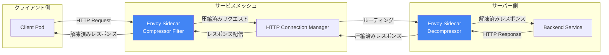

# Cloud Service Mesh: Envoy Compressor Filter GA

**リリース日**: 2026-07-24

**サービス**: Cloud Service Mesh

**機能**: Envoy Compressor Filter GA

**ステータス**: Feature (GA)

[このアップデートのインフォグラフィックを見る](https://takech9203.github.io/google-cloud-news-summary/20260724-cloud-service-mesh-envoy-compressor-filter-ga.html)

## 概要

Cloud Service Mesh の Envoy Compressor Filter が Stable リリースチャネルで一般提供 (GA) となりました。これにより、すべてのリリースチャネル (Rapid、Regular、Stable) で Envoy Compressor Filter の全フィールドが正式にサポートされ、本番環境での HTTP ボディの圧縮・帯域幅最適化が完全にサポートされた状態で利用可能になります。

Envoy Compressor Filter は、HTTP リクエストおよびレスポンスのボディをリアルタイムで圧縮する機能を提供します。gzip などの圧縮アルゴリズムを使用することで、サービスメッシュ内の通信帯域幅を削減し、アプリケーションのパフォーマンスを向上させます。

このアップデートは、サービスメッシュを運用するすべてのユーザーに影響があります。特に、大量のデータをサービス間で転送するマイクロサービスアーキテクチャを採用している組織にとって、帯域幅コストの削減とレイテンシの改善に直結する重要なアップデートです。

**アップデート前の課題**

- Stable チャネルでは Envoy Compressor Filter の一部フィールドが正式サポートされておらず、本番環境での利用に制限があった
- 非推奨の旧形式 (トップレベルフィールド) を使用している場合、バリデーションの段階的ロールアウトにより警告やエラーが発生する可能性があった
- Stable チャネルを使用する本番クラスターでは、圧縮機能の利用に対するサポート保証が限定的だった

**アップデート後の改善**

- Stable チャネルを含むすべてのリリースチャネルで Envoy Compressor Filter が GA として完全サポートされた
- `response_direction_config` および `request_direction_config` の全フィールドが Stable チャネルで利用可能になった
- 本番環境でのサービスメッシュ圧縮設定に対する完全なサポート保証が提供されるようになった

## アーキテクチャ図



Envoy Compressor Filter は HTTP Connection Manager のフィルターチェーンに挿入され、サービス間通信のリクエストおよびレスポンスボディを透過的に圧縮・解凍します。

## サービスアップデートの詳細

### 主要機能

1. **レスポンス方向の圧縮設定 (response_direction_config)**
   - `common_config.min_content_length`: 圧縮をトリガーする最小レスポンスサイズの設定
   - `common_config.content_type`: 圧縮対象のコンテンツタイプ (配列) の指定
   - `common_config.enabled`: ランタイムキーによる動的な有効/無効切り替え
   - `disable_on_etag_header`: ETag ヘッダーを含むレスポンスの圧縮無効化
   - `remove_accept_encoding_header`: アップストリームへのリクエストから Accept-Encoding ヘッダーを除去
   - `uncompressible_response_codes`: 圧縮しないレスポンスコードの指定

2. **リクエスト方向の圧縮設定 (request_direction_config)**
   - `common_config.min_content_length`: 圧縮をトリガーする最小リクエストサイズの設定
   - `common_config.content_type`: 圧縮対象のコンテンツタイプの指定
   - `common_config.enabled`: ランタイムキーによる動的な有効/無効切り替え

3. **圧縮ライブラリの選択 (compressor_library)**
   - gzip 圧縮アルゴリズムのサポート
   - `choose_first` オプションによる優先圧縮アルゴリズムの選択

## 技術仕様

### サポートされるフィールド一覧

| フィールド | Rapid | Regular | Stable |
|------|------|------|------|
| compressor_library | GA | GA | GA |
| choose_first | GA | GA | GA |
| response_direction_config.common_config.min_content_length | GA | GA | GA |
| response_direction_config.common_config.content_type | GA | GA | GA |
| response_direction_config.common_config.enabled | GA | GA | GA |
| response_direction_config.disable_on_etag_header | GA | GA | GA |
| response_direction_config.remove_accept_encoding_header | GA | GA | GA |
| response_direction_config.uncompressible_response_codes | GA | GA | GA |
| request_direction_config.common_config.min_content_length | GA | GA | GA |
| request_direction_config.common_config.content_type | GA | GA | GA |
| request_direction_config.common_config.enabled | GA | GA | GA |

### EnvoyFilter API の制約

| 項目 | 詳細 |
|------|------|
| コントロールプレーン | TRAFFIC_DIRECTOR のみサポート |
| configPatches[].applyTo | HTTP_FILTER のみ |
| patch.operation | INSERT_FIRST、INSERT_BEFORE (router フィルター使用時) のみ |
| match.listener.filter.name | envoy.filters.network.http_connection_manager のみ |
| match.listener.filter.subFilter.name | envoy.filters.http.router のみ |

### 推奨される設定形式 (モダン形式)

```yaml
apiVersion: networking.istio.io/v1alpha3
kind: EnvoyFilter
metadata:
  name: compressor-filter-update
  namespace: istio-system
spec:
  configPatches:
  - applyTo: HTTP_FILTER
    match:
      context: GATEWAY
      listener:
        filterChain:
          filter:
            name: envoy.filters.network.http_connection_manager
            subFilter:
              name: envoy.filters.http.router
    patch:
      operation: INSERT_BEFORE
      value:
        name: envoy.filters.http.compressor
        typed_config:
          '@type': type.googleapis.com/envoy.extensions.filters.http.compressor.v3.Compressor
          compressor_library:
            name: gzip
            typed_config:
              '@type': type.googleapis.com/envoy.extensions.compression.gzip.compressor.v3.Gzip
          response_direction_config:
            disable_on_etag_header: true
            remove_accept_encoding_header: true
            common_config:
              min_content_length: 1024
              content_type:
              - "application/javascript"
              - "application/json"
              enabled:
                default_value: true
                runtime_key: "compressor.enabled"
```

## 設定方法

### 前提条件

1. Cloud Service Mesh が有効化された GKE クラスター (TRAFFIC_DIRECTOR コントロールプレーン)
2. Stable リリースチャネルを使用中のクラスター (GKE Stable チャネル対応)
3. `kubectl` コマンドラインツール

### 手順

#### ステップ 1: 既存の非推奨設定を確認

```bash
# 非推奨フィールドを使用している EnvoyFilter を特定
kubectl get envoyfilters --all-namespaces -o yaml | grep -A 20 "envoy.filters.http.compressor"
```

既存の EnvoyFilter で `min_content_length`、`content_type`、`disable_on_etag_header`、`remove_accept_encoding_header` がトップレベルの `typed_config` 直下に配置されている場合、移行が必要です。

#### ステップ 2: モダン形式への移行

```bash
# 新しいモダン形式の EnvoyFilter を適用
kubectl apply -f compressor-filter-modern.yaml
```

非推奨フィールドを `response_direction_config.common_config` または `request_direction_config.common_config` 配下に移動します。

#### ステップ 3: 設定の検証

```bash
# EnvoyFilter のステータスを確認
kubectl get envoyfilter -n istio-system compressor-filter-update -o yaml

# レスポンスヘッダーで圧縮が有効であることを確認
curl -s -H "Accept-Encoding: gzip" http://<SERVICE_URL> -o /dev/null -D - | grep Content-Encoding
```

## メリット

### ビジネス面

- **帯域幅コストの削減**: HTTP ボディの圧縮により、サービス間通信のデータ転送量を大幅に削減でき、ネットワーク Egress コストを低減
- **本番環境での安心運用**: Stable チャネルでの GA により、SLA に基づいたサポートが保証され、ミッションクリティカルなワークロードでの利用が可能

### 技術面

- **レイテンシの改善**: 圧縮されたペイロードによりネットワーク転送時間が短縮され、エンドツーエンドのレイテンシが改善
- **柔軟な設定制御**: リクエスト/レスポンス方向別の独立した圧縮設定、ランタイムキーによる動的制御、コンテンツタイプベースのフィルタリングが可能
- **段階的な移行パス**: 非推奨形式からモダン形式への明確な移行パスが提供され、既存設定の互換性も維持

## デメリット・制約事項

### 制限事項

- TRAFFIC_DIRECTOR コントロールプレーン実装でのみサポート (Istiod ベースのコントロールプレーンでは利用不可)
- EnvoyFilter API は HTTP_FILTER のみに適用可能 (TCP フィルターなどには適用不可)
- 圧縮処理による CPU オーバーヘッドが発生するため、CPU バウンドなワークロードでは影響の評価が必要

### 考慮すべき点

- 非推奨のトップレベルフィールドを使用している既存設定は、バリデーション強化に伴い将来的に拒否される可能性がある
- 圧縮対象のコンテンツタイプと最小サイズの適切な設定が必要 (小さなペイロードの圧縮はかえってオーバーヘッドになる)
- 既に圧縮されたコンテンツ (画像、動画など) に対する圧縮は効果がなく CPU を浪費する

## ユースケース

### ユースケース 1: マイクロサービス間の JSON API 通信の最適化

**シナリオ**: 多数のマイクロサービスが JSON 形式で大量のデータを交換するEコマースプラットフォームにおいて、サービス間の帯域幅を最適化したい。

**実装例**:
```yaml
apiVersion: networking.istio.io/v1alpha3
kind: EnvoyFilter
metadata:
  name: json-compressor
  namespace: istio-system
spec:
  configPatches:
  - applyTo: HTTP_FILTER
    match:
      context: SIDECAR_INBOUND
      listener:
        filterChain:
          filter:
            name: envoy.filters.network.http_connection_manager
            subFilter:
              name: envoy.filters.http.router
    patch:
      operation: INSERT_BEFORE
      value:
        name: envoy.filters.http.compressor
        typed_config:
          '@type': type.googleapis.com/envoy.extensions.filters.http.compressor.v3.Compressor
          compressor_library:
            name: gzip
            typed_config:
              '@type': type.googleapis.com/envoy.extensions.compression.gzip.compressor.v3.Gzip
          response_direction_config:
            common_config:
              min_content_length: 512
              content_type:
              - "application/json"
              - "application/grpc+proto"
              enabled:
                default_value: true
                runtime_key: "json_compressor.enabled"
```

**効果**: JSON レスポンスが平均 60-80% 圧縮され、ネットワーク帯域幅の使用量が大幅に削減される。

### ユースケース 2: API Gateway での帯域幅コスト削減

**シナリオ**: Ingress Gateway を通じて外部クライアントにサービスを公開しており、Egress 帯域幅コストを削減したい。

**効果**: クライアント向けレスポンスの圧縮により、Cloud NAT や外部ロードバランサーを経由するトラフィック量が削減され、ネットワークコストが低減される。

## 料金

Cloud Service Mesh の料金体系に含まれます。Envoy Compressor Filter 自体の追加料金はありません。

- **GKE Enterprise サブスクライバー**: Cloud Service Mesh は GKE Enterprise 料金に含まれる
- **スタンドアロン利用**: Cloud Service Mesh 単独での料金が適用される
- **オンプレミス / マルチクラウド**: GKE Enterprise ライセンスが必要 (Cloud Service Mesh 含む)

詳細は [Cloud Service Mesh 料金ページ](https://cloud.google.com/service-mesh/pricing) を参照してください。

## 利用可能リージョン

Cloud Service Mesh はマネージドサービスとして全リージョンで利用可能です。Stable リリースチャネルの Envoy Compressor Filter は、Cloud Service Mesh が利用可能なすべてのリージョンの GKE クラスターで使用できます。

## 関連サービス・機能

- **Cloud Service Mesh Data Plane Extensibility**: EnvoyFilter API を使用したデータプレーンの拡張機能全般。Compressor Filter はサポートされる拡張の一つ
- **Cloud Load Balancing**: 外部ロードバランサーでの圧縮と組み合わせることで、エンドツーエンドの帯域幅最適化が可能
- **Cloud Monitoring / Cloud Logging**: 圧縮率やパフォーマンスメトリクスの監視に活用
- **GKE (Google Kubernetes Engine)**: Cloud Service Mesh の基盤となるコンテナオーケストレーションプラットフォーム。GKE のリリースチャネルが Cloud Service Mesh のチャネルを決定

## 参考リンク

- [インフォグラフィック](https://takech9203.github.io/google-cloud-news-summary/20260724-cloud-service-mesh-envoy-compressor-filter-ga.html)
- [公式リリースノート](https://docs.cloud.google.com/release-notes#July_24_2026)
- [Data Plane Extensibility with EnvoyFilter](https://docs.cloud.google.com/service-mesh/docs/data-plane-extensibility)
- [Modernize EnvoyFilter Compressor Configurations](https://docs.cloud.google.com/service-mesh/docs/migrate/modernize-envoyfilter-compressor)
- [Cloud Service Mesh リリースチャネルの選択](https://docs.cloud.google.com/service-mesh/legacy/anthos-service-mesh/managed-anthos-service-mesh/select-a-release-channel)
- [料金ページ](https://cloud.google.com/service-mesh/pricing)

## まとめ

Envoy Compressor Filter の Stable チャネルでの GA は、Cloud Service Mesh を本番環境で運用するすべてのユーザーにとって重要なマイルストーンです。サービスメッシュ内の HTTP 通信を透過的に圧縮することで、帯域幅コストの削減とレイテンシの改善を実現できます。既存の非推奨形式の設定を使用している場合は、`response_direction_config` / `request_direction_config` を使用したモダン形式への移行を推奨します。

---

**タグ**: #CloudServiceMesh #EnvoyFilter #Compressor #GA #Stable #サービスメッシュ #帯域幅最適化 #GKE
