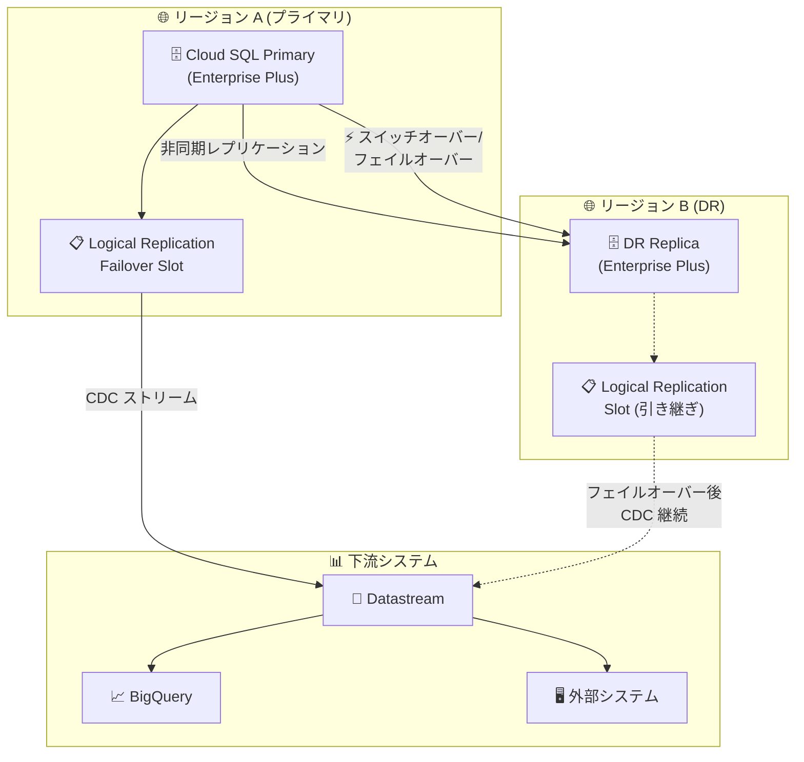

# Cloud SQL for PostgreSQL: Logical Replication Failover Slot

**リリース日**: 2026-07-24

**サービス**: Cloud SQL for PostgreSQL

**機能**: Logical Replication Failover Slot

**ステータス**: Feature (GA)

📊 [このアップデートのインフォグラフィックを見る](https://takech9203.github.io/google-cloud-news-summary/20260724-cloud-sql-postgresql-logical-replication-failover-slot.html)

## 概要

Cloud SQL for PostgreSQL において、論理レプリケーションのフェイルオーバースロット (Logical Replication Failover Slot) が一般提供 (GA) となりました。この機能により、Advanced Disaster Recovery (DR) のスイッチオーバーおよびレプリカフェイルオーバー操作において、論理レプリケーションスロットの継続性が保証され、ビジネス継続性が大幅に向上します。

従来、Cloud SQL の Advanced DR 環境では、論理レプリケーション (logical decoding) と DR 操作を併用することに制約がありました。スイッチオーバーやフェイルオーバーが発生すると、論理レプリケーションスロットが失われ、下流のデータパイプラインが中断するリスクがありました。今回の Logical Replication Failover Slot の GA により、DR 操作後も論理レプリケーションが自動的に継続され、CDC (Change Data Capture) パイプラインやリアルタイムデータストリーミングの信頼性が確保されます。

この機能は、Cloud SQL Enterprise Plus エディションを使用し、クロスリージョン DR レプリカを構成しているユーザーを主な対象としています。特に、Datastream や外部システムへの論理レプリケーションを利用している環境で、DR 操作時のデータパイプライン中断を防止したいユーザーにとって重要なアップデートです。

**アップデート前の課題**

- Advanced DR のスイッチオーバーやレプリカフェイルオーバーを実行すると、元のプライマリインスタンス上の論理レプリケーションスロットが失われていた
- DR 操作後に下流のデータコンシューマー (Datastream、外部レプリカ等) への論理レプリケーションを手動で再構成する必要があった
- DR レプリカには `cloudsql.logical_decoding` フラグを設定できず、論理スロットや論理レプリケーションを構成できなかった
- DR 操作とリアルタイムデータパイプラインの両立が困難で、ビジネス継続性に影響を与える可能性があった

**アップデート後の改善**

- フェイルオーバースロットにより、DR スイッチオーバーおよびレプリカフェイルオーバー操作後も論理レプリケーションスロットが自動的に新しいプライマリに引き継がれる
- 下流のデータコンシューマーへのレプリケーションが DR 操作後も継続され、手動再構成が不要になった
- CDC パイプライン (Datastream 等) のビジネス継続性が DR 環境でも保証されるようになった
- 論理レプリケーションと Advanced DR の併用が可能になり、より柔軟な DR アーキテクチャが設計できるようになった

## アーキテクチャ図



この図は、Logical Replication Failover Slot を使用した Advanced DR アーキテクチャを示しています。プライマリインスタンスの論理レプリケーションスロットが、DR 操作時に DR レプリカへ引き継がれ、下流の CDC パイプラインが中断なく継続する仕組みを表しています。

## サービスアップデートの詳細

### 主要機能

1. **論理レプリケーションフェイルオーバースロット**
   - DR スイッチオーバーおよびレプリカフェイルオーバー操作時に、論理レプリケーションスロットの状態を新しいプライマリインスタンスに自動的に引き継ぐ
   - スロットの位置情報 (LSN) が保持されるため、下流のコンシューマーはデータの欠落なくストリーミングを継続可能

2. **Advanced DR との統合**
   - Cloud SQL Enterprise Plus エディションの Advanced DR 機能と完全に統合
   - スイッチオーバー (計画的な切り替え) とレプリカフェイルオーバー (障害時の切り替え) の両方に対応
   - DNS ライトエンドポイントとの組み合わせにより、アプリケーション側の変更なしで DR 操作が可能

3. **CDC パイプラインの継続性保証**
   - Datastream や外部の CDC ツールへの論理レプリケーションが DR 操作後も中断なく継続
   - WAL (Write-Ahead Log) の変更データが新しいプライマリから自動的にストリーミングされる

## 技術仕様

### 前提条件と要件

| 項目 | 詳細 |
|------|------|
| Cloud SQL エディション | Enterprise Plus (必須) |
| PostgreSQL バージョン | PostgreSQL 12 以降 |
| DR レプリカ | クロスリージョンの指定 DR レプリカが必要 |
| PITR | プライマリインスタンスで有効化が必要 |
| トランザクションログ | Cloud Storage に保存 |
| gcloud CLI バージョン | 502.0.0 以降 |

### レプリケーションスロットの制限

| 最大メモリ (GB) | 最大レプリケーションスロット数 |
|----------------|-------------------------------|
| 4 | 10 |
| 16 | 32 |
| 32 | 128 |
| 64 | 256 |
| 128 | 512 |
| 256 | 1024 |
| 512 | 2048 |
| 512+ | 4096 |

### 関連フラグ設定

```sql
-- 論理デコーディングの有効化 (Cloud SQL 固有のフラグ)
-- Cloud SQL コンソールまたは gcloud で設定
cloudsql.logical_decoding = on

-- WAL センダーの最大数 (デフォルト: 10、メモリあたり 8 WAL センダー/GB)
max_wal_senders = 10

-- レプリケーションスロットの最大数
max_replication_slots = 10
```

## 設定方法

### 前提条件

1. Cloud SQL Enterprise Plus エディションのインスタンスが作成されていること
2. クロスリージョンの DR レプリカが指定されていること
3. プライマリインスタンスで PITR が有効化されていること
4. gcloud CLI バージョン 502.0.0 以降がインストールされていること

### 手順

#### ステップ 1: 論理デコーディングの有効化

```bash
# プライマリインスタンスで cloudsql.logical_decoding フラグを有効化
gcloud sql instances patch PRIMARY_INSTANCE_NAME \
  --database-flags cloudsql.logical_decoding=on
```

インスタンスの再起動が必要です。

#### ステップ 2: レプリケーションユーザーの作成

```sql
-- REPLICATION 属性を持つユーザーを作成
CREATE USER replication_user WITH REPLICATION
  IN ROLE cloudsqlsuperuser
  LOGIN PASSWORD 'your_secure_password';
```

#### ステップ 3: パブリケーションとレプリケーションスロットの作成

```sql
-- レプリケーション対象テーブルのパブリケーションを作成
CREATE PUBLICATION my_publication FOR TABLE schema1.table1, schema2.table2;

-- フェイルオーバースロットを使用した論理レプリケーションスロットの作成
SELECT PG_CREATE_LOGICAL_REPLICATION_SLOT('my_failover_slot', 'pgoutput');
```

#### ステップ 4: DR レプリカの指定

```bash
# DR レプリカを指定
gcloud sql instances patch DR_REPLICA_NAME \
  --failover-dr-replica-name=PRIMARY_INSTANCE_NAME
```

#### ステップ 5: スイッチオーバーの実行 (計画的な切り替え時)

```bash
# DR レプリカへのスイッチオーバー
gcloud sql instances switchover DR_REPLICA_NAME \
  --db-timeout=TIMEOUT_DURATION
```

## メリット

### ビジネス面

- **ダウンタイムの最小化**: DR 操作時にデータパイプラインの再構成が不要になり、ビジネス影響を最小限に抑制
- **データ損失リスクの低減**: 論理レプリケーションスロットの引き継ぎにより、CDC パイプラインでのデータ欠落を防止
- **運用コストの削減**: DR 操作後の手動復旧作業が不要になり、運用チームの負荷を軽減

### 技術面

- **自動フェイルオーバー**: 論理レプリケーションスロットの状態が自動的に新しいプライマリに引き継がれる
- **エンドツーエンドの継続性**: WAL ストリームの位置情報が保持されるため、重複やギャップなしにレプリケーションが再開
- **柔軟な DR アーキテクチャ**: 論理レプリケーションと物理レプリケーションを同一環境で併用可能に

## デメリット・制約事項

### 制限事項

- Cloud SQL Enterprise Plus エディションでのみ利用可能 (Enterprise エディションでは利用不可)
- PostgreSQL 12 以降が必要
- DR レプリカはプライマリと異なるリージョンに配置する必要がある
- カスケードレプリカは DR レプリカとして使用不可
- DR レプリカはプライマリの直接レプリカである必要がある

### 考慮すべき点

- 非同期レプリケーションを使用するため、フェイルオーバー時の RPO はゼロにならない可能性がある
- 未使用のレプリケーションスロットは WAL セグメントの無限蓄積を引き起こすため、モニタリングが必要
- DR レプリカとプライマリインスタンスの機材タイプ (tier) とサイズを揃えることが推奨される
- `max_connections`、`max_worker_processes` 等のフラグ値は DR レプリカでプライマリと同等以上に設定する必要がある

## ユースケース

### ユースケース 1: リアルタイム分析パイプラインの DR 保護

**シナリオ**: EC サイトのトランザクションデータを Cloud SQL for PostgreSQL から Datastream 経由で BigQuery にリアルタイムストリーミングしている環境で、リージョン障害に備えた DR を構成したい。

**実装例**:
```bash
# プライマリ (asia-northeast1) に論理レプリケーションを設定
gcloud sql instances patch ecommerce-primary \
  --database-flags cloudsql.logical_decoding=on

# DR レプリカ (us-central1) を指定
gcloud sql instances patch ecommerce-dr-replica \
  --failover-dr-replica-name=ecommerce-primary
```

**効果**: リージョン障害発生時に DR レプリカへフェイルオーバーしても、Datastream への CDC ストリーミングが自動的に継続され、BigQuery のリアルタイムダッシュボードが中断なく稼働し続ける。

### ユースケース 2: マイクロサービス間のイベント駆動アーキテクチャ

**シナリオ**: PostgreSQL の論理レプリケーションを使用して、注文管理サービスから在庫管理サービスや通知サービスにイベントを伝播しているマイクロサービスアーキテクチャで、DR 切り替え時もイベントの欠落を防ぎたい。

**効果**: DR スイッチオーバー後も論理レプリケーションスロットが保持されるため、すべてのイベントが欠落なく下流サービスに伝達される。計画メンテナンス時のスイッチオーバーでもサービス間の整合性が維持される。

## 料金

Logical Replication Failover Slot の利用に追加料金は発生しません。ただし、以下の Cloud SQL Enterprise Plus エディションの料金が適用されます。

### 料金例

| 項目 | 料金 |
|------|------|
| Compute (Enterprise Plus) | $0.05369/vCPU/時間〜 |
| Memory (Enterprise Plus) | $0.0091/GB/時間〜 |
| Storage (SSD) | $0.17/GB/月 |
| PITR ログ (Cloud Storage) | 無料 (最大 35 日間) |

詳細は [Cloud SQL 料金ページ](https://cloud.google.com/sql/pricing) を参照してください。

## 利用可能リージョン

Cloud SQL Enterprise Plus エディションが利用可能なすべてのリージョンで利用可能です。DR レプリカはプライマリとは異なるリージョンに配置する必要があります。詳細は [Cloud SQL リージョン一覧](https://cloud.google.com/sql/docs/postgres/locations) を参照してください。

## 関連サービス・機能

- **Cloud SQL Advanced DR**: フェイルオーバースロットが統合される基盤機能。スイッチオーバーとレプリカフェイルオーバーを提供
- **Datastream**: Cloud SQL からの CDC (Change Data Capture) を実現するサービス。論理レプリケーションスロットを使用してデータ変更をストリーミング
- **BigQuery**: Datastream と組み合わせたリアルタイム分析の宛先として利用
- **Cloud SQL PITR (Point-in-Time Recovery)**: Advanced DR の前提条件。トランザクションログを Cloud Storage に保存
- **DNS ライトエンドポイント**: DR 操作後にエンドポイントを自動更新し、アプリケーション変更なしで接続を切り替え
- **Cloud Monitoring**: レプリケーションラグやスロットの状態のモニタリングに利用

## 参考リンク

- 📊 [インフォグラフィック](https://takech9203.github.io/google-cloud-news-summary/20260724-cloud-sql-postgresql-logical-replication-failover-slot.html)
- [公式リリースノート](https://docs.cloud.google.com/release-notes#July_24_2026)
- [Advanced disaster recovery (DR) with logical failover slot](https://docs.cloud.google.com/sql/docs/postgres/use-advanced-disaster-recovery)
- [Cloud SQL for PostgreSQL 論理レプリケーション設定](https://docs.cloud.google.com/sql/docs/postgres/replication/configure-logical-replication)
- [Cloud SQL エディション概要](https://docs.cloud.google.com/sql/docs/postgres/editions-intro)
- [Cloud SQL 災害復旧の概要](https://docs.cloud.google.com/sql/docs/postgres/intro-to-cloud-sql-disaster-recovery)
- [料金ページ](https://cloud.google.com/sql/pricing)

## まとめ

Cloud SQL for PostgreSQL の Logical Replication Failover Slot の GA は、Advanced DR 環境において論理レプリケーションとディザスタリカバリの両立を実現する重要なアップデートです。CDC パイプラインや外部システムへのデータストリーミングを行っている環境では、DR 操作時のデータパイプライン中断リスクが解消されるため、早期の導入検討を推奨します。Cloud SQL Enterprise Plus エディションを利用中で、論理レプリケーションと DR を併用しているユーザーは、フェイルオーバースロットの設定を確認し、DR テスト計画に組み込むことをお勧めします。

---

**タグ**: #CloudSQL #PostgreSQL #LogicalReplication #DisasterRecovery #FailoverSlot #CDC #EnterpriseePlus #HighAvailability #BusinessContinuity
