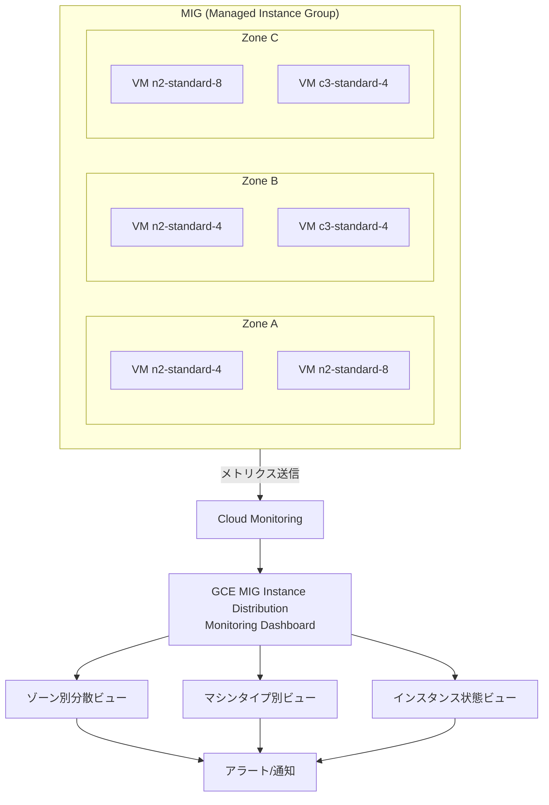

# Compute Engine: MIG Instance Distribution Monitoring Dashboard

**リリース日**: 2026-07-24

**サービス**: Compute Engine

**機能**: MIG Instance Distribution Monitoring Dashboard

**ステータス**: Feature (GA)

[このアップデートのインフォグラフィックを見る](https://takech9203.github.io/google-cloud-news-summary/20260724-compute-engine-mig-instance-distribution-monitoring.html)

## 概要

Google Cloud は、マネージド インスタンス グループ (MIG) における VM のリアルタイム分散状況を可視化する「GCE MIG Instance Distribution Monitoring」ダッシュボードを Cloud Monitoring で一般提供 (GA) として公開しました。このダッシュボードでは、ゾーン間、マシンタイプ間、インスタンス状態ごとの VM 分散をリアルタイムで確認できます。

この機能は、ロケーション フレキシビリティ (複数ゾーンへの分散配置) やインスタンス フレキシビリティ (複数マシンタイプの利用) を使用している MIG において特に価値を発揮します。キャパシティの割り当て状況やランタイム フォールバック動作を診断する際の可視性を大幅に向上させます。

主な対象ユーザーは、大規模な MIG を運用するインフラストラクチャエンジニア、SRE、およびコスト最適化を担当するクラウドアーキテクトです。

**アップデート前の課題**

- MIG 内の VM がどのゾーンにどれだけ分散されているかをリアルタイムで確認する統合的なダッシュボードがなかった
- インスタンス フレキシビリティを使用している場合、実際にどのマシンタイプが選択されているかを一目で把握するのが困難だった
- フォールバック動作 (優先マシンタイプが利用不可の場合に別のタイプへ切り替わる) が発生しているかを診断するには、個別に API を呼び出す必要があった
- ゾーン間のキャパシティ不均衡を検知するには、カスタムモニタリング設定を構築する必要があった

**アップデート後の改善**

- Cloud Monitoring の事前定義ダッシュボードで、MIG の VM 分散をゾーン別・マシンタイプ別・状態別にリアルタイムで可視化可能になった
- キャパシティ割り当ての偏りや想定外のフォールバック動作を即座に検知できるようになった
- 追加設定なしで利用可能であり、カスタムダッシュボードを構築する必要がなくなった
- インスタンス フレキシビリティのランク機能と組み合わせることで、コスト最適化の効果を定量的に確認できるようになった

## アーキテクチャ図



GCE MIG Instance Distribution Monitoring ダッシュボードは、MIG 内の各ゾーンに配置された VM からメトリクスを収集し、ゾーン分散・マシンタイプ分布・インスタンス状態を可視化します。異常検知時にはアラートポリシーと連携して通知が可能です。

## サービスアップデートの詳細

### 主要機能

1. **ゾーン別 VM 分散モニタリング**
   - リージョナル MIG 内の各ゾーンにおける VM 数をリアルタイムで表示
   - BALANCED / ANY / EVEN 各ターゲット分散シェイプの実際の動作結果を確認可能
   - ゾーン間の不均衡を視覚的に検知

2. **マシンタイプ別分布の可視化**
   - インスタンス フレキシビリティで設定した複数マシンタイプの実際の使用割合を表示
   - ランク (優先度) に基づくフォールバック状況を把握可能
   - コスト最適化のための実際のマシンタイプ配分を確認

3. **インスタンス状態モニタリング**
   - RUNNING、CREATING、STOPPING 等の各状態にある VM 数を表示
   - オートヒーリングやオートスケーリングの動作状況をリアルタイムで監視
   - 異常状態のインスタンスを即座に特定

4. **ランタイム フォールバック動作の診断**
   - 優先マシンタイプのキャパシティ不足による代替タイプへの切り替えを検知
   - ゾーン間のリソース制約によるアンバランスな分散を可視化
   - キャパシティ計画の精度向上に活用可能

## 技術仕様

### ダッシュボード関連情報

| 項目 | 詳細 |
|------|------|
| ダッシュボード名 | GCE MIG Instance Distribution Monitoring |
| 提供場所 | Cloud Monitoring > Dashboards |
| カテゴリ | Google Services (事前定義ダッシュボード) |
| 対応 MIG タイプ | リージョナル MIG (マルチゾーン) |
| 対応ターゲット分散シェイプ | EVEN, BALANCED, ANY, ANY_SINGLE_ZONE |

### インスタンス フレキシビリティの設定例

```json
{
  "instanceFlexibilityPolicy": {
    "instanceSelections": {
      "cost-optimized": {
        "machineTypes": ["n2-standard-4", "n2-standard-8"],
        "rank": 1
      },
      "fallback": {
        "machineTypes": ["c3-standard-4", "c3-standard-8"],
        "rank": 2
      }
    }
  }
}
```

## 設定方法

### 前提条件

1. Cloud Monitoring API が有効化されたプロジェクト
2. リージョナル MIG が作成済みであること
3. `monitoring.dashboards.list` および `monitoring.dashboards.get` の権限

### 手順

#### ステップ 1: Cloud Monitoring ダッシュボードへアクセス

```bash
# Google Cloud Console で Monitoring > Dashboards に移動
# または gcloud で利用可能なダッシュボードを確認
gcloud monitoring dashboards list --filter="displayName:'GCE MIG Instance Distribution'"
```

Cloud Console の左メニューから「Monitoring」>「Dashboards」を選択し、「Google Services」カテゴリから「GCE MIG Instance Distribution Monitoring」を選択します。

#### ステップ 2: MIG にインスタンス フレキシビリティを設定 (既存 MIG の場合)

```bash
# 複数マシンタイプとランクを設定
gcloud beta compute instance-groups managed update MY_MIG \
  --region us-central1 \
  --instance-flexibility-policy='{
    "instanceSelections": {
      "primary": {
        "rank": 1,
        "machineTypes": ["n2-standard-4", "n2-standard-8"]
      },
      "secondary": {
        "rank": 2,
        "machineTypes": ["c3-standard-4", "c3-standard-8"]
      }
    }
  }'
```

インスタンス フレキシビリティを設定することで、ダッシュボードのマシンタイプ別ビューでより詳細な分布情報を確認できます。

#### ステップ 3: ターゲット分散シェイプの設定

```bash
# リージョナル MIG のターゲット分散シェイプを設定
gcloud compute instance-groups managed create my-regional-mig \
  --template my-template \
  --size 30 \
  --region us-central1 \
  --zones us-central1-a,us-central1-b,us-central1-c \
  --target-distribution-shape balanced
```

ターゲット分散シェイプの設定により、ゾーン間の VM 分散方法が決まります。ダッシュボードでは実際の分散結果を確認できます。

## メリット

### ビジネス面

- **運用コスト削減**: フォールバック動作の可視化により、不必要に高コストなマシンタイプへの切り替えを早期に検知し対処可能
- **SLA 遵守の支援**: ゾーン間の分散が想定通りであることを常時確認でき、HA 構成の信頼性を証明可能
- **キャパシティ計画の精度向上**: 実際のリソース配分データに基づき、将来のキャパシティ計画を立案可能

### 技術面

- **ゼロ設定で利用開始**: 事前定義ダッシュボードとして提供されるため、追加のエージェントやカスタム設定が不要
- **リアルタイム可視性**: VM の分散状況をリアルタイムで確認し、問題を即座に特定可能
- **既存ワークフローとの統合**: Cloud Monitoring のアラートポリシーやログとシームレスに連携

## デメリット・制約事項

### 制限事項

- ゾーナル MIG (単一ゾーン) では、ゾーン間分散の可視化は対象外
- インスタンス フレキシビリティを設定していない MIG では、マシンタイプ別ビューの情報が限定的
- ダッシュボードのカスタマイズ範囲は Cloud Monitoring の標準的な制限に従う

### 考慮すべき点

- 大規模な MIG (数千インスタンス) の場合、ダッシュボードの表示レイテンシが発生する可能性がある
- フォールバック動作の「原因」まではダッシュボードだけでは判別できず、ログとの併用が推奨される
- アラートポリシーの閾値設定には、通常運用時のベースラインデータの蓄積が必要

## ユースケース

### ユースケース 1: Spot VM ワークロードのフォールバック監視

**シナリオ**: バッチ処理ワークロードで Spot VM を使用しており、インスタンス フレキシビリティで複数のマシンタイプをランク付けして設定している。Spot VM のプリエンプションにより、想定外のマシンタイプへフォールバックが頻発していないか監視したい。

**実装例**:
```bash
# インスタンス フレキシビリティの設定
gcloud beta compute instance-groups managed update batch-mig \
  --region us-central1 \
  --instance-flexibility-policy='{
    "instanceSelections": {
      "cost-optimal": {
        "rank": 1,
        "machineTypes": ["n2-standard-4", "n2-standard-8"]
      },
      "fallback-1": {
        "rank": 2,
        "machineTypes": ["c3-standard-4", "e2-standard-4"]
      }
    }
  }'
```

**効果**: ダッシュボードのマシンタイプ別ビューで、rank 1 のマシンタイプ使用率が低下し rank 2 に移行しているタイミングを検知。プリエンプション率の高い時間帯を特定し、ジョブスケジューリングを最適化。

### ユースケース 2: マルチゾーン HA 構成の分散均等性監視

**シナリオ**: BALANCED ターゲット分散シェイプを使用したリージョナル MIG で Web アプリケーションをホストしている。特定ゾーンのキャパシティ制約により分散が偏り、ゾーン障害時のリスクが増大していないか確認したい。

**効果**: ゾーン別分散ビューで各ゾーンの VM 数をリアルタイム確認。偏りが閾値を超えた場合にアラートを発行し、必要に応じてリザベーションの追加やオーバープロビジョニングの調整を実施。

### ユースケース 3: コスト最適化の効果測定

**シナリオ**: インスタンス フレキシビリティの「コスト最適化」ユースケースとして、低コストのマシンタイプを高ランクに設定している。実際にどの程度コスト効率の良いマシンタイプが割り当てられているか定量的に測定したい。

**効果**: マシンタイプ別ビューで実際の割り当て分布を確認し、高ランク (低コスト) マシンタイプの使用割合が期待値を満たしているか検証。データに基づくコスト最適化レポートの作成が可能。

## 料金

GCE MIG Instance Distribution Monitoring ダッシュボードは Cloud Monitoring の事前定義ダッシュボードとして提供されます。

- **ダッシュボードの閲覧**: 追加料金なし (Cloud Monitoring の標準機能に含まれる)
- **メトリクスの収集**: Compute Engine の標準メトリクスとして収集されるため、追加のインジェスト料金は不要
- **アラートポリシー**: Cloud Monitoring のアラート料金体系に従う

詳細は [Cloud Monitoring の料金ページ](https://cloud.google.com/stackdriver/pricing) を参照してください。

## 利用可能リージョン

Cloud Monitoring は全てのリージョンで利用可能であり、リージョナル MIG が作成されている全てのリージョンでこのダッシュボードを使用できます。

## 関連サービス・機能

- **Cloud Monitoring**: ダッシュボードの提供基盤。アラートポリシーとの連携により、分散異常の自動検知が可能
- **Compute Engine インスタンス フレキシビリティ**: 複数マシンタイプの設定機能。ダッシュボードのマシンタイプ別ビューと組み合わせて使用
- **MIG ターゲット分散シェイプ**: ゾーン間の VM 分散方法を制御する機能 (EVEN, BALANCED, ANY, ANY_SINGLE_ZONE)
- **Cloud Logging**: フォールバック動作の詳細原因調査に活用。ダッシュボードと組み合わせた障害診断ワークフロー
- **MIG インサイト**: CPU・メモリ使用率に基づくマシンタイプ推奨機能。分散ダッシュボードと合わせてリソース最適化に活用
- **Compute Engine リザベーション**: 特定ゾーンでのキャパシティ確保。ダッシュボードで確認した偏りに対するリザベーション追加で対処

## 参考リンク

- [インフォグラフィック](https://takech9203.github.io/google-cloud-news-summary/20260724-compute-engine-mig-instance-distribution-monitoring.html)
- [公式リリースノート](https://docs.cloud.google.com/release-notes#July_24_2026)
- [Monitor instance distribution in MIGs (ドキュメント)](https://docs.cloud.google.com/compute/docs/instance-groups/monitor-instance-distribution)
- [インスタンス フレキシビリティの設定](https://docs.cloud.google.com/compute/docs/instance-groups/configure-instance-flexibility)
- [リージョナル MIG の分散シェイプ](https://docs.cloud.google.com/compute/docs/instance-groups/regional-mig-distribution-shape)
- [Cloud Monitoring ダッシュボード](https://docs.cloud.google.com/monitoring/charts/predefined-dashboards)
- [Compute Engine 料金](https://cloud.google.com/compute/vm-instance-pricing)

## まとめ

MIG Instance Distribution Monitoring ダッシュボードは、インスタンス フレキシビリティやロケーション フレキシビリティを使用している環境において、運用の可視性を大幅に向上させる重要なアップデートです。追加設定なしで即座に利用可能であり、特に大規模なマルチゾーン MIG を運用しているチームは、フォールバック動作の早期検知とキャパシティ計画の最適化のために活用を推奨します。

---

**タグ**: #ComputeEngine #MIG #CloudMonitoring #InstanceFlexibility #LocationFlexibility #Dashboard #GA #可観測性 #キャパシティ管理
