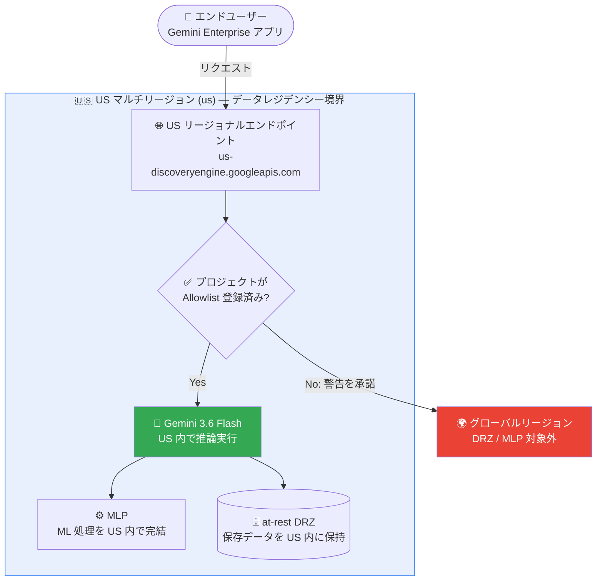

# Gemini Enterprise: Gemini 3.6 Flash が US マルチリージョンで利用可能に (DRZ / MLP 対応、Allowlist)

**リリース日**: 2026-07-24

**サービス**: Gemini Enterprise

**機能**: Gemini 3.6 Flash の US マルチリージョン対応 (データレジデンシー at-rest DRZ / ML 処理 MLP)

**ステータス**: Limited Availability (Allowlist 制)

📊 [このアップデートのインフォグラフィックを見る](https://takech9203.github.io/google-cloud-news-summary/20260724-gemini-enterprise-3-6-flash-us-multi-region.html)

## 概要

Google Cloud は Gemini Enterprise において、Gemini 3.6 Flash を US マルチリージョン (`us`) で利用可能にしました。プロジェクトが Allowlist に登録されている場合、データレジデンシー at-rest (DRZ: Data Residency Zone) と機械学習処理 (MLP: Machine Learning Processing) の両方のコミットメントを維持したまま、最新の Gemini 3.6 Flash モデルを利用できます。アクセスをリクエストするには、Google アカウントチームへの問い合わせが必要です。

2026 年 7 月 21 日にグローバルリージョンで提供開始された Gemini 3.6 Flash は、これまでデータレジデンシー要件のある組織では利用できませんでした ([関連レポート: Gemini 3.6 Flash グローバルリージョン対応](./2026-07-21-gemini-enterprise-3-6-flash-global.md))。今回のアップデートにより、金融、医療、公共機関など、顧客データを米国内に保持する必要がある規制業界のユーザーも、最新の Flash モデルの恩恵 (トークン効率の向上、コード生成品質の改善、マルチモーダル推論の強化) を受けられるようになります。

なお、EU マルチリージョンおよび各国リージョン (CA, IN, JP, SG, UK) では、Gemini 3.6 Flash は引き続きグローバルリージョン経由でのみ利用可能であり、これらのリージョンでは本モデルに対するリージョナルなデータレジデンシーと ML 処理は保証されません。

**アップデート前の課題**

- Gemini 3.6 Flash はグローバルリージョンでのみ提供されており、データレジデンシー要件 (at-rest DRZ) のある組織は利用できなかった
- US マルチリージョンのアプリで Gemini 3.6 Flash のトグルを有効にすると、「トラフィックがグローバルリージョンにルーティングされる」という警告を受け入れる必要があり、DRZ / MLP コミットメントの対象外だった
- 規制業界のユーザーは、DRZ / MLP を維持するために旧世代の Gemini 3.5 Flash や Gemini 2.5 Pro を使い続ける必要があった

**アップデート後の改善**

- Allowlist 登録済みプロジェクトは、US マルチリージョン (`us`) 内で at-rest DRZ と MLP の両方を維持したまま Gemini 3.6 Flash を利用可能になった
- Allowlist 登録済みの場合、管理者はリージョン外ルーティングの警告なしで Gemini 3.6 Flash のトグルを有効化できるようになった
- データレジデンシー要件と最新モデルの性能を両立できるようになり、規制業界でも最新の Flash モデルへの移行パスが確保された

## アーキテクチャ図



Allowlist 登録済みプロジェクトでは、ユーザーのリクエストは US マルチリージョン内で処理され、保存データ (at-rest DRZ) と ML 処理 (MLP) の両方が米国内に留まります。Allowlist 未登録の場合は警告を承諾のうえグローバルリージョンにルーティングされ、DRZ / MLP の対象外となります。

## サービスアップデートの詳細

### 主要機能

1. **US マルチリージョンでの Gemini 3.6 Flash 提供 (Allowlist 制)**
   - プロジェクトが Allowlist に登録されている場合、US マルチリージョン (`us`) で Gemini 3.6 Flash を利用可能
   - Limited Availability 提供のため、アクセスには Google アカウントチームへのリクエストが必要
   - Cloud Data Processing Addendum (CDPA) に基づき、個人データの処理にも利用可能

2. **at-rest DRZ (データレジデンシー) のサポート**
   - 顧客データの保存 (at-rest) が US マルチリージョン内に限定される
   - コンプライアンス要件 (データ所在地規制) を満たしながら最新モデルを利用可能

3. **MLP (Machine Learning Processing) のサポート**
   - 推論などの ML 処理が US マルチリージョン内で実行される
   - 保存だけでなく処理の所在地も保証されるため、より厳格な規制要件に対応

4. **警告なしのトグル有効化**
   - Allowlist 登録済みプロジェクトでは、管理者が Feature Management で Gemini 3.6 Flash のトグルを有効化する際、リージョン外ルーティングの警告が表示されない
   - 未登録プロジェクトでは、トグル有効化時にグローバルリージョンへのルーティング警告を承諾する必要がある

## 技術仕様

### Gemini 3.6 Flash のリージョン別データレジデンシー対応状況

| リージョン | Gemini 3.6 Flash | at-rest DRZ | MLP | 備考 |
|-----------|------------------|-------------|-----|------|
| グローバル (global) | 利用可能 (GA) | 非対応 | 非対応 | 2026-07-21 提供開始 |
| US マルチリージョン (us) | **利用可能 (Allowlist)** | **対応** | **対応** | 今回のアップデート |
| EU マルチリージョン (eu) | グローバル経由のみ | 非対応 | 非対応 | 警告承諾が必要 |
| 各国リージョン (CA, IN, JP, SG, UK) | グローバル経由のみ | 非対応 | 非対応 | 警告承諾が必要 |

### Gemini Enterprise の主要モデルのデータレジデンシー比較 (US マルチリージョン)

| モデル | at-rest DRZ | MLP | 提供形態 |
|--------|-------------|-----|---------|
| Gemini 3.6 Flash | 対応 | 対応 | Allowlist (Limited Availability) |
| Gemini 3.5 Flash | 対応 | 対応 | GA |
| Gemini 3.1 Pro | 対応 | 対応 | Limited Availability |
| Gemini 2.5 Pro | 対応 | 対応 | GA |

### US マルチリージョンの API エンドポイント

US マルチリージョンで顧客データを at-rest DRZ の対象にするには、リージョナルエンドポイントを使用します。

```
https://us-discoveryengine.googleapis.com/v1/projects/PROJECT_ID/locations/us/...
```

(グローバルの場合: `https://discoveryengine.googleapis.com/v1/projects/PROJECT_ID/locations/global/...`)

## 設定方法

### 前提条件

1. プロジェクトが Gemini 3.6 Flash US マルチリージョンの Allowlist に登録されていること (Google アカウントチームにリクエスト)
2. Gemini Enterprise アプリが US マルチリージョン (`us`) に作成されていること
3. Gemini Enterprise の管理者権限があること

### 手順

#### ステップ 1: Allowlist へのアクセスをリクエスト

Google アカウントチームに連絡し、Gemini 3.6 Flash の US マルチリージョン利用のための Allowlist 登録をリクエストします。

#### ステップ 2: US マルチリージョンにアプリを作成 (未作成の場合)

Google Cloud コンソールでアプリを作成する際に、ロケーションとして `us` (multiple regions in the United States) を選択します。

#### ステップ 3: Gemini 3.6 Flash トグルを有効化

Google Cloud コンソールで Gemini Enterprise ページに移動し、対象アプリの「Configurations」→「Feature Management」で Gemini 3.6 Flash のトグルを ON にします。Allowlist 登録済みであれば、リージョン外ルーティングの警告は表示されません。

## メリット

### ビジネス面

- **コンプライアンス対応**: データ所在地規制 (米国内でのデータ保持・処理要件) を満たしながら最新モデルを利用可能
- **規制業界での AI 活用促進**: 金融、医療、公共機関など、これまで最新モデルの採用が難しかった業界でも Gemini 3.6 Flash を導入可能
- **移行パスの確保**: データレジデンシー要件のある組織でも、旧世代モデルから最新 Flash モデルへの計画的な移行が可能に

### 技術面

- **保存と処理の両方を保証**: at-rest DRZ に加えて MLP もサポートされるため、推論処理自体も US 内で完結
- **最新モデルの性能**: トークン効率の向上、コード生成のコンパイル失敗率低減、マルチモーダル推論の強化といった Gemini 3.6 Flash の改善を DRZ 環境で享受可能
- **警告なしの管理体験**: Allowlist 登録済みなら管理者はリージョン外ルーティングの警告を意識せずにトグルを有効化できる

## デメリット・制約事項

### 制限事項

- Allowlist 制 (Limited Availability) のため、利用には Google アカウントチームへのリクエストと承認が必要
- US マルチリージョンのみの対応であり、EU マルチリージョンおよび各国リージョン (CA, IN, JP, SG, UK) では Gemini 3.6 Flash の DRZ / MLP は非対応 (グローバルリージョン経由のみ)
- Allowlist 未登録のプロジェクトが US マルチリージョンでトグルを有効にすると、トラフィックはグローバルリージョンにルーティングされ、DRZ / MLP の対象外となる

### 考慮すべき点

- Limited Availability 提供のため、GA と比べて機能や SLA の条件が異なる可能性がある。個人データの処理は Cloud Data Processing Addendum の範囲で可能
- グローバルリージョンでは Gemini 3.5 Flash が 2026 年 8 月 4 日に削除予定 (US/EU マルチリージョンの 3.5 Flash には影響なし)。US マルチリージョンでも将来的なモデル世代交代を見据え、3.6 Flash の Allowlist 申請を早めに検討する価値がある
- データレジデンシー要件がない場合、Google はグローバルリージョンの利用を推奨 (応答速度、最新モデル・機能が最も早く提供されるため)

## ユースケース

### ユースケース 1: 金融機関でのデータレジデンシー準拠 AI アシスタント

**シナリオ**: 米国の金融機関が、顧客データを米国内に保持・処理する規制要件の下で Gemini Enterprise を運用している。Allowlist 登録により、US マルチリージョンのアプリで Gemini 3.6 Flash を有効化し、DRZ / MLP を維持したまま最新モデルによる文書検索・要約・コード生成を利用する。

**効果**: コンプライアンスを損なわずに、トークン効率とコード生成品質が向上した最新モデルへアップグレードでき、運用コストと応答品質の両方を改善。

### ユースケース 2: 旧世代 Flash モデルからの計画的移行

**シナリオ**: US マルチリージョンで Gemini 3.5 Flash を利用中の組織が、モデル世代交代に備えて Allowlist を申請し、Gemini 3.6 Flash への段階的な移行検証を DRZ 環境のまま実施する。

**効果**: データレジデンシー要件を維持したまま新旧モデルの品質・コストを比較検証でき、将来のモデル削除時にも慌てずに移行できる。

## 料金

Gemini Enterprise アプリ内での Gemini 3.6 Flash の利用は、Gemini Enterprise のライセンス (Standard または Plus Edition) に含まれます。詳細は料金ページを参照してください。

- [Gemini Enterprise 料金](https://cloud.google.com/gemini-enterprise-agent-platform/generative-ai/pricing)

## 利用可能リージョン

| ロケーション | Gemini 3.6 Flash の DRZ / MLP |
|-------------|------------------------------|
| US マルチリージョン (us) | 対応 (Allowlist 制) |
| EU マルチリージョン (eu) | 非対応 (グローバル経由のみ) |
| 各国リージョン (CA, IN, JP, SG, UK) | 非対応 (グローバル経由のみ) |

## 関連サービス・機能

- **Gemini Enterprise (グローバルリージョン)**: Gemini 3.6 Flash は 2026-07-21 にグローバルリージョンで GA ([関連レポート](./2026-07-21-gemini-enterprise-3-6-flash-global.md))
- **CMEK (顧客管理暗号鍵)**: US / EU マルチリージョンで利用可能なセキュリティ機能。グローバルリージョンでは利用不可のため、CMEK と 3.6 Flash を併用するには US マルチリージョン + Allowlist が必要
- **Model Armor**: モデルのセキュリティポリシー適用。US / EU マルチリージョンで DRZ / MLP 対応 (グローバルリージョンでは利用不可)
- **Gemini Notebook Enterprise**: US / EU マルチリージョンで基本機能の at-rest DRZ / MLP に対応

## 参考リンク

- 📊 [インフォグラフィック](https://takech9203.github.io/google-cloud-news-summary/20260724-gemini-enterprise-3-6-flash-us-multi-region.html)
- [公式リリースノート](https://docs.cloud.google.com/release-notes#July_24_2026)
- [Gemini Enterprise データレジデンシー (Standard / Plus Edition)](https://docs.cloud.google.com/gemini/enterprise/docs/locations)
- [既知の制限事項: Gemini 3.6 Flash in US multi-region](https://docs.cloud.google.com/gemini/enterprise/docs/known-limitations#using-gemini-36-flash-us-mrep)
- [Gemini 3.6 Flash モデルページ](https://docs.cloud.google.com/gemini-enterprise-agent-platform/models/gemini/3-6-flash)
- [Web アプリの機能管理](https://docs.cloud.google.com/gemini/enterprise/docs/manage-web-app-features)
- [Cloud Data Processing Addendum](https://cloud.google.com/terms/data-processing-addendum)
- [関連レポート: Gemini 3.6 Flash グローバルリージョン対応 (2026-07-21)](./2026-07-21-gemini-enterprise-3-6-flash-global.md)

## まとめ

今回のアップデートにより、データレジデンシー要件のある組織でも US マルチリージョン内で at-rest DRZ と MLP を維持したまま Gemini 3.6 Flash を利用できるようになりました。規制業界で最新 Flash モデルの導入を検討している場合は、Google アカウントチームに Allowlist 登録をリクエストし、DRZ 環境での移行検証を開始することを推奨します。

---

**タグ**: #GeminiEnterprise #Gemini3.6Flash #データレジデンシー #DRZ #MLP #USマルチリージョン #Allowlist #コンプライアンス
