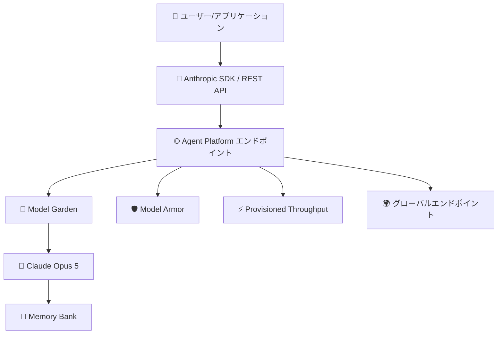

# Gemini Enterprise Agent Platform: Anthropic Claude Opus 5 が Model Garden で利用可能に

**リリース日**: 2026-07-24

**サービス**: Gemini Enterprise Agent Platform

**機能**: Anthropic Claude Opus 5 Available in Model Garden

**ステータス**: Feature

📊 [このアップデートのインフォグラフィックを見る](https://takech9203.github.io/google-cloud-news-summary/20260724-gemini-enterprise-agent-platform-claude-opus-5.html)

## 概要

Anthropic の最新フラッグシップモデルである Claude Opus 5 が、Google Cloud の Gemini Enterprise Agent Platform (旧 Vertex AI) の Model Garden で利用可能になった。これにより、Google Cloud ユーザーは既存の Agent Platform インフラストラクチャを通じて、Anthropic の最先端 AI モデルにアクセスできるようになる。

Claude Opus シリーズは、複雑なマルチステップのエンタープライズワークフロー、エージェンティックコーディング、長時間セッションでの依存関係追跡に最適化されたモデルファミリーである。Claude Opus 5 は、この系譜の最新版として、前世代の Claude Opus 4.8 を上回る性能を提供すると期待される。

対象ユーザーは、高度な推論能力を必要とするエンタープライズ AI アプリケーション開発者、エージェンティックワークフローを構築するチーム、および大規模なコードベースのリファクタリングや分析を行うソフトウェアエンジニアリングチームである。

**アップデート前の課題**

- Claude Opus 4.8 が Agent Platform で利用可能な最新の Opus モデルであり、最新世代の能力にアクセスできなかった
- より高度な推論や長文脈での一貫性が求められるタスクにおいて、既存モデルの限界に直面する場合があった
- Anthropic の最新モデルを利用するには、別のプラットフォームでの利用を検討する必要があった

**アップデート後の改善**

- Claude Opus 5 が Model Garden から直接利用可能になり、最新世代のフロンティアモデルにアクセスできるようになった
- Agent Platform のエコシステム (Memory Bank、Sessions、Provisioned Throughput、グローバルエンドポイント等) と統合された状態で利用可能
- Google Cloud のセキュリティ、コンプライアンス、データガバナンス機能を維持しながら最新モデルを活用できる

## アーキテクチャ図



ユーザーは Anthropic SDK または REST API を通じて Agent Platform エンドポイントにリクエストを送信し、Model Garden を経由して Claude Opus 5 にアクセスする。Model Armor によるセキュリティ保護、Provisioned Throughput による安定したパフォーマンス、グローバルエンドポイントによる高可用性が提供される。

## サービスアップデートの詳細

### 主要機能

1. **Model Garden でのワンクリックデプロイ**
   - Google Cloud コンソールの Model Garden からモデルカードを選択し、「Enable」をクリックするだけで利用開始可能
   - インフラストラクチャのプロビジョニングは不要 (サーバーレス MaaS)

2. **Anthropic SDK および REST API 対応**
   - Anthropic の公式 Python/TypeScript SDK を使用して Agent Platform 経由でリクエスト可能
   - `rawPredict` エンドポイントを使用した REST API アクセスもサポート
   - モデル ID: `claude-opus-5` (推定)

3. **Agent Platform エコシステムとの統合**
   - Memory Bank: 長期的なコンテキストの永続化
   - Sessions: マルチインタラクションにわたる自然なユーザー体験
   - Prompt Caching: 柔軟な TTL によるコスト最適化
   - Batch Predictions: 大量リクエストの効率的処理
   - Web Search: リアルタイム情報へのアクセス

4. **セキュリティとコンプライアンス**
   - Model Armor によるプロンプトインジェクション防御
   - データレジデンシーコントロール
   - Security Command Center による AI リスクの優先順位付け

## 技術仕様

### モデル仕様 (Claude Opus 4.8 の仕様を参考)

| 項目 | 詳細 |
|------|------|
| モデル ID | `claude-opus-5` (推定) |
| 入力タイプ | テキスト、コード、画像、ドキュメント (PDF) |
| 出力タイプ | テキスト |
| 最大入力トークン | 1,000,000 (推定) |
| 最大出力トークン | 128,000 (推定) |
| ローンチステージ | GA |

### サポートされる機能 (推定)

| 機能 | 対応状況 |
|------|----------|
| Computer Use | 対応 |
| Web Search | 対応 |
| Batch Predictions | 対応 |
| Prompt Caching | 対応 |
| Function Calling | 対応 |
| Extended Thinking | 対応 |
| Count Tokens | 対応 |

### 利用方法

```python
# Anthropic Vertex SDK を使用した呼び出し例
from anthropic import AnthropicVertex

client = AnthropicVertex(project_id="your-project-id", region="us-east5")

message = client.messages.create(
    model="claude-opus-5",
    max_tokens=1024,
    messages=[
        {
            "role": "user",
            "content": "複雑なシステム設計のレビューをお願いします。",
        }
    ],
)
print(message.model_dump_json(indent=2))
```

## 設定方法

### 前提条件

1. Google Cloud プロジェクトで Agent Platform API (`aiplatform.googleapis.com`) が有効化されていること
2. パートナーモデルを有効化するための適切な IAM 権限を持っていること
3. Anthropic のサービス規約への同意

### 手順

#### ステップ 1: Model Garden でモデルを有効化

Google Cloud コンソールから Model Garden にアクセスし、Claude Opus 5 のモデルカードで「Enable」をクリックする。

```bash
# コンソール URL
# https://console.cloud.google.com/agent-platform/publishers/anthropic/model-garden/claude-opus-5
```

#### ステップ 2: Anthropic SDK のインストール

```bash
pip3 install --upgrade google-cloud-aiplatform
pip3 install -U 'anthropic[vertex]'
```

#### ステップ 3: 認証の設定

```bash
gcloud auth application-default login
```

#### ステップ 4: API リクエストの送信 (curl)

```bash
curl -X POST \
  -H "Authorization: Bearer $(gcloud auth print-access-token)" \
  -H "Content-Type: application/json; charset=utf-8" \
  -d '{
    "anthropic_version": "vertex-2023-10-16",
    "max_tokens": 1024,
    "stream": false,
    "messages": [
      {
        "role": "user",
        "content": "Hello, Claude Opus 5!"
      }
    ]
  }' \
  "https://us-east5-aiplatform.googleapis.com/v1/projects/PROJECT_ID/locations/us-east5/publishers/anthropic/models/claude-opus-5:rawPredict"
```

## メリット

### ビジネス面

- **マルチモデル戦略の強化**: Google Cloud 上で Google (Gemini) と Anthropic (Claude) の最新モデルを統一的なインフラで利用でき、ユースケースに応じた最適なモデル選択が可能
- **エンタープライズグレードのガバナンス**: データレジデンシー、アクセス制御、監査ログが統合されており、規制の厳しい業界でも安心して利用可能
- **コスト最適化**: Provisioned Throughput による固定コストでの安定運用、Prompt Caching によるトークン消費の削減

### 技術面

- **サーバーレスアーキテクチャ**: インフラ管理不要で即座にスケール可能
- **グローバルエンドポイント**: 高可用性と低レイテンシーを実現
- **エージェンティックワークフロー**: Agent Runtime、Memory Bank、Sessions との統合により、長時間稼働するマルチステップエージェントの構築が容易

## デメリット・制約事項

### 制限事項

- 一部のリセラー経由の課金アカウントでは利用規約の同意ができず、Claude モデルを有効化できない場合がある
- Advanced AI Safety Addendum への同意が必要な場合があり、プロンプトとレスポンスが最大 30 日間保存される可能性がある
- リージョンの可用性が限定的 (主に US マルチリージョン、EU マルチリージョンおよびグローバルエンドポイント)

### 考慮すべき点

- Opus モデルは Sonnet や Haiku と比較してトークン単価が高いため、コストとパフォーマンスのバランスを検討する必要がある
- クォータ制限 (QPM、TPM) があるため、大規模利用時には Provisioned Throughput の検討が必要
- Anthropic のサービス固有規約 (Section F) に基づき、プロンプト・レスポンスの共有設定が必要

## ユースケース

### ユースケース 1: エージェンティックコーディング

**シナリオ**: 大規模なコードベースのリファクタリングプロジェクトで、Claude Opus 5 を搭載したコーディングエージェントが依存関係を追跡しながら、複数ファイルにまたがる変更を自律的に実行する。

**実装例**:
```python
from anthropic import AnthropicVertex

client = AnthropicVertex(project_id="my-project", region="us-east5")

message = client.messages.create(
    model="claude-opus-5",
    max_tokens=8192,
    tools=[
        {
            "name": "read_file",
            "description": "ファイルの内容を読み取る",
            "input_schema": {
                "type": "object",
                "properties": {
                    "path": {"type": "string", "description": "ファイルパス"}
                },
                "required": ["path"]
            }
        }
    ],
    messages=[
        {
            "role": "user",
            "content": "このリポジトリの認証モジュールをOAuth2.0に移行してください。"
        }
    ]
)
```

**効果**: 複雑なリファクタリングタスクの自動化により、エンジニアリング工数を大幅に削減

### ユースケース 2: マルチステップ・エンタープライズワークフロー

**シナリオ**: 金融機関での規制レポート作成において、複数のデータソースからの情報収集、分析、レポート生成を一連のワークフローとして実行する。

**効果**: Memory Bank との統合により、長期的なコンテキストを維持しながら複雑な業務プロセスを自動化

## 料金

Claude Opus 5 の具体的な料金は公式料金ページを参照のこと。Claude モデルの料金はトークンベースの従量課金制であり、入力トークンと出力トークンそれぞれに料金が設定される。

参考として、Claude Opus シリーズは Claude モデルファミリーの中で最も高性能かつ高価格帯のモデルである。コスト最適化には以下の機能が利用可能:

- **Prompt Caching**: キャッシュヒット時にトークン料金を削減
- **Batch Predictions**: バッチ処理による割引
- **Provisioned Throughput**: 大規模利用時の固定コスト予約

詳細料金: [Gemini Enterprise Agent Platform Pricing](https://cloud.google.com/gemini-enterprise-agent-platform/generative-ai/pricing)

## 利用可能リージョン

Claude Opus 4.7/4.8 の仕様を参考にした推定:

| リージョン | エンドポイントタイプ |
|-----------|---------------------|
| United States | マルチリージョン |
| Europe | マルチリージョン |
| Global | グローバルエンドポイント |

グローバルエンドポイントを使用することで、QPM と TPM のクォータが倍増し、高可用性が実現される。

## 関連サービス・機能

- **Agent Runtime**: Claude Opus 5 を搭載したエージェントのサーバーレスデプロイとスケーリング
- **Memory Bank**: エージェントの長期メモリ管理、永続的なコンテキスト維持
- **Model Armor**: プロンプトインジェクションやツールポイズニングからの保護
- **Claude Sonnet 5**: よりコスト効率の高い日常的なワークフロー向けモデル
- **Claude Haiku 4.5**: 低レイテンシーが求められるサブエージェントやフリーティア向けモデル
- **Claude Fable 5**: 自律的なナレッジワークと長時間タスク向けフロンティアモデル
- **BigQuery**: エンタープライズデータとの統合分析

## 参考リンク

- 📊 [インフォグラフィック](https://takech9203.github.io/google-cloud-news-summary/20260724-gemini-enterprise-agent-platform-claude-opus-5.html)
- [公式リリースノート](https://docs.cloud.google.com/release-notes#July_24_2026)
- [Claude on Agent Platform](https://cloud.google.com/products/model-garden/claude)
- [Claude モデルの使用方法](https://docs.cloud.google.com/gemini-enterprise-agent-platform/models/partner-models/claude/use-claude)
- [Model Garden](https://console.cloud.google.com/vertex-ai/model-garden)
- [料金ページ](https://cloud.google.com/gemini-enterprise-agent-platform/generative-ai/pricing)

## まとめ

Claude Opus 5 の Model Garden への追加は、Google Cloud の Gemini Enterprise Agent Platform におけるマルチモデル戦略の継続的な強化を示している。エンタープライズユーザーは、Google Cloud の統合されたセキュリティ・ガバナンスフレームワークの中で最新のフロンティアモデルを活用でき、特にエージェンティックコーディングや複雑なマルチステップワークフローにおいて高い価値を発揮する。既に Agent Platform で Claude モデルを利用しているユーザーは、モデル ID の切り替えだけで最新モデルへの移行が可能であるため、早期の評価を推奨する。

---

**タグ**: #GeminiEnterpriseAgentPlatform #ModelGarden #Anthropic #ClaudeOpus5 #LLM #AI #パートナーモデル #MaaS
