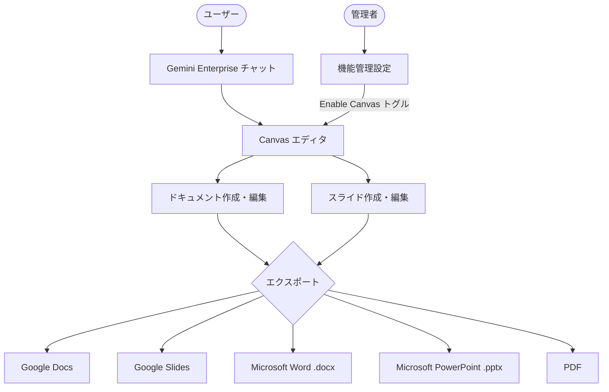

# Gemini Enterprise: Create and Edit Documents and Slides in Canvas (GA)

**リリース日**: 2026-07-24

**サービス**: Gemini Enterprise

**機能**: Create and Edit Documents and Slides in Canvas (GA)

**ステータス**: Feature (GA)

[このアップデートのインフォグラフィックを見る](https://takech9203.github.io/google-cloud-news-summary/20260724-gemini-enterprise-canvas-ga.html)

## 概要

Gemini Enterprise ウェブアプリにおいて、Canvas アシスタントが一般提供 (GA) となった。Canvas は、チャットから直接 AI 生成のドキュメントやプレゼンテーションを作成・編集できる専用のインタラクティブツールである。ユーザーはチャットと並行してドキュメントやスライドを操作でき、アプリケーションの切り替えが不要になる。

作成したコンテンツは Google Workspace (Google Docs、Google Slides)、Microsoft Office 形式 (DOCX、PowerPoint)、PDF にエクスポート可能であり、既存のワークフローとシームレスに統合できる。Canvas は Gemini Enterprise の Business、Standard、Plus エディションで利用可能で、Global、US、EU リージョンに対応している。

管理者がウェブアプリの機能管理設定で「Enable canvas」トグルを有効にすることで、ユーザーが Canvas を利用できるようになる。デフォルトでは無効化されているため、管理者は事前に確認・テストを行った上で有効化を判断できる。

**アップデート前の課題**

- Canvas は Preview 段階であり、本番環境での利用が推奨されていなかった
- AI 生成のドキュメントやプレゼンテーションを作成するには、チャットとは別のアプリケーションを使い分ける必要があった
- チャットで生成したコンテンツを外部ツールに手動でコピー・ペーストする手間が発生していた

**アップデート後の改善**

- Canvas が GA となり、本番環境でのエンタープライズ利用に対応した
- チャット画面のすぐ隣で AI 生成ドキュメント・スライドを直接作成・編集可能になった
- Google Workspace、Microsoft Office、PDF への直接エクスポートにより、ワークフローがシームレスになった

## アーキテクチャ図



Gemini Enterprise ウェブアプリ内で、ユーザーがチャットから Canvas を起動し、ドキュメントやスライドを作成・編集した後、各種形式にエクスポートする流れを示している。管理者は機能管理設定から Canvas の有効化を制御する。

## サービスアップデートの詳細

### 主要機能

1. **AI によるドキュメント・スライド生成**
   - チャットプロンプトから直接ドキュメントやスライドプレゼンテーションを生成
   - 会話履歴、有効化されたコネクタからのコンテンツ、明示的に追加されたソースを入力として活用
   - ファイルや画像をアップロードしてプロンプトと共に使用可能

2. **インタラクティブな編集機能**
   - ドキュメントの直接編集: テキストの追加・編集・削除、見出し・太字・イタリックなどの書式変更、箇条書き・番号付きリストの作成
   - AI による編集: 文章の長さや文調をスライダーで調整、詳細なチャットフィードバックによる指示
   - ハイライト編集: 特定のテキスト部分を選択し、その部分に対する修正指示を入力
   - 取り消し・やり直しで保存バージョン間を移動可能

3. **マルチフォーマットエクスポート**
   - ドキュメント: Google Docs、DOCX、PDF、テキストコピー
   - スライド: Google Slides、Microsoft PowerPoint、PDF
   - Google Workspace へのエクスポートには Google Drive データストアの接続が必要

4. **ソース引用**
   - ドキュメント生成時に使用した参照元・検索結果をソースとして表示
   - スライドでは最終ページに画像ソースのメタデータを自動的に含む

## 技術仕様

### IAM 権限

Canvas を利用するにはユーザーに適切な IAM 権限が必要である。事前定義ロール (`roles/discoveryengine.user`) を使用している場合は追加設定不要だが、カスタムロールを使用している場合は以下の権限を追加する必要がある。

| 権限 | 説明 |
|------|------|
| `discoveryengine.immersiveArtifacts.create` | Canvas アーティファクトの作成 |
| `discoveryengine.immersiveArtifacts.delete` | Canvas アーティファクトの削除 |
| `discoveryengine.immersiveArtifacts.export` | Canvas アーティファクトのエクスポート |
| `discoveryengine.immersiveArtifacts.get` | Canvas アーティファクトの取得 |
| `discoveryengine.immersiveArtifacts.list` | Canvas アーティファクトの一覧表示 |
| `discoveryengine.immersiveArtifacts.navigate` | Canvas アーティファクトのナビゲーション |
| `discoveryengine.immersiveArtifacts.update` | Canvas アーティファクトの更新 |

### カスタムロールへの権限追加

```bash
gcloud iam roles update ROLE_ID \
  --project=PROJECT_ID \
  --add-permissions=discoveryengine.immersiveArtifacts.create,discoveryengine.immersiveArtifacts.delete,discoveryengine.immersiveArtifacts.export,discoveryengine.immersiveArtifacts.get,discoveryengine.immersiveArtifacts.list,discoveryengine.immersiveArtifacts.navigate,discoveryengine.immersiveArtifacts.update
```

注意: これらの権限は現在 alpha ステータスであり、gcloud CLI で「カスタムロールでの使用に不安定な可能性がある」という警告が表示されるが、権限は正常に適用される。

## 設定方法

### 前提条件

1. Gemini Enterprise Admin ロール (`roles/discoveryengine.agentspaceAdmin`) を持つ管理者アカウント
2. 既存の Gemini Enterprise ウェブアプリ
3. カスタムロールを使用している場合、immersiveArtifacts 権限の追加

### 手順

#### ステップ 1: Canvas 機能の有効化

1. Google Cloud コンソールで Gemini Enterprise ページに移動
2. 設定するアプリの名前をクリック
3. **Configurations** をクリックし、**Feature Management** タブを選択
4. **Enable Canvas** トグルをオンにする

#### ステップ 2: Google Workspace へのエクスポート設定 (オプション)

Google Docs や Google Slides へのエクスポートを有効にするには以下が必要:

1. ユーザーアカウントにアクティブな Google Workspace ライセンスがあること
2. Google Drive データストアが Gemini Enterprise アプリに接続されていること
3. Google Workspace 管理者が Gemini Enterprise のデータアクセスを有効にしていること

## メリット

### ビジネス面

- **生産性向上**: チャットとドキュメント作成を同一画面で行えるため、アプリケーション切り替えによる時間ロスを削減
- **コンテンツ制作の高速化**: AI を活用した文書・プレゼンテーション生成により、初稿作成時間を大幅に短縮
- **フォーマット互換性**: Google Workspace と Microsoft Office の両方に対応し、異なるツールを使用するチーム間での連携が容易

### 技術面

- **GA ステータス**: 本番環境での利用が正式にサポートされ、SLA の対象となる
- **細粒度のアクセス制御**: IAM 権限による Canvas 機能へのアクセス制御が可能
- **管理者による段階的展開**: デフォルト無効のため、テスト後に段階的にユーザーへ展開可能

## デメリット・制約事項

### 制限事項

- リージョン制限: Global、EU、US リージョンのみ対応 (アジアリージョンは未対応)
- モバイル非対応: Canvas はウェブアプリでのみ利用可能で、モバイルアプリでは使用できない
- スライド編集: 更新のたびに完全に新しい Canvas アーティファクトが生成され、既存のものは修正・バージョン管理されない

### 考慮すべき点

- Canvas クエリは通常の Gemini Enterprise チャットクエリと同じクォータを消費する
- Google Workspace へのエクスポートには追加の設定要件がある (Google Drive データストア接続、データアクセスの有効化)
- IAM のカスタムロールを使用している場合、alpha 権限の手動追加が必要

## ユースケース

### ユースケース 1: 営業チームの提案資料作成

**シナリオ**: 営業担当者が商談後にクライアント向けの提案書をすばやく作成する必要がある。

**実装例**:
```
プロンプト: "先ほどの商談メモを基に、クラウド移行提案のスライドを10枚で作成してください。
ROI試算とマイルストーンを含めてください。"
```

**効果**: 従来数時間かかっていた提案資料の初稿作成が数分に短縮。AI が構成とコンテンツを生成し、営業担当者は微調整のみで済む。

### ユースケース 2: マーケティングチームのコンテンツ制作

**シナリオ**: マーケティングチームが新製品のローンチに向けた各種ドキュメント (プレスリリース、ブログ記事、ソーシャルメディア投稿) を一括で作成する。

**効果**: Canvas の文調・長さ調整スライダーにより、同一コンテンツを異なるフォーマットや文体に素早く変換可能。Google Docs へのエクスポートでチームレビューもスムーズに実施できる。

### ユースケース 3: プロジェクトマネージャーのステータスレポート

**シナリオ**: プロジェクトマネージャーが週次の進捗報告書を、接続されたデータソースからの情報を基に自動生成する。

**効果**: コネクタ経由で取得したプロジェクトデータを元に、構造化されたレポートを自動生成。DOCX でエクスポートし、Microsoft Office を使用するステークホルダーにも対応。

## 料金

Canvas は Gemini Enterprise サブスクリプションに含まれる機能であり、追加料金は発生しない。Canvas クエリは通常のチャットクエリと同じクォータを消費する。

### エディション別料金

| エディション | 月額料金 (1 シートあたり) | 最大シート数 |
|-------------|--------------------------|-------------|
| Business | $21 USD から | 1-500 |
| Standard | $30 USD から | 無制限 |
| Plus | $30 USD から (上位プラン) | 無制限 |

注: 30 日間の無料トライアルが利用可能。

## 利用可能リージョン

| リージョン | 対応状況 |
|-----------|---------|
| Global | 対応 |
| US | 対応 |
| EU | 対応 |
| アジア (東京等) | 未対応 |

## 関連サービス・機能

- **Gemini Enterprise Agent Designer**: カスタムエージェントをノーコードで作成・管理するツール。Canvas と同じウェブアプリ内で利用可能
- **Gemini Notebook Enterprise**: ドキュメントを基にしたセキュアなワークスペース。Canvas と補完的に使用可能
- **Google Workspace**: Canvas からの直接エクスポート先。Google Docs、Google Slides との統合
- **Deep Research エージェント**: 複雑な調査タスクを自動化する事前構築エージェント。調査結果を Canvas でドキュメント化する連携が有効

## 参考リンク

- [インフォグラフィック](https://takech9203.github.io/google-cloud-news-summary/20260724-gemini-enterprise-canvas-ga.html)
- [公式リリースノート](https://docs.cloud.google.com/release-notes#July_24_2026)
- [Canvas ドキュメント](https://docs.cloud.google.com/gemini/enterprise/docs/assistant-canvas)
- [機能管理設定](https://docs.cloud.google.com/gemini/enterprise/docs/manage-web-app-features)
- [Gemini Enterprise エディション比較](https://docs.cloud.google.com/gemini/enterprise/docs/editions)
- [Gemini Enterprise 料金ページ](https://cloud.google.com/gemini-enterprise)

## まとめ

Gemini Enterprise の Canvas が GA となったことで、企業ユーザーはチャットインターフェースから直接、本番品質のドキュメントやプレゼンテーションを AI で生成・編集できるようになった。Google Workspace と Microsoft Office の両形式に対応するエクスポート機能により、組織内のツール環境を問わず活用可能である。管理者は Feature Management 設定から段階的に展開できるため、まずはパイロットチームで試用し、効果を確認した上で全社展開を進めることを推奨する。

---

**タグ**: #GeminiEnterprise #Canvas #GA #ドキュメント生成 #プレゼンテーション #AI #GoogleWorkspace #MicrosoftOffice
