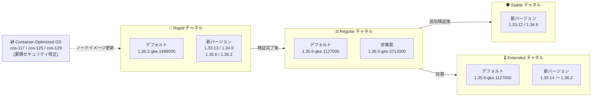

# Google Kubernetes Engine (GKE): バージョンアップデート 2026-R31

**リリース日**: 2026-07-24

**サービス**: Google Kubernetes Engine (GKE)

**機能**: クラスタバージョンの更新とセキュリティアップデート (2026-R31)

**ステータス**: Change + Security (Version Update / Security Update)

📊 [このアップデートのインフォグラフィックを見る](https://takech9203.github.io/google-cloud-news-summary/20260724-gke-version-updates-2026-r31.html)

## 概要

Google Kubernetes Engine (GKE) の全リリースチャネル (Rapid, Regular, Stable, Extended) において、クラスタバージョンが更新された。今回の 2026-R31 アップデートでは、Rapid チャネルのデフォルトバージョンが 1.36.2-gke.1498000 に、Regular / Extended / No channel のデフォルトバージョンが 1.35.6-gke.1127000 に更新され、各チャネルに新しいパッチバージョンが追加されるとともに、複数の旧バージョンが非推奨となった。

あわせてセキュリティアップデート (2026-R31) として、更新された Container-Optimized OS イメージを使用する新しい GKE バージョンがリリースされた。これらのイメージは前回の GKE リリース以降に公開されたすべての Container-Optimized OS のセキュリティ修正を累積的に含んでおり、ノード OS レベルの脆弱性対策が強化されている。

このアップデートは、GKE クラスタを運用するすべてのプラットフォーム管理者およびインフラエンジニアに影響する。特に自動アップグレードを有効にしているクラスタでは、新しい自動アップグレードターゲットへの昇格が順次実施される。

**アップデート前の課題**

- 前回 (2026-R30) までのバージョンには、直近の Container-Optimized OS セキュリティ修正が含まれていなかった
- Rapid チャネルのデフォルトは 1.36.0 系であり、1.36.2 系の最新パッチがデフォルトとして提供されていなかった
- Regular / Extended チャネルの一部の旧パッチバージョン (1.36.0-gke.3712000 など) に既知の問題や未適用のセキュリティ修正が残っていた

**アップデート後の改善**

- Rapid チャネルのデフォルトが Kubernetes 1.36.2 系 (1.36.2-gke.1498000) に昇格し、最新パッチが標準で適用されるようになった
- Regular / Extended / No channel のデフォルトが 1.35.6-gke.1127000 に統一され、安定チャネルのベースラインが揃った
- 新しい GKE バージョン (1.32.13 / 1.34.9 / 1.36.2 系) に累積的なセキュリティ修正を含む Container-Optimized OS イメージが適用され、ノード OS の脆弱性リスクが低減された

## アーキテクチャ図



GKE のリリースチャネルは、Rapid で導入されたバージョンが検証を経て Regular、Stable へと段階的に展開されるパイプラインとして機能する。今回は新しい Container-Optimized OS イメージによるセキュリティ修正も各バージョンに組み込まれている。

## サービスアップデートの詳細

### チャネル別バージョン一覧

| チャネル | デフォルトバージョン | 新規追加バージョン | 非推奨/削除バージョン |
|---------|---------------------|-------------------|-----------------|
| Rapid | 1.36.2-gke.1498000 (新デフォルト) | 1.33.13-gke.1269000, 1.34.9-gke.1610000, 1.35.6-gke.1638000, 1.35.6-gke.1641000, 1.36.2-gke.2064000 | 1.33.13-gke.1101000, 1.34.9-gke.1287000, 1.35.6-gke.1250000, 1.36.0-gke.4681000, 1.36.2-gke.1346000 (提供終了) |
| Regular | 1.35.6-gke.1127000 (新デフォルト) | 1.33.13-gke.1101000, 1.34.9-gke.1287000, 1.35.6-gke.1250000, 1.36.0-gke.4681000, 1.36.2-gke.1346000 | 1.36.0-gke.3712000 (非推奨、90 日以内に削除) |
| Stable | 変更なし | 1.33.12-gke.1270000, 1.34.9-gke.1065000 | - |
| Extended | 1.35.6-gke.1127000 (新デフォルト) | 1.30.14 / 1.31.14 / 1.32.13 / 1.33.13 / 1.34.9 / 1.35.6 / 1.36.0 / 1.36.2 の各シリーズ | 1.30.14 / 1.31.14 / 1.32.13 の複数の旧パッチ (非推奨) |
| No channel (非推奨) | 1.35.6-gke.1127000 (新デフォルト) | 1.33.13-gke.1269000, 1.34.9-gke.1610000, 1.35.6-gke.1638000 ほか | 1.35.5-gke.1241004, 1.36.0-gke.3712000 (非推奨) |

### 自動アップグレードターゲット (Rapid チャネル)

| 現在のマイナーバージョン | アップグレード先 |
|------------------------|------------------|
| 1.32 | 1.33.13-gke.1109000 |
| 1.33 | 1.34.9-gke.1322000 |
| 1.34 | 1.35.6-gke.1258000 |
| 1.35 | 1.36.2-gke.1498000 |

メンテナンス除外や非推奨 API の使用などマイナーアップグレードを妨げる要因がある場合は、同一マイナーバージョン内の新パッチへ自動アップグレードされる。

### セキュリティアップデート (2026-R31)

新しい GKE バージョンでは、更新された Container-Optimized OS イメージが使用される。これらのイメージは前回の GKE リリース以降のセキュリティ修正を累積的に含む。

| GKE バージョン | Container-Optimized OS バージョン |
|---------------|----------------------------------|
| 1.32.13-gke.2137000 | cos-117-18613-675-2 |
| 1.34.9-gke.1610000 | cos-125-19216-532-3 |
| 1.36.2-gke.2064000 | cos-129-19506-299-3 |

解決された個別の脆弱性は、各 Container-Optimized OS イメージのセキュリティリリースノートで確認できる。

### 主要な変更点

1. **Rapid チャネルのデフォルトが Kubernetes 1.36.2 系に昇格**
   - 1.36.2-gke.1498000 が新規クラスタ作成時のデフォルトに
   - 1.35 系クラスタの自動アップグレードターゲットも 1.36.2 系に更新
   - Kubernetes 1.36 の最新パッチが標準で適用される

2. **Regular / Extended チャネルのデフォルトが 1.35.6-gke.1127000 に統一**
   - 前回 (R30) の 1.35.6-gke.1049000 から新パッチに更新
   - 1.36.0-gke.3712000 が Regular チャネルで非推奨に (90 日以内に削除)

3. **Container-Optimized OS のセキュリティ修正を累積適用**
   - cos-117 (M117) / cos-125 (M125) / cos-129 (M129) の 3 マイルストーンのイメージを更新
   - 1.32 / 1.34 / 1.36 系の新バージョンにそれぞれ適用

## 技術仕様

### リリースチャネルの特性

| チャネル | 提供マイナーバージョン範囲 | 安定性 | 今回の主な変更 |
|---------|---------------------|--------|------------------|
| Rapid | 1.33 - 1.36 | 最新機能優先 (SLA 対象外) | デフォルトが 1.36.2 に昇格 |
| Regular | 1.33 - 1.36 | バランス重視 | デフォルトが 1.35.6 新パッチに |
| Stable | 1.33 - 1.34 | 安定性優先 | 1.33.12 / 1.34.9 の新パッチ追加 |
| Extended | 1.30 - 1.36 | 長期サポート (最大 24 ヶ月) | デフォルト更新 + 旧パッチの整理 |

### バージョンロールアウトの注意点

- リリースノート公開時点でロールアウトは進行中であり、全ゾーンへの展開完了まで数日を要する場合がある
- 非推奨バージョンは 90 日後、またはサポート終了時のいずれか早い時点で削除される

## 設定方法

### 前提条件

1. Google Cloud プロジェクトで GKE API が有効であること
2. `gcloud` CLI がインストール・認証済みであること
3. クラスタに対する適切な IAM 権限 (`container.admin` ロールなど) を保持していること

### 手順

#### ステップ 1: 現在のクラスタバージョンとチャネルを確認

```bash
gcloud container clusters list \
  --format="table(name,location,currentMasterVersion,releaseChannel.channel)"
```

#### ステップ 2: 利用可能なバージョンを確認

```bash
# Rapid チャネルのデフォルトバージョンと利用可能バージョンを確認
gcloud container get-server-config \
  --flatten="channels" \
  --filter="channels.channel=RAPID" \
  --format="yaml(channels.channel,channels.defaultVersion,channels.validVersions)" \
  --location=asia-northeast1
```

#### ステップ 3: 手動アップグレード (必要な場合)

```bash
# コントロールプレーンのアップグレード
gcloud container clusters upgrade CLUSTER_NAME \
  --master \
  --cluster-version=1.35.6-gke.1127000 \
  --location=LOCATION

# ノードプールのアップグレード
gcloud container clusters upgrade CLUSTER_NAME \
  --node-pool=NODE_POOL_NAME \
  --cluster-version=1.35.6-gke.1127000 \
  --location=LOCATION
```

#### ステップ 4: メンテナンスウィンドウの設定 (推奨)

```bash
# 業務時間外に自動アップグレードを制限
gcloud container clusters update CLUSTER_NAME \
  --maintenance-window-start="2026-07-25T18:00:00+09:00" \
  --maintenance-window-end="2026-07-25T22:00:00+09:00" \
  --maintenance-window-recurrence="FREQ=WEEKLY;BYDAY=SA,SU" \
  --location=LOCATION
```

## メリット

### ビジネス面

- **セキュリティリスクの低減**: 累積的なセキュリティ修正を含む Container-Optimized OS イメージへの更新により、ノード OS の脆弱性露出時間を短縮
- **運用コストの削減**: 自動アップグレードにより、手動でのバージョン管理・パッチ適用作業が不要
- **コンプライアンス対応**: サポート対象バージョンの維持により SLA 適用範囲内を維持

### 技術面

- **最新パッチの自動適用**: Rapid チャネルのデフォルトが 1.36.2 系に昇格し、Kubernetes 1.36 の最新バグ修正が新規クラスタに標準適用
- **ベースラインの統一**: Regular / Extended / No channel のデフォルトが同一バージョン (1.35.6-gke.1127000) に揃い、環境間のバージョン差異を低減
- **累積的なセキュリティ修正**: COS イメージは前回リリース以降の修正をすべて含むため、途中のパッチをスキップしても最新のセキュリティ状態に到達可能

## デメリット・制約事項

### 制限事項

- ロールアウトは段階的に行われるため、一部のゾーンでは新バージョンがまだ利用できない場合がある
- コントロールプレーンのマイナーバージョンのスキップアップグレードは不可 (1 バージョンずつ順次アップグレードが必要)
- Rapid チャネルのバージョンは GKE SLA の対象外
- Extended チャネルの拡張サポート期間中はセキュリティパッチのみ提供 (新機能追加なし)

### 考慮すべき点

- Regular チャネルで非推奨となった 1.36.0-gke.3712000 を使用中の場合、90 日以内に削除されるため移行計画を早期に策定すること
- Rapid チャネルの 1.35 系クラスタは 1.36.2 系への自動アップグレード対象となるため、Kubernetes 1.36 の非推奨 API への対応状況を事前に確認すること
- ノードのバージョンスキューポリシー (コントロールプレーンとノードの差は最大 2 マイナーバージョン) に注意
- メンテナンス除外を設定している場合でも、パッチバージョンの自動アップグレードは適用される場合がある

## ユースケース

### ユースケース 1: セキュリティ修正の迅速な適用

**シナリオ**: セキュリティポリシーにより、ノード OS の脆弱性修正を速やかに適用する必要があるプロダクションクラスタを運用している。

**実装例**:
```bash
# 該当ノードプールを COS 更新済みバージョンへ手動アップグレード
gcloud container clusters upgrade my-prod-cluster \
  --node-pool=default-pool \
  --cluster-version=1.34.9-gke.1610000 \
  --location=asia-northeast1
```

**効果**: cos-125-19216-532-3 の累積セキュリティ修正が適用されたノードイメージに更新され、脆弱性の露出時間を最小化できる。

### ユースケース 2: 非推奨バージョンからの計画的移行

**シナリオ**: Regular チャネルで 1.36.0-gke.3712000 を使用しており、90 日以内の削除に備えて移行が必要。

**実装例**:
```bash
# 新しい 1.36 系パッチへアップグレード
gcloud container clusters upgrade my-cluster \
  --master \
  --cluster-version=1.36.2-gke.1346000 \
  --location=us-central1
```

**効果**: 削除期限前に計画的にアップグレードすることで、強制アップグレードによる予期しない業務影響を回避できる。

### ユースケース 3: 自動アップグレードによる運用レス管理

**シナリオ**: 開発環境クラスタを Rapid チャネルで運用し、常に最新バージョンで検証したい。

**効果**: 1.35 系クラスタは自動的に 1.36.2-gke.1498000 へアップグレードされるため、手動介入なしで最新の Kubernetes 環境を維持でき、本番環境 (Regular/Stable) への展開前検証が効率化される。

## 料金

GKE のバージョンアップデート自体には追加料金は発生しない。

### 料金例

| 項目 | 料金 |
|------|------|
| GKE クラスタ管理費 (Standard) | $0.10 / クラスタ / 時間 |
| GKE クラスタ管理費 (Autopilot) | 管理費無料 (Pod リソース課金) |
| Extended サポート追加料金 | 拡張サポート期間に入ったクラスタに追加費用が発生 |
| ノードのコンピューティング費用 | 通常の Compute Engine 料金 |

詳細は [GKE 料金ページ](https://cloud.google.com/kubernetes-engine/pricing) を参照。

## 利用可能リージョン

GKE バージョンアップデートは全リージョンで利用可能。ただし、新バージョンのロールアウトはゾーンごとに段階的に行われ、完了まで数日を要する場合がある。

利用可能なバージョンはロケーションごとに確認可能:

```bash
gcloud container get-server-config --location=LOCATION
```

## 関連サービス・機能

- **Container-Optimized OS**: GKE ノードの OS イメージ。今回のセキュリティアップデートの中核であり、GKE バージョンと連動して更新される
- **Cloud Monitoring**: クラスタのアップグレード状態やバージョン情報を監視し、アップグレードイベントをアラート通知
- **Cloud Logging**: アップグレードイベントのログを記録し、トラブルシューティングに活用
- **GKE Security Posture**: クラスタのセキュリティ状態の継続的評価とバージョン推奨
- **GKE Rollout Sequencing**: 複数クラスタ間でのバージョンロールアウトの順序制御

## 参考リンク

- 📊 [このアップデートのインフォグラフィック](https://takech9203.github.io/google-cloud-news-summary/20260724-gke-version-updates-2026-r31.html)
- [公式リリースノート](https://docs.cloud.google.com/release-notes#July_24_2026)
- [GKE リリースノート](https://docs.cloud.google.com/kubernetes-engine/docs/release-notes)
- [GKE バージョニングとサポート](https://docs.cloud.google.com/kubernetes-engine/versioning)
- [リリースチャネルの概要](https://docs.cloud.google.com/kubernetes-engine/docs/concepts/release-channels)
- [クラスタアップグレードのベストプラクティス](https://docs.cloud.google.com/kubernetes-engine/docs/best-practices/upgrading-clusters)
- [Container-Optimized OS リリースノート (M129)](https://docs.cloud.google.com/container-optimized-os/docs/release-notes/m129)
- [料金ページ](https://cloud.google.com/kubernetes-engine/pricing)

## まとめ

GKE 2026-R31 アップデートにより、Rapid チャネルのデフォルトが Kubernetes 1.36.2 系に昇格し、Regular / Extended チャネルのデフォルトも 1.35.6 の新パッチに更新された。あわせて累積的なセキュリティ修正を含む Container-Optimized OS イメージが 1.32 / 1.34 / 1.36 系の新バージョンに適用されている。クラスタ管理者は、非推奨となった 1.36.0-gke.3712000 などからの移行計画を早期に策定し、メンテナンスウィンドウの設定を確認したうえで、セキュリティ修正済みバージョンへの計画的なアップグレードを推奨する。

---

**タグ**: #GKE #Kubernetes #VersionUpdate #SecurityUpdate #ReleaseChannel #ContainerOptimizedOS #2026-R31
