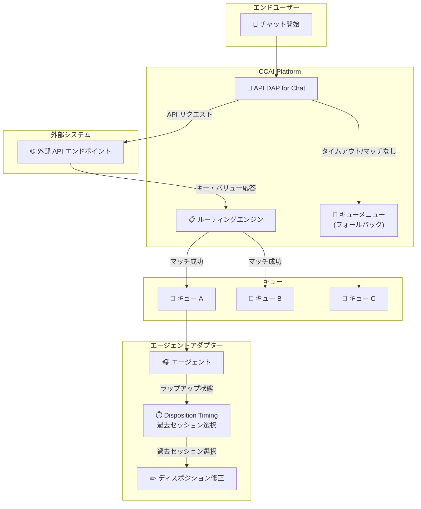

# Google Cloud Contact Center as a Service (CCaaS): バージョン 5.0 リリース

**リリース日**: 2026-07-24

**サービス**: Google Cloud Contact Center as a Service (CCaaS) / CCAI Platform

**機能**: Disposition Timing、API Direct Access Point for Chat、多数のバグ修正

**ステータス**: GA (一般提供)

📊 [このアップデートのインフォグラフィックを見る](https://takech9203.github.io/google-cloud-news-summary/20260724-google-cloud-ccaas-5-0.html)

## 概要

Google Cloud CCaaS (Contact Center as a Service) のバージョン 5.0 がリリースされました。本リリースでは、エージェントのラップアップ業務を大幅に改善する「Disposition Timing」機能、チャットセッションの自動ルーティングを実現する「API Direct Access Point (DAP) for Chat」機能が新たに追加されています。加えて、メール、通話、チャット、ボイスメールなど多岐にわたるチャネルで発生していた多数のバグが修正されています。

本アップデートのインスタンスへの適用タイミングは、選択しているデプロイメントスケジュール (Rapid / Regular / Critical) に依存します。Rapid スケジュールでは最速で適用され、Critical スケジュールでは少なくとも 2 日以降にピーク時間帯を避けて適用されます。

主な対象ユーザーは、コンタクトセンターの管理者、スーパーバイザー、およびエージェントです。特に、複数のセッションを同時に処理するエージェントや、チャットルーティングの最適化を目指す管理者にとって大きな改善となります。

**アップデート前の課題**

- エージェントが手動でラップアップ状態に入った際、ディスポジションコードとノートは直近のセッションにのみ紐付けられ、過去のセッションに遡って属性付けすることができなかった
- 一度完了したセッションのディスポジションコードやノートを後から修正する手段がなかった
- チャットセッションの着信時にエンドユーザーがキューメニューから手動で選択する必要があり、ルーティングの自動化が限定的だった
- メールが「転送中」状態のまま停止する、エージェントに通話やチャットが配信されないなど、複数チャネルで安定性の問題が存在した

**アップデート後の改善**

- Disposition Timing 機能により、エージェントが過去のセッションにラップアップ時間・ディスポジションコード・ノートを紐付けできるようになった
- 完了済みセッションのディスポジションコードとノートの事後修正が可能になった
- API DAP for Chat により、外部 API エンドポイントのレスポンスに基づいてチャットセッションを自動的にキューにルーティングできるようになった
- 多数のバグ修正により、メール・通話・チャット・ボイスメールの各チャネルの安定性が向上した

## アーキテクチャ図



API DAP for Chat による自動ルーティングフローと、Disposition Timing によるエージェントのラップアップ作業の改善を示しています。外部 API からのレスポンスに基づいてチャットが自動ルーティングされ、エージェントは過去のセッションに対してディスポジションを設定・修正できます。

## サービスアップデートの詳細

### 主要機能

1. **Disposition Timing (ディスポジションタイミング)**
   - エージェントが手動でラップアップ状態に入った際、過去に完了したセッションにラップアップ時間、ディスポジションコード、ノートを紐付けることが可能
   - 完了済みセッションのディスポジションコードとノートの修正機能 (セッション終了後 15-30 分以内)
   - 管理者向け: Settings > Operation Management > Wrap-up に新しい「Manual Wrap-up」セクションが追加
   - エージェント向け: エージェントアダプターに過去セッションのリストが表示される新しい UI
   - CRM レコードの自動読み込み機能 (CRM 埋め込み型エージェントアダプター使用時)
   - 各ラップアップ期間は個別のレコードとして追跡され、開始・終了時間が記録される

2. **API Direct Access Point (DAP) for Chat**
   - 外部 API エンドポイントのレスポンスに基づいてチャットセッションを自動ルーティング
   - 2 つの DAP タイプをサポート: API Response (直接応答) と Webhook Response (非同期応答)
   - Web チャットとモバイルチャットの両方に対応
   - 新規チャットと再開チャットの両方で動作
   - マッチしない場合やタイムアウト時は標準キューメニューにフォールバック
   - ルーティングロジックの優先順位を設定可能 (API response > General access point label > User segmentation)
   - デフォルトでは無効。有効化には Google Cloud Support への連絡が必要

3. **バグ修正 (多数)**
   - メールが「転送中」状態のまま停止する問題
   - エンドユーザーにメッセージが配信されない問題
   - 利用可能なエージェントに通話やチャットが配信されない問題
   - ディスポジションパネルの不具合
   - CSV 一括インポートの問題
   - 音声文字起こし (トランスクリプション) の問題
   - チャット通知の問題
   - ボイスメールの問題
   - その他多数の安定性改善

## 技術仕様

### Disposition Timing 設定オプション

| 項目 | 詳細 |
|------|------|
| 自動属性付け | 直近のセッションに自動でラップアップを紐付け |
| セッション選択 | エージェントが過去セッションのリストから選択 |
| 表示方法 (件数指定) | 直近 N 件の通話・チャットを表示 |
| 表示方法 (時間指定) | 直近 N 時間以内に終了したセッションを表示 |
| ディスポジション修正 | 完了済みセッションのコード・ノートを修正可能 |
| CRM レコード自動読み込み | セッション選択時に CRM レコードを自動表示 |
| ノート保持期間 | セッション終了後 15-30 分間 |

### API DAP for Chat 設定オプション

| 項目 | 詳細 |
|------|------|
| DAP タイプ | API Response / Webhook Response |
| 対応チャットタイプ | 新規チャット / 再開チャット |
| 認証方式 | Basic Authentication / Custom Header |
| API リクエストメソッド | POST / GET |
| API リクエストタイムアウト | カスタム設定可能 (秒単位) |
| API コールバックタイムアウト | Webhook Response 時のみ設定可能 |
| ルーティングロジック | API response > General access point label > User segmentation |

### API DAP for Chat の設定パス

```
CCAI Platform Portal > Settings > Developer Settings > API Request Direct Access Point > Chat タブ
```

## 設定方法

### Disposition Timing の設定

#### 前提条件

1. CCAI Platform インスタンスが CCaaS 5.0 にアップデート済みであること
2. キューレベルのラップアップ設定とディスポジションコードが構成済みであること

#### ステップ 1: Manual Wrap-up の有効化

CCAI Platform ポータルで Settings > Operation Management に移動し、Wrap-up > Manual Wrap-up セクションで以下を設定:

- 「Automatically attribute manual wrap-up to the last call or chat session」: 直近セッションへの自動紐付け
- 「Select the call or chat session to attribute manual wrap-up to」: エージェントにセッション選択リストを表示

#### ステップ 2: セッションリストの表示設定

セッション選択を有効にした場合、以下のいずれかを選択:

- 「Display the list of the last [N] calls and chats」: 直近 N 件を表示
- 「Display the list of the calls and chats within the last [N] hours」: 直近 N 時間以内のセッションを表示

#### ステップ 3: ディスポジション修正の有効化 (オプション)

- 「Allow agents to modify the disposition code and notes of previously completed sessions」チェックボックスを有効化
- 変更は新しい CRM レコードとして保存される (元のレコードは変更されない)

### API DAP for Chat の設定

#### 前提条件

1. Google Cloud Support に連絡して機能を有効化
2. 外部 API エンドポイントが準備済みであること

#### ステップ 1: DAP の有効化

Settings > Developer Settings > API Request Direct Access Point > Chat タブで:

- 「API Request Direct Access Point for Chat」トグルを ON に設定
- DAP タイプを選択 (API Response または Webhook Response)

#### ステップ 2: API エンドポイントの設定

- API エンドポイント URL を入力
- 認証方式を設定 (Basic Authentication または Custom Header)
- API リクエストタイムアウトを設定
- リクエストメソッドを選択 (POST / GET)

#### ステップ 3: キューレベルの DAP 設定

各キューで Settings > Queue > (Web/Mobile) > Access Point セクションで:

- 「Create direct access point」をクリック
- Access Point Type で「API Response」を選択
- API レスポンスとマッチするキー・バリューペアを設定

## メリット

### ビジネス面

- **エージェント生産性の向上**: Disposition Timing により、エージェントは複数セッションを効率的に処理し、正確なディスポジション記録を残せる
- **顧客体験の改善**: API DAP for Chat により、エンドユーザーはキューメニューを操作する必要がなくなり、適切なキューに即座にルーティングされる
- **レポーティングの精度向上**: 各セッションに正確なディスポジションとラップアップ時間が紐付けられることで、コンタクトセンターの KPI 分析が改善

### 技術面

- **柔軟なルーティングロジック**: API DAP は外部システムとの連携により、CRM データやビジネスロジックに基づいた動的なルーティングが可能
- **CRM 連携の強化**: Disposition Timing の CRM レコード自動読み込みにより、エージェントのコンテキスト切り替えが最小化
- **安定性の大幅改善**: メール、通話、チャット、ボイスメール全般にわたるバグ修正により、システム全体の信頼性が向上

## デメリット・制約事項

### 制限事項

- API DAP for Chat はデフォルトで無効。Google Cloud Support への連絡による有効化が必要
- Disposition Timing のノート編集は、セッション終了後 15-30 分間のみ可能。それ以降は新しいノートの追加のみ
- ディスポジション修正は新しい CRM レコードとして保存され、元のレコードは変更されない (HubSpot の hs_call_disposition プロパティは例外で上書きされる)
- API DAP の Webhook Response タイプでは、API コールバックタイムアウト内にレスポンスがなければフォールバック
- User segmentation マッチングは CRM 接続が必要

### 考慮すべき点

- Disposition Timing を有効化すると、セッションあたりのラップアップレコード数が増加する可能性がある。最新のディスポジションを最終結果として扱う運用ルールの設計が必要
- API DAP の外部エンドポイントの可用性がチャットルーティングに直接影響する。エンドポイントのダウン時はフォールバックが機能するが、レスポンスタイムの監視が推奨される
- CCaaS 5.0 へのアップデートタイミングはデプロイメントスケジュールに依存するため、本番環境への適用時期を確認する必要がある

## ユースケース

### ユースケース 1: マルチタスクエージェントのラップアップ管理

**シナリオ**: コンタクトセンターのエージェントが複数のチャットセッションを並行処理している。セッション A が完了した後、セッション B の対応中にセッション A のディスポジションを記録する余裕がなかった。

**実装例**:
1. 管理者が Manual Wrap-up セクションで「Select the call or chat session to attribute manual wrap-up to」を有効化
2. 「Display the list of the last 5 calls and chats」を設定
3. エージェントがラップアップ状態に入ると、過去 5 件のセッションリストが表示される
4. エージェントがセッション A を選択し、ディスポジションコードとノートを入力して Submit

**効果**: エージェントは複数セッションを効率的に処理しながら、各セッションに正確なディスポジションを記録できる。ラップアップ時間も正しいセッションに紐付けられるため、レポーティングの精度が向上する。

### ユースケース 2: CRM データに基づくチャット自動ルーティング

**シナリオ**: E コマース企業がチャットサポートを提供しており、顧客の注文ステータスに応じて適切な専門チームにルーティングしたい。

**実装例**:
1. 外部 API エンドポイントを構築し、顧客の注文ステータスに応じたキー・バリューペアを返すようにする
2. API DAP for Chat を有効化し、エンドポイント URL を設定
3. 各キューに対応するキー・バリューペアを設定:
   - 「order_status: pending」 → 注文確認キュー
   - 「order_status: shipping」 → 配送問い合わせキュー
   - 「order_status: return」 → 返品対応キュー

**効果**: 顧客がチャットを開始するとすぐに適切な専門チームに接続され、キューメニューでの操作が不要になる。顧客の待ち時間短縮と問題解決率の向上が期待できる。

## 料金

CCAI Platform の料金は以下の課金モデルに基づいています:

| 課金モデル | 説明 |
|-----------|------|
| 同時接続エージェント数 | 月間で同時にサインインしているエージェントロールユーザーの最大数 |
| 指定エージェント数 | 月間でエージェントロールを持つインスタンス内のユーザー最大数 |
| 使用分数 | エージェントロールユーザーがサインインしている分数 |

テレフォニー料金は従量課金制で別途発生します。非本番インスタンス (Trial、Sandbox、Dev) はテレフォニー以外無料で利用可能です (最大 250 同時セッション)。

詳細な料金については Google Cloud の営業チームまたはパートナーにお問い合わせください。

## 利用可能リージョン

CCAI Platform は複数の国と Google Cloud リージョンで利用可能です。詳細なリージョンリストについては [CCAI Platform Locations](https://docs.cloud.google.com/contact-center/ccai-platform/docs/localities) を参照してください。

## 関連サービス・機能

- **Gemini Enterprise for Customer Experience**: CCAI Platform のコアとなる AI 基盤。仮想エージェント、Agent Assist、Insights 機能を提供
- **Dialogflow CX**: 高度な仮想エージェントの構築に使用。CCAI Platform と統合してシームレスなエスカレーションを実現
- **Contact Center AI Insights**: コンタクトセンターのインタラクションデータを分析し、顧客満足度や運用効率の改善に活用
- **Cloud CRM 連携 (Salesforce, HubSpot 等)**: Disposition Timing の CRM レコード連携により、エージェントの作業効率を向上
- **Speech-to-Text / Text-to-Speech**: 通話のトランスクリプション機能に使用。本リリースでトランスクリプション関連のバグも修正

## 参考リンク

- 📊 [インフォグラフィック](https://takech9203.github.io/google-cloud-news-summary/20260724-google-cloud-ccaas-5-0.html)
- [公式リリースノート](https://docs.cloud.google.com/release-notes#July_24_2026)
- [CCAI Platform ドキュメント](https://docs.cloud.google.com/contact-center/ccai-platform/docs)
- [Disposition Timing の設定](https://docs.cloud.google.com/contact-center/ccai-platform/docs/configure-disposition-timing)
- [Disposition Timing のエージェント体験](https://docs.cloud.google.com/contact-center/ccai-platform/docs/disposition-timing-agent-experience)
- [API DAP for Chat](https://docs.cloud.google.com/contact-center/ccai-platform/docs/api-dap-for-chat)
- [デプロイメントスケジュール](https://docs.cloud.google.com/contact-center/ccai-platform/docs/deployment-schedules)
- [CCAI Platform 開始ガイド](https://docs.cloud.google.com/contact-center/ccai-platform/docs/get-started)

## まとめ

Google Cloud CCaaS 5.0 は、エージェントの業務効率と顧客体験の両面で重要な改善をもたらすリリースです。Disposition Timing はマルチタスク環境でのディスポジション管理を柔軟にし、API DAP for Chat は外部システム連携による高度な自動ルーティングを実現します。コンタクトセンター管理者は、デプロイメントスケジュールを確認の上、新機能の有効化と設定を計画することを推奨します。特に API DAP for Chat の利用には Google Cloud Support への事前連絡が必要なため、早めの準備が望まれます。

---

**タグ**: #GoogleCloud #CCaaS #CCAI-Platform #ContactCenter #DispositionTiming #APIDirect AccessPoint #ChatRouting #v5.0 #GA
